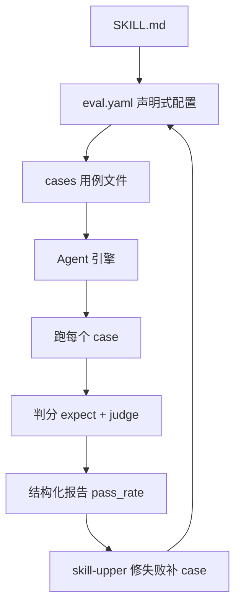

# 给 Agent 的 Skill 写评测，我这才搞清楚它到底靠不靠谱

skill-up 是阿里巴巴开源的一个工具，一句话定位：Agent Skill 的**评测与演进**工具。评测这边，让 Skill 质量变得可度量、可复现——你写成声明式 YAML 用例，它把这些用例塞进真实的 Agent 引擎（Claude Code、Codex、Qoder CLI…）里跑，用规则、脚本或者请一个 Agent 当裁判来打分，再吐出一套结构化报告，本地跑得，CI 里也跑得。演进那边，把评测结果变成下一轮的改法：通过对话，让一个叫 **skill-upper** 的 Agent Skill 读失败、自动修或补 eval 用例、再跑一遍，跟你一圈一圈往前转。

写这段之前，我其实刚撞上一个特别实在的尴尬：我辛辛苦苦把一段"技能"教给 Agent——一个 `SKILL.md`，或一组 prompt 加脚本——然后有人问我一句"这东西靠不靠谱"，我愣了半天。不是功能不行，是你说不清它到底"行"。它没个门槛，没个数，没个"跑一遍就知道过了没过了"的抓手。你要是在测试这行干久了，心里会冒出一个很脏的念头：**这不跟没有测试的代码一个样吗。**

就这么一句话：**它不替你给 Skill 打分，它帮你不靠"信不信"过日子，改用"跑过没有"过日子。**

---

为啥这不是一件小事？你手工评测一个 Agent Skill，最常见的下场是凑合：临时想起一个场景，手写一个 prompt，丢给 Claude 看看像不像，得，白跑一遍就算它过了。然后哪天真改了一行逻辑，你根本不知道哪块东西坏了——因为压根没有一套能天天跑、能回归的断言。

官方对"怎么写 Skill 评测"本来有套正确示范（agentskills 上的评价循环：写真实用例、带 Skill 和不带 Skill 分别跑、判分、汇总、迭代）。skill-up 的活就是把这条方法学焊成一个可以反复用的命令。它干的几件事，落在工程上都是硬招式：

- 用声明式的 `eval.yaml` + `cases/*.yaml`，取代你临时拼出来的那些运行目录。
- 自动把 Skill 装进真实的 Agent 引擎，跑 case、判分、出报告，流程一条龙。
- 支持不止一个引擎（`claude_code` / `codex` / `qodercli` / `qwen_code`），不把命拴在某一家的客户端上。
- 兼容 Anthropic 风格的 `evals.json`（`skill-up import` 进来，或 `--auto` 自动认），但给你更多样的 judge、更适合 CI 的命令和结构化报告。

一句话：它把"给 Skill 写测试"从手搓变成立起骨架。

---

先把这条链路在脑子里过一遍，你才知道每一步在干嘛（下面也就要按这个节奏带你们走一遍）：



（最下面那条 `skill-upper 修失败补 case` 要提前说清楚：它是 skill-upper 这个 agent 的对话式能力，属于"你把它接进 agent 才有的组合用法"，不是命令行一个人偷偷把文件改了。）

---

下面整个"五分钟上手"例子，就是从官方中文手册里一字不差抄下来的。你手边现在就可以照着建，前提是你的机器能调到一个 Agent 引擎和一个模型的凭据（这不能没有，否则评测闭不了环，后面我也会说）。

**第一步：把工具装上。** 两条路，二选一。

**A 路：装 skill-upper**（推荐，让对话帮你演进）——它是个可以直接装进你 Agent 的 Skill：

```bash
# Codex，全局安装
npx skills add https://github.com/alibaba/skill-up/tree/main/skills/skill-upper -g -a codex -y

# Claude Code，全局安装
npx skills add https://github.com/alibaba/skill-up/tree/main/skills/skill-upper -g -a claude-code -y
```

装 skill-upper 之前，不要求你先把 skill-up 本身装好——它跑的时候会自己查 CLI 在不在，不在就引导你的 Agent 把它装上。

**B 路：直接装 CLI**（如果你更爱上手动）：

```bash
curl -fsSL https://raw.githubusercontent.com/alibaba/skill-up/main/install.sh | bash
```

装完验证一下：

```bash
skill-up --version
```

> 这一步如果你也想跑，记住 skill-up 目前只支持 macOS / Linux；Windows 官方还没有支持。

---

**第二步：在你的 Skill 目录下建一个评测入口 `evals/eval.yaml`。** 它会声明"在什么环境、用什么引擎、跑哪些用例"。最短的这样就行：

```yaml
schema_version: v1alpha1

environment:
  type: none                    # 纯文本 Skill 无需容器隔离

engine:
  name: claude_code             # 使用 Claude Code 作为 Agent Engine

cases:
  files:
    - evals/cases/hello-world.yaml
```

这里有几个默认值你暂时不用管（JSON 报告、`timeout_seconds: 300`、`max_turns: 10`、`parallelism: 1`）。等 `evals/eval.yaml` 落在包含 `SKILL.md` 的目录下时，skill-up 会自动把当前 Skill 装进去，通常不用你手动写 Skill 路径。

**第三步：写一个用例 `evals/cases/hello-world.yaml`。** 用例 ID 默认就取文件名，这里面写"要发给 Agent 的 prompt"和"期望怎样算过"：

```yaml
input:
  prompt: |
    请帮我生成一个 Hello World 程序

expect:
  must_contain:
    - "Hello"
    - "World"
  must_not_contain:
    - "error"
```

就这一条，够它先"过"你一回。除开这层门槛检查，还有脚本判法和 Agent 判法两种打法，那是给复杂情况准备的。

**第四步：先校验（首次强烈建议），它不真启动 Agent，只检查 `eval.yaml` 和引用的用例文件：**

```bash
skill-up validate
```

正确时你看到：

```plain
✓ eval.yaml is valid (loaded 1 case(s))
```

**第五步：跑。**

```bash
skill-up run
```

你会看到类似——（*下面是官方文档示例输出，我没在这个环境真跑过，标清楚不骗你*）：

```text
Running 1 case(s) with agent claude_code
[Runner] Running 1 cases with agent claude_code
[Evaluator] Skill installed: <skill-name>
[Evaluator] Running case hello-world (with_skill): Skill 应该正确响应基本请求
[Evaluator] Case hello-world: PASS (pass_rate: 100.0%)
[INFO] Results written to ./<skill-name>-workspace/iteration-1
```

到这一步你该看见的东西：一个 `PASS`、一串 `pass_rate: 100.0%`，外加一个 `<skill-name>-workspace/iteration-1` 目录，里面躺着你这轮报告。从"凭感觉过日子"到"有数据垫底"，就这么落定了。

（等你真想改，目录结构长这样，好认：`evals/eval.yaml` 管全局，`cases/*.yaml` 一个文件一个 case，`fixtures/` 放测试资源，跑完输出在 `<skill-name>-workspace/iteration-1/`。是不是眼熟？跟测试工程那套目录规范一个意思。）

---

## 这个 Case 到底在测什么

你可能已经发现，这个例子里"算不算过"分了两个台阶，skill-up 自己也把这层分得很清：

- **expect —— 门槛检查**。零成本，纯本地比字：`must_contain` 要有"Hello""World"，`must_not_contain` 不能出现"error"，还能比退出码、有没有某些文件、跟黄金文件对不对。门槛过不去，进度条直接"FAIL"，连裁判都懒得请。
- **judge —— 质量评估**。这儿才是打分干重活的：`rule_based`（声明式规则，结果确定可重复）、`script`（你自己写一个脚本判分，退出码 0 算过）、`agent_judge`（请一个 LLM 按你写的一堆 criteria 打分，宽松到能理解语义）。

顺序就是：**先跑 expect，不过就跳过 judge——省时间和 token**。想让你那些关键断言点在最廉价的台阶上过一遍，别一上来就上 LLM 评审，那是烧钱的活儿。

给你一个再往深一点的例子，体会"judge 到底怎么定"。假设一个"代码统计 skill"，你要确实断言它输出的格式里必须有汇总段和按扩展名的表格：

```yaml
id: analyze-directory
input:
  prompt: |
    Analyze the current directory using the code-stats requirements.
    Report the statistics in the full Code Statistics format with Summary,
    Files by Extension, Top File Extensions, and Largest Files sections.
expect:
  must_contain:
    - "Files by Extension"
    - "Total Files"
    - "Total Lines"
  must_not_contain:
    - "error"
judge:
  type: script
  script_path: evals/fixtures/scripts/check-stats.sh
```

这段我原样抄自仓库自带的 `examples/code-stats`（它连 `check-stats.sh` 脚本 judge 和 fixtures 样例仓库都配好了，整个可运行）。你看出门道没：门槛先拦快速失败，再交给脚本判分，两层一卡就稳了，这套结构你很快能套到自己的 Skill 上。

> 这里插一句观众的疑问——**"那我写的好好的 Skill，万一评测脚本比我 Skill 还容易写错，怎么保证是它在验我不是我在验它？"**
>
> 回得实在点：所以 expect 先跑便宜规则，judge 才上是判分。脚本 judge 的"exit 0 才过"，逼你把'好长什么样'想清楚再写代码；agent_judge 更是把你那几条自然语言的"评价标准"当合同递过去。评测一旦成型，它就是一面镜子，你 Skill 真坏了它照得出来。脚本本身会不会错？会，所以才有 `skill-up validate` 先查配置、稳了再跑——一层套一层，跟"测试也要被测"一个道理。

---

## 它能接进你自己那摊事里吗

能，这回能从"模板示例"落到你手头了。几个口子：

**1. 给你自己的 Skill 加评测，用 `eval.yaml` + 目录结构管**。一旦你从"临时 eval 目录"升级成"能反复跑、能回归的 eval 集"，改完 Skill 就 apply 一遍，坏没坏马上知道。这就是给你自己做的东西加了个"能天天测"的锚。

**2. 在 CI 上跨引擎给它上质量门禁。** 仓库自带一个 GitHub Action，在每次 PR 时只要动到 Skill / evals / `SKILL.md`，就在 CI 里用多个引擎（`claude_code` / `codex` / `qodercli` / `qwen_code`）一起跑这个 Skill。一个文件就齐活：

```yaml
# .github/workflows/skill-eval.yml
name: Skill Eval
on:
  pull_request:
    paths: ['skills/**', 'evals/**', '**/SKILL.md']
jobs:
  eval:
    runs-on: ubuntu-latest          # Docker 容器 action —— 仅 Linux
    steps:
      - uses: actions/checkout@v4
      - uses: alibaba/skill-up@main  # 见下方「版本引用」
        with:
          engine: claude_code        # 或 codex / qodercli / qwen_code；留空则由 eval.yaml 自行声明
          api-key: ${{ secrets.ANTHROPIC_API_KEY }}
          base-url: https://api.anthropic.com   # 你的模型端点
          skill-target: evals/eval.yaml
```

它要求 Linux runner 和把模型凭据存成仓库 secret。用起来就是"拉镜像、评测"——镜像已经把 skill-up 和引擎 CLI 烤好了。退出码 `0` = 全过，`1` = 有失败，CI 直接据此挡门。

**3. 把它接进你自己的 agent（Codex / Claude Code / DeepSeek Harness / OpenCode…）当 eval 用**。这就是组合使用：你把 `skill-upper` 装进这些 agent，让它在你写 Skill 的时候顺手帮你建评测、跑一圈、看失败。这部分不是 skill-up CLI 自带的原厂能力，是 skill-upper（一个 agent Skill）在你的对话里帮你搭桥——写成"我这边这么接 / 组合使用示例"，别当成官方神招。

**4. 凭据怎么给也保稳。** skill-up 按优先级认：命令行 `--api-key` > 环境变量 `ANTHROPIC_API_KEY` / `OPENAI_API_KEY` > 配置文件 `~/.skill-up/credentials.yaml`。够用且不泄露密钥的方式，就是 export 环境变量那套。

---

说了半天好用，也该把它摆在桌面上，放到同类的炉子里摊开看：**它到底站在哪一格。**

同类里它不是唯一一家。给它排一张不自吹的表，你照着选：

| 工具 / 思路 | 核心定位 | 上手难度 | 适用场景 | 什么时候别用它 |
|---|---|---|---|---|
| skill-up | 给单个 Agent Skill 写 eval + 对话式演进闭环 | 中（有个声明 YAML + 引擎凭据就能起步） | Skill 作者想给 Skill 立一个可回归的评测；在 CI 跨引擎验 Skill | 你要的是整模型满表测评 / 大厂级 eval 平台那套调度度量时，别在这死磕 |
| Anthropic 官方 Skill 评测指南 | 方法是评测循环的"方法论文档" | 低 | 学习正确的 Skill 评测套路 | 想要开箱命令、结构化报告时，它只给"该做啥"，不给"点按钮" |
| 大模型 eval 平台（如 Braintrust 等） | 整车级的评测编排、指标对标 | 偏高 | 大组统一控制、跨模型对标沉淀 | 只想快速给一个 Skill 立一套评测时，上车太重 |

> 这表里"什么时候别用"那格，我基于定位写的是我的判断，不是官方结论，别误会。

几个它"不是啥"也得交底，用大白话：

- **它不是魔法。** "自动修"来自 skill-upper 这个 agent 的对话，不是 CLI 背地里就把你的 Skill 改好了；不配上模型凭据和 Agent 引擎，它就是一具"配置都验过但还没跑"的架子。
- **它不总得按那套"最贵判分"来。** 你要老让 agent_judge 兜底，token 哗哗的。谁都想快点判，先 expect + rule_based，精准拦 FAIL，剩下实在要语义的才请 LLM。
- **它也不是 Windows 的盘。** 官方明确只 macOS / Linux。
- **它跑起来要地方放凭据。** 要有模型 API 的密钥，密钥格式别写进 eval 文件、环境变量和 `credentials.yaml` 那套是正路。

---

凑热闹的人总爱问"值不值上"。这类空话我不接——后台没有你们账号的数据，我没资格替谁拍板。我想说的是件更大又更素的事：

你有没有发现，我们把"人能不能被一个指标盖棺"这事心里憋了很久——可对 Agent 的 Skill，我们竟然默认它"不用测、没法测、测了也白测"。skill-up 倒也没多玄，只是把该走的路，给走成了一条走下去的路。

真伪是它的事，长本事——是你的事。你手里那个 Skill，先别管能不能爆，先把"跑一遍"装上，让坏东西在它批下来之前就现形。剩下的，一步一步。

---

