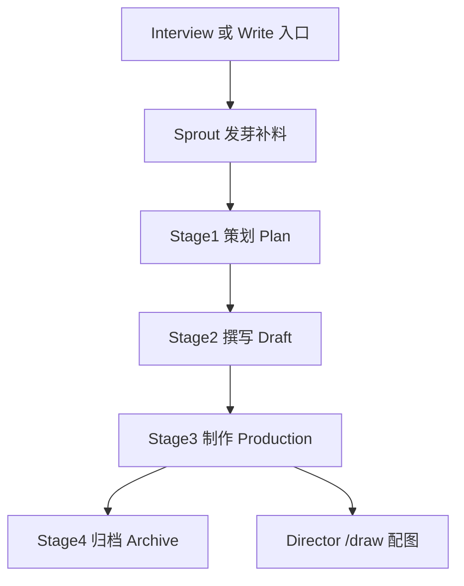

# 公众号没写好，往往是没管流程：拆解 wechat-writing-team 的「写作 + 配图」流水线

`DavidLam-oss/wechat-writing-team` 是一套面向 Claude Code / Codex / Gemini CLI 的微信公众号内容生产 Skill 集合，包含两个 Skill：`wechat-writer`（写作流水线，v3.5.2）和 `wechat-director`（视觉导演配图，v2.3.0）。它把一条「从零散想法到发布、带配图」的公众号生产链路，固化成了有阶段、有检查点、有审校门禁的工程化流程，仓库以 MIT 协议开源。

一句话点破它的价值：写公众号这件事，卡住人的往往不是「写不出来」，而是「没有一套可复用的流程」。这个项目把「访谈挖掘 → 素材发芽 → 大纲 → 写作 → 四层审校 → SEO → 配图 → 归档」编成了一台有门禁的流水线；AI 不再是「替作者写一段话」，而是「在一个有序步骤里逐步产出一整篇内容」的参与者。下文按这套流水线拆开它设计了哪些环节，每一个环节解决什么，并走一遍完整案例。

## 一、它不是"写稿工具"，是一套「人机协作」的写作流水线

大多数写作工具的思路是"一句话出全文"。而这个 Skill 的思路完全相反：它把写作拆成可在阶段间暂停、回退的工程化流程，每走完一个主阶段就停一次，让作者过一眼再继续。这套设计来自一个很实际的判断：**AI 一次性输出越长，越容易脱离作者本人的经历和风格**。所以它用「角色化分工 + 阶段检查点」来对抗这一点。

四个主阶段是：

- **Stage 1 策划（Plan）**：清理解素材、做选题质检、写人机边界卡、查 SEO 关键词，再到结构大纲；
- **Stage 2 撰写（Draft）**：主笔按大纲写出正文第一版，接下来做「四层审校＋综合改写」；
- **Stage 3 制作（Production）**：出 4 个标题方向、摘要、转发语、Tags；
- **Stage 4 归档（Archive）**：发布归档、更新文章索引、沉淀团队记忆；

在写之前还有一层叫做**发芽（Sprout Seed）**的预备动作，专门用来把外部人物、事件、故事补进素材库。这套结构用「把每一步的产物都写到独立文件」来给作者留控制权，而不是一次生成完所有东西。

## 二、写作 Skill 的四阶段：每一步都有 QA 闸门

### 入口一：发芽（/sprout、/harvest）——补外部素材

当作者手里只有自己的看法、没有具体的人物 / 事件 / 案例抓手时，就不能直接进正文。流程会先做「发芽」：把外部世界的人物、事件、故事加工成结构化的 Seed，按 `person / event / story / concept / trend` 分类，落到项目的 `_source/Seeds/`。有一个硬规则：如果输入只是 `concept` 或 `trend` 这类抽象概念，会强制先追问具体案例，避免带着空泛视角开写。可复用的 Seed 会沉淀到长期知识库，一次性 Seed 留在当前项目。

### 入口二：访谈（/interview）——解决冷启动

如果作者只有一个模糊想法，就直接进入"先聊后写"：由「首席记者」这个角色做 5-10 轮苏格拉底式追问，挖掘事实细节、情绪波动。访谈记录是「高保真」的，要求保留第一人称、口语、情绪词和断句，不中途润色成书面语——要把"生肉"留下来，供后续阶段用本人口吻写。

### 阶段 1：策划——设好「三道门」

策划阶段有四个强约束门禁，缺一不可：

1. **选题质检卡**：从「好奇感」「信息增量」「共鸣感」三个维度给这篇选题打分（强/中/弱），至少两项达标才允许继续；否则回到访谈或发芽补素材。这是防止"为了跑完流程硬写一篇没人想看的文章"。
2. **人机边界卡**：明确一篇里哪些必须来自作者本人（原话、亲历、旧文），哪些可以由 AI 辅助（事实核查、结构、表达润色），哪些**绝对禁止虚构**（第一手经历、关键情绪、未经验证的数据）。
3. **SEO 决策卡**：以主题为种子词，用微信指数查上升搜索词，做关键词采用/弱信号/放弃的三选一决策，并决定词进标题、摘要还是 Tags。
4. **结构 + 主线回扣**：确定文章类型（现象解读/方法论/产品体验等），把大纲每节的推进任务、一句话回到核心论点的设计都先写清楚。

最后还要调脚本做调研，把带来源的事实填入 `01_Plan.md`。这一阶段结束会停在 **Checkpoint 1**，等作者审核大纲，再进入写作。

### 阶段 2：撰写与四层审校

主笔写出正文第一版后，交给四层审校：L1 硬规则、L2 风格一致性、L3 内容成立度、L4 老友感终审。其中 **L3/L4 有一条底线——即使 L1/L2 全绿，只要 L3 内容成立度或 L4 老友感挂了，就不算通过**。

对「方法论 / 技术类」文章，L3 还多三套扫描：数字与时间线必须能对上原始素材，禁止编数字；全篇破折号 `——` 的数量应为 0（这是最常见的 AI 味暴露点）；所有「不是 A 是 B」的反转句式都要抹掉。审校报告和综改指令都会先落盘成文件，再在对话里汇报，而不是只口头总结。

### 阶段 3：制作与包装

做标题、摘要、转发语、Tags。标题按四个方向出：SEO 关键词型、情绪共鸣型、问题共鸣型、反常识型，同时生成一个英文 slug 短链接。摘要的软上限 45 字、硬上限 120 字。这一步也停在 Checkpoint，让作者定稿。

### 阶段 4：归档

调用 `scripts/archive.py` 生成 `published/[Title].md`，把整个项目目录归档到 `archive/YYYYMMDD_[标题]/`，并自动把新文章索引写回 `published_article_index.md`；这一轮写作的经验也会被提炼进 `team_memory.md`。

## 三、视觉导演 Skill：文字之外的配图流水线

`wechat-director` 负责在文字定稿后做配图。它由一位"视觉导演"角色驱动，在文章情绪转折或留白处设计分镜 Storyboard，而不是随手插图。它强制的尺寸规范很有参考价值：

- **Part A 主视觉**：`2.35:1` 电影画幅；
- **Part B 侧边栏**：`1:1` 纯色底，中间放 4-6 个中文核心词，分两行，禁止英文；
- **Part C 内文配图**：`3:4` 竖图（手机最佳比例），且每一张都必须带 `Context`——指向它该插入位置上一段的最后一句原文，保证唯一性。

配图本身由 `scripts/visualize.py` 驱动，支持 Gemini Web / Gemini API / SiliconFlow 等多个后端，并且可以走一条「生成→压缩→上传对象存储→插入正文→清理本地」的全自动闭环。这条链路的执行依赖作者的生图 API 与云存储配置，属于组合使用，不是这一 Skill 原生自带的能力。

## 四、从零到一：一次完整的公众号生产

用一个「作者本人经历」型主题走一遍这个系统性流程，能看到每一步的中间产物。

**问题。** 作者手里只有一段亲身经历，想写成一篇公众号推文，缺的是外部视角、结构、SEO 和配图。

**输入。** 一条 `/interview 创业经历` 的指令，以及后续作者的若干轮对话回答。

**流程与产出。**

1. 访谈：首席记者对话形成 `Raw_x.md`，保留第一人称口语（Stage 0）。
2. 发芽：主编走 `sprout` 流程，补充 2 个相关外部案例或反方视角、1 个第一性问题（补足素材）。
3. Stage1：清洗、`选题质检卡` 判定通过、`人机边界卡` 明确哪些经历是作者原话、SEO 决策卡查词、主线回扣大纲，产出 `01_Plan.md` 并停在检查点。
4. Stage2：主笔按大纲写出正文第一版，做四层审校（L1-L4）+ 综改，产出 `02_Draft.md`（v2）。
5. Stage3：4 个标题方案 + 摘要 + Tags，产出 `03_Production.md`。
6. 作者定稿后，`/draw` 让导演生成 `Storyboard.md`，进入配图环节。
7. Stage4：`archive.py` 归档，更新 `published_article_index.md` 并提炼团队记忆。

**验证与产物。** 这条链路走通，才能得到一篇「有大纲、有事实来源、有选题质检卡、有 SEO 决策、有标题方案、有配图 Storyboard」齐整的公众号文档。以上涉及微信指数、生图 API、云存储的具体命令输出，本文并未在本环境实测，流程与命令取自项目官方 SKILL.md。

**边界。** 这套流程高度依赖：作者本人的风格文件（如 `style_guide_个人.md`）、SEO 依赖微信指数（`wechat-index-query`）、配图依赖生图 API 与对象存储。换机器/换人，需要把 `knowledge/` 下的个性化文件换掉，否则它就是作者本人的"Demo 稿"。

**可迁移部分。** 即便不装整套，也能直接抽出三件可迁移到他处的看家货：一套「选题质检 + 人机边界」的标准卡，一个「四层审校 + 去 AI 味扫描（破折号、反转句式）」的建议清单，以及一套「分镜配图尺寸规范」。

## 五、边界与组合使用

把"编排"和"它所依赖的外部通道"区分清楚，避免误判成一套自足系统：

- **它不是网站，也不是内容平台。** 它是已经会在 Claude Code/Codex/Gemini CLI 中执行的一串流程；SEO 查词依赖微信指数、配图依赖生图 API、归档依赖 Obsidian。这些是组合使用。
- **内置角色与风格是个人化的。** 内置的"作者本人"是作者风格的示范模板，不是通用写作风格；要用它需要一个替换动作。
- **这套策略真正能带走的，是它的 QA 方法。** 可复用的资产是选题质检、人机边界、去 AI 味审校，而不是它直接生成的文本。

## 六、下一步

找一个想写的公众号选题，让 Agent 用这套 Skill 跑一遍 `/interview` 走到 `01_Plan.md`，再照 `四层审校` 那套检查稿子，最后把「选题质检 + 人机边界 + 配图规范」复制到：无论是自己手工写还是交给 AI，都按这套流程表来走一遍。

#公众号写作 #AgentSkill #内容流水线 #AI审校 #公众号排版