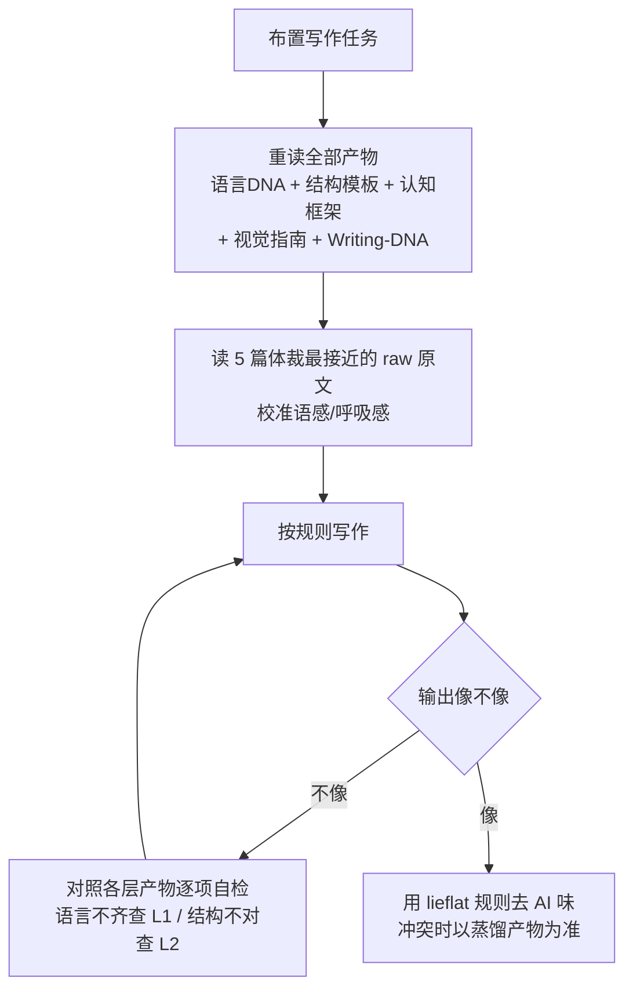

# 写作风格不是玄学：把 28 篇自己的文章蒸成一份 Writing DNA（附完整操作教程）

让 AI 模仿一个作者的风格，最常见的做法是丢几篇例文，然后说一句"照这个风格写"。结果通常差一口气：语气抓到了七分，想法和结构总是对不上；这篇像了，下一篇又飘了。

原因不在模型。在于"风格"这件事被当成了一种感觉，而不是一组可以被拆开、记录、检查的规则。

这次实测的对象 `writing-dna-skill`（写作蒸馏器）处理的就是这个问题：它把一套完整文章拆成六层可复用的写作 DNA——语言、结构、选题、素材、认知框架、视觉风格，再让 Agent 在写作前读取这些规则来复刻。

本文按一次真实开发实例写成一份可照做的教程：在本机把本地 28 篇原创公众号长文蒸馏成 Alan 的中文 Writing DNA——每步的命令、代码、产物都贴出来，跑完得到五份分层产物加一份整合文档，最后讲清楚这套"蒸出来的技能"怎么用、用起来什么效果。全部命令与输出均来自本机实际运行。

---

## 一次蒸馏会得到什么：先看产物长什么样

按项目目录规范，一次完整蒸馏的落盘结构是这样（本实例真实产物）：

```text
Alan-Writing-DNA/
├── raw/                        # 28 篇原始文章语料
├── _meta/                      # 元数据标注（28 条，100% 覆盖）
├── 语言DNA.md                  # L1 产物：词频/句长/标点统计
├── 文章结构模板.md              # L2 产物：按内容类型归纳的结构模板
├── 写作视角与认知框架.md        # L3-L5 产物：选题逻辑/素材策略/认知命题
├── 视觉风格指南.md              # L6 产物：配图/排版/色彩规律
├── l1-stats.json               # L1 脚本统计的原始数据
└── Writing-DNA.md              # 最终整合文档（写作前总入口）
```

其中 `Writing-DNA.md` 是压缩后的总入口，四份分层产物是细节。项目规定写作前**五份全读、一份不跳**——整合文档是结论，具体的语感只存在于分层产物和原文里。

这套流程背后的六层拆法，用一张表说清：

| 层次 | 分析对象 | 输出产物 |
| - | - | - |
| L1 表层语言 | 词频、句长、标点、修辞、常用表达 | 语言DNA.md |
| L2 文章结构 | 开头 hook、正文架构、转折、结尾收束 | 文章结构模板.md |
| L3 选题逻辑 | 发布时机、切入角度、话题优先级 | 写作视角与认知框架.md |
| L4 素材策略 | 引用来源、权威对象、案例和数据用法 | 写作视角与认知框架.md |
| L5 认知框架 | 世界观、价值判断、核心假设、反复命题 | 写作视角与认知框架.md |
| L6 视觉风格 | 配图策略、排版、字体层级、色彩 | 视觉风格指南.md |


L1-L2 解决"怎么写"，L3-L5 解决"怎么想"，L6 解决"怎么呈现"。只复刻语言，通常"读着像但想法不像"；只复刻结构，"框架像但语气不像"；忽略视觉，图文内容就会"文字像但看着不像"。

本次实例的验收标准定成四条：语料至少 20 篇完整文章；六层产物全部产出；Writing-DNA 不超过 4000 字（项目质量标准）；蒸馏产物能实际用来复刻一段短文并逐层自检。

---

## 一步一步教程：从零蒸出写作 DNA

### Step 1 克隆仓库、建隔离环境

先拿到项目的完整目录（含 SKILL.md 流程说明与产物模板），再用 uv 建一个 Python 虚拟环境，装分词库 jieba 供 L1 统计使用：

```bash
$ git clone https://github.com/larashero3-dotcom/writing-dna-skill.git /tmp/wds-repo
Cloning into '/tmp/wds-repo'...
（clone 成功，commit ee3d97e，2026-08-24）

$ cd /tmp/wds-lab && uv venv --python /opt/homebrew/bin/python3.13 .venv
Creating virtual environment at: .venv

$ uv pip install --python .venv/bin/python jieba
Resolved 1 package in 1.96s
Installed 1 package in 4ms
 + jieba==0.42.1
```

需要说明的是：jieba 只用于 L1 的自动化分词统计；L2-L6（结构、选题、认知、视觉）靠的是对语料的深度阅读，脚本替代不了。

### Step 2 备语料：至少 20 篇完整文章

项目要求真实蒸馏至少准备 20 篇完整文章，格式建议 `.md` 或 `.txt`，尽量覆盖不同时期、主题和类型，统一放进 `raw/`。本实例从本地文章库筛选 28 篇中文公众号长文，时间跨度 2026-01 至 2026-09，主题覆盖 AI 测试、Agent 工程化、评测方法、知识库、工作方式复盘：

```text
raw/
├── 2026-01-31-大模型意图识别测试...md
├── 2026-02-20-别再收藏教程了...md
├── 2026-04-13-OpenClaw-的记忆边界...md
├── 2026-06-03-01-给Agent做了一套测试框架...md
├── 2026-07-29-企微IM-Agent自动化评测重构复盘.md
├── 2026-08-14-DeepSeek-Harness-dsh-开箱指南.md
├── 2026-09-01-给AI-agent写evals完整实操手册...md
└── ...（共 28 篇）
```

⚠️ 两个容易踩的坑：一是别拿少于 20 篇的"小样"来评估——项目文档明确说 `examples/format-only/` 只演示目录格式，不代表真实蒸馏效果；二是语料要挑完整文章，把 Skill 文档、笔记碎片混进去会污染风格统计。

### Step 3 建元数据：_meta/ 是统计的地基

给每篇文章建立元数据记录，字段包括标题、日期、作者、栏目、文章类型、主题标签、hook 类型、结构模式、素材来源、字数、备注。这是后续跨文章统计和筛选的基础，项目规定不可跳过。本实例生成的 28 条记录里，一条真实样例长这样：

```json
{
  "title": "企微IM-Agent自动化评测重构复盘",
  "date": "2026-07-29",
  "author": "Alan_Hsu",
  "column": "公众号技术文",
  "article_type": "复盘实践",
  "topic_tags": ["企微", "评测", "Agent"],
  "hook_type": "观点式",
  "source_types": ["自身实践", "公开资料"],
  "word_count": 5740,
  "file": "2026-07-29-企微IM-Agent自动化评测重构复盘.md"
}
```

28 篇全部生成，元数据覆盖 100%。类型分布如下——复盘实践 7 篇、工具拆解 6 篇、观点长文 5 篇、方法论文 4 篇，另有工具清单、开箱实测、实操手册、实测报告若干。覆盖多种内容类型，结构模板才能归纳出"不同体裁各有套路"。

### Step 4 跑 L1 语言统计：脚本 + 真实输出

按 SKILL.md 的 Step3 写一个 Python 脚本做表层语言统计。核心逻辑分三块：**抽取正文**（去 frontmatter 与 Markdown 标记）、**切句**（按中文句末标点）、**统计**（jieba 词频 + 句长/标点分布）。脚本关键片段：

```python
import glob, re, jieba
from collections import Counter

FENCE = chr(96) * 3   # 反引号 x3，用于识别代码围栏起始行

def text_of(path):
    """抽取正文：去 frontmatter 与 markdown 标记，保留文字流。"""
    lines = open(path, encoding="utf-8").read().split("\n")
    if lines and lines[0].strip() == "---":
        for i, ln in enumerate(lines[1:], 1):
            if ln.strip() == "---":
                lines = lines[i + 1:]
                break
    out = []
    for ln in lines:
        s = ln.strip()
        if not s or s.startswith(("#", ">", "|", "-", FENCE, "![", "---")):
            continue
        s = re.sub(r"\[([^\]]*)\]\([^)]*\)", r"\1", s)   # 去行内链接
        out.append(s)
    return "\n".join(out)

def split_sents(text):
    """按中文句末标点与换行切句。"""
    return [p.strip() for p in re.split(r"(?<=[。！？；])|\n", text) if p.strip()]

def zh_chars(s):
    return len(re.findall(r"[\u4e00-\u9fff]", s))        # 只数中文字符
```

运行脚本（语料在 raw/，输出直接落到标准输出与 l1-stats.json）：

```bash
$ .venv/bin/python scripts/l1_language_analysis.py
```

真实输出（即 l1-stats.json 的核心字段）：

```json
{
 "corpus_files": 28,
 "total_chars": 126189,
 "sentence_count": 4148,
 "avg_sentence_chars": 14.9,
 "short_ratio_le15": 37.4,
 "long_ratio_ge50": 2.6,
 "punct_ratio_dash_vs_paren": 0.34,
 "punct": { "破折号": 142, "括号": 418, "引号": 1869, "冒号": 752, "感叹号": 0 },
 "top_words": ["规则", "代码", "模型", "任务", "评测", "文件", "不能", "失败", "数据", "用户", ...]
}
```


这些数字已经把风格说掉了一半：平均句长 14.9 字、短句占 37.4%、长句只占 2.6%——中短句为主，判断落成短句；句长分布里约 63% 的句子不超过 20 字；括号使用是破折号的近 3 倍（比 0.34），技术解释习惯用括号补注；感叹号为 0，不用感叹号煽情；高频词集中在工程对象与质量语言——规则、代码、模型、任务、评测、文件、失败、数据、验证、判断、边界、证据。

按统计结果写出的《语言DNA.md》产物（这是交给 Agent 复刻时的 L1 依据）：

```markdown
# 语言DNA

## 句式规律
- 平均句长（中文字符）：14.9 字/句（4148 句实测）
- 短句（≤15 字）占比：37.4%
- 长句（≥50 字）占比：2.6%
- 结论：以中短句为主、长短交错，重要判断往往落成短句独立成行

## 标点与格式
- 破折号 vs 括号使用比：0.34（括号远多于破折号）
- 正文感叹号实测为 0
- 中英混用：英文专名（Agent/evals/Harness）直接保留，
  概念用"中文名（英文原词）"括注
- 小标题常为完整陈述句或带观点的短语，不追求四字对仗
```
### Step 5 深读抽 L2-L6：脚本统计不了的部分

L1 之后的层次，脚本帮不上忙，需要通读语料逐篇标注。本实例把 28 篇按时间分三批深读，每篇记录：开头 hook 类型、正文推进结构、结尾收束方式、素材引用习惯、认知命题、视觉标记（mermaid 数、代码块数、表格数、小标题层级）。三批结论相互印证后，稳定观察落进各层产物。

**《文章结构模板.md》**（L2，按内容类型归类）——归纳出至少四种可复用模板：

```markdown
# 文章结构模板

## 内容类型 A：概念拆解 / 方法论文
开头 hook：场景化痛点对照，首段亮反直觉观察
  （例："代码跑了，测试绿了，页面也能打开。
     结果产品看完说：这不是要做的东西。"）
正文：按小论点分节，一节 = 论点 → 短例 → 一句话结
结尾：升华收束，金句加粗点题
  （例："模型决定上限，Harness 决定这东西能不能稳定交付。"）

## 内容类型 B：复盘式长文
开头 hook：开门见山讲项目与被测对象，直接抛真实数字
  （例："跑了 50 个场景，结果 25 个 passed、21 个 failed"）
正文：按设计决策分章，每步贴代码/配置/流程证据链
结尾：经验感想清单收束，不刻意升华，可坦诚未完成项

## 内容类型 C：工具 / 实操拆解文
开头 hook 四型：痛点场景 / 情绪共鸣 / 反直觉断言 / 开门见山声明
正文推进套路（稳定）：
  一句话定位+大白话翻译 → 解决什么痛点 → 怎么跑（可照抄命令）
  → 实测证据（或标注未实测） → 边界与"它不是什么" → 适合谁
结尾：收在给读者的下一步/边界/迁移场景

## 内容类型 D：实操/方法论手册（连载型）
开头：交底声明 + 拆解对象清单
正文：编号章节 + 大表格承载信息，章节结尾带"下一篇预告"
```

**《写作视角与认知框架.md》**（L3-L5，选题 + 素材 + 认知）——不只记"怎么写"，还记"怎么想"：

```markdown
# 写作视角与认知框架

## 选题逻辑
- 集中于 AI Agent 工程化、AI 测试与评测方法、流程改造、
  知识库与文档工程、工作方式复盘
- 切入时机：多在亲历过一轮真实折腾/踩坑后写，较少追突发新闻
- 切入角度：实践者 + 测试工程视角，"这工具解决什么真实痛点"先行

## 素材策略
- 一手素材为主：亲身实践、真实项目复盘、真实命令输出/日志/产物
- 外部人物观点作引子后常加"冷静限定"，防止神化权威
- 数字多为真实测量；未实测明确标注

## 认知框架（反复出现的核心命题）
1. 判断力 > 生成力
2. 确定性交给代码，语义交给 LLM（硬规则/Judge 分层）
3. 评测可信度先于好看数字；评测是反馈回路不是分数仪表盘
4. 工程化 = 把模糊变可比较，把经验固化成可回归的资产
5. 真实失败先归因再动手；失败要有名字才可修
6. 工具必须写清诚实边界
```

**《视觉风格指南.md》**（L6）——正文几乎不贴外链图，靠 mermaid 流程图讲链路、表格压决策、代码块给证据；加粗只强调命题级结论；方法论文用引用块放"一句话结论 / 虚拟质疑 / 边界声明"。语料是 Markdown 源文件，无公众号排版后台数据，色彩项标注为不可观测，不臆断。

### Step 6 整合 Writing-DNA.md

把四份分层产物的结论压缩成一份整合文档，章节对应语言特征、结构模板、选题标准、素材规范、认知框架、视觉风格。质量要求单文档控制在 4000 字以内，实测 1261 字：

```markdown
# Writing-DNA

## 语言特征
- 平均句长 14.9 字，短句约 37%，长句约 3%；重要判断落成短句
- 英文专名直接保留；概念用"中文名（英文原词）"括注
- 括号明显多于破折号；不用感叹号煽情

## 结构模板
- 工具/实操拆解文（最常见）：一句话定位 → 痛点 → 怎么跑
  → 实测证据 → 边界 → 适合谁
- 概念拆解/方法论文：反直觉痛点开场 → 每节一个小论点 → 金句收束
- 复盘长文：真实数字钩子 → 设计决策分章 → 经验清单收尾

## 选题判断标准
- 写亲历验证过的工具/方法与复盘，不写无实测依据的宣传
- 切入用实践者+测试工程视角；落到具体业务场景

## 核心认知框架
1. 判断力 > 生成力
2. 确定性交给代码，语义交给 LLM
3. 评测是反馈回路不是分数仪表盘
4. 把经验固化成可复用资产
5. 失败先归因再动手，有名字才可修
6. 工具必须写清边界

## 视觉风格
- mermaid 讲链路；代码块给证据；三列对照表压决策
- 加粗只强调命题级结论；短平快文大量一句一段
```

至此六层蒸馏全部完成。产物总览（真实运行证据）：

| 阶段 | 执行动作 | 真实产物/证据 |
| - | - | - |
| Step1 备语料 | git clone + uv 建环境 | 仓库 commit ee3d97e；jieba 0.42.1 |
| Step2 建元数据 | 生成 28 条 meta 记录 | _meta/corpus-meta.json（100% 覆盖） |
| Step3 语言统计 | 跑 L1 脚本 | 28 篇 / 126189 字符 / 4148 句 / 均句长 14.9 |
| Step4 深读标注 | 三批通读 28 篇 | 结构模板 4 类、认知命题 6 条 |
| Step5 整合 | 压缩四份产物 | Writing-DNA.md（1261 字 ≤4000） |

### Step 7 复刻验证：蒸馏产物能不能真用来写

蒸馏产物合不合格，标准只有一个：能不能真用来写。按 SKILL.md 的写作前流程，先通读全部产物，再挑 5 篇与目标体裁最接近的原文校准语感，然后写一段 300 字左右的短文。

第一次成稿，自觉已经按风格写了。拿产物一对照，问题立刻现形：

```text
初版实测：平均句长 27.7 字，短句占比 8%
DNA 基线：平均句长 14.9 字，短句占比 37.4%
```

长句偏多、节奏偏说明书——语感上觉得像，量化下来语言层根本没对齐。这就是分层产物的价值：不像的时候，能指出不像在哪一层，而不是笼统说"再写一遍"。

按语言 DNA 修正：拆长句、补短句收束、增加一句一段的节奏。修正后：

```text
修正实测：平均句长 14.6 字，短句占比 60%，长句 0%
```


修正后的短文节选（主题是一个虚构的"周报转测试计划"skill，仅用于风格验证，不是真实项目）：

```markdown
同一个团队，上个月周报二十行，这个月直接翻倍。
一半在重复上个月的"已完成"。
另一半写的是没人会执行的计划。
第一反应是：让大家写细一点。
写细以后，周报更长了。计划还是没人执行。
问题不在周报写得不够多。
在周报和测试计划之间，没有一条能自动跑的链路。
（中略）
工具把文字变成候选和缺口。判断还是人的。
```

短文按结构层对齐工具拆解模板（痛点 → 归因 → 工具定位 → 边界），认知层保留"工具把文字变成候选和缺口，判断还是人的"这类命题，标点沿用不用感叹号的习惯。复刻闭环跑通：产物可执行、可检查，偏差能定位到具体层次。

对照项目质量标准逐项核对，全部达标：

| 质量标准 | 要求 | 实测 |
| - | - | - |
| 元数据覆盖 | ≥80% 语料 | 100%（28/28） |
| 结构模板 | ≥3 种内容类型 | 4 类 |
| 认知框架 | ≥3 条非显而易见命题 | 6 条 |
| 视觉分析 | 覆盖配图/排版/色彩 | 3 维（色彩标注不可观测） |
| Writing-DNA 字数 | ≤4000 字 | 1261 字 |

---

## 蒸馏出来的技能怎么用：写作前的一套硬流程

得到五份产物后，这套"技能"的使用方式不是把文件丢给 Agent 就完事。SKILL.md 把每次写作前的读取写成了硬性步骤，一份都不能跳：




具体到一次写作，照这个顺序做：

1. **重读全部五份产物**。整合文档是压缩后的结论，句子呼吸感、段落怎么接、什么时候突然用一个短句，这些只存在于分层产物里。
2. **再读 5 篇最接近的原文**。按 `_meta/` 里的 `article_type` 和 `topic_tags` 筛选，匹配超过 5 篇取时间最近的。读原文不是找素材，是校准语感。
3. **按规则写作**。规则冲突时的取舍顺序写死了：用户本次指令 > 匹配当前体裁的结构模板 > 语言特征与视觉风格 > 认知框架。
4. **不像就逐层自检重写**。对照 `语言DNA.md` 查句子长度和标点，对照 `文章结构模板.md` 查骨架，对照 `写作视角与认知框架.md` 查观点和素材选择。

一条硬约束：原文里的具体观点和事实不能搬进新文章——复刻的是写法，不是内容。

## 用起来什么效果：这次实测的三个直观结论

**第一，复刻偏差能定位到层。** 初版短文"觉得像"但语言层实测 27.7 字 vs 基线 14.9 字——有产物在，偏差不是笼统的"再写一遍"，而是明确指向 L1 语言层，修一次就到位。

**第二，元数据 + 分层产物让风格"可检查"。** 28 篇的 hook 类型、结构模式、认知命题全部落成结构化记录，风格判断从"感觉"变成可对照的清单；结构模板覆盖 4 类内容类型，不同体裁可以各取所需。

**第三，这套东西沉淀的是资产，不是一次性的 prompt。** 蒸馏产物连同 28 篇语料落在 `03-Projects/Alan-Writing-DNA/`，以后每次让 Agent 按这个风格写，先读产物再动笔，越用越一致，而不是每次从零描述想要的感觉。

## 这锅蒸完，留几句实在话

一件事连着另一件事。起初只是想把风格说清楚，说着说着，先把句子说清楚了，再把结构说清楚了，最后连"不用感叹号"都成了规则。写到这句，本文依然没有一个感叹号。规则刚立起来，第一个管住的就是作者自己。这是黑色幽默的第一课：立规矩的人，永远先被规矩管。

第二课，风格是蒸出来的，不是感觉出来的。作者最常犯的错，是以为风格住在感觉里。感觉这东西，说有就有，说没就没，自己跟自己都能打架。等数字摆出来，均句长 27.7 字对着基线 14.9 字，感觉就不吭声了。感觉负责说"像"，数字负责说"哪不像"。两个都得听。只听感觉，文章是飘的；只听数字，文章是死的。飘和死之间，才叫活着。

第三课，一个人最不了解的，是自己怎么写。写了二十八篇，平均句长 14.9 字，短句占三成七，括号是破折号的三倍，感叹号一个没有。这些事，作者本人此前未必数得清。机器替人数了一遍，作者才第一次看清自己。看清之后想赖账都赖不掉——证据是明摆着的。所谓认识自己，多数时候是让外人替自己照一次镜子。Agent 就是那面镜子。镜子不说话，但镜子不撒谎。

第四课，单独一篇是文章，连起来才是风格。没有 `_meta/` 的时候，二十八篇是二十八个孤岛；有了元数据，孤岛才连成一片大陆。作者以为自己的开头花样很多，直到二十八种 hook 摆在一起，才发现翻来覆去就是那几招。招数少不可怕，可怕的是不知道自己的招数少。知道得晚，也比不知道强。

第五课，规则要写在写作前面。写之前没有规则，写完之后就没有地方可查。复刻像不像，作者说了不算，Agent 说了也不算，二十八篇文章说了才算。写偏了能指出偏在哪一层，这是分层产物最值钱的地方——它把"再写一遍"这种正确的废话，换成了"句长不对，拆"这种能执行的话。

第六课，门槛就是门槛，不是建议。二十篇是蒸馏的底限，不是追求。拿三篇短文去蒸，蒸出来的东西，说好听是风格，说不好听是那三篇的语气。前者能用来写下一篇，后者一用就露馅。仓库里的 `format-only` 目录同理：它只演示目录格式，不演示蒸馏效果——就像菜谱封面的成品图，负责好看，不负责好吃。

第七课，蒸自己的文章叫资产，蒸别人的文章冒充别人叫事故。这套流程用于学习、分析、风格研究、个人写作资产沉淀，都不越界；拿去冒充作者、误导读者、侵犯版权，就全越界了。开源仓库里也只能放目录模板、字段模板和自己拥有版权的示例文本，原文语料是作者自己的，不是公共的。顺带说清另一件容易混的事：蒸馏解决"像不像这个作者"，去 AI 味解决"像不像机器写的"，这是两件事。一个人完全可能写得像自己，同时写得像机器——这两种病，得分开治。

第八课，也是最后一句：判断力比生成力贵。这话在蒸馏之前就听过，蒸馏之后才算听懂了。因为能把自己的风格写成规则的人，才配让规则替自己写。规则是作者留给机器的最小遗产：不多，两百来行，够用。写作这件事，说到底还是那句老话——先看清自己，再谈让别人像自己。

https://github.com/larashero3-dotcom/writing-dna-skill
#写作DNA #写作蒸馏器 #AgentSkill #公众号写作 #风格复刻 #AIAgent
