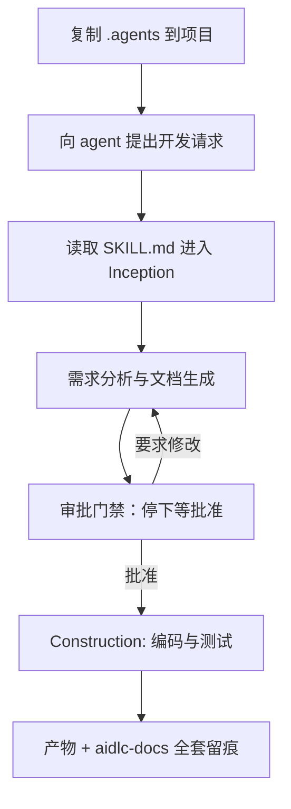
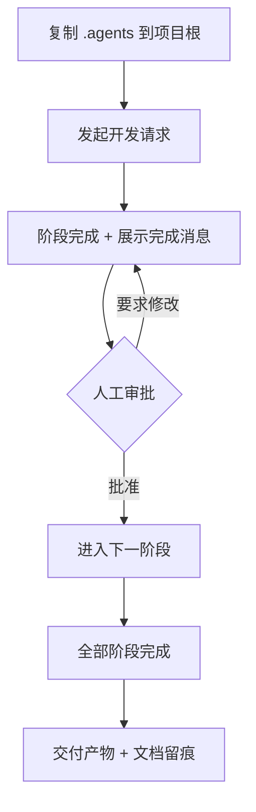

# AI 写代码不听话？实测给 agent 套上"需求→审批→编码"流程的 skill

代码可以让 AI 写，流程不能让它乱走。这篇文章拿到一个把 AWS AI-DLC 开发工作流改造成通用 skill 的仓库 qtalen/aidlc-skills，判断它的用途是给编码 agent 上"流程约束"；随后在真机上复制这个 skill、让 agent 开发一个命令行工具，验证它是否真的会先规划、过审批、再编码。读者读完能判断：这种"复制即用"的流程规则包，是否适合接进自己的 AI 编码流程。

---

## 从一次"开发半天、修 bug 几天"说起

先交代这套流程的来源。

AI 编码普及一年后，团队关心的问题从"哪个模型更强"转向"怎么保证 AI 写的代码质量可控"。彭鹏（qtalen）在 2026 年 9 月的文章里记录了自己团队的状态：用 AI 写代码大半年，速度上去了，质量没跟上，"开发常常只要半天，排查 bug 却要几天"。他原本采用基于 OpenSpec 的规格驱动开发（SDD），推给全团队后暴露两个问题：命令太多太绕，成员各用各的，有人干脆退回自由发挥；规格文件不保留原始意图与讨论过程，跨人评审看不懂，时间一久连作者本人都忘了当初为什么这么设计。

他的解法是换用 AIDLC（AI-Driven Development Life Cycle）工作流，并把这套流程做成"复制即用"的 skill 形态，即本文要实测的 qtalen/aidlc-skills。其上游是 AWS 的 awslabs/aidlc-workflows——官方把它定义为"给 AI 编码 agent 的自适应流程规则"，2025 年 11 月开源，现已演进到 2.0 GA（14 个 agent、33 个阶段、5 个阶段组）。aidlc-skills 仓库做的是把 AWS 的 1.0 规则集改造成通用 skill：一个 `.agents` 目录，复制进项目即可让 agent 遵循整套流程。

仓库本身是纯 Markdown 规则包：33 个文件，无代码、无测试、无 CI。Skill 的 frontmatter 声明"软件研发请求一律覆盖内置工作流、先走本流程"，references/ 下分 common、inception、construction、operations、extensions 五类细节规则，SKILL.md 中引用的规则路径经核对全部存在，无缺失引用。

## 验证什么、卡到什么标准

这次实例要验证的不是 skill 有多少个文件，而是它的核心承诺是否成立：**把规则目录复制进项目后，编码 agent 是否真的会按流程干活，而不是直接生成代码**。

为此设计一个最小开发任务作为探针：让 agent 在空项目里构建一个 Python 命令行工具，运行后输出 `hello from aidlc`。任务足够简单，若 agent 仍然主动先走"需求分析 → 审批 → 计划 → 编码 → 测试"，说明流程约束真实生效；若它无视规则直接写文件，说明规则只是摆设。

验收标准定为五条：

1. agent 收到请求后是否先进入规划阶段，而非立刻写代码；
2. 每阶段产物是否落到独立的文档目录并记录进度；
3. 关键阶段是否停下来等批准；
4. 批准后能否从状态文件续接流程直至完成；
5. 最终程序输出是否精确等于 `hello from aidlc`。

说明：以上验证目标为本文作者定义，不是仓库或上游官方的承诺口径；skill 在哪个 agent 上生效属于"组合行为"，本次实测环境为 codex CLI，不代表其它工具链必然同样触发。

## 方案怎么定下来：这套规则靠什么让 agent 走流程

看仓库内 SKILL.md 的机制设计，可以理解它约束 agent 的手段，全部为文件内可核对的事实：

**三阶段生命周期。** Inception（规划：工作区探测、需求分析、用户故事、流程计划、应用设计等）→ Construction（按单元做功能/NFR/基础设施设计与代码生成，最后统一构建测试）→ Operations（当前为占位）。其中工作区探测、需求分析、流程计划、代码生成、构建测试为恒执行阶段，其余按复杂度条件执行。

**规则按需加载。** 每个阶段开跑前强制读取 references/ 下对应规则文件；扩展（安全基线、弹性基线、属性测试等）先只加载轻量的 opt-in 提示，需求分析时问用户是否启用，选 Yes 才加载完整规则，避免无关规则占用上下文。

**审批门禁 + 强制留痕。** 每个阶段完成必须展示固定格式的完成消息并等待显式批准，未批准不得进入下一阶段。用户每次输入原样记入 audit.md，进度写入 aidlc-state.md，计划步骤完成后必须立即勾选。会话中断后靠 aidlc-state.md 恢复。

整体触发链路如下：



这套机制本身是规则文本；agent 是否执行，取决于它是否加载了该 skill，属于组合使用效果。

## 真机跑起来：复制目录、发请求、看它停下来

在 mac 真机上完整执行一遍。执行环境：macOS 26.6.2，git 2.48.1，codex-cli 0.153.4；沙箱项目 /tmp/aidlc-demo，独立 git 仓库，不影响工作区。

### 第一步：拿仓库

克隆项目并记录版本证据：

```bash
$ git clone --depth 1 https://github.com/qtalen/aidlc-skills.git /tmp/aidlc-skills
```

```text
Cloning into 'aidlc-skills'...
```

版本核对：最新提交 b975d22（"docs(readme): add Chinese version and translate to English"，作者 Peng Qian，2026-09-01），仓库 tag v0.1.0。这一步的产物是完整 skill 目录，共 33 个 Markdown 文件。

### 第二步：建沙箱项目并复制 skill

按仓库 README 的标准用法"把 .agents 目录复制到项目根"，在空项目里接入：

```bash
$ mkdir /tmp/aidlc-demo && cd /tmp/aidlc-demo
$ git init -q
$ cp -R /tmp/aidlc-skills/.agents /tmp/aidlc-demo/
$ find /tmp/aidlc-demo/.agents -type f | wc -l
```

```text
33
```

产物：项目根的 `.agents/skills/aidlc-workflows/`，内含 SKILL.md 与 references/ 规则集。这一步之后，工作区与一个没有接任何流程约束的 git 空仓库的唯一差别，就是多出这个目录。

### 第三步：发出第一个开发请求，观察是否进入流程

向 codex 发出请求：

```bash
$ codex exec -C /tmp/aidlc-demo "Build a simple Python CLI tool that prints \"hello from aidlc\". Keep it minimal."
```

请求本身没提任何流程要求。codex 读完 SKILL.md 后的实际行为是：先做工作区探测，判定 greenfield；进入需求分析，判定任务清晰到无需澄清问题，直接生成需求文档；然后——**停在审批门禁，没有写任何代码**。真实输出节选：

```text
# 🔍 Requirements Analysis Complete

- CLI prints exactly `hello from aidlc`.
- Single-file, standard-library-only implementation.
- Verification: run `python3 hello.py`.

> **📋 REVIEW REQUIRED:**
> Please examine the requirements document at: `aidlc-docs/inception/requirements/requirements.md`
>
> **🚀 WHAT'S NEXT?**
>
> You may:
> 🔧 Request Changes - Ask for modifications to the requirements
> 📝 Add User Stories - Choose to include a User Stories stage
> ✅ Approve & Continue - Approve requirements and proceed to Workflow Planning
```

此时工作区已生成三个文件：

```text
aidlc-docs/
├── aidlc-state.md
├── audit.md
└── inception/requirements/requirements.md
```

需求文档完整记录了意图分析、功能/非功能需求与验收标准。audit.md 中用户的原始请求一字未改被记入。第 1、2、3 条验收标准在这一步已经通过：agent 没有直接编码，先做了规划；产物落盘到文档目录；停在审批点等待批准。

### 第四步：批准需求，观察会话续接与完成

对 approval 门禁给出批准指令：

```bash
$ codex exec -C /tmp/aidlc-demo "Approve the requirements and continue the workflow to completion: build the tool, test it, and finish."
```

codex 从 aidlc-state.md 恢复上下文，正确识别上次停在需求审批。随后按流程计划逐项处理：对每个阶段给出执行或跳过结论，然后进入代码生成，最后执行构建与测试。真实输出节选：

```text
### Inception
- [x] Workspace Detection
- [x] Reverse Engineering - skipped because the workspace is greenfield.
- [x] Requirements Analysis
- [x] User Stories - skipped; there is one clear command...
- [x] Workflow Planning
- [x] Application Design - skipped; no component boundary...
- [x] Units Generation - skipped; this is one implementation unit.

### Construction
- [x] Functional Design - skipped; the required behavior is one print operation.
- [x] NFR Requirements - skipped; no performance, security... requirement exists.
- [x] Code Generation - execute for the `hello-cli` unit.
- [x] Build and Test - execute exact-output verification.
```

### 第五步：查看最终产物

工作区最终状态（不含 .agents 与 .git）：

```text
hello.py
aidlc-docs/
├── aidlc-state.md
├── audit.md
├── inception/
│   ├── plans/execution-plan.md
│   └── requirements/requirements.md
└── construction/
    ├── hello-cli/code/summary.md
    ├── plans/hello-cli-code-generation-plan.md
    └── build-and-test/
        ├── build-and-test-summary.md
        ├── build-instructions.md
        ├── unit-test-instructions.md
        ├── integration-test-instructions.md
        └── performance-test-instructions.md
```

共 1 个代码文件 + 11 个文档文件，代码在项目根、文档全在 aidlc-docs/，符合该工作流"应用代码不进文档目录"的约定。生成的代码：

```python
# hello.py（本实例真实运行产物）
print("hello from aidlc")
```

第 4 条验收标准通过：批准后 agent 从状态文件续接，完整走完流程到构建测试阶段。

### 过程中的两个真实卡壳

真机执行并非一路顺畅，两处排障值得记录：

**卡壳一：agent CLI 的选择。** 本环境先尝试 claude CLI（2.1.212），API 连接失败（证书校验错误），改换 codex CLI 完成实测。同一份 skill 在 codex 上成功触发整套流程，从侧面印证它是与具体 agent 解耦的规则文本。

**卡壳二：验收时的"假失败"。** skill 报告"stdout 精确匹配通过"，但手动复跑 `python3 hello.py` 时无任何输出且退出码为 0，一度以为验收造假。排查后确认是本机 PATH 问题：`python3` 指向 /Library/Frameworks 下 Python 3.10 的 shim，无参数运行静默；改用工作区统一解释器后输出正常：

```bash
$ /opt/homebrew/bin/python3.13 hello.py
```

```text
hello from aidlc
```

skill 自身的验收逻辑（语法编译 + 精确输出比对）没有问题，是执行环境的 PATH 配置造成的假象。这个坑对任何接入了流程但"本地有多个 python"的团队都有参考价值：验收脚本最好锁定解释器绝对路径。

## 结果怎么判定、卡了哪些壳

五条验收标准逐条核对，全部通过：

| 验收标准 | 结果 | 证据 |
|---|---|---|
| 先规划而非直接编码 | 通过 | 首次请求未生成任何代码，先产出需求文档 |
| 产物落盘 + 进度记录 | 通过 | aidlc-docs/ 11 个文档 + aidlc-state.md 状态机 |
| 关键阶段停下等批准 | 通过 | 需求分析后停在审批门禁（原文输出为 REVIEW REQUIRED 提示） |
| 批准后续接完成 | 通过 | 二次指令后从 state 恢复，走完编码与测试 |
| stdout 精确输出 | 通过 | `/opt/homebrew/bin/python3.13 hello.py` 输出 `hello from aidlc`，退出码 0；`python3.13 -m py_compile hello.py` 通过 |

一次最小任务全程消耗约 5 万 + 6 万 token 两次会话，产物为一个通过验收的 CLI 与整套可审计的流程文档。

### 使用边界（本仓库 v0.1.0，依据仓库实际内容）

1. **约束力取决于 agent 是否加载 skill。** 本次在 codex CLI 上实测生效；claude 端因环境原因未实测。若 agent 未把 .agents 当作技能来源，规则不会被读取。
2. **规则约束流程，不保证代码正确。** 本次验收通过是因为任务简单、验收标准明确；复杂需求的正确性仍依赖需求文档质量与人的终检。
3. **仓库描述与实际内容存在差异。** GitHub 描述称"还加入基于云的流程审批能力"，但 v0.1.0 仓库内容中未找到该实现，README 亦未说明；本文按仓库实际内容表述，cloud approval 功能基于仓库内容判断为"未包含/待后续版本"。
4. **版本形态。** 本仓库是上游 AWS 1.0 规则的 skill 化移植；上游已发布 2.0 GA，两者阶段数、agent 数不一致，选用时需区分版本。

## 这轮实践留给团队什么

### 实测效果小结

两轮指令、五步命令，换来一个能精确验收的 CLI 和 11 份流程文档，agent 在关键门禁处两次停下等人批准。这套 skill 的价值不在生成代码，而在把"先规划、过审批、留痕迹"变成 agent 的默认行为，且接入成本仅为复制一个目录。

### 这东西怎么用

接入三步：

1. **复制规则目录**到项目根（团队统一），或复制到用户级技能目录（个人全局生效）。
2. **在项目里发起开发请求**，让 agent 读取 SKILL.md 进入流程。
3. **逐阶段过审批**：每阶段完成后检查产物，批准则继续，要修改则退回该阶段，直至完成。



### 可迁移的判断

值得借鉴的团队场景有三类：试点 AI 编码又担心不可控的团队，可以用它做"轻量流程约束"，先观察 agent 在门禁下的行为再决定放权幅度；需要跨人评审 AI 产物的团队，audit.md 与 state 文件提供了可追溯的决策记录；对"AI 直接改代码"有合规顾虑的场景，审批门禁保证了每步有人确认。

不适用的情况同样明确：团队已有成熟的规格驱动或评审体系时，再叠一套流程规则是重复建设；追求"一句话生成整个项目"的探索性编码场景，流程门禁反而拖慢节奏。

选择接不接受这套流程，核心判断就一条：**团队需要的是 AI 的速度，还是 AI 的可控。** 如果两者都要，先让 agent 学会在门禁前停下来，再让它跑得更快。

原文链接：<https://github.com/qtalen/aidlc-skills>

`#AI编码` `#AIDLC` `#Agent工作流` `#研发提效`
