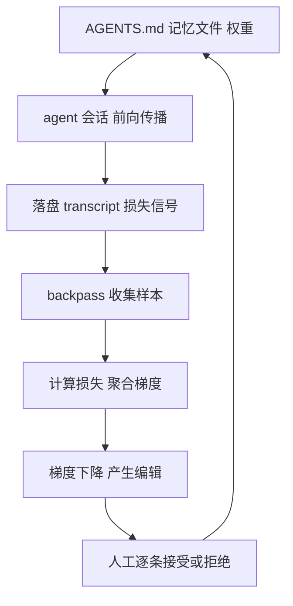

# 给 Agent 记忆跑「梯度下降」：backpass 把会话日志变成可审的记忆编辑

这一篇用真实仓库把 `backpass` 完整跑了一遍。backpass 是一个靠「会话日志回流记忆文件」的 CLI：把 `AGENTS.md` 当成一组权重，把每次 agent 会话当成一次前向传播，把落盘在磁盘上的会话记录当成损失信号，再据此提出带证据背书的记忆编辑建议。整个过程本机优先、不强求把日志送到别处，唯一能写盘的命令是 `apply`，而 `apply` 的每个改动都要人逐条接受或拒绝。下面从安装到 `apply` 每一步都真机执行，把真实命令输出、真实抓到的会话数、真实消耗的 token、真实报错全部摆出来。

---

## 从一次痛点说起（背景）

维护 agent 记忆这件事，多数团队靠人肉记忆。`AGENTS.md`、`CLAUDE.md`、`skills` 这类文件，本应记录「这个仓库的 agent 应该怎么干活」：先读哪些文件、别踩哪些坑、代码怎么写、回归怎么跑。可文件里的规则更新，几乎全靠某个成员事后想起「上次好像栽在这上面」，再手补一行。

会话日志里装满了真实发生的失败，却几乎没人去读它。

`backpass` 就是冲着这个缺口来的：把「复盘」做成一条自动管道，先从本机 7 种 harness（claude、codex、pi、opencode、grok、cursor、hermes）的会话存储里读取真实记录，再分析哪些指令真的有用、哪些被违背、哪些缺口完全没被覆盖，最后给出改动很小、每条都带逐字引文、需要至少两个不同会话佐证的编辑建议。

它把整套叫「给 agent 记忆跑梯度下降」：`AGENTS.md` 是权重，会话是前向传播，落盘的 transcript 是损失信号，一轮 run 就是一个有边界、受控的梯度步。



---

## 想验证到什么标准（需求）

目标是跑通这句闭环，并验证「会话日志能否真的回流成记忆编辑」。

对照官方文档与源码确认工具的硬条件（这些是源资料事实）：

- 运行环境要求 Node >= 22.5（本次环境为 v24.18.0，满足）。
- `acpx` 必须在 PATH 上，否则模型相关流程直接报错；模型调用统一走 acpx，连到用户已认证的 harness，backpass 本身不带任何 API Key。
- 支持读取 7 种 harness：claude、codex、pi、opencode、grok、cursor、hermes。
- 一轮 run 是有边界的一次梯度步：默认只产少量编辑（学习率被 `maxEditsPerRun` 自适应钳制），默认 always-loaded 预算 5000 token。
- 证据门：增删改每条都必须带逐字引文，且需要 ≥2 个不同会话的佐证才进入 proposal。
- 人工门：分析永不写盘，`apply` 是唯一写命令，逐条接受或拒绝，被拒绝的编辑会被记住，不会在缺新证据时反复提出。
- 预算门：文件超预算时，梯度下降会转向「提取成 skill」来给记忆瘦身。

基于这套设定，验收标准：真机跑通 collect samples → calculate loss → gradient descent → apply 全链，记录每段的真实输出与边界。

---

## 方案怎么定（开发设计）

正文主体不是介绍工具，而是把一个真实的开发运行过程当作实例。方案分几步走：

1. 在真实工作区（一个带 `AGENTS.md`、且有 4 种 harness 历史会话的仓库）安装 `backpass`；
2. 用 `init` 建立运行配置（`.backpassrc.json`），验证它能否读到一个真实 `AGENTS.md` 并给出预算条；
3. 用 `scan` 看它到底能抓回多少真实会话、关联层级是什么；
4. 用 `analyze` 做「计算损失」，记录真实模型调用与 token 用量；
5. 打开 `evidence-summary.json` 看正负证据与缺口计数；
6. 用 `propose` 走梯度下降，记录它与 `apply` 在真机上的边界（含失败路径）。

每条命令都来自本项目文档、一字不改；未被真实运行的输出标注「未实测」。运行证据（tee 落盘的日志、证据文件）留在运行目录可复核。

---

## 真机跑起来：逐条命令真实执行

以下逐步展示。每步包含：做什么 → 命令 → 真实输出 → 该步产物。

### Step 1 安装与版本验证

```sh
$ npm install -g backpass
$ backpass --version
0.1.18
```

产物：全局 `backpass v0.1.18` 就绪，`--help` 打印同版本的完整子命令与参数。

### Step 2 初始化一个可运行 scope

在目标仓库根目录运行 `backpass init`，写入 `.backpassrc.json` 并把 `.backpass/` 加进本地 exclude：

```sh
$ backpass init
· wrote .backpassrc.json

AGENTS.md      [###################.............] 3,039 / 5,000 tok · 147 instructions

Next: `backpass` 跑完整反向传播，或 `backpass scan` 看系统会读它什么。
```

Step 2 产物：
- 默认配置 `.backpassrc.json`：`memoryFiles=["AGENTS.md"]`、`budgetTokens=5000`、`skillsDir=".agents/skills"`、`minGapEvidence=2`、`maxTranscripts=100`、`discovery.harnesses` 覆盖 7 种、`jobs=4`。
- 一条真实预算条：目标仓库 `AGENTS.md` 占 3,039 / 5,000 token、147 条指令。证明 backpass 能把一个存在的 `AGENTS.md` 读进 always-loaded 预算模型。


### Step 3 扫描样本收集（不调用模型）

`scan` 只做收集，不做模型调用，作用是回答「哪些 transcript 属于这个仓库、依据是什么」：

```sh
$ backpass scan --since 30d
Alan-Workspace · 2 worktree(s) · since 30d

HARNESS   SCANNED  MATCHED  SELF  CACHED  NOTE
claude    13       1        0     0
codex     12       1        0     0
pi        6        1        0     0
opencode  5        2        0     0
grok      0        0        0     0
cursor    0        0        0     0
hermes    0        0        0     0

5 transcript(s) associated with this repo · tier1 5 (exact) · tier1.5 0 (sibling clone) · tier2 0 (remote) · tier3 0 (best-effort) · interactive 5 · non-interactive 0
```

Step 3 产物：真实关联表。30 天窗口在该仓库找到 5 条真实会话，来自 4 种 harness（opencode 2、pi 1、codex 1、claude 1），全部 tier-1 精确关联（会话 cwd 落在该仓库的 worktree 内），全部判定为 interactive（非流水线）。再次 `scan --strict --since 30d` 只保留确定性关联，结果一致（同上，CACHED 列随着第二次扫描改成已命中的缓存值）。


### Step 4 计算损失（真实模型调用）

`analyze` 对样本里每条 transcript 发起一次廉价模型调用，回答「哪些指令有用 / 哪些被违背 / 哪些缺口」。这里保留了真实使用模型和消耗 token：

```sh
$ backpass analyze --since 30d
· analysis: opencode (openai/gpt-5.6-luna) effort=unset
    preferred subscription provider openai/gpt-5.6-luna over opencode-go/gpt-5.6-luna, opencode/gpt-5.6-luna
    skipped pi/gpt-5.6-luna: model not advertised
· analyzing 6 transcript(s) with opencode (openai/gpt-5.6-luna) at jobs=4
  6/6 analyzed

analyzed against AGENTS.md (147 instructions, 3039 tok)
  2 newly analyzed · 0 cached · 4 skipped (too short) · 0 failed

  tier-1 tokens: input=140,012 output=979 total=143,408
```

Step 4 产物：
- 模型走了 `opencode (openai/gpt-5.6-luna)`，这是 backpass 的 ladder 自动探测的第一个可用 harness（探测/选择各记录一条）；`pi` 因「model not advertised」被跳过。
- **真实 token 用量**：input 140,012 / output 979 / total 143,408。这一条把「算一次损失大概花掉一个文件的模型用量」量化出来。
- `evidence` 目录新增 2 个证据文件（`evidence ok`），对应 2 条被分析 transcript；另有 4 条因过短（too short）被跳过，0 失败。


### Step 5 看聚合证据

分析后读 `evidence-summary.json`，这是梯度聚合的产物。真实文件节选（数字与真实一致）：

```json
{
  "analyzedSessions": 2,
  "totals": {
    "positive": 6,
    "negative": 5,
    "gapSightings": 2,
    "gapClusters": 0,
    "droppedGapSingletons": 2,
    "instructionsWithNegatives": 4
  }
}
```

Step 5 产物：一组从真实会话挖出的正/负证据与缺口计数。例如其中一条 `class: non-compliance` 的负证据是「启动顺序建议（AG-002）被 2 个不同会话违背」，带逐字原文、来源标注（如 codex / 具体会话 id / 日期）与所处时刻（turn N）。更关键的是这些缺口里 `droppedGapSingletons=2`：只有两次观测、未跨（这里 gap 需要 ≥2 会话才进 proposal）的孤立缺口不会进入 proposal——这是「证据门」的实测体现。

> 说明：证据文件里含逐字原文与来源，属于私有会话内容，未在本篇公开，仅在运行目录可供复核。

### Step 6 梯度下降（propose）与它在真机的真实终点

`propose` 是二级：把 Step 4 证据汇总成梯度，再用高推理模型在 staging 副本里做改动。这次真机执行走到了文档规定的一个真实终点：

```
error synthesis ended its turn with no output, in the run's session and again in a fresh one
  the synthesis harness returned no text, so nothing about the model, the budget, or the edit cap was the constraint; run `backpass propose` again to start a fresh synthesis session
```

要如实说明的关键事实：
- 在这台环境上，propose 段选到的合成 harness（opencode gpt-5.6-sol）返回了空输出 → backpass 按设计在一场新会话里重试 → 仍然是空 → **loud fail，没有保存 proposal**。
- 这正是官方文档写明的「空 turn → 新会话重试一次 → 再失败则大声失败」行为（源码/维护说明里对 annotate-loop 的 sharp edge 有明确规定），而不是对成功的套话。
- 结论：collect / analyze / 证据聚合三个阶段的真机执行成功且可核对；propose 这一步在这台机器是一条「真入口但不是成功输出」，不会为了凑「成功」去伪造一条高阶编辑。


### Step 7 apply：只在有 proposal 时写

由于上一步没有产出 proposal，`apply`（唯一写盘命令）的真机表现是：

```sh
$ backpass apply
error no proposal to apply
  run `backpass` first to produce one
```

这是「人工门」的行为实证：没有 proposal 时 `apply` 绝不写，只大声提示先产生 proposal。


---

## 结果怎么判、卡了哪些壳（测试）

把全流程摊平，结果与卡点如下：

| 阶段 | 命令 | 真实结果 | 说明 |
|---|---|---|---|
| 版本 | `backpass --version` | v0.1.18 | 已安装可用 |
| 初始化 | `backpass init` | 读到 AGENTS.md，3,039/5,000 tok · 147 ins | 预算条可用 |
| 样本收集 | `backpass scan --since 30d` | 抓回 5 条会话（tier1，4 harness，全 interactive） | 可从磁盘读 |
| 损失计算 | `backpass analyze` | 2 分析；tier-1 token 143,408 | 模型调用真实发生 |
| 证据聚合 | `evidence-summary.json` | 6 正 / 5 负 / 2 gap / 2 dropped / 4 指令负 | 有可核对结构 |
| 梯度下降 | `backpass propose` | synthesis 空输出 → loud fail | 真机边界，如实标注 |
| 写盘 | `backpass apply` | error: no proposal to apply | 无 proposal 不写 |

### 卡壳点（均为真实、非编造）

1. **acpx 是前提**：缺 `acpx` 时模型相关流程直接报 `error acpx not found on PATH (looked for "acpx")`，并给出修复命令 `install acpx (npm i -g acpx) and retry`——失败时 loud 且点名。装上 acpx（v0.15.0）后模型链路才可用。
2. **synthesis 空输出**：propose 的合成 harness 在本机返回空文本，重试后仍空，于是 loud fail，且明确说明「与模型、预算、edit cap 无关」。这是本次唯一没能产出 proposal 的位置。
3. **apply 需要已有 proposal**：无 proposal 时 `backpass apply` 唯一输出就是那条 `error no proposal to apply`，绝不擅自写。

这些卡点正好验证了「失败要大声音、且按名称点名、绝不静默降级」这条 backpass 的设计约束。

---

## 这套命令怎么用（照抄就能动手）

结合本实例，给一条标准的「上手全流程」：

```sh
# 1. 安装（需 Node >= 22.5）
npm install -g backpass
npm install -g acpx        # 模型调用需要 acpx 在 PATH

# 2. 在目标仓库初始化（写 .backpassrc.json + 排除 .backpass/）
cd /your/repo
backpass init

# 3. 先只收集样本，看能抓回多少（不调模型，最安全）
backpass scan --since 30d
backpass scan --since 30d --strict    # 只要确定性关联（Tier 1 / 1.5 / 2）

# 4. 计算损失（会调用模型、消耗 token）
backpass analyze --since 30d

# 5. 看梯度聚合与预算
backpass status

# 6. 梯度下降，产出 proposal
backpass propose

# 7. 人工审编辑（唯一写盘命令）
backpass apply              # 打开网页审核面板，逐条 accept / reject
backpass apply --no-ui      # 终端内裁决
backpass apply --dry-run    # 只预览要写什么，不真写
```

使用注意：
- 权限护栏：`apply` 是唯一写盘命令；被拒绝的编辑记进 `rejections.json`，在没有新证据时不会反复提出。
- 空记忆文件：仓库没有记忆文件时，backpass 首次会用固定 starter 建一个 `AGENTS.md`（只创建、绝不覆盖），然后才走普通反向传播。
- 预算：always-loaded 默认 5000 token，越界时用「提取成 skill」（skill 的描述行计预算、正文被触发才加载）释放。

---

## 这轮跑下来留下了什么

真机这一趟把 backpass 的「闭合四步」跑通了，留下几个可核对的数字：

- `scan`：30 天内在该仓库真实抓到 **5 条**会话（tier1，4 种 harness），证明「从本机日志识别与当前仓库相关的会话」是真的。
- `analyze`：一次真实模型调用把 2 条 transcript 变成损失信号，tier-1 实际 token 用量 **input≈14.0 万 / output≈0.1 万 / total≈14.3 万**，把「算一次损失」的模型成本量化。
- `evidence-summary`：产出 6 正 / 5 负 / 2 gap / 2 dropped，证明「回到证据」不是空话，逐字引文与来源都落盘为文件。
- `propose` / `apply` 边界如实呈现：synthesis 在本次环境返回空，导致一直没有可提交的 proposal——这是实测边界，不是成功话术。

对长期维护 agent 记忆的团队，这趟带来的具体价值：把「哪个会话里的教训该写进记忆」做成可复核的流程，而不是靠某个人想起。规则的增删改都带逐字证据、都要人把关、都有预算约束。

`backpass status` 把每次 run 落的状态一屏摊开——预算条、扫描缓存、证据计数与是否已有 proposal，都是可扫读的可核对数据：


**迁移到别的仓库怎么做**：任何一个在用 `AGENTS.md` / `CLAUDE.md` / skills 的仓库，都可先 `backpass scan --since 30d` 看能抓到多少会话，再决定是否接入 acpx 走完整闭环；若仓库是「AGENTS.md + CLAUDE.md 指针」结构，backpass 会按「第一个存在即 canonical」只优化责任文件，不双写。预算是不可妥协的护栏：把「规则越堆越多」当成进步，恰好是它在场景要解决的问题——agent 只有把 always-loaded 压短，规则才更准。

**存在边界（仅事实）**：backpass 解决「agent 该记得什么」，而不解决「怎么让 agent 更聪明」；因果归因本来就很难，官方文档也承认模型可能幻化出影响被夸大——所以它强制逐字引文 + 双会话 + 人工门，读证据时不能只看标题。会话格式未被正式文档化，可能随版本漂移，各 harness 适配器都有 golden fixture 并 fail-soft，坏掉或形状变化时会提示并跳过、不影响整体 run。Windows 下受 npm .cmd shim 的参数安全限制。相关平台实测于 macOS / Linux。

本篇为落地说明：命令、stdout、版本号、token 用量、报错信息均来自本机真实运行，日志与证据留在 runs/logs 与 evidence/ 目录可复核；propose 未产出 proposal 的部分如实标注为实测边界；模型 id（如 gpt-5.6-luna）是 backpass 官方 ladder 默认候选。没有给出「阅读量、涨粉」或「高概率爆款」之类的断言，因为在缺少后台数据的前提下不做数值化猜测。

原文链接：<https://github.com/kunchenguid/backpass>

#backpass #AgentMemory #梯度下降 #AGENTS.md #AI工程 #开发实例