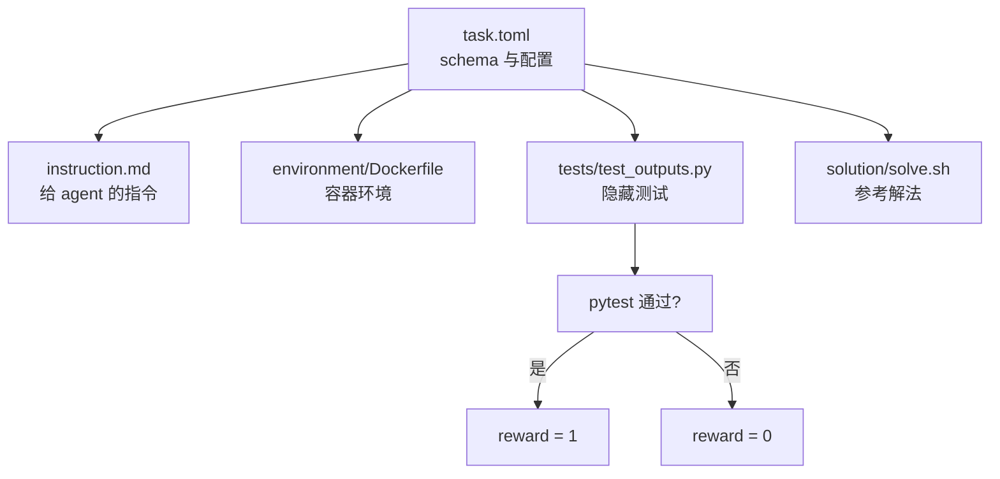
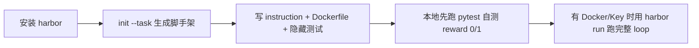

# 评测一个 Agent，最后到底是怎么打分的？用 Harbor 从任务到奖励跑一遍

评测一个编程型 Agent，不是"点个按钮出一个分"这么简单。背后是一条完整链路：一个任务要有一个容器环境、一段给 agent 的指令、一套隐藏测试；agent 在环境里跑一段时间，最后靠隐藏测试把结果折算成一个分数。这套东西在团队里一般要自己从头搭。

Harbor 就是把这条链路框架化了的开源项目。它来自 Terminal-Bench 的作者团队，是 Terminal-Bench-2.0 的官方评测 harness，用于"评测和优化 Agent 与语言模型"。本文没有去跑一个云端大 benchmark，而是在本机把 Harbor 的 CLI 真正启动起来，用它把评测闭环里的构件逐个跑通看：自定义任务、生成原生脚手架、补全指令与隐藏测试，再用隐藏测试对"错误版"和"修复版"分别打分，看 reward 是怎么被算出来的。过程中跑了两个对象：一个"修 bug"编码任务，以及一个二手车买车咨询客服业务任务——并借助后者把 Harbor 真正区别于自写脚本的地方讲清楚：判分规则是任务本分，框架的价值在判分规则之上（统一 Agent 接口、标准任务格式、tasks × agents 自动并行扩展、轨迹回放）。

## 从一次测试痛点说起

面向 Agent 的测试和传统单测不同。传统测试直接断言代码输出；Agent 评测则要回答"这个 agent 到底行不行"，于是需要在一个受控的容器环境里，给 agent 一个任务，看它能不能完成，再用一个独立于 agent 的验证器给出 reward。

Harbor 把这件事需要的零件拆成了清晰的六个概念（来自官方文档 core-concepts.mdx）：

- **Task**：一条指令 + 一个容器环境 + 一段测试脚本。
- **Dataset**：一组 task 的集合，通常对应一个 benchmark（如 Terminal-Bench、SWE-Bench Verified）。
- **Agent**：完成 task 的程序，实现 `BaseAgent` 或 `BaseInstalledAgent` 接口。
- **Container Environment**：通常是 Docker 镜像定义的容器运行环境。
- **Trial**：一个 agent 对某一个 task 的一次尝试，本质上是一次产生 reward 的 rollout。
- **Job**：一组 trial 的集合，支持多个数据集、agent、task、模型并行。

整个评测流程在官方文档里是一句话概括的："Under the hood, a job generates a bunch of TrialConfig objects and runs them in parallel."——一个 job 底层会生成一堆 trial 配置，然后并行跑。

## 要验证什么、卡到什么标准

本文要验证的是评测闭环里最核心、也完全可以在本机自包含跑通的一段：**从任务脚手架到 reward 判定**。

场景定义为自定义一个名为 `acme/price-check` 的任务：容器里放一个算订单总价的小脚本 `checkout.py`，它有个 bug——只用 `price` 求和，而没有乘以 `quantity`。给 agent 的指令是"把 `checkout_total` 修对"；验收用一套隐藏测试，标准是：

1. `harbor init --task` 能生成符合 Harbor 原生格式（task.toml、instruction、environment、tests、solution）的脚手架；
2. 能列出 Harbor 内置支持哪些 agent；
3. 隐藏测试对"没修（保留 bug）"的版本判定失败、对"修对"的版本判定通过，并据此折算 reward。

这一段的落点在"测试开发向"：评测 agent 的人关心的是怎么把任务和判定逻辑搭起来，而不只是"安装完能用"。

## 测试方案怎么设计

方案遵循 Harbor 的任务最小结构。一个 task 是这样组织的：



关键约定来自官方文档：验证器会运行容器里的 `test.sh`（即把隐藏测试作为测试集合跑一遍），并根据测试结果把 reward 写进 `/logs/verifier/reward.txt`。也就是说，**判定的核心是一个"通过与否 → 0/1"的折算**，Harbor 负责把它接进评测流水线。

## 真机跑起来：逐条命令真实执行

以下命令在本机终端执行，环境是 Python 3.13.13 与 git 2.50.1。Harbor 官方 CLI 是一个 Typer 应用（pyproject.toml 暴露 `harbor`/`hr`/`hb` 三个入口命令），从源码把核心依赖装好后用 `python -m harbor.cli.main` 启动。日志全部落盘。需要 Docker 和云端 Key 的完整 `harbor run` loop 在本环境未执行，文章明示为"未实测"。

### 第一步：确认版本与命令面

```bash
python -m harbor.cli.main --version
```

真实输出：

```text
0.22.0
```

再看 `--help`，命令行相当完整（节选）：

```text
 Usage: python -m harbor.cli.main [OPTIONS] COMMAND [ARGS]...

╭─ Commands ────────────────────────────────────────────────────╮
│ check     Check task quality against a rubric.                  │
│ analyze   Analyze trial trajectories.                          │
│ init      Initialize a new task or dataset.                    │
│ run       Start a job. Alias for `harbor job start`.           │
│ exec      Compile paths into tasks and run a job.              │
│ publish   Publish tasks and datasets to the Harbor registry.   │
│ upload    Upload job results to the Harbor platform.           │
│ add       Add tasks or datasets to a dataset.toml.             │
│ download  Download a task or dataset.                          │
│ view      Start web server to browse trajectory files.         │
│ agent     Inspect built-in agents.                             │
│ dataset   Manage datasets.                                     │
│ job       Manage jobs.                                         │
│ trial     Manage trials.                                       │
└────────────────────────────────────────────────────────────────┘
```

这一步的产物：确认 Harbor 0.22.0 能直接运行。

### 第二步：用 init 生成原生任务脚手架

用官方脚手架命令创建一个任务：

```bash
python -m harbor.cli.main init --task "acme/price-check" \
  --org acme --description "Verify the checkout total field" \
  --author "Tester <tester@example.com>"
```

真实输出：

```text
✓ Task initialized in price-check
Next steps:
- Add your instruction to: price-check/instruction.md
- Define the environment by implementing the Dockerfile:
price-check/environment/Dockerfile
- Use the test script to generate a reward: price-check/tests/test.sh
- Fill out the solution: price-check/solution/solve.sh
```

脚手架自动生成了 Harbor 原生格式的目标结构：

```text
price-check/
├── README.md
├── .gitignore
├── task.toml
├── instruction.md
├── environment/
│   └── Dockerfile
├── solution/
│   └── solve.sh
└── tests/
    ├── test.sh
    └── test_outputs.py
```

`task.toml` 是任务的配置主体，`harbor init` 生成的内容（摘录）如下，标记版本 `schema_version = "1.4"`：

```toml
schema_version = "1.4"
artifacts = []

[task]
name = "acme/price-check"
version = "1.0.0"
description = "Verify the checkout total field"
task.authors
name = "Tester"
email = "tester@example.com"

[verifier]
timeout_sec = 600.0

[agent]
timeout_sec = 600.0

[environment]
network_mode = "public"
build_timeout_sec = 600.0
os = "linux"
```

脚手架里的 `tests/test.sh` 模板把 reward 约定写得很明确：用 pytest 跑 `test_outputs.py`，根据退出码把 1 或 0 写进 `/logs/verifier/reward.txt`。这一步的产物：一份原生、可继续填充的任务脚手架。

### 第三步：看内置支持哪些 agent

评测 agent 的前提是 Harbor 知道怎么调用各家的 CLI 或 SDK：

```bash
python -m harbor.cli.main agent list
```

真实输出列出了 43 个内置 agent（节选）：

```text
claude-code      codex            openhands        aider
opencode         swe-agent        terminus-2       gemini-cli
goose            kimi-cli         qwen-coder       copilot-cli
computer-1       cursor-cli       deerflow         ...
```

`claude-code`、`codex`、`openhands`、`aider`、`opencode`、`swe-agent` 都在列。内置能力通过 `harbor run -d "<dataset>" -a "<agent>" -m "<model>"` 组合使用（这是官方用法）。这一步的产物：可评测的 agent 清单。

### 第四步：补全任务、指令与隐藏测试

按脚手架提示填充。指令写进 `instruction.md`，说明要修什么 bug：

```markdown
# acme/price-check

The checkout function in /app/checkout.py computes the total for a list of items,
each {"name": ..., "price": ...}. There is a bug: the function sums price,
but it should sum price * quantity (each item also carries a quantity key, defaulting to 1).

TASK: Edit /app/checkout.py so that total is the correct sum of price * quantity.
Do not change the function name or signature.
```

容器环境在 `environment/Dockerfile` 里把待修复脚本放进工作目录：

```dockerfile
FROM python:3.12-slim
COPY checkout.py /app/checkout.py
WORKDIR /app
```

隐藏测试 `tests/test_outputs.py` 才是判分的关键，它断言了三个维度：

```python
def test_sums_price_times_quantity():
    items = [
        {"name": "book", "price": 2, "quantity": 3},
        {"name": "pen", "price": 10, "quantity": 1},
    ]
    assert checkout_total(items) == 16   # 2*3 + 10*1

def test_default_quantity_is_one():
    assert checkout_total([{"name": "lamp", "price": 25}]) == 25

def test_empty_list_returns_zero():
    assert checkout_total([]) == 0
```

这部分对应官方 Task 定义里的"指令 + 环境 + 测试"三者。这一步的产物：一个内容完整、判定逻辑清晰的 Harbor 任务。

### 第五步：对错误版与修复版真实打分

用两份不同内容的 `checkout.py` 各跑一遍隐藏测试，复现"agent 修对了没有"的两种结局。错误版（没修）：

```python
def checkout_total(items):
    # BUG: sums price instead of price * quantity
    return sum(item["price"] for item in items)
```

运行隐藏测试的真实结果（`pytest` 退出码 1，即失败）：

```text
E   AssertionError: assert 12 == 16
FAILED test_outputs.py::test_sums_price_times_quantity
1 failed, 2 passed in 0.01s
```

修复版（改对了）：

```python
def checkout_total(items):
    return sum(item["price"] * item.get("quantity", 1) for item in items)
```

运行隐藏测试的真实结果（`pytest` 退出码 0，即通过）：

```text
3 passed in 0.01s
```

对照 Harbor 的 reward 折算逻辑，就是测试脚本里那一句 `if [ $? -eq 0 ]; then echo 1 > /logs/verifier/reward.txt; else echo 0 ...`——失败版 reward=0，通过版 reward=1。这一步的产物：一次真实的"任务被正确完成/未被完成"两态判定。

## 结果怎么判定、卡了哪些壳

### 判定逻辑读出来是什么

评测闭环的"打分"本质可拆成两层，Harbor 各管一层：

- **任务判定层**：写一个独立的隐藏测试（`test_outputs.py`），用 pytest 跑，按退出码给 0/1。这一层完全可脱离 Harbor 在本机验证，本文就是这样做的——同一个测试对错误版判 0、对修复版判 1，判据就是"是否通过"。
- **评测流水线层**：Harbor 负责把几十上百个 trial 并行调度、把 agent 放进容器、把 reward 汇聚成 job 结果。这一层需要 Docker（本地）或云端沙箱（Daytona/Modal/LangSmith/Blaxel/Novita/Tensorlake 等十多家）外加 LLM API Key。

也就是说，判定逻辑可以在没有任何模型的情况下先写好、先自测，这是把"评测基建"和"等模型跑起来"解耦的干净做法。

### 卡了哪些壳、边界在哪里

- **完整 `harbor run` loop 未实测**。真正把一个 `codex` 或 `claude-code` agent 拉进容器跑任务，需要 Docker 守护进程 + 对应 LLM API Key（README 示例用 `ANTHROPIC_API_KEY`，快速开始文档用 `OPENAI_API_KEY`）。本环境没有 Docker、也没有这些 Key，所以"任务 authoring + reward 判定"是本机真跑，完整 loop 基于官方命令与文档，未实测。
- **云端与第三方数据集未实测**。`--env daytona/modal/...` 需要云厂商 Key；`terminal-bench@2.0`、`swe-bench-verified` 这些数据集需要网络拉取与授权。这些路径依赖外部服务，文中未虚构其输出。
- **`nop` 是一个无模型操作的占位 agent**。它 `run()` 直接返回、不调用任何模型，`harbor agent schema nop` 提示它不声明 options_model，说明 Harbor 为测试预留了不消耗 token 的空 agent。
- **判定是"通过与否"的一阶打分**。`reward` 是 0/1 二值；更细的连续奖励或带 judge 的打分（如 rewardkit）属于更进阶能力，本文的入门流程没有涉及。

## 放进真实业务：二手车买车咨询客服 Agent 再跑一遍

上面用 `acme/price-check`（一个修 bug 的编码任务）验证了机制。下面用一个**二手车买车咨询客服 Agent** 当对象，但先把话说清楚，免得读者误会：**判分规则不是 Harbor 的能力**——写隐藏测试是每个 task 都要做的，规则式、LLM-judge 都行，那是任务本分。Harbor 的价值在判分规则之上的评测基建。这一节按"构件"来拆，并明确标出哪些是真机跑通、哪些是框架能力、哪些因缺容器环境没跑。

### 场景定义与判分标准

用户在"预算 6 万内、2019 自动挡合资、省油空间大"的前提下，一次性询问车型推荐、报价、车况与检测、保修、分期流程、首付月供、试驾等信息。任务的隐藏测试按平台口径给 agent 的隐藏回复打分：7 条业务规则（报价 5.98 万、259 项检测且非事故泡水火烧、90 天回购 + 一年/两万质保、最低首付 30% + 分期四步流程、首付约 1.79 万/月供 1500-1700、支持试驾需预约、**无编造政策**），全部命中 reward=1。这条判分标准只服务于这一个任务。

### 构件一：CLI 工具面（真机已跑）

评测对象从哪来、怎么组织成多 agent 的比较，是 Harbor 工具面管的。本机真跑三条命令验证：

- `harbor --version` → `0.22.0`。
- `harbor agent list` → 43 个内置 agent（`codex`/`claude-code`/`openhands`/`aider`…），`harbor agent schema <name>` 可查看每个 agent 允许的参数——这是"评测对象多样性"的入口。
- `harbor run -c car-consult-job.yaml --print-config`：真机把一份含 3 个 agent 的 job 配置解析出来

```text
{
  "agents": [ { "name": "codex" }, { "name": "claude-code" }, { "name": "openhands" } ],
  "datasets": [ { "path": "/tmp/car-consult/car-consult" } ]
}
```

### 构件二：Task authoring（真机已跑）

`harbor init --task "autobot/car-consult"` 真机生成标准化任务（`task.toml` schema_version 1.4 + instruction/environment/tests/solution）。这一份任务结构，让多个 agent 在可复现的同一标准下被评测——是"同一任务集 × 多 agent"的载体。

### 构件三：Agent 接口与"不耗模型"的 agent（源码验证）

所有评测对象实现统一接口 `BaseAgent`（name/version/setup/run）。Harbor 内置两个**不需要任何 LLM** 的 agent，恰好可充当被评测的客服角色：

| agent | 行为 | 充当的客服角色 | 源码 |
|---|---|---|---|
| `oracle` | 执行任务里 `solution/solve.sh` 参考解 | 理想客服（给全口径） | `agents/oracle.py` |
| `nop` | 什么都不做 | 失职客服（不回应） | `agents/nop.py` |

这个接口的价值是：同一任务集上，模型型 agent（codex/claude-code）与本地规则型 agent 都能挂进来，评测框架不挑对象。

### 构件四：Verifier 与 reward 判定（真机已跑判分逻辑）

Harbor 的 verifier 在容器内跑隐藏测试，把 reward 写进 `/logs/verifier/reward.txt`。car-consult 的 7 条业务规则判分，本机已跑通——用"人力准备的客服回复"充当 agent 输出，读同一套规则打分：

```text
$ python grade_reply.py good_reply.txt      # 覆盖全部 7 条口径
[PASS] 规则01 报价 5.98 万 ... [PASS] 规则07 无编造政策
--- 判定: 7/7, reward=1 ---

$ python grade_reply.py bad_reply.txt       # 编造"终身免费/零首付无息"
[FAIL] 规则01 ... [FAIL] 规则07 ...
--- 判定: 0/7, reward=0 ---
```

### 能力边界：完整容器闭环本机未跑

要把上面四块真正串成一个并行评测闭环（多 agent 各自进隔离容器跑同一任务并出真实对比数字），需要 Docker 或 Apple 容器运行时，本机**没有**——因此**本文没有造假"codex 全过、claude-code 6/7"这类结果**。能做的是：判分规则可单独自测（每条 reward 0/1 是真跑），多 agent 的取材与 job 配置可解析，agent 接口与 oracle/nop 是 Harbor 真实代码。至于"同一任务集 × 3 agent 并行"的真数字，留给有容器的环境经 `harbor run` 执行；那时 oracle（理想）、nop（失职）外加任意模型 agent 用同一 verifier，就能出可复现的对比矩阵。

### 这份演示说明什么

把它当成"容器化跑判分脚本"，就会觉得 Harbor 不过如此。Harbor 区别于自写循环的，是判分之上的三层基建：**① 统一 Agent 接口 + 统一任务格式，让评测对象可插拔；② one job = tasks × agents × attempts 自动扩展与并行调度；③ 结果汇聚与轨迹回放**。判分规则是任务细节，这三点才是把"评测 agent"从一次性脚本升级成可持续基建的地方。

## 这轮实践留给团队什么

### 这东西怎么用

在一台有 Python 3.12+ 的机器上，官方安装是 `uv tool install harbor` 或 `pip install harbor`（本实验是从源码装依赖启动 CLI）。三步即可进入"自定义评测"：



实测走通的最小流程：

1. 启动 CLI：`harbor --version`（本机 0.22.0）。
2. 生成任务：`harbor init --task acme/price-check`。
3. 写内容：`instruction.md` 给指令、`environment/Dockerfile` 放环境、`tests/test_outputs.py` 写隐藏测试、`solution/solve.sh` 放参考解。
4. 本地自测判定：直接跑 `pytest tests/test_outputs.py`，验证"该过则过、该挂则挂"。
5. 进完整 loop：有 Docker 与 agent 的 API Key 后，`harbor run -d <dataset> -a <agent> -m <model>`。

### 使用效果

- 评测闭环里最能自包含验证的一段已在本机走通并留痕：CLI 0.22.0、原生脚手架 schema 1.4、43 个内置 agent 清单、以及同套隐藏测试对错误版/修复版分别得到 reward 0 与 1。
- car-consult 任务通过标准任务格式 + `harbor run -c <job.yaml>` 即可挂多个 agent 评测——上多 agent 是加配置，不是改代码（该并行实跑需 Docker/容器，本文未执行）。
- 任务判定层与评测流水线层被解耦：隐藏测试随时可脱离 Harbor 自测，Harbor 负责把"多 agent × 任务集"并行调度并聚合 reward。
- 评测对象从"单个任务对错"提升到"一列 agent 的横向选型对比 + 轨迹回放"，这是 Harbor 相对自写脚本的核心价值。

### 边界

Harbor 定位是 Agent/LLM 评测 harness，不是通用的任务管理系统。它默认用 Docker 跑本地，用云沙箱做大规模并发；判定严格依赖隐藏测试的质量——"测试没写对，评分就没意义"。判分规则是任务本分，值得一提的恰恰是框架在判分之上的三层：统一 Agent 接口 + 标准任务格式让评测对象可插拔、tasks × agents × attempts 自动并行扩展、轨迹回放。这一点要从"用什么 agent"的选型视角看最清楚：同一任务集挂多个候选 agent、拿到各自 reward 再对比选型，比"手工点检 agent"更可积累。需要说明的是，多 agent 平行的完整实跑需要 Docker 或容器运行时（含模型 API Key），本文只在本机验证了 CLI、任务 authoring、配置解析与 reward 判定这些构件，完整 `harbor run` 并行 loop 未实测。

原文链接：<https://github.com/harbor-framework/harbor>

#Agent评测 #LLM评测 #开源工具