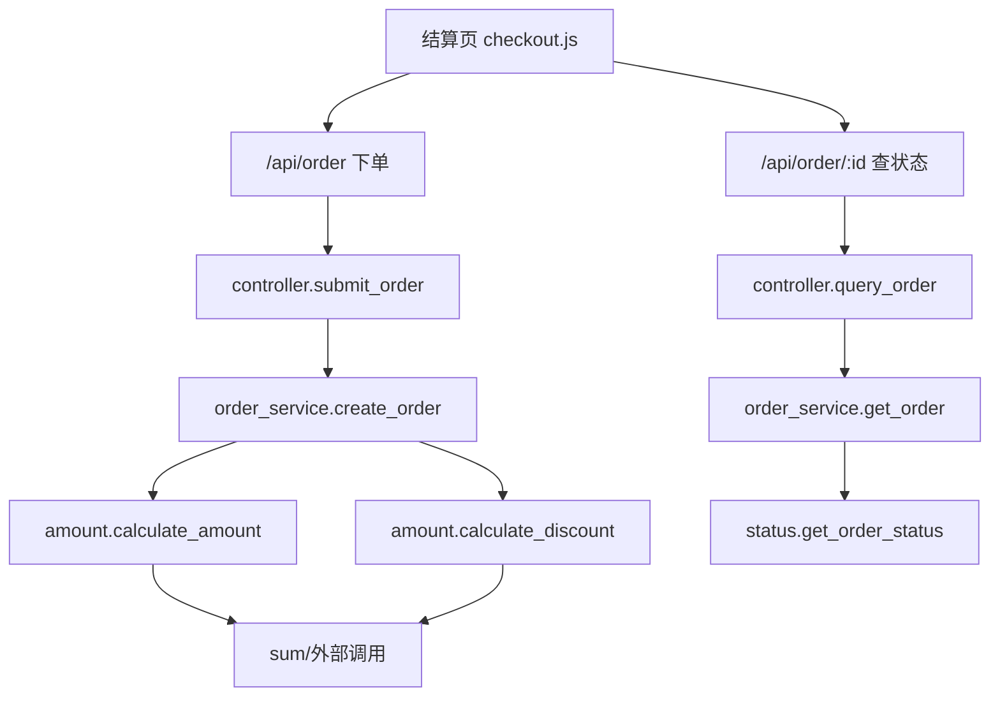
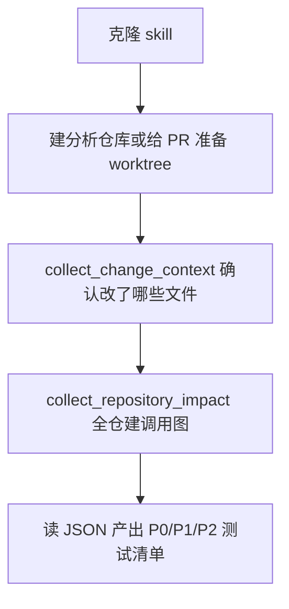

# 一个 Codex Skill，把前后端改动变成一份 P0/P1/P2 测试清单

拿到一个跨前端、后端、公共函数的改动，最花时间的往往不是看代码，而是把"这次改了哪些地方、会波及哪些调用方、到底要测什么"梳理成一份可执行的测试清单。这个开销在多人交接时还会翻倍。

开源项目 analyze-change-test-scope 专门解决这件事。它是一个面向 Codex 的 skill，自带三个只用 Python 标准库和本地 git 就能独立运行的脚本，能读工作区、暂存区、单一 commit、revision range 甚至 GitHub PR，扫全仓源码建一份轻量级调用图，最后输出带证据、风险等级和 P0/P1/P2 优先级的测试范围。本文在真实环境里克隆、准备一个订单业务仓库，把这条"从 Git 变更到测试清单"的链路完整跑一遍，并展示每一步的真实命令和输出。

## 从一次测试痛点说起

改动往往不是一个文件的事。一个"加折扣"的需求，可能同时动到公共金额算法、后端订单服务、前端结算页，还可能牵出一个之前没人记着的调用方。靠人肉翻 diff 去追影响链，链条越长，漏掉的概率越高。

analyze-change-test-scope 想把这个问题收敛成确定性的脚本化分析。项目定位在 README 里写得很清楚：面向 Codex 的开源 Skill，读取前端和后端 Git 代码变更，分析需求与影响范围，生成带证据、风险等级和优先级的测试清单。它不做代码评审，也不自动修改或运行任何东西，只做只读分析。

项目结构很小，核心就是三个脚本加一份 Skill 定义：

```text
analyze-change-test-scope/
├── README.md
├── LICENSE
└── skills/analyze-change-test-scope/
    ├── SKILL.md
    ├── agents/openai.yaml
    ├── references/
    └── scripts/
        ├── collect_change_context.py      # 采集工作区/暂存/commit/range 变更上下文
        ├── collect_repository_impact.py   # 全仓扫描 + 轻量级调用图 + 影响证据
        └── prepare_pr_workspace.py        # 为 GitHub PR 准备隔离只读分析工作区
```

## 要验证什么、卡到什么标准

本文要验证的不只是"脚本能跑"，而是这条链路有没有用：先定义一个真实的前后端改动，再跑两个采集脚本，最后能不能真的读出一份可以落地的测试范围。

场景定为订单业务仓库 demo-append-repo，改动分两步：先在共享金额模块加"满 100 打九折并新增折后应付款"，再新增一个"按订单号查状态"的接口，前端结算页同时新增对应的查询调用。这个改动刻意跨了公共函数、后端入口、前端消费者和已有测试四类位置，正好能检验调用图能不能把散在各处的相关方串起来。

验收标准是三条：

1. collect_change_context.py 能输出结构化 JSON，说清本次改了哪些文件、增删了多少行、diff 有没有被截断；
2. collect_repository_impact.py 能在全仓扫描基础上给出 changed_symbols、调用链影响路径、相关测试和前端消费者，并自报"扫描是否完整"；
3. 系统性地产出 P0/P1/P2 测试清单，并区分代码事实与推断。

## 测试方案怎么设计

方案的骨架是 skill 自己在 SKILL.md 里定义的调用链：`页面/入口 → 前端组件/状态 → 接口客户端 → 控制器 → 服务 → 公共方法 → 模型/数据库 → 外部系统`。测试范围分析的任务，就是从变更节点出发，沿反向 `caller → callee` 一路追到用户入口或系统边界。

demo 仓库的调用链：



这条链的核心假设：改一个公共方法，所有往上调用它的控制器、接口、前端页面都是候选回归点。skill 用两个脚本落实这个假设——先确认"改了什么"，再确认"改的东西被谁用"。

## 真机跑起来：逐条命令真实执行

以下命令都在本机终端执行，环境是 Python 3.13.13 与 git 2.50.1，日志通过管道写入运行目录。整个链路只用标准库和本地 git，不需要任何 API Key 或联网，可以离线复现。

### 第一步：克隆 skill，准备仓库

先克隆源项目，再准备一个带真实 git 历史的订单仓库用作分析对象。

```bash
git clone https://github.com/Cheryl-station/analyze-change-test-scope.git
```

dataprep 仓库 git 历史为三次提交：

```text
git:main
e759264 feat: 订单初始版本
1a2ba67 feat: 满百九折,新增折后应付款
feature/order-status 分支在此基础上再新增 order 状态查询
```

构建 demo 仓库时，把改动提交到 feature/order-status 分支，让 main 分支停在 1a2ba67，形成 `main...HEAD` 这个可对比的 revision range。这一步的产物是一个有三个提交、一个特性分支、前后端和测试齐全的本地仓库。

### 第二步：采集变更上下文

核心命令是第一个脚本的 range 模式：

```bash
python3 skills/analyze-change-test-scope/scripts/collect_change_context.py \
  --repo . --range main...HEAD --analysis-mode full
```

真实输出的关键字段如下（节选）：

```json
{
  "repository": "/.../demo-append-repo",
  "source": "range:main...HEAD",
  "analysis_mode": "Full repository context analysis",
  "base_sha": "1a2ba674a760be3dc34720848e5e89c2be40b746",
  "merge_base": "1a2ba674a760be3dc34720848e5e89c2be40b746",
  "diff_truncated": false,
  "changed_files": [
    {"path": "backend/controller.py", "change_type": "modified", "added_lines": 5, "deleted_lines": 1},
    {"path": "backend/order_service.py", "change_type": "modified", "added_lines": 7, "deleted_lines": 1},
    {"path": "backend/status.py", "change_type": "added", "added_lines": 3, "deleted_lines": 0},
    {"path": "frontend/pages/checkout.js", "change_type": "modified", "added_lines": 5, "deleted_lines": 0}
  ]
}
```

注意 `diff_truncated: false`——这次 diff 完整未截断，change 上下文可信。该脚本识别出本次改动是后端 controller、后端 order_service、新增 status.py 和前端 checkout.js 四个文件。这一步的产物是"本次改了哪些文件、各自增删多少行"的事实清单。

脚本还支持 --staged、--commit HEAD 等模式。真实演示暂存区模式时，新增一个 README.md 和一个 backend/ping.py 并 git add 后运行：

```bash
python3 skills/analyze-change-test-scope/scripts/collect_change_context.py --repo . --staged
```

输出同样把这两个新增文件识别为 added，说明同一个脚本可以覆盖"还没提交但已加号准备"的改动，适合提交前先看影响。

### 第三步：全仓扫描与轻量级调用图

这是最有信息量的一步。它不止读 PR diff，而是遍历全部受支持的源码（Python、JavaScript、TypeScript、JSX/TSX、Java、Vue），建立 `caller → callee` 关系，再把调用关系与本次变更对象关联。

```bash
python3 skills/analyze-change-test-scope/scripts/collect_repository_impact.py \
  --repo . --range main...HEAD
```

真实输出的扫描统计可见扫描是被完整执行的：

```json
"repository_scan": {
  "candidate_source_files": 7,
  "source_files_scanned": 7,
  "definitions_indexed": 12,
  "call_sites_indexed": 20,
  "call_edges_emitted": 20,
  "scan_complete": true,
  "excluded_directories": [".git", ".venv", "__pycache__", "build", "node_modules", "vendor"]
}
```

`scan_complete: true` 表明这次对完整仓库完成了扫描，没有因超时、截断或解析失败而遗留死区。`excluded_directories` 显示依赖目录与构建产物被明确排除在分析外。

更有价值的是它给出的影响路径（impact_paths）。例如新增的 `get_order_status`，脚本追踪到它的多跳调用链：

```json
{
  "changed_symbol": "get_order_status",
  "depth": 2,
  "path": [
    {"symbol": "query_order",  "file": "backend/controller.py", "line": 9},
    {"symbol": "get_order",    "file": "backend/order_service.py", "line": 19},
    {"symbol": "get_order_status", "file": "backend/status.py", "line": 1}
  ]
}
```

也就是说，改动最小的 `status.get_order_status`，实际会通过 `controller.query_order → service.get_order` 两级调用向上暴露出去。前端消费者也被识别出来——checkout.js 里的 `fetch("/api/order/" + idValue)` 被标成 `api_consumer`，引用 url 是 `/api/order/`。

这一步的产物是"这次改动波及哪些调用方、影响路径有多长、谁在前端消费这些接口"的影响地图。

### 第四步：跑项目自带测试

skill 自带 tests/test_scripts.py（用标准库 unittest，不需要 pytest）。在克隆目录执行：

```bash
python3 -m unittest tests/test_scripts.py -v
```

真实输出末尾：

```text
test_scans_all_supported_project_source_files ... ok
...
Ran 15 tests in 3.825s
OK
```

15 个用例全部通过，覆盖了 URL 解析、变更上下文、轻量级调用路径构建、前端 API 消费者识别、相关测试发现和只读降级等关键行为。这一步验证了工具本身是自洽且可回归的。

## 结果怎么判定、卡了哪些壳

### 从输出读出 P0/P1/P2 测试清单

按 SKILL.md 的分级定义（P0 阻断发布或保护关键数据/安全；P1 覆盖核心改动行为；P2 覆盖次要回归或低概率边界），结合真实调用链，这次改动可以得出如下必测场景：

| ID | 优先级 | 类型 | 前置/数据 | 操作 | 预期结果 | 证据 |
|---|---|---|---|---|---|---|
| T1 | P0 | API/contract | 商品金额合计 ≥100 | 前端 POST /api/order 并读取 payable | payable = total×0.9，且两位小数 | order_service.create_order→calculate_discount 影响路径 |
| T2 | P0 | 集成 | 订单号末位 0 | GET /api/order/:id 返回订单状态 | 状态返回 paid；前端 queryOrder 能解析 json | queryOrder→query_order→get_order 调用链 |
| T3 | P1 | 单元 | 99.99 与 100 两个边界价 | 调用 calculate_discount | <100 不打折、≥100 打九折（round 两位） | 已有 test_discount_boundary 覆盖 |
| T4 | P1 | 集成 | 新建订单后立即查状态 | 先下单再查该订单 | 同一次会话中下单→查询状态可连贯 | create_order/get_order 共享 order 状态 |
| T5 | P2 | 兼容 | 旧前端只读 total | 回归原下单接口响应体 | total 字段仍在，新增 payable 不破坏旧消费方 | controller.submit_order 未改响应结构 |

其中 T1、T2 是 P0，因为涉及金额和订单状态语义，一旦出错直接阻断发布；它们对应的影响链都能在调用图里找到证据，不是凭空推断。T3 直接对应已有的相关测试 test_discount_boundary，回归时直接重跑。注意 create_order 对 controller、amount、config 都有 `resolved_callees`，且修改它会影响 controller.submit_order 与测试 test_create_order，这部分要作为核心回归范围。

### 分析模式与模式选择

skill 支持两种模式。本文走的是 Mode A（仅代码变更）：没有需求文档时，靠 diff 推断业务意图并明确标注置信度。另一种 Mode B（需求对照）在提供需求/验收标准/ticket 时使用，会输出需求追踪矩阵和"疑似超范围实现"，本文没有实际需求文本，未展开。

### 卡了哪些壳、边界在哪里

真机跑下来遇到的限制有几处，都应该如实写进测试分析：

- **JS/TS 使用正则与花括号作用域而非 AST**。SKILL.md 和脚本输出都把这一点列为限制：重载、继承、动态分派、反射和生成代码可能解析不准。所以调用图是"轻量级"的，适合给测试影响分析提供线索，不等于编译器级完整调用图。定位到这种启发式边后，应回到源码人工核验关键路径。
- **PR 拉取路径本次未实测**。prepare_pr_workspace.py 需要真实 GitHub PR URL 并依赖 gh 或 GitHub API。本文没有对公网 PR 真跑，这一步在成稿里明确标为"基于官方资料，未实测"。脚本本身自带降级：拿不到完整仓库就明确标 `Diff-only analysis`，不会硬说已覆盖全部间接调用方。
- **只读、不跑测试是设计使然**。脚本不修改业务代码、不自动运行测试、不安装依赖。这意味着"建议执行"里引用的测试文件或命令如果没有在本轮跑过，要明确写"未执行，仅建议"。
- **diff 可能不完整代表需求**。代码差异无法还原产品需求、线上动态配置、外部系统状态或隐含业务规则，这是项目 README 明示的边界，测试范围分析不能替代需求评审。

## 这轮实践留给团队什么

### 这东西怎么用

在一台有 Python 3.9+ 和 git 的机器上，三步就能投入使用：



完整的可照做流程：

1. 克隆：`git clone https://github.com/Cheryl-station/analyze-change-test-scope.git`
2. 装进 Codex：`cp -R analyze-change-test-scope/skills/analyze-change-test-scope ~/.codex/skills/`（重新打开 Codex 会话后用 `$analyze-change-test-scope` 调用）；不走 Codex 时，三个脚本本身可直接用 `python3` 执行。
3. 选变更来源：工作区用默认，暂存区加 `--staged`，单一提交用 `--commit HEAD`，分支对比用 `--range main...HEAD`，PR 用 `prepare_pr_workspace.py` 先准备隔离工作区。
4. 跑两条采集命令，把 JSON 落盘，再读成测试范围报告并给 P0/P1/P2 分级。

### 使用效果

- 一次改动从"人工翻 diff 猜影响面"变成"两条命令出结构化影响地图"。本次真实扫描数字：全仓 7 个源文件、索引 12 个定义、20 个调用点、20 条调用边，`scan_complete=true`，diff 未截断。
- 调用图直接给出了散在公共函数、后端、测试、前端四处的相关方，并追踪到 `get_order_status` 的两跳影响路径，前端 `/api/order/` 消费者也被自动识别。
- skill 自带 15 条单测全部通过，工具本身可回归验证。
- 跨前后端共 4 个文件、新增 20 行（另删 2 行）的小改动，能稳定产出 5 个带证据的测试场景（2 个 P0、2 个 P1、1 个 P2）。

这套方法的价值在"辅助测试范围分析"，不在"替代评审"。调用图对 JS 是近似值，PR 拉取未被本文实测，diff 不等于完整需求。落地时把它当作给测试范围的起点和交叉验证依据，关键路径仍回到源码和需求核验。可迁移的场景不少：提交前快速预估影响、PR 评审时快速出回归清单、接入 Mode B 把需求文本和代码改动对账，都是比"人工翻 diff"更确定的打开方式。

原文链接：<https://github.com/Cheryl-station/analyze-change-test-scope>

#测试开发 #Codex #AI辅助测试