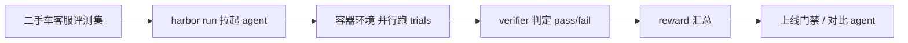

# 用 Harbor 给二手车智能客服 agent 做上线前的"体检"

Harbor 是 Terminal-Bench 团队出品的 Agent 与语言模型评测框架：它能在容器环境里评估任意 agent（Claude Code、OpenHands、Codex CLI、Aider 等），可以自建并分享自定义评测集与运行环境，也能借助 Daytona、Modal 等云端运行时在大量环境里并行跑实验，并为 RL 优化生成 rollout。下面用一个"二手车平台智能客服 agent 上线前评测"的模拟案例，说明测试团队怎么拿它把"客服靠不靠谱"变成一个可复现的自动化门禁。文中涉及项目命令与配置均来自 Harbor 官方项目文档，业务输入、处理流程、输出与收益均为**模拟示例**，不代表已经安装、运行或上线。

---

## 从一次测试痛点说起

智能客服 agent 上线前的验收经常卡在同一个地方：人工拿几十条用例点一遍，agent 答对答错靠测试员肉眼判断，结果没法复现、没法对比、更没法接进发布流程。换一个模型、换一次版本，同样的场景又要重新手工点一遍。

Harbor 把这类问题的底层件给出来了——一个"任务 + 环境 + 测试"的评测框架。按 Harbor 官方定位，它的核心概念是：**Task**（单条指令 + 容器环境 + 测试脚本，一个 task 就是一个目录）、**Dataset**（task 的集合，通常对应一个基准）、**Agent**（完成任务的程序）、**Environment**（容器运行环境，默认 Docker）、**Trial**（agent 对某个 task 的一次尝试，产出 reward）、**Job**（一批 trials 的集合）。把业务问答塞进 Task，用 verifier 判对错，问题就从"这次手测看着还行"变成"这轮跑完 pass 几条、fail 几条、reward 是多少"。

---

## 要验证什么、卡到什么标准

这个模拟案例要回答的问题是：**一个二手车平台的智能客服 agent，在接待"车况咨询、报价预约、预约看车、线索收集"这几类任务时，到底靠谱到什么程度，能不能放行上线。**

被测对象是客服 agent，评测集是这几类场景下的问答任务。验收标准定成两条：一是在设定的评测集上跑完，得到逐条 pass/fail 和总 reward；二是这个结果可复现——同一个评测集换 agent 或换 model 再跑一次，能直接对比，不需要人再猜一次。

用到的 Harbor 能力是自建 Task（装业务场景）和 Tool 的 verifier（判定对错）。这里的"把客服场景做成评测集再去评测"，属于把 Harbor 用在业务 agent 评测上的组合用法，不是 Harbor 官方内置的客服能力。

---

## 测试方案怎么设计

Harbor 的自建任务从一条命令开始。官方文档给出的初始化方式是：

```
harbor init --task "<org>/<name>"
```

这条命令会生成一个标准 task 目录。官方文档列出的目录骨架是：

```
instruction.md   # agent 的任务说明（自然语言，写给 agent 看）
task.toml        # 任务配置（超时、资源、元数据）
environment/     # Dockerfile 或环境定义
tests/           # 验证脚本，test.sh 把 reward 写到 /logs/verifier/reward.txt
solution/        #（可选）参考解
```

（以上命令与目录结构引自 Harbor 官方文档-Tasks 一节。）

整体评测链路可以画成一张流程图，业务输入从左手进，reward 从右手出：



方案里"原生能力"和"组合使用"要分清楚：Harbor 原生提供的是 Task/Environment/Agent/Verifier 这套评测骨架和并行执行能力；而"把二手车客服问答翻译成 task、规定每条答得多对才算 pass"这套口径是测试团队自己在评测集里定的，属于组合使用设计。

---

## 模拟流程怎么走

以下为本案例的**模拟示例**流程：业务输入、处理步骤、预期中间结果都是按 Harbor 官方概念推演的，没有在真实环境里跑过。

**Step 1：把客服场景整理成评测集。** 业务上先收集常用客服问答，样例输入可以是"这台 2019 款二手思域跑了 6 万公里，报价多少？""今天能预约看车吗？周末时间是什么？""留下电话，之后有新车源请通知。"每条配一个判定标准：答对 / 答错 / 需转人工 / 边界场景。这是模拟的评测集，不是 Harbor 自带数据。

**Step 2：用 init 建 task，把一条场景填成评测任务。** 按官方格式建目录，`instruction.md` 里写清楚 agent 该做什么；`task.toml` 里声明超时、镜像、资源（引官方文档示例概念：`[task]`、`[agent]`、`[verifier]`、`[environment]` 几段配置）。

**Step 3：写 verifier / tests 判定对错。** 在 `tests/test.sh` 里根据 agent 的回复判定符合哪条口径，并把 reward 写到指定位置。官方文档写明验证结果会写到 `/logs/verifier/reward.txt` 或 `/logs/verifier/reward.json`。这是 Harbor 的验收入口，判定规则本身由评测集自定义。

**Step 4：并行跑 trials。** 用同样的评测集对可能采用的 agent×model 组合各跑一轮。官方文档给出的评估本地数据集的方式是：

```
harbor run -p "<path/to/local-dataset>" -m "<model>" -a "<agent>"
```

若要在云端并行放大，可加 `--env` 指定 Daytona 这类云环境（官方文档有示例）。这一轮跑完，预期中间结果是：每个 task 有独立 trial 与 reward，多个 agent 可横向对比。

**Step 5：汇总 reward，落到门禁。** 把每条 pass/fail 与总 reward 汇总成一张表，作为上线前放行的依据。

---

## 结果怎么判定

验收围绕"能否得到可复现的判定"展开。模拟的验收用例表如下（仅示意判定口径，不是真实运行结果）：

| 场景 | 判定标准 | 预期口径 |
|---|---|---|
| 车况/报价咨询 | 回复包含准确价格区间或明确引导 | pass / fail |
| 预约看车 | 能给出可预约时段并完成邀约 | pass / fail |
| 线索收集 | 正确采集留资并确认 | pass / fail |
| 用户追问/长对话 | 不丢失上下文、不擅自承诺无依据价格 | pass / fail / 转人工 |

通过条件上设定：核心场景全 pass 且无红线 fail 才建议放行；任一红线 fail 则打回。这里的"通过率""reward 数值"都是**预期口径**，不是实测数据。

边界要写清楚：Harbor 评测卡的是 agent 在"已有 task"上的行为，评测集覆盖不到的场景、实时价格这类动态数据，agent 的真实表现不在这次评测能保证的范围内；需要人工抽检兜底。

---

## 这东西怎么用

对想直接上手把模型或 agent 接进来跑评测的团队，落地路径是：先 `uv tool install harbor`（官方安装方式），用 `harbor init --task "<org>/<name>"` 建任务目录，把业务场景填进 `instruction.md` 并配好 `task.toml`，用 `tests/` 里的脚本做判定，最后用

```
harbor run -p "<path/to/task-or-dataset>" -a "<agent>" -m "<model>"
```

跑起来。查有哪些可用的数据集可以 `harbor dataset list`，看某个 agent 接受哪些参数用 `harbor agent schema <name>`（以上命令均引自 Harbor 官方文档）。

---

## 预期带来什么改变

在适用条件下，这套做法带来的预期变化是三块：一是把"客服 agent 靠谱吗"从人工抽样变成可复现、可留档的自动化评测门禁；二是同一个评测集能横向对比不同 agent 与模型，选型决策有数据支撑；三是评测集和 command 能回填到 CICD，做发布前的质量卡点。

它也能迁移到别的业务 agent：电商退货咨询、工单客服、下单与支付引导、线索留资电话等，只要能把场景沉淀成 task、把"对错口径"写进 verifier，就能复用同一套评测骨架。

限制也在：不安装、不运行 Harbor，以上输入、流程、输出和收益均为预期示例；评测只能覆盖已经写成 task 的场景，动态数据、抽检、真实并发这些要靠测试团队在评测集之外另行设计。它把"评分标尺"稳住，"标尺之外的世界"仍由人兜底。

Harbor 官方文档：<https://www.harborframework.com/docs>  
Harbor 项目：<https://github.com/harbor-framework/harbor>  
输入原文件：<https://github.com/harbor-framework/harbor/blob/main/AGENTS.md>

#Agent评测 #智能客服 #测试开发 #开源框架 #LLM评测