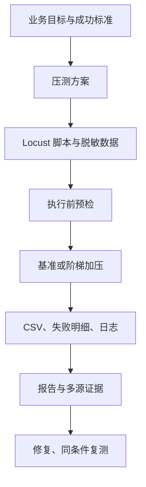

# locust-perf-framework


> 基于 Python + Locust 的通用性能测试框架，沉淀「压测方案 → 脚本 → 数据 → 执行记录 → 中文分析报告 → LLM 辅助总结」的可复用流程。

本框架不是替代 Locust，而是在 Locust 之上加了一层面向测试工程落地的组织方式：统一目录边界、命名规范、防覆盖的时间戳产物管理、命令封装，以及把 Locust 原始 CSV 二次加工成可直接汇报的中文 HTML 报告。

## 特性

- 📁**分层约定**：`locustfiles/` 脚本、`data/` 数据、`reports/` 原始+二次报告、`logs/` 日志、`config/` 配置。
- 🔒 **自动时序命名 / 不覆盖**：每次执行自动生成时间戳目录，目标已存在自动追加序号，杜绝重跑覆盖历史。
- 🚀 **一体化命令**：面对用户的执行入口封装在 `tools/`，只暴露并发、速率、时长、目标、数据等必要参数。
- 🧾 **中文 HTML 报告**：解析 Locust CSV + 失败明细，输出含 TPS / RT / 错误率趋势、请求级瓶颈、调用链热图的中文报告。
- 🤖 **LLM 辅助分析（可选）**：经 `config/ai_apiclient.py`（OpenAI 兼容封装）为报告追加 AI 摘要，遵守"证据链 / 反证法 / 药方+复验"的排查纪律，密钥走环境变量。
- 🧑‍💻 **AI 对话协作（Agent-ready）**：内置「规划 → 脚本开发 → 报告分析」三 Agent 规则，Codex / Claude Code / DSH 等工具打开项目即可用自然语言驱动全流程压测。
- 📈 **阶梯加压找拐点**：`tools/run_step_load.py` 逐级加压并自动判定 TPS 性能拐点与错误率击穿点，支持熔断。
- 🔍 **瓶颈模式库**：`docs/performance_known_issues.md` 沉淀常见瓶颈（慢 SQL、连接池、Redis 热点、GC 风暴等），供定位与报告分析参考。
- 📊 **多源监控接入**：支持 Prometheus 资源 CSV + 慢查询 JSONL，在报告中叠加"资源与吞吐关联曲线"与慢查询 Top，作为交叉验证的第二层证据。
- 🩺 **执行前预检**：`tools/preflight.py` 自动检查占位 host、占位密钥与环境对齐，避免误压空白环境。
- 🧼 **敏感数据默认不入库**：`.gitignore` 默认忽略 `data/` 下的真实 txt/json/csv，仓库只保留 `data/examples/` 脱敏示例。

## 📁 目录结构

```
.
├── AGENTS.md                 # Agent 规则入口（目录边界/命名/不覆盖/规范）
├── agents/                   # 规划 / 脚本开发 / 报告分析 Agent 职责模板
├── config/
│   ├── config.ini            # 运行配置（host、环境、等待时间、日志）
│   ├── ai_apiclient.py       # LLM 调用封装（环境变量驱动）
│   └── performance_profile.yaml
├── data/
│   └── examples/             # 脱敏示例数据（脚本默认指向）
├── docs/                     # 工作流与报告设计
├── examples/                 # 可公开的端到端压测示例（含报告成品）
├── locustfiles/              # Locust 压测脚本
├── logs/                     # 框架运行日志（不入库）
├── reports/                  # raw/ 原始产物、html/ 中文报告、analysis/ 中间产物
├── tools/                    # 命名/日志/报告生成/执行封装
└── tests/                    # 自包含单元测试（不触网、不调真实 LLM）
```

## 🚀 快速开始

### 安装

```shell
# 需要 Python >= 3.11，推荐使用 uv
uv sync --extra dev
# 或用 pip:
pip install -e .[dev]
```

### 查看公开示例

仓库 `examples/` 目录存放了**端到端跑通**的脱敏压测示例（含脚本、数据、原始 产物与中文 HTML 报告成品），适合先看产物再动手复现，也方便理解框架的标准流程 与各类测试类型：

|示例|场景 / 测试类型|示范点|成品报告|
|---|---|---|---|
| [`health-check-demo`](https://github.com/xsoway/locust-perf-framework/blob/master/examples/health-check-demo) |健康检查 · 基准/负载|单步基准 + 阶梯加压找拐点| `report.html` |
| [`pressure-test-demo`](https://github.com/xsoway/locust-perf-framework/blob/master/examples/pressure-test-demo) |健康检查 · 压力|加压到服务过载，击穿点与熔断判定| `report.html` |

```shell
# 直接打开某个示例的成品报告
open examples/health-check-demo/report.html
open examples/pressure-test-demo/report.html
```

每个示例的 `README.md` 都给出了「启动本地 Mock 被测服务 → 预检 → 压测 → 生成中文报告」的可一次性复现命令，完整清单见 [`examples/README.md`](https://github.com/xsoway/locust-perf-framework/blob/master/examples/README.md)。

### 跑通一个示例场景（健康检查）

```shell
uv run locust -f locustfiles/locust_demo_health_baseline.py \
  --headless -u 1 -r 1 -t 10s
```

默认 host 从 `config/config.ini` 读取（仓库内为 `https://example.com` 占位）。可用 `LOCUST_TARGET_HOST` 覆盖指向你的被测服务：

```shell
LOCUST_TARGET_HOST=https://your-service.example.com uv run locust \
  -f locustfiles/locust_demo_health_baseline.py --headless -u 1 -r 1 -t 10s
```

### 一体化执行入口

每个场景都封装为 `uv run python -m tools.xxx ...`，自动创建时间戳目录、生成 Locust 原始产物、失败明细 JSONL 与中文 HTML 报告：

```shell
# 基准测试：健康检查
uv run python -m tools.report_builder \
  --scenario demo_health --test-type baseline \
  --stats-csv reports/raw/demo_health/<timestamp>/stats_stats.csv \
  --overview "示例：健康检查接口基准摸底" \
  --plan "1 个虚拟用户，持续 10 秒，建立响应时间基线" \
  --users 1 --spawn-rate "1 user/s" --run-time "10s" \
  --host "https://example.com" \
  --data-file "data/examples/demo_health_payloads.csv" \
  --api-name "健康检查接口" --method GET --path /health

# 阶梯加压找拐点（容量/压力测试）：
uv run python -m tools.run_step_load \
  --locustfile locustfiles/locust_demo_health_baseline.py \
  --steps "10,30,50,80,100" --step-duration 30s \
  --scenario demo_health --host https://your-service.example.com
```

所有入口都支持 `--host` / `--path` / `--data-file` / `--url-file` 覆盖默认值；如某个环境网络或 LLM 网关不可用，加 `--no-llm-analysis` 跳过 AI 摘要。

**正式压测前建议先做预检**，避免误压占位环境或带占位密钥的数据：

```shell
uv run python -m tools.preflight \
  --host https://your-service.example.com \
  --data-file data/examples/demo_health_payloads.csv
```

> 只需 Locust 原始产物、不需要二次报告时，也可以直接用底层 `locust` 命令（见各 `tools/run_*.py` 的 help）。

## 🔧 配置

|环境变量|作用|默认|
|---|---|---|
| `LOCUST_TARGET_HOST` |被压测服务根地址（覆盖 `config.ini host`）| `https://example.com` |
| `AI_APICLIENT_BASE_URL` |LLM 网关 base_url（OpenAI 兼容）| `http://localhost:8000/v1` |
| `AI_APICLIENT_API_KEY` |LLM API Key| `not-configured` |
| `AI_APICLIENT_MODEL` |模型名| `demo-model` |
| `AI_APICLIENT_EXTRA_HEADERS` |透传给网关的额外 header（JSON）|空|

LLM 分析名为可选增强：未配置环境不会真正调用；交叉 `--no-llm-analysis` 跳过。**请勿在仓库提交真实密钥**。

## 🤖 AI 对话协作（Codex / Claude Code / DSH）

本项目**天然面向 AI 工具（Codex、Claude Code、DeepSeek Harness 等）驱动**： 仓库内置了一套「规划 → 脚本开发 → 报告分析」的三 Agent 协作规则。当用任意 Agentic 工具打开本项目根目录时，**工具会自动读取 `AGENTS.md` 与 `agents/*.md` **，获得压测 全流程的领域规则（命名规范、目录边界、防覆盖、指标口径、熔断红线、报告纪律），从而 可以用自然语言直接驱动一次完整的压测。

### 三 Agent 协作工作流

|Agent|指令文件|职责|输入 → 输出|
|---|---|---|---|
|**规划 Agent**| [`agents/planning_agent.md`](https://github.com/xsoway/locust-perf-framework/blob/master/agents/planning_agent.md) |确认业务背景、接口信息、测试类型、并发模型、指标口径、熔断/退出条件|对话信息 → 结构化压测方案（YAML）|
|**脚本开发 Agent**| [`agents/script_development_agent.md`](https://github.com/xsoway/locust-perf-framework/blob/master/agents/script_development_agent.md) |按方案生成 Locust 脚本、数据文件、运行命令|压测方案 → `locustfiles/` + `data/` 产物|
|**报告分析 Agent**| [`agents/report_analysis_agent.md`](https://github.com/xsoway/locust-perf-framework/blob/master/agents/report_analysis_agent.md) |多指标证据链归因，输出带优先级与复测方案的中文报告|原始产物 → `reports/html/` 决策级报告|

> 🪄 想直接开聊？[`docs/agent_prompts.md`](https://github.com/xsoway/locust-perf-framework/blob/master/docs/agent_prompts.md) 提供**一键全流程 / 分步推进 / 进阶精调**三档可直接复制的提示词模板，填上你的接口信息即可。

### 典型对话流程

**第一步，告诉规划 Agent 你的目标**（工具会按 `planning_agent.md` 逐项与你确认）：

> 「帮我规划一个上线前单接口基准测试：`POST /api/v1/orders`，预期日活 10000， 目标定位最慢接口和错误率。」

规划 Agent 会依次确认：业务背景、接口/认证/请求体、测试目标→策略、并发模型、 环境对齐、数据来源、算力估算、SLA 阈值与熔断红线，最后输出结构化方案。

**第二步，交给脚本开发 Agent**：

> 「按刚才的方案开发 Locust 脚本和数据文件。」

脚本开发 Agent 会生成符合 `locust_<业务域>_<接口>_<测试类型>.py` 命名的脚本、 脱敏数据文件与一体化运行命令。

**第三步，交给报告分析 Agent**：

> 「分析 `reports/raw/orders/20260910_120000/` 并生成中文报告。」

报告分析 Agent 读取原始 CSV/失败明细，遵循「多指标证据链 + 反证法 + 药方&复测」 纪律，产出可决策的中文 HTML 报告。

### 各 AI 工具的使用方式

- **Codex**：在项目根目录打开会话，直接描述压测诉求，让它在 `AGENTS.md` 约束下 完成规划→脚本→执行→报告的全流程。
- **Claude Code**：同样进入项目根目录，工具会加载 `CLAUDE.md` / `AGENTS.md` / `agents/*.md`，可用自然语言分阶段推进。
- **DSH / 其它 Agent 工具**：让 Agent 先读取上述规则文件，再开始对话协作。

### 程序化加载 Agent 指令


如需在代码或编排层复用这三段指令（例如未来接入 `openai-agent-framework-py`），可调用 `agents/performance_agents.py`：

```python
from agents.performance_agents import load_agent_instruction

planning   = load_agent_instruction("planning")           # 规划 Agent 指令
dev        = load_agent_instruction("script_development") # 脚本开发 Agent 指令
analysis   = load_agent_instruction("report_analysis")    # 报告分析 Agent 指令
```

> 该项目基于 Codex、Claude Code、DSH 等 Agentic 工具打开即可获得完整对话协作能力， 不需要额外配置；工具会自动把上述 Markdown 规则作为 Agent 的领域上下文注入。

## 🧪 测试

测试自包含：不触网、不调真实 LLM（使用 Fake 响应）：

```shell
uv run pytest
uv run ruff check .
```


## 一次“跑通”，和一次能交付的性能测试，差在哪

很多性能测试之所以显得费劲，不是工具不会用，而是前面的测试设计和后面的证据留存没有收口。只要中间缺一段，最后的“结论”就很容易变成经验判断。

一个能用于上线判断的压测，至少要能交代清楚四件事：

- 为什么测：上线前摸底、活动保障、容量评估，还是线上问题复现？
- 怎么测：用户模型、爬升速率、时长、数据、环境和停止条件是什么？
- 测到了什么：请求量、失败率、吞吐、P95/P99、失败明细和时间趋势分别说明什么？
- 接下来怎么做：先修什么、如何排查、修完后拿什么条件复验？

`locust-perf-framework` 的核心流程可以概括为：

```text
压测方案 → Locust 脚本 → 测试数据 → 执行记录 → 原始产物 → 中文分析报告 → 复测
```

这条链路并不复杂，但很值钱。性能结论不是一张“平均响应 200ms”的截图，而是一笔能对账的工程记录。



这里有个判断特别重要：能跑不等于可控。只要原始数据、输入参数和失败现场没留住，报告写得再漂亮，也很难经得住第二轮追问。

## 这个框架到底补了什么

项目不是想把所有能力堆进一个大命令，而是把各类产物放回各自项目规定每次执行以场景和时间戳保存到 `reports/raw/<场景>/<时间戳>/`；如果发生同名，继续追加序号。这样做的目的不是文件名好看，而是为了保住“同一个环境、同一套输入、前后两次结果”的对比基础。

性能问题经常不是突然出现，而是某次版本发布后，P99 一点点抬高，或者同样并发下错误开始增多。历史产物被覆盖掉，根因线索就被自己抹掉了一层。

## 报告不该是 CSV 的中文翻译

Locust 的 CSV 很重要，它是原始事实。但 CSV 本身不回答“这次能不能上线”。

项目里的 `docs/performance_report_design.md` 把报告目标定得比较明确：让测试、研发、服务负责人能快速知道本次测了什么、关键指标是否达标、下一步该关注什么。报告需要把方案、参数、数据来源、接口信息、指标口径、统计汇总、错误分析和建议放在一起。

尤其是不要只盯平均值。平均响应很好看，尾部延迟依然可能已经开始变形。性能测试里，P95/P99 往往比“平均 200ms”更接近真实用户的坏体验。

可以把三类测试的关注点拆开：

| 测试类型 | 真正要回答的问题 | 重点指标 |
| --- | --- | --- |
| 基准测试 | 这个接口的可复用基线是什么 | 总请求、失败率、平均值、P95、P99、最大响应、吞吐 |
| 负载测试 | 目标业务负载下是否稳定 | 失败率、吞吐、最高 P95/P99、最慢接口 |
| 压力测试 | 容量边界在哪里，何时开始失控 | 拐点、击穿点、错误类型、资源与慢查询线索 |

框架当前有一套轻量默认判定：失败率大于 1% 标为“需修复”；失败率不超过 1% 但最高 P95 超过 3000ms 标为“需关注”；其余为“通过”。这个规则适合示例和快速起步，但正式项目别机械照搬。支付、搜索、后台导出，用户容忍度根本不是一个量级，SLA 要在方案阶段按业务定下来。

数据，依然是核心。

报告里的接口级请求数、失败数、平均响应、P95、P99 和 RPS 来自 `*_stats.csv`；失败类型可继续看 `*_failures.csv`、`*_exceptions.csv`；趋势要结合 `*_stats_history.csv`。这些文件不是附件，它们就是结论的证据底座。

## 别一上来打满：阶梯加压才能看见容量变化

一次性把并发拉到一个很大的数字，看起来很猛，实际信息密度很低。系统崩了，只知道它崩了；究竟从哪一级开始出现吞吐平台、从哪一级开始抖、错误类型是否变化，都不清楚。

`tools.run_step_load` 提供的是更工程化的做法：按并发阶梯逐级加压，每一级留一份独立 CSV，再判断两个节点：

- 性能拐点：并发继续增加，但 TPS 不再明显增长；
- 击穿点：错误率第一次跨过事先约定的阈值。

例如：

```bash
uv run python -m tools.run_step_load \
  --locustfile locustfiles/locust_order_create_load.py \
  --steps "10,30,50,80,100" --step-duration 30s \
  --scenario order_create_load \
  --host https://your-service.example.com
```

每一级会保存在各自的输出目录里，末尾生成 `step_load_summary.json`。错误率超过可配置的熔断阈值时，后续阶梯会停止。这个停止动作其实很关键：压测不是为了把测试环境打挂，更不是为了证明谁的并发数字大，而是为了在风险可控的边界里找出容量变化。

项目的 `pressure-test-demo` 就是一个很清楚的教学场景：本地 Mock 服务在活跃并发超过 20 后返回 503，阶梯压到 40 并发时记录到 76% 错误率，超过默认 30% 熔断阈值后提前结束。76% 只是这个 Mock 的演示结果，不是任何真实系统的容量结论。值得看的，是从正常档位到越线档位的过程和现场有没有留下来。

## AI 可以参与分析，但别把锅甩给模型

这类项目很容易把“AI 分析报告”说得很玄。实际应该克制一点。

`agents/report_analysis_agent.md` 对分析 Agent 的要求，不是看一张图就宣布“数据库有问题”，而是围绕多指标做归因：瓶颈在哪里、证据是什么、还有哪些反证、应该怎么改、改完怎么验证。每条建议要有优先级、预期收益和相同压力下的复测方式；“必须修”和“建议优化”也要分开。

这才是 AI 在性能分析里比较合适的位置：

```text
原始指标与失败现场 → 提出假设 → 补充反证 → 给出排查路径 → 同条件复测
```

例如，P99 抬升同时 CPU 接近打满，可以把 CPU 视为值得排查的线索；但它还不是“CPU 就是根因”。如果 CPU 稳定、慢查询恰好集中在同一时间窗，排查重点就应该转向 SQL、连接池或下游依赖。相关性不是因果，这条底线需要人守住。

框架提供的 `config/ai_apiclient.py` 是 OpenAI 兼容调用封装，网关地址、密钥和模型名由环境变量注入；没有可用网关时，用 `--no-llm-analysis` 就能跳过。LLM 的 Markdown/JSON 分析单独留在 `reports/analysis/`，不会覆盖原始指标，也不会替代最终的性能判定。

真正难的不是让模型写出一段“分析”，而是让每个结论都能顺着路径追到数据和现场。

## 从客户端曲线到两层证据，少一点拍脑袋归因

Locust 看见的是客户端侧的结果：响应时间、RPS、失败率。要定位问题，通常还需要知道服务端在同一时间发生了什么。

`tools/monitoring_parser.py` 能解析两类本地导入数据：Prometheus 导出的资源时序 CSV，以及慢查询 JSONL。它会按时间轴把 CPU、内存、RPS 和慢查询线索对齐，让报告多出一层交叉验证：

- 响应时间升高时，吞吐是否下滑，CPU 和内存有没有同步变化？
- 错误率抬升时，是否正好出现了网关异常、连接池耗尽或慢查询集中？
- 最慢请求所在的时间段，是否有能互相印证的服务端证据？

项目不会偷偷连进团队的监控系统。监控数据仍需要在授权范围内由团队导出，框架只负责本地解析与呈现。这个边界挺好：接入成本不高，也不把权限、网络和监控平台差异伪装成已经解决的问题。

## 一个订单创建接口，怎么把链路真正跑起来

假设版本上线前需要验证 `POST /api/v1/orders`。目标不该写成“尽可能打高并发”，而应该写得可以验收：在约定业务负载、测试环境和数据条件下，接口能否满足响应时间、失败率与业务成功率门槛；不满足时，是否能留下足够线索供研发排查和复测。

先把方案补齐。接口认证、请求体、账号池、并发模型、爬升速率、持续时间、SLA、资源指标、熔断线、报告受众，缺什么就问什么。接口细节没确认时，只生成脚本模板，不能为了“跑通”瞎编请求。

然后按规范创建 `locust_order_create_load.py`，测试数据独立放在 `data/`。订单类写接口还要额外看幂等、数据回收和并发安全：如果每轮压测都向同一个订单号写入，得到的可能不是服务性能，而是数据冲突制造出来的假问题。

正式发压前跑预检：

```bash
uv run python -m tools.preflight \
  --host https://your-service.example.com \
  --data-file data/examples/demo_health_payloads.csv
```

它会识别占位 host、占位密钥和常见环境未对齐问题；存在 ERROR 时以返回码 2 阻断执行。这个动作不酷，但能避免把空配置、错误环境和脏数据跑成一份“看似完整”的报告。

最后选定某个阶梯的原始 CSV 生成中文报告：

```bash
uv run python -m tools.report_builder \
  --scenario order_create_load --test-type load \
  --stats-csv "reports/raw/order_create_load/<timestamp>/step_N_users/stats_stats.csv" \
  --overview "订单创建接口的阶梯负载验证" \
  --plan "按既定并发阶梯逐级升压，记录每级容量变化" \
  --environment "已对齐的测试环境" \
  --api-name "订单创建接口" --method POST --path /api/v1/orders
```

报告出来以后，先做一次最小对账：接口、时间范围、负载参数和数据来源能否追溯；P95/P99、失败率、吞吐量是否对应事先约定的标准；失败明细或监控数据能否支撑结论；调优后能否用完全相同的压力参数再跑一遍。

这几项过了，才可以说性能结论站得住。

## 开源框架的价值，不是“什么场景都通吃”

这个项目已经提供了健康检查基准、阶梯加压和本地过载模拟两个端到端示例，也提供规划、脚本开发、报告分析的 Agent 指令。它比较适合作为团队把 Locust 从“一个脚本工具”升级为“可重复的性能测试工作流”的起点。

但框架不会替团队决定 SLA，不会自动拿到生产监控，也不会凭空知道某个业务的成功标准。这里没有捷径。工具能减少重复劳动，Agent 能帮助整理线索，最终的边界、证据和上线判断，仍然需要测试、研发和业务一起确认。

性能测试最怕的不是测出问题，而是测完以后谁都说不清问题是怎么来的、修完是否真的好了。把方案、产物、证据和复测入口都留住，压测才不只是一次发压动作，而是一套能持续用下去的质量能力。

项目地址：<https://github.com/xsoway/locust-perf-framework>

#Locust #性能测试 #Python #测试开发 #质量工程 #AI生能测试 #AIAgent 
