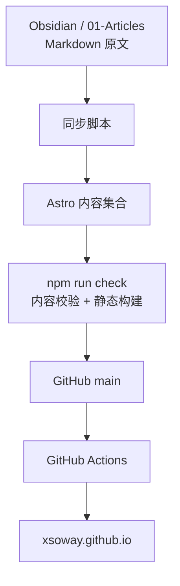

# 博客三迁之后，我又回到了 GitHub：把内容、代码和部署收进同一条链路


个人博客这件事，我已经折腾过三次。

每次开始时，目标都很简单：把笔记、文章和零散的想法，放到一个能长期留下来的地方。

https://xsoway.github.io


但系统一旦真的开始用，问题就不只是“能不能发一篇文章”了。平台会不会突然不可用？网络差时能不能写？域名、部署、主题、图片和备份，最后是谁在维护？内容究竟属于某个产品，还是属于自己？

最近把新站点 [xsoway.github.io](https://xsoway.github.io) 搭起来，才发现自己不是在做第四个“好看一点的博客”，而是在给这些年积累的内容重新找一个更稳的落点。

这篇把三次迁移、几次翻车，以及这次为什么又回到 GitHub，完整对一下账。

## 第一站：Notion + NotionNext，笔记和发布终于像一件事

最早用 Notion 记笔记时，我很吃它的 all-in-one 思路。

笔记、数据库、页面组织、链接跳转都在一个地方。以前写一篇内容，通常要经历“先记下来—整理格式—复制到发布平台—处理图片和链接”几道工序；Notion 的体验则很直接：内容原本就在这里，发布像是顺手打开另一扇门。

后来借助开源的 NotionNext 搭博客，最打动我的正是这个点：笔记和博客共用一份内容源。写完、整理好、设定公开属性，页面就能呈现出来。它新颖，也确实省事。

那段时间会觉得，个人内容系统终于不用分裂成“我的笔记”和“我的网站”两套东西了。

但这套体验有一个前提：Notion 和承载站点的服务必须一直可用。


后来 Vercel 服务被封，邮件申诉也没有得到可行的解决方案。这里不纠结到底是哪一个规则触发了什么，结果已经足够说明问题：当入口、部署和服务策略都掌握在外部平台手里，内容虽然是自己的，能否稳定被访问却未必由自己决定。

这不是说 NotionNext 不好。它解决的是“从 Notion 快速发布”的问题，而且解决得很漂亮。

只是当博客承担起长期内容归档的角色时，“启动快”不是唯一标准。依赖链上任何一个环节变动，整个站点都会跟着被动。那次之后，我果断停掉了这条路。

第一站留下的经验很简单：**内容可以借平台组织，但不要把内容的可达性完全押在单一平台上。**

## 第二站：从 Obsidian 到 Hexo，本地文件重新成为主角

Notion 的问题不只在建站服务。

它本质上是云端存储。网络状态不好的时候，打开、搜索和加载笔记都会拖慢节奏。短时间看，这只是“有点慢”；内容越多，越会意识到这种等待不是小问题——写作和整理本来需要连续注意力，工具却在反复把人从思路里拉出来。

后来笔记开始转到 Obsidian。

一方面，AI 盛行之后，Markdown 又重新变得很热；另一方面，Obsidian 的本地文件、双链和插件生态，确实经得起折腾。笔记就是目录里的 Markdown 文件，不需要先向某个服务请求“是否允许我看自己的内容”。本地可读、可搜、可备份，也能被 Git、脚本、静态站生成器和 AI 工具继续处理。

这一步改变的不是编辑器，而是内容资产的边界。

从这里开始，笔记不再只是一种产品里的页面；它是一个自己能掌控的文件集合。

随后又用 Hexo 在本地搭了私有博客，申请域名转发，把内容发布到一个属于自己的地址。Hexo 那套方案很典型：Markdown 负责内容，主题控制展示，静态生成器产出页面，域名把访问入口接起来。


它运行了一年多。对当时来说，这已经比上一站更踏实：即便线上服务有变化，文章源文件还在本地，站点也可以重建。

但“能重建”和“会持续维护”是两回事。

后来更新节奏慢下来，域名到期，博客也逐渐不再维护。真实的原因不复杂：一套系统除了写内容，还要顾主题、配置、部署、域名续费、跳转、图片和异常排查。每个单点看着都不难，凑在一起就是一条长链路。人一忙，最先断掉的通常不是写作意愿，而是维护意愿。

第二站让我重新认识到：**静态博客解决了内容所有权，但不自动解决长期运营成本。**

## 中间的回归：先把公众号和 Obsidian 用起来

Hexo 停更之后，文章开始更多在公众号整理和发布。

这并不是“博客失败了，所以只剩公众号”。恰恰相反，公众号适合持续写、持续和读者交流；Obsidian 里积累的大量文章和笔记，则可以继续作为自己的知识库。

两者并不冲突。

公众号承担的是传播和阅读场景，Obsidian 承担的是个人内容的长期沉淀。问题只是：有些文章、项目复盘和工具整理，放在公开仓库里会更合适——可检索、可链接、可被复用，也方便把代码、文档和文章放在同一个上下文里。

于是，新一轮整理的起点不再是“我想再搭一个博客”，而是“哪些内容值得被重新整理成公开资产”。

这个顺序很重要。

如果先挑主题、买域名、配样式，很容易再次进入“站点搭得差不多了，内容还没开始”的循环。先把已有文章、项目和知识库盘清楚，站点才有真正要服务的对象。

## 第三站：GitHub Pages + Astro，把链路收短

这次做 [xsoway.github.io](https://xsoway.github.io)，有一种返璞归真的感觉。

不再单独购买域名，不再找一套额外托管服务。仓库、代码审查、版本历史、构建、部署和公开地址，都尽量收在 GitHub 这条链路里。`xsoway.github.io` 本身就是入口，GitHub Pages 负责发布，`main` 分支触发 Actions 构建和部署。

这并不意味着 GitHub 没有依赖风险。任何托管平台都有规则、权限和服务边界。

但和第一站相比，系统的关键资产更清晰：Markdown 源文章在本地工作区，站点代码在 Git 仓库，公开构建由可查看的工作流完成。出了问题，不需要猜某个黑盒页面怎么点；可以回到提交记录、构建日志、内容脚本和静态产物逐段检查。

当前站点使用 Astro。选择它不是为了追新，而是它很适合这类“内容为主、页面为辅”的站点：构建后是静态页面，部署简单，页面结构和组件仍然有足够的控制力。

这次真正想保住的，是下面这条链路：



文章的原始位置仍然是 `Alan-Workspace/01-Articles`。只有首段 frontmatter 明确标记 `published: true` 的文章，才会进入公开同步流程。草稿不该因为“顺手跑了一次构建”就被发出去，这个边界必须在内容源头划清。


同步脚本还做了几件看起来琐碎、实际上很关键的事：处理本地图片，转换 Obsidian 双链，拦截本机绝对路径、附件引用和疑似敏感令牌；如果资源找不到，也不会悄悄生成一个看似正常、实际缺图的页面。

这些规则的意义不是把发布流程搞复杂，而是让内容公开时少一点意外。公开站点最怕的不是构建失败，而是构建成功后才发现路径、附件或不该公开的内容已经出去了。

站点的最小发布动作也因此很明确：

```bash
npm run sync
npm run check
git add src/content public/article-assets .sync-report.json
git commit -m "content: sync published articles"
git push origin main
```

`npm run check` 会先校验内容，再进行 Astro 构建；GitHub Actions 也会重复执行这一步。一次本地检查不能代替线上部署，但至少先把“内容同步有无异常、静态站能否完整构建”留在推送之前。

能跑，不等于可以放心公开。

## AI 让这次开发顺了很多，但它没有替我验收

和以前手搓博客相比，这次 AI 辅助开发的体感确实很明显。

以前改一个样式、加一段脚本、调整文章卡片或部署配置，往往要在文档、搜索引擎、主题源码和控制台之间来回跳。尤其是样式和构建问题，改一次、刷一次、再看一次，时间很容易碎掉。

现在 AI 可以更快地帮助定位组件、梳理改动范围、生成一个小改动的初稿，也能陪着把发布链路从内容同步到 GitHub Pages 过一遍。对个人项目来说，这种反馈速度很舒服：想法不必在“等有空研究主题和脚本”里搁置太久。

但这次也反复提醒自己，不要把“改得快”误解成“已经正确”。

最近站点加过标签页、文章末尾的标签推荐、总访问量和单篇阅读量。中间就出现过很典型的问题：代码提交了，部署后的页面没有按预期显示；访问量接口返回异常或读写权限不匹配，页面只能显示一个横杠。UI 看起来只是一行数字，背后却牵着前端请求、跨域白名单、第三方数据服务权限、构建缓存和线上环境差异。

这类问题，AI 可以协助排查，但不能替人宣布“稳了”。

真正的闭环仍然是：先把症状复现出来，再检查线上实际加载的资源和接口响应；修复后跑本地构建、看部署日志、打开正式地址验证；最后再做一次针对失败路径的 review。特别是统计功能，不能只看页面上出现了数字，还要验证刷新、不同页面和异常响应时的行为。

AI 在这里是杠杆，不是免责主体。

它省下的是重复查资料、反复手写样式和脚本试错的时间；判断改动是否符合预期、线上是否真的生效、内容有没有被误发，责任仍然在人。

## 三次迁移后，真正留下来的不是某个框架

回头看，NotionNext、Hexo、Astro 都没有谁“彻底赢了”。它们分别对应了当时最需要解决的问题。

| 阶段 | 当时最看重的事 | 获得了什么 | 后来暴露的问题 |
| --- | --- | --- | --- |
| Notion + NotionNext | 笔记发布一体化 | 上手快，内容与页面衔接自然 | 对外部平台和服务可用性依赖较重 |
| Obsidian + Hexo + 域名 | 本地 Markdown 与自主建站 | 内容文件掌握在自己手里 | 主题、部署、域名和维护成本会累积 |
| GitHub Pages + Astro | 内容、代码与发布链路收口 | Git 历史、构建和部署可追溯，公开入口简单 | 仍需面对平台边界，并持续做内容与线上验收 |

如果一定要提炼几条经验，我会留下这几条。

**第一，先把内容源攥在自己手里。**

平台会变，主题会停更，域名会到期，服务策略也可能调整。但 Markdown 原文、本地图片和清晰的目录结构，只要还在，就还有重新组织和发布的选择权。

**第二，发布链路越短，长期越容易持续。**

个人系统不怕功能少，怕每次更新都要跨多个后台、记多个账号、处理多个容易遗忘的配置。把文章库、仓库、构建和部署收进一条可复核的链路，比再多一个花哨功能更有价值。

**第三，把“公开”做成显式动作。**

`published: true` 这样一个小标记，看起来普通，却把“这篇已经整理完、允许公开”变成了可执行规则。对有大量私人笔记、草稿和工作记录的知识库来说，这比默认全量同步安全得多。

**第四，别迷信一次搭好。**

博客不是装修完就不动的房子，更像一个长期使用的工作台。访问量没更新、样式没生效、域名到期、服务不可用，都会发生。关键不是保证永远不出问题，而是内容还在、链路能查、改动能回滚、问题能复现。

## 新站上线，接下来慢慢把值得留下的东西搬过去

全新的 [xsoway.github.io](https://xsoway.github.io) 已经上线。

接下来不会为了凑数量把所有旧内容一股脑倒过去。更想做的是持续整理：把公众号文章、项目复盘、工具实践，以及 Obsidian 里真正有长期价值的内容，一篇篇核对后同步出来。

这件事对外是博客更新，对内更像一次内容资产的整理和归档。

三次迁移绕了一圈，最后又回到 Markdown、Git 和静态页面这些很基础的东西。没有那么炫，但很踏实。内容在本地，变更有记录，发布可验证，站点能被重新构建。

这就够了。

站点地址：https://xsoway.github.io


#个人博客 #Obsidian #GitHubPages #Astro #AI开发
