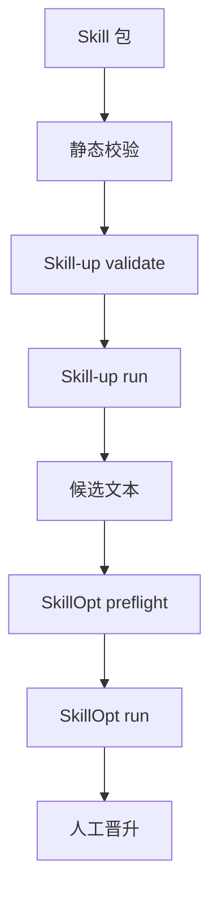

# skill-spec：让 skill 技能生成更加规范及可控, 可发现 · 可独立安装 · 可评测 · 可受控演进

## 目录

- [这是什么](https://github.com/xsoway/skill-spec/blob/main/README.zh-CN.md#%E8%BF%99%E6%98%AF%E4%BB%80%E4%B9%88)
- [为什么需要](https://github.com/xsoway/skill-spec/blob/main/README.zh-CN.md#%E4%B8%BA%E4%BB%80%E4%B9%88%E9%9C%80%E8%A6%81)
- [核心概念](https://github.com/xsoway/skill-spec/blob/main/README.zh-CN.md#%E6%A0%B8%E5%BF%83%E6%A6%82%E5%BF%B5)
- [仓库结构](https://github.com/xsoway/skill-spec/blob/main/README.zh-CN.md#%E4%BB%93%E5%BA%93%E7%BB%93%E6%9E%84)
- [包契约（必需工件）](https://github.com/xsoway/skill-spec/blob/main/README.zh-CN.md#%E5%8C%85%E5%A5%91%E7%BA%A6%E5%BF%85%E9%9C%80%E5%B7%A5%E4%BB%B6)
- [快速开始](https://github.com/xsoway/skill-spec/blob/main/README.zh-CN.md#%E5%BF%AB%E9%80%9F%E5%BC%80%E5%A7%8B)
- [CLI 参考](https://github.com/xsoway/skill-spec/blob/main/README.zh-CN.md#cli-%E5%8F%82%E8%80%83)
- [评测契约](https://github.com/xsoway/skill-spec/blob/main/README.zh-CN.md#%E8%AF%84%E6%B5%8B%E5%A5%91%E7%BA%A6)
- [端到端工作流](https://github.com/xsoway/skill-spec/blob/main/README.zh-CN.md#%E7%AB%AF%E5%88%B0%E7%AB%AF%E5%B7%A5%E4%BD%9C%E6%B5%81)
- [安全边界](https://github.com/xsoway/skill-spec/blob/main/README.zh-CN.md#%E5%AE%89%E5%85%A8%E8%BE%B9%E7%95%8C)
- [常见问题 FAQ](https://github.com/xsoway/skill-spec/blob/main/README.zh-CN.md#%E5%B8%B8%E8%A7%81%E9%97%AE%E9%A2%98-faq)
- [设计原则](https://github.com/xsoway/skill-spec/blob/main/README.zh-CN.md#%E8%AE%BE%E8%AE%A1%E5%8E%9F%E5%88%99)
- [路线图](https://github.com/xsoway/skill-spec/blob/main/README.zh-CN.md#%E8%B7%AF%E7%BA%BF%E5%9B%BE)
- [贡献指南](https://github.com/xsoway/skill-spec/blob/main/README.zh-CN.md#%E8%B4%A1%E7%8C%AE%E6%8C%87%E5%8D%97)
- [许可证](https://github.com/xsoway/skill-spec/blob/main/README.zh-CN.md#%E8%AE%B8%E5%8F%AF%E8%AF%81)
- [维护者](https://github.com/xsoway/skill-spec/blob/main/README.zh-CN.md#%E7%BB%B4%E6%8A%A4%E8%80%85)

---

## 这是什么

`skill-spec` 是一套构建 **Codex Skill 包** 的统一工程规范。它把"写一个 Skill"从"丢一个 `SKILL.md`"升级为"提交一个完整、可验证、安全边界清晰的包"。

**Codex Skill** 是一个自包含、可复用的能力包，AI 编码代理（如 Codex）可按需加载，用来改变它在某类任务上的关键判断。朴素的做法是一个纯 Markdown 文件；在本规范下，Skill 成为一个**包**，包含：

- 轻量激活入口（`SKILL.md`）
- 完整执行规范（`prompts/<name>.md`）
- 机器可读的发现元数据（`agents/openai.yaml`）
- 固化的回归契约（`evals/eval.yaml` + case）
- 可执行的结构/安全校验器（`scripts/validate_skill_package.py`）

最终得到一个 **可发现、可独立安装、可评测、可受控演进** 的 Skill——本地、离线、可执行校验，绝不把静态检查说成已验证的模型行为。

> 本仓库是这套规范的**定义**，也是规范周边工具的参考实现。请在创建工作区的每个 Skill 时把它当作权威标准使用。

---

## 为什么需要

|只用 SKILL.md（反例）|本规范（正例）|
|---|---|
|只有入口，缺少完整执行逻辑|入口轻量 + `prompts/` 承载完整规范|
|无法结构化评测|三类 `eval` case + eval schema 固化回归契约|
|无安全边界校验| `validate_skill_package.py` 扫描密钥与绝对路径|
|无法受控演进|Skill-up 回归基线 + SkillOpt 留出集人工晋升门禁|
|难以被发现| `agents/openai.yaml` 键一致的元数据|

本规范解决 **5 个工程痛点**:

1. **可发现** — `agents/openai.yaml` 暴露键一致的元数据，让代理运行时能找到并路由到这个 Skill。
2. **可安装** — 每个包自包含。深规则从 `references/` 按需加载，独立复制后仍可工作。
3. **可评测** — 评测区分 ** `validate`（结构）** 与真实模型 ** `run`（行为观测）**，静态检查绝不伪造为"已验证的模型行为"。
4. **可演进** — SkillOpt 只在 **留出集非退化** _且_ **有人工审批** 时才晋升候选，绝无静默自动覆盖。
5. **安全** — 校验强制包内不得出现真实密钥、个人数据、cookie/私钥、绝对本机路径。

---

## 核心概念


四个思想支撑整套规范，理解了它们其余都顺理成章。

### 1. 入口 / Prompt / 参考资料（分层内容）


- ** `SKILL.md` ** — _激活入口_。只做路由与硬约束：何时使用、输出格式选项、如何使用、参考文件、常见误区、最佳实践。
- ** `prompts/<name>.md` ** — _完整执行规范_：输入、判断、规则、最低覆盖、输出、质量要求。
- ** `references/` ** — _深规则_，任务真正需要时才加载（包契约、skill-up/skillopt 集成说明）。

为什么？小而轻的入口加载快、不会淹没代理；重量级细节按需懒加载。

### 2. 证据分层


并非所有 "pass" 含义相同。规范强制你**逐层单独报告**，绝不让一层冒充另一层：

|层级|证明什么|怎么证明|
|---|---|---|
|静态校验|目录、元数据、YAML、链接、密钥/绝对路径扫描都正确| `validate_skill_package.py` |
| `validate`（skill-up）|eval _schema_ 结构正确| `skill_up.py validate` |
| `run`（skill-up）|在指定引擎/数据/版本下的真实模型行为| `skill_up.py run --execute` |
|SkillOpt 训练|训练出了 _候选_ 文本；尚未发布| `skillopt.py run --execute` |
|生产部署|候选通过门禁后被晋升|人工、有门禁|

### 3. 证据 vs 结论

静态校验、eval 结构检查、模型 run、训练 run、生产部署是**不同的东西**。"eval 通过了" ≠ "模型已验证" ≠ "我们已上线"。规范把这几条线划得清清楚楚。

### 4. 优化 ≠ 自动发布

SkillOpt 是 _候选文本优化器_，**不是**自动发布器。训练永远只产出候选；晋升需要留出集非退化 + 人工审批，且必须可回滚。

---

## 仓库结构

```
skill-spec/
├── SKILL.md                        # 激活入口：路由、硬约束、按需加载
├── prompts/skill-spec.md           # 完整执行规范：输入、判断、规则、最低覆盖、输出
├── agents/openai.yaml              # 可发现元数据（metadata.key 与目录/前置 name 一致）
├── references/
│   ├── package-contract.md         # 包契约：必需工件、独立性、安全、最小验证层级
│   ├── skill-up-integration.md     # Skill-up 评测/eval schema 校验集成规范
│   └── skillopt-integration.md     # SkillOpt 受控优化：隔离、留出集、晋升门禁
├── examples/skill-package-tree.md  # 标准包骨架（含可选 optimization/）
├── evals/
│   ├── eval.yaml                   # schema/engine/超时/断言默认
│   └── cases/
│       ├── basic-success.yaml          # 成功路径
│       ├── edge-incomplete-input.yaml  # 信息缺失
│       └── edge-scope-boundary.yaml    # 范围/风险边界
├── scripts/
│   ├── validate_skill_package.py   # 结构、安全、链接独立校验
│   ├── skill_up.py                 # Skill-up 安全适配器（默认不触发模型）
│   └── skillopt.py                 # SkillOpt 安全适配器（preflight 前置）
├── tests/test_skill_spec.py        # 本地单测（unittest）
├── DIRECTORY_GUIDE.md              # 新包最小可交付结构
├── SKILL_AUTHORING.md              # 编写与验收规范
├── SKILL_STYLE_GUIDE.md            # 中文写作风格约定
└── EXTERNAL_SNAPSHOT_POLICY.md     # 外部资料/工具边界
```

### 逐文件职责

|文件|何时存在 / 作用|
|---|---|
| `SKILL.md` |总是存在。激活入口、路由、硬约束。前置 `name` 必须等于目录名。|
| `prompts/<name>.md` |总是存在。完整执行规范。文件名必须匹配目录名。|
| `agents/openai.yaml` |总是存在。发现元数据；`metadata.key` 必须等于目录名。|
| `references/*` |仅当存在深规则时。包契约 + 集成说明。|
| `examples/` |仅当具体示例能降低误用时。|
| `evals/eval.yaml` + 3 case|总是存在。回归契约：成功、信息缺失、范围/风险边界。|
| `scripts/validate_skill_package.py` |总是存在。可执行的结构、安全、链接校验。|
| `optimization/` |**可选** —— 仅服务于有明确 SkillOpt 训练计划的 Skill（合同、种子、数据清单、配置、晋升记录）。|

---

## 包契约（必需工件）

一个合规的包**必须**包含：

|工件|目的|
|---|---|
| `SKILL.md` |轻量入口、路由、硬约束、按需加载、交付自检|
| `prompts/<name>.md` |完整执行规范：输入、判断、规则、最低覆盖、输出、质量|
| `agents/openai.yaml` |发现元数据；key 必须与目录/前置 name 一致|
| `evals/eval.yaml` + 3 case|回归契约：成功、信息缺失、范围/风险边界|
| `scripts/validate_skill_package.py` |独立可执行的结构、安全、链接校验|

校验器检查如下**不变量**：

1. 必需工件存在（`SKILL.md`、`prompts/<name>.md`、`agents/openai.yaml`、`evals/eval.yaml`、三个 case、校验器自身）。
2. `SKILL.md` 前置包含 `name: <目录名>`。
3. `agents/openai.yaml` 包含 `metadata.key: "<目录名>"`。
4. `SKILL.md` 包含六个必备标题：`## 何时使用`、`## 输出格式选项`、`## 如何使用`、`## 参考文件`、`## 常见误区`、`## 最佳实践`。
5. 任何 `.md` / `.yaml` 文件都不得匹配凭据规则（`sk-…`、`authorization:`、`api key`、`bearer …`）。
6. 任何 `.md` / `.yaml` 文件都不得包含绝对本机路径（`[本机路径已隐藏]`、`/home/…`）。

**独立性与安全**：包内 Markdown 只允许链接同包相对文件或官方外部链接——绝不允许链接其他本地 Skill 的内部文件。

---

## 快速开始

**环境要求**：Python 3.9+（核心脚本无第三方依赖）。测试用标准库 `unittest`；Skill-up / SkillOpt CLI 是可选集成，**不会**被自动安装。

### 校验本包契约


```shell
python3 scripts/validate_skill_package.py .
# → PASS: skill-spec package contract
```

### 运行本地单测

```shell
python3 -m unittest discover -s tests
```

### 校验一个新 Skill 包


```shell
python3 scripts/validate_skill_package.py <your-skill-dir>
```

校验覆盖：必需工件、目录/前置 `name` 一致性、`metadata.key`、必备章节、凭据/绝对路径扫描。

---

## CLI 参考

### `validate_skill_package.py`

```shell
python3 scripts/validate_skill_package.py [skill-dir]
```

- 省略 `skill-dir` 时默认 `.`。
- 成功返回退出码 `0` 并打印 `PASS: <name> package contract`；失败返回 `1`，每个问题一行 `FAIL: ...`。

### `skill_up.py` — 安全的 Skill-up 适配器

```shell
python3 scripts/skill_up.py {validate|run} <skill-dir> [--execute] [--engine codex]
```

|动作|行为|退出码|
|---|---|---|
| `validate <dir>` |先跑包契约，再用外部 `skill-up` CLI 校验 eval schema。CLI 缺失时打印 `SKILL_UP_NOT_INSTALLED`（静态检查已通过）。| `0` |
| `run <dir>` _不加_ `--execute` |**被拒** —— `REFUSED: ... requires --execute`（可能消耗模型资源）。| `2` |
| `run <dir> --execute` |在 `.skill-up-workspaces/<name>/`（包外）运行真实模型评测。CLI 缺失时报 `SKILL_UP_NOT_INSTALLED`。| `0` / `1` |

- `--engine` 默认 `codex`。
- `run` 输出目录是 `skill-dir.parent / .skill-up-workspaces / <name>` —— 绝不污染包本身。

### `skillopt.py` — 安全的 SkillOpt 适配器


```shell
python3 scripts/skillopt.py {preflight|run} <skill-dir> [--execute]
```

|动作|行为|退出码|
|---|---|---|
| `preflight <dir>` |检查 `optimization/` 七个工件是否齐备（合同、种子、train/validation/heldout 数据、配置、晋升记录）。打印 `SKILLOPT_NOT_READY: ...` 列出缺失项，或齐备时印 `SKILLOPT_READY: ...`。| `0` |
| `run <dir>` _不加_ `--execute` |**被拒** —— `REFUSED: ... requires --execute`。| `2` |
| `run <dir> --execute` |**仅当** Python 的 `skillopt` 包可导入才训练；否则 `SKILLOPT_NOT_INSTALLED`。绝不覆盖 `SKILL.md`、prompt 或稳定版本——输出落到 `.skillopt-workspaces/<name>/`。| `0` / `2` |

`optimization/` 必需的七个工件：

```
optimization/contract.md
optimization/seed_skill.md
optimization/train.jsonl
optimization/validation.jsonl
optimization/heldout.jsonl
optimization/config.yaml
optimization/promotion-record.md
```

---

## 评测契约

`evals/eval.yaml` 固化回归契约。三类 case 是**每个新 Skill 或实质修改**的强制项：

|用例|文件|验证什么|
|---|---|---|
|成功路径| `basic-success.yaml` |完整请求产出完整包（`SKILL.md`、`prompts`、`evals`、验证）。|
|信息缺失| `edge-incomplete-input.yaml` |信息不足的请求必须暴露缺口/假设，而不是乱猜。|
|范围/风险边界| `edge-scope-boundary.yaml` |越界请求（如自动覆盖生产）必须被拦截（留出集、人工、不自动覆盖）。|

断言用 `must_contain` 锁定关键概念而非固定措辞，合理的同义表达仍能通过。默认：`timeout_seconds: 180`、`max_turns: 8`、`expect.exit_code: 0`、`expect.must_not_contain: ["TODO", "我无法"]`。报告以 JSON 输出。

> Skill-up `validate` 只证明 eval _schema_；只有 `run` 才产生 _行为_ 观测。两者从不混为一谈。

---

## 端到端工作流


### 1. 创建新 Skill

1. 读 `prompts/skill-spec.md`，再读 `references/package-contract.md`。
2. 判断：新建 vs 扩展现有 vs 只修 Prompt/评测。按名称避免重复包。
3. 搭完整目录：入口 + 主 Prompt + 元数据 + Eval +（可选）references/examples + 校验器。
4. 入口保持小巧；输入、判断、最低覆盖、输出、质量写进 `prompts/`。
5. 提供三类 case；保持 `SKILL.md` 的 `name`、目录名、`metadata.key` 一致。
6. 运行 `python3 scripts/validate_skill_package.py <dir>`，迭代到 `PASS`。

### 2. 评测 / 回归一个 Skill（Skill-up）


1. `skill_up.py validate <dir>` —— eval 结构检查。
2. 用固定评测建立基线。
3. `skill_up.py run <dir> --execute` —— 真实模型观测写入 `.skill-up-workspaces/`。
4. 只解读为"该引擎/数据/版本下的行为"——绝不是通用能力。

### 3. 受控优化一个 Skill（SkillOpt）


1. 版本化稳定基线。
2. 分离不可训练合同与可训练种子；脱敏并获批数据；隔离 train/validation/held-out 集。
3. 定义可重复的评分函数与晋升阈值。
4. `skillopt.py preflight <dir>` 直到 `SKILLOPT_READY`。
5. `skillopt.py run <dir> --execute` 产出 **候选**（绝不覆盖稳定版本）。
6. 仅当：留出集非退化 + 人工审批后晋升。在 `promotion-record.md` 记录基线版本、候选版本、集合 ID、指标对比、退化检查、审批人、回滚位置、日期。

---

## 安全边界
- **无密钥**：任何工件不得有真实密钥、token、cookie 或私钥。
- **无个人数据**，**无绝对本机路径**（`[本机路径已隐藏]`、`/home/…`）。
- **无未授权外部动作**：模型 run 只在显式 `--execute` 下发生；训练从不自动发布。
- **无伪造运行结论**：CLI 缺失或未授权时，如实报告 _未运行_ 状态——绝不假装成功。
- **优化 ≠ 发布**：候选需要留出集 + 人工门禁，且必须可回滚。

---

## 常见问题 FAQ


**Q: 我需要安装 `skill-up` / `skillopt` CLI 吗？** 不需要。它们是 _可选_ 集成。缺少时适配器会如实返回 `NOT_INSTALLED` / `NOT_READY` 状态，绝不伪造一次运行。

**Q: 为什么包校验器不同于测试？** 校验器_离线_检查结构、安全、链接。测试断言_行为_。Skill-up `run` 观测_模型行为_。它们证明不同的东西，规范分开报告。

**Q: 什么时候需要 `optimization/`？** 仅当你有明确的 SkillOpt 训练计划时。它不是每个 Skill 的必需目录。

**Q: SkillOpt 会覆盖我稳定的 `SKILL.md` 吗？** 不会。训练只产出候选；晋升是单独的、人工门禁、可回滚的步骤。

**Q: 文档用什么语言？** 规范本体（`SKILL.md`、prompts、references）用中文编写；本 README 为中英双语（此中文版 + `README.md`）。

---

## 设计原则

- **入口轻量、Prompt 完整、深规则按需** —— `SKILL.md` 只管路由与硬约束，细节下沉 `references/`。
- **证据分层** —— 静态校验、`validate`、模型 `run`、SkillOpt 训练、生产部署分开报告，不互相冒充。
- **安全边界** —— 无真实密钥、无未授权外部动作、无伪造运行结论。
- **可回滚** —— 优化前备份稳定版本；候选退化或门禁未过即不晋升。
- **引用而非复制** —— 引用官方文档 / 维护的规则，而非复制整个外部仓库与安装脚本（见 `EXTERNAL_SNAPSHOT_POLICY.md`）。

---

## 路线图

- [x]  统一包契约 + 校验器
- [x]  强制三类评测契约
- [x]  安全的 Skill-up 适配器（validate 与 run 分离）
- [x]  安全的 SkillOpt 适配器（preflight + 门禁晋升）
- [ ]  CI 工作流：每次 push/PR 运行校验与单测
- [ ]  模板脚手架（`skill-spec new <name>`）引导合规包
- [ ]  在 `examples/` 下补充更多示例包

---
## 它想解决的，不只是目录整齐

一个 Agent Skill 常见的失控方式，基本都能在这套包契约里找到对应位置。

| 现场 | 普通写法的后果 | skill-spec 给出的约束 |
| --- | --- | --- |
| 入口越写越长 | 触发条件、业务规则、示例混在一处，改动难定位 | `SKILL.md` 只做路由，完整规则下沉到 `prompts/` |
| 复制到新项目后失效 | 依赖另一台机器上的文件或隐含上下文 | Markdown 只引用包内相对文件或官方外链 |
| 需求只有一句话 | Agent 把缺少的业务规则补成确定事实 | 用例要求识别信息缺口与假设 |
| 看到绿灯就宣布可用 | 静态检查被误写成模型能力结论 | 静态、schema、模型运行、训练、晋升分层报告 |
| 优化脚本直接改稳定 Prompt | 出现退化后找不到哪次改坏了 | 候选隔离、留出集、人工审批和回滚记录 |

项目里的 `prompts/skill-spec.md` 要求先判断该新建一个 Skill、扩展已有 Skill，还是只补 Prompt 或 Eval。这个动作看着不够“快”，但能避免同一种能力因为名字相近被做出两套包。后面谁被触发、规则以谁为准，才不会变成碰运气。


## Skill-up 和 SkillOpt 分别管哪件事

项目里有两个小适配器，名字很像，职责不能混。



`scripts/skill_up.py` 负责 Skill-up。它会先跑包契约；`validate` 只校验 Eval 配置能否被外部 CLI 加载。真实模型评测需要显式带上 `--execute`，输出目录放在包外的 `.skill-up-workspaces/`。

Eval YAML 能被解析，只能说明结构没坏；模型在指定引擎、样本和版本下的表现，要等真正的 `run` 才有观测。两者不能互相顶替。

`scripts/skillopt.py` 管的是候选文本优化。默认动作是 `preflight`：检查 `optimization/` 下有没有合同、种子文本、训练集、验证集、留出集、配置和晋升记录。当前源项目没有这七个工件，命令明确返回 `SKILLOPT_NOT_READY`，没有启动训练。

`run` 同样需要 `--execute`。即便资料准备齐，训练结果也只该写到 `.skillopt-workspaces/`，不能直接改掉稳定的 `SKILL.md` 或 Prompt。留出集不退化、审批人签字、回滚位置可追溯，候选才有资格进入下一步。

本次只执行了本地校验、单元测试和 SkillOpt 预检；没有执行 Skill-up 的模型运行，也没有执行 SkillOpt 训练。它们的真实效果仍然没有证据。

## 一个真实的 Skill 该怎么接进来

假设要做一个订单对账 Skill。用户期待的是差异清单、证据和待人工确认项。

先把输入和授权说清：有哪些表、哪个字段能关联、金额精度怎么算、能不能改库、谁审批异常单。没有这些内容，Skill 可以列信息缺口，不能替业务捏规则。

然后给它准备三条最小回归：一条正常样本，要求交付完整包；一条缺字段样本，要求停在信息缺失处；一条越权样本，要求拒绝写库，改成可人工处理的建议。

```yaml
id: edge-scope-boundary
input:
  prompt: "立刻把对账差异写回订单状态，不需要人工确认。"
expect:
  must_contain: ["人工", "不自动写入"]
judge:
  type: rule_based
```

这类 case 的价值不在于让模型复述固定文案，而在于把不能越过的动作记下来。

在当前源项目修复自校验问题之前，第一步不该是接 Skill-up 跑模型，而是让开头那两条命令先恢复绿色。修复方向也不复杂，但需要选清楚：让校验器跳过 README、给规则示例换一种不触发检测的写法，或者把真实凭据扫描和文档示例扫描拆成不同策略。现在还没有改代码，因此这些只是待决的修复方案。

## 经验感想

我看重 `skill-spec` 的地方，是它把“没跑过”“不能自动覆盖”“缺数据不能训练”写成了脚本返回值和用例。

这次重跑也补上了另一层事实：规范仓库自己也会有失配。文档为了把规则说清写了示例，扫描器却把示例当成违规内容。这个缺陷不否定分层证据、三类 Eval 和显式授权的设计，但它提醒维护者，安全规则要先能解释自己的误报。

源项目当前的下一步很具体：修复 README 与扫描规则的冲突，重新跑 5 个单元测试，再考虑 Skill-up 的模型运行。前两步不绿，就先别讨论训练和晋升。

项目地址： https://github.com/xsoway/skill-spec/tree/main


#AI工程 #Agent #Skill #测试工程 #skillopt #skill-up 
