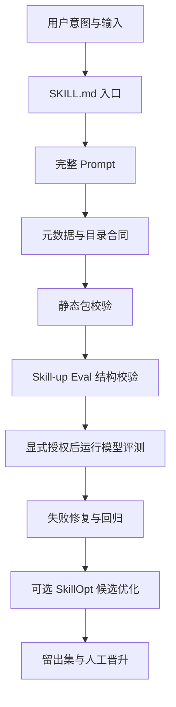

`python3 scripts/validate_skill_package.py .` 打出 `PASS: skill-spec package contract` 的那一刻，事情看起来已经结束了。

目录齐了，YAML 也在，三个 Eval case 都躺在 `evals/cases/` 里。要是把一个 Agent Skill 当成一段提示词，这确实够了。

但换个真实场景：有人复制这个 Skill 到另一个项目，触发词不准；有人给了半句需求，Agent 开始自信补全；有人一句“直接优化并覆盖生产版本”，系统顺手把稳定提示词改掉。前面的绿色输出，对这些事都没有发言权。

`skill-spec` 是给这类问题准备的工程规范包。它不负责替任何业务做决策，也不承诺让模型突然变聪明。它做的是把一个容易散落在聊天记录里的 Skill，固定成可发现、可检查、可回归、可受控演进的一组工件。

这套东西放在 `code_project/skills/skill-spec/`。它不是一个只有 `SKILL.md` 的模板，而是一套针对 Skill 作者的工作台。

## 先把 Skill 当成一个小产品

很多 Skill 的起点都很朴素：写一个 `SKILL.md`，告诉 Agent “什么时候用、怎么做、输出什么”。这一步没有问题，入口文件本来就应该短。

麻烦出在内容开始变多以后。

用户意图、输入缺口、业务规则、工具授权、示例、评测用例、失败修复方法，全塞进入口，文件会越来越像一锅粥。更糟的是，复制到别的机器后，依赖某个本地路径、某份隐含资料或某个没写下来的习惯，谁都不知道从哪儿开始排查。

`skill-spec` 的基本判断是：入口只负责路由，真正的执行合同单独放；测试、元数据和辅助脚本各归各的位置。

一个满足规范的最小目录长这样：

```text
invoice-reconciliation/
├── SKILL.md
├── prompts/invoice-reconciliation.md
├── agents/openai.yaml
├── evals/eval.yaml
├── evals/cases/
│   ├── basic-success.yaml
│   ├── edge-incomplete-input.yaml
│   └── edge-scope-boundary.yaml
└── scripts/validate_skill_package.py
```

看着比一份提示词多了几个文件，但每个文件的责任很单一。

| 工件 | 放什么 | 不该放什么 |
| --- | --- | --- |
| `SKILL.md` | 触发条件、轻量流程、硬约束、按需阅读入口 | 大段业务细节、机器本地路径、真实密钥 |
| `prompts/<name>.md` | 输入判断、最小覆盖、输出格式、质量要求 | 与当前 Skill 无关的通用口号 |
| `agents/openai.yaml` | 可发现的元数据 | 业务处理逻辑 |
| `evals/` | 回归用例、环境、引擎和断言 | “看起来不错”这类不可判定描述 |
| `scripts/validate_skill_package.py` | 目录、元数据、安全和链接检查 | 模型能力的虚假结论 |
| `references/`、`examples/` | 需要时加载的深规则和示例 | 为了显得专业而堆的资料 |

这个拆分有一个直接收益：人能知道该改哪儿，Agent 也能知道该读哪儿。

## skill-spec 到底管什么

它先规定了一个 Skill 从创建到维护时要过的几道门。



图里的每一步回答的不是同一个问题。混在一起，后面很容易把一张绿色截图当成全部证据。

### 1. 创建或重构时，先把问题问完整

`prompts/skill-spec.md` 要求先声明已知事实、信息缺口、冲突、范围外和最小假设。

这个要求听着有点像流程控，实际是防止 Agent 在模糊输入下凭感觉造功能。

比如有人说：“帮我做一个订单对账 Skill。”

一个合格的输出不该直接甩出一堆文件。至少要把输入来源、对账规则、预期结果、可调用系统、谁有批准权限这些内容列出来。缺少业务数据或外部工具时，可以先交付静态包，但必须把没有运行的部分标出来。

还有一个很实用的限制：先判断该新建、扩展，还是修现有 Skill。名字相近就再造一个，后面会出现两个内容相似、触发范围重叠的包。到那时，用户一句话触发谁都像抽盲盒。

### 2. 它把“包完整”变成可执行检查

`validate_skill_package.py` 不依赖模型。它会检查必需文件是否存在，`SKILL.md` 的 `name` 是否与目录名一致，`agents/openai.yaml` 的 `metadata.key` 是否一致，入口有没有规定章节。

它还扫描 Markdown 和 YAML：疑似 API Key、`Authorization`、Bearer Token、绝对用户目录路径，都会被当成问题报出来。

这类检查的价值很朴素。Skill 需要被复制、安装、检索；把某台电脑上的 `[本机路径已隐藏]` 写进包里，或者把临时令牌粘进示例里，迟早会翻车。脚本不能证明回答质量，却能在最便宜的阶段把这些硬错误挡住。

### 3. 它规定了三类不能省的 Eval

当前 `skill-spec` 有三个 case，不是凑数：

| 用例 | 输入情境 | 希望锁住的行为 |
| --- | --- | --- |
| `basic-success.yaml` | 用户要新建一个订单对账 Skill | 输出目录、Prompt、Eval 和验证动作齐全 |
| `edge-incomplete-input.yaml` | 用户只说“帮我做一个 Skill” | 明确指出信息缺口和假设，而不是硬编业务规则 |
| `edge-scope-boundary.yaml` | 用户要求用 SkillOpt 直接覆盖生产版本 | 提示留出集、人工审批和“不自动覆盖” |

这三个用例对应的是一个 Skill 最常见的三种翻车方式：主路径没覆盖、信息不足时瞎猜、风险请求没刹住。

Eval 的断言也没有强迫模型背固定答案。`basic-success` 看的是输出是否包含 `SKILL.md`、`prompts`、`evals` 和“验证”这些交付合同；风险用例看的是是否出现留出集和人工门禁。表达可以变，底线不能丢。

## Skill-up 和 SkillOpt，别放进同一个抽屉

这两个名字都带 Skill，很容易被当成“一键把 Skill 变好”的工具。实际职责差得挺远。

### Skill-up：拿回归用例观察一次真实运行

[Skill-up](https://github.com/alibaba/skill-up) 是 Agent Skill 的评测 CLI。它可以读取 `eval.yaml` 和 case，在指定 Agent 引擎中运行，再根据规则、脚本或评审器生成报告。

`skill-spec` 把它分成两层：

```bash
# 只校验 eval 文件和 case 能不能被正确加载
python3 scripts/skill_up.py validate <skill-dir>

# 可能调用模型，必须显式写出 --execute
python3 scripts/skill_up.py run <skill-dir> --execute --engine codex
```

第一条命令回答的是：评测配置是否能被解析。

第二条命令回答的是：在这次指定引擎、指定模型、指定样本和指定版本下，行为观察到了什么。

两者中间隔着模型调用、费用、环境差异和波动。把第一条的通过写成“Skill 已验证有效”，属于证据越级。

这次本机安装了 `skill-up v0.12.0`，并执行过 `skill-up validate`：`skill-upper` 自带的 Eval 配置加载了 6 个 case；`skill-spec` 自身的配置加载了 3 个 case。这个结果只能说明配置结构通过，没有跑模型，也没有获得任何泛化能力结论。

### SkillOpt：生成候选版本，不是自动发布按钮

[Microsoft SkillOpt](https://github.com/microsoft/SkillOpt) 处理的是另一件事：在有数据和评分条件时，帮助优化可训练的 Skill 文本。

风险也集中在这里。优化一旦直接写回稳定文件，出现退化时，人甚至不知道是哪轮训练把规则改坏了。

因此 `skill-spec` 的 `scripts/skillopt.py` 默认先做 preflight。一个准备进入训练的包，至少要具备：

```text
optimization/
├── contract.md           # 不可训练的合同
├── seed_skill.md         # 允许优化的种子文本
├── train.jsonl
├── validation.jsonl
├── heldout.jsonl
├── config.yaml
└── promotion-record.md
```

少任何一项，`preflight` 都会返回 `SKILLOPT_NOT_READY`，而不是假装可以训练。

即使资料齐了，`run` 也还要求显式 `--execute`。训练产物写到独立工作目录，不能自动覆盖 `SKILL.md`、主 Prompt 或稳定版本。候选只有在留出集没有退化、记录了基线与指标、有人审阅并批准后，才有资格被晋升。

本机已经安装 SkillOpt 0.2.0，Python 导入和 `skillopt-train`、`skillopt-eval` 的参数解析都已验证。但 `skill-spec` 本身没有训练数据和晋升记录，预检按设计返回了缺失资产清单；没有启动训练。

## 一个具体例子：做“订单对账 Skill”时该怎么用

假设团队要把“核对订单、支付和退款数据”的经验做成 Skill。别急着写提示词，可以按这个顺序走。

**第一步，写清意图。**

输入可能是订单表、支付流水和退款流水；输出可能是差异清单和待人工确认项。这里需要先确定时区、主键、金额精度、退款状态、数据新鲜度和能否调用数据库。没有这些信息，Skill 只能生成待确认清单，不能替业务定义对账规则。

**第二步，生成包。**

```bash
cd code_project/skills/skill-spec
python3 scripts/validate_skill_package.py ../invoice-reconciliation
```

把入口写成触发条件和硬约束；把订单匹配、金额容差、异常分类和输出字段写进 `prompts/invoice-reconciliation.md`；如果规则很长，再把枚举和值域拆去 `references/domain-rules.md`。

**第三步，先放三条最小回归。**

- 一条正常样本：三张表字段齐全，要求输出差异及证据。
- 一条缺字段样本：退款表没有订单号，要求停在信息缺失处，不允许用金额猜关联。
- 一条越权样本：用户要求直接改订单状态，要求拒绝写库，改为生成修复建议和人工操作清单。

**第四步，跑静态检查和 Eval 结构检查。**

```bash
python3 scripts/validate_skill_package.py ../invoice-reconciliation
python3 scripts/skill_up.py validate ../invoice-reconciliation
```

前者通过后，至少说明工件、元数据和安全扫描没有明显错误。后者通过后，说明评测配置可被 Skill-up 加载。

**第五步，等授权齐全再跑行为评测。**

只有在模型、样本、成本和运行环境明确后，再执行带 `--execute` 的 Skill-up 命令。失败时要回看具体 case、输出和 judge 证据：是 Skill 的规则没说清，是用例断言写错，还是评审器误判。修复后先回归失败 case，再跑完整集合。

这个过程不华丽，但它把“感觉这个提示词不错”换成了能定位的问题单。

## 哪些时候应该叫出 skill-spec

它不适合拿来处理一次性的小提示，也不该成为每次写两句话前的仪式感。

比较适合的场景有这些：

- 要新建一个会被多人复用、需要安装发现的 Codex Skill。
- 已有 Skill 越写越长，入口和深规则混在一起，修改一次就担心误伤。
- Skill 要接入外部工具、数据或写操作，需要把授权与拒绝条件说清。
- 准备给 Skill 加测试、回归样本，或者接入 Skill-up。
- 有真实、已脱敏、获批的数据，准备探索 SkillOpt 候选优化。

不适合的场景也要说透：只需要一次性回答、没有稳定输入输出、没有任何可判定结果，或者只是想把一段通用常识改个名字。这些情况硬套完整目录，只会增加维护负担。

## 用它之前，先记住三个限制

第一，结构通过不代表模型答得好。静态脚本是门卫，不是业务验收员。

第二，Skill-up 的一次运行也不等于模型从此稳定。它记录的是特定版本、特定样本、特定运行条件下的观测，报告必须连同配置与样本一起看。

第三，SkillOpt 不能越过人工判断。它产出的是候选，稳定版本的替换需要留出集结果、晋升记录和审批人。缺数据、缺评分函数、缺回滚位置时，先别让优化器动笔。

`skill-spec` 现在带着一个很具体的验收记录：结构校验通过，5 个单元测试通过，Skill-up 的 Eval schema 已加载成功，SkillOpt 安装与安全预检已完成。模型评测与训练仍处于未运行状态，记录里保留了这个空白。

把这个空白写出来，反而比再多一句“效果很好”更有用。下一次有人准备把一段提示词交给团队长期使用时，可以从 `SKILL.md` 开始，也能知道该在哪一步停下来补证据。

## 经验感想

这次把规范、验证脚本、Eval 和安装记录放在一起后，有一个感受很明确：Skill 的问题经常不在第一版写得不够长，而在它没有留下能反驳自己的东西。

三条 case、一次静态检查、一次明确标注“未运行”的记录，都不替人做判断。但它们能让下一个维护者少猜一点，知道哪里该补信息，哪里不能擅自越权，哪里还没有证据。

资料来源：[`skill-spec` 本地规范包](../../code_project/skills/skill-spec/)、[Alibaba Skill-up](https://github.com/alibaba/skill-up)、[Microsoft SkillOpt](https://github.com/microsoft/SkillOpt)。

## 推荐标签

#AI工程 #Agent #Skill #测试工程
