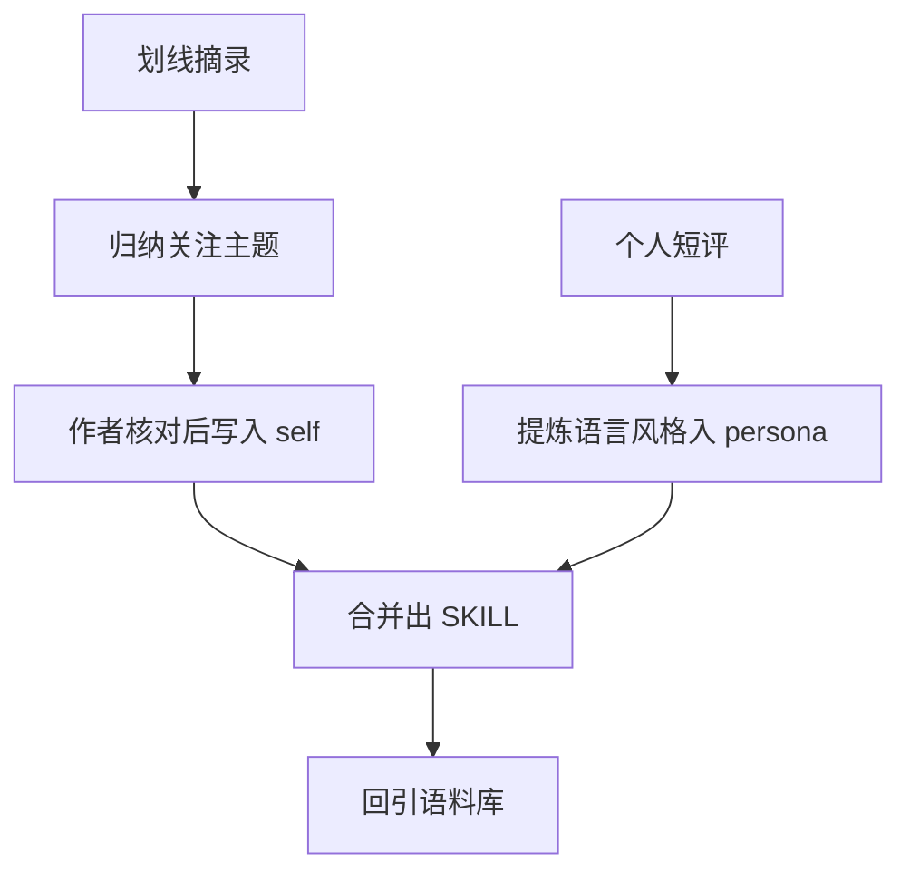

# 我把 4647 条微信读书摘录，蒸馏成了一个数字分身

前阵子整理自己攒下的微信读书划线和笔记，发现内耗、自我价值、极简、财务自由、知行合一这些话题反复出现。划线能看出我愿意留下什么，却不能直接证明我信什么；真要找自己的说话习惯，还得看亲手写的短评。

我想试着把这两类材料分开用：划线帮我找到反复关注的话题，短评帮我提取用词和语气，再把它们写进一个可调用的角色 Skill。这样至少能查清某个判断和某种口吻从哪来。

这件事并不是把几千条文本喂进去，就能自动得到一个"更懂我"的分身。先分清书摘和自己的话，后面的提炼才有依据。

## 这次做了什么

当前 `cleaned/` 目录有 4647 份 Markdown：3818 份书籍划线、829 份个人笔记。我想把它们用于一份可调用的个人角色 Skill，同时保留书摘与本人表达的区别。

材料能支持到哪一步，得先划清楚。

- 划线摘录可以提示反复关注的话题，不能直接当成个人价值观或亲历的证明。
- 个人笔记短评更适合观察用词、标点和句子节奏，也不代表每篇文章都要照搬这些写法。
- 但私密生活信息（作息、关系、人生节点、具体年龄这类）笔记里基本没有。这些数据不足，就老实标注"待补充"，绝不脑补。

这份 Skill 最多保留一部分判断与表达习惯。没写进材料的生活经历，它无从知道；生成的第一人称内容仍要逐句核对。

## 关键过程

我借用了 `echo-me-skill` 的两层组织方式：Self Memory 放有材料支撑的记忆，Persona 放表达与反应习惯。面对微信读书材料，先分清书籍划线和个人短评，再归纳主题、提取口吻，最后组合文件。

### 第一步，先从 4647 份材料里找主题线

我先从两条目录看反复出现的主题，再回到具体摘录核对。只看单篇，很容易把当时的一句感想当成长期偏好。

目前整理出六条线索：

- **反内耗 = 反熵增**：内耗、熵减、心流，几乎是反复出现的主题词。
- **自我价值与爱自己**：大量"自我价值感""不要讨好""先爱自己"的摘录。
- **极简断舍离**：控制物品数量，把资源花在体验和成长上。
- **财务自由/被动收入**：杠杆、资产 vs 负债、睡后收入。
- **成长与知行合一**："认知觉醒 → 认知驱动 → 知行合一"。
- **真诚、边界感、不盲从**：会质疑、会保留判断，不是什么都信。

这六条是我对当前材料的归纳，不是自动聚类得出的标签，也不等于经过了频次校准。单条摘录说明不了什么；同类主题反复出现，才值得回原文继续看。

材料目录如下：

```text
src/temp-data-clear/cleaned/
├── 划线/    # 3818 份 Markdown，书籍摘录，关注课题的线索
└── 笔记/    # 829 篇，个人短评，最接近真实口吻的第一手样本
```

### 第二步，语言风格从哪来？从你真正写过的句子来

提炼说话风格时，我只把 `笔记/` 中自己写的 829 条内容当作候选样本。书里的划线可以提示关注点，不能拿来认领作者的句式。

比如“这个办法不错👍”“释怀，需要时间，接受，需要过程”能在笔记文件名里找到。它们短，却比书里的整段金句更适合拿来观察自己的措辞。

先看几条笔记文件名中的原话：

```text
# 真实表达样本（来自个人笔记，非书籍摘录）
"释怀，需要时间，接受，需要过程"
"认知觉醒-知 认知驱动-行 知行合一，加油！😃"
"这个办法不错👍 也是一种互相激励"
"认真你就输了——想解释，想证明，就输了"
"其实，这句话有点费解，开导不了自己"
```

这些短评能看出 emoji（😃 👍）、短句和自我鼓励的用法，也能看到"开导不了自己"这种不硬装想通的表达。Persona 可以参考这些原句的节奏；书摘里的句子要留在书摘这一侧。

### 第三步，组合落到 Skill，踩了个大坑

材料和分层齐全之后，就该生成文件了。这一层解决了"怎么把这些提炼，变成 agent 能直接读的格式"。

这套设计把产物放在同一个 Skill 目录，分为四类文件：

```text
.claude/skills/alan/
├── SKILL.md     # 运行版：合并 Persona + Self Memory，含原始语料库引用与运行规则
├── self.md      # 自我记忆：核心身份、价值观、习惯、成长轨迹
├── persona.md   # 人物性格：5 层结构，从硬规则到人际行为
└── meta.json    # 元数据：profile、tags、impression、语料来源
```

四份文件各有用途：`meta.json` 记录基本标识，`self.md` 放有材料支持的记忆，`persona.md` 放判断与表达习惯，`SKILL.md` 合并运行规则。分开存放，后续修正经历或口吻时能找到对应位置。

生成文件时，我碰到过一次“外层命令返回 0，但预期目录里没有产物”的情况。只看退出码，很容易把这一步当成已经完成。

当时排查指向工作目录与预期不一致。当前能确认的教训是：检查 `SKILL.md`、`self.md`、`persona.md` 和 `meta.json` 是否实际存在，比相信一次命令的返回码更可靠；不能据此断定 `skill_writer.py` 本身有静默失败的问题。

随后按目标结构补齐四类文件，并逐个检查内容。这里说的“补齐”是文件组合，不是重新训练模型。


### 文件怎么组织

`SKILL.md` 先标出原始语料位置，再合并 PART A 自我记忆、PART B 人物性格和运行规则。这样 Agent 读取入口时能找到人物设定；需要核对口吻时，还能回原文。

`persona.md` 按五层记录人物信息：

| 层 | 存什么 | 一句话 |
| --- | --- | --- |
| Layer 0 硬规则 | 底线与棱角 | 你是 Alan，不是 AI；不突然完美，不说教 |
| Layer 1 身份 | 名字、职业、城市、倾向 | 测试开发工程师，北京，内省型 |
| Layer 2 说话风格 | 口头禅、语气词、标点、emoji | 爱用 😃👍，爱用省略号和短句点题 |
| Layer 3 情感与决策 | 开心/生气/焦虑怎么反应，怎么下决定 | 理性分析为主，处变会先拆解再说话 |
| Layer 4 人际行为 | 社交能量、分寸感、冲突处理 | 独处充电型，很有分寸 |

其中 Layer 2 记录表达习惯。前面那几条笔记可以给它提供例句，但不能据此写成“每段都加 emoji”的指令。遇到严肃的技术判断，先把事实说准，再决定要不要用口语。

这些样本有鼓励自己的话，也有“开导不了自己”的保留。Layer 0 把限制写得更直白：没有材料支持的经历和态度，不能为了让角色显得完整就补上。

调用时先看 PART B 的判断与表达，再查 PART A 有没有相关事实。两者冲突时，以 Layer 0 的事实限制为先；口头禅和标点只是参考，不能压过实际输入。

`meta.json` 可以记录基本标识与检索标签。标签只是摘要，不能替代逐条原文；单凭“反内耗”一类词，也推不出私人经历。

作息、饮食、人生时间线、家庭关系在这批笔记里缺少直接证据，就保留 **[待补充]**。以后有了本人确认的材料再填，不用一句“关注精力管理”去推断日常作息。


### 补了一处我觉得值得推广的设计

文档生成完还不算完。我后来给它补了一个很小的设计：在 SKILL.md 顶部加了一段"原始语料库参考路径"，明确告诉运行它的 agent——**需要写作或模拟口吻时，先回到 `cleaned/笔记/` 去翻原文**，对齐真实用词、句长、段落节奏、标点和 emoji，再落笔。

Skill 里写的是概括，具体用词还得回原文核对。Agent 按主题读少量相关笔记，比只看一条“爱用 emoji”的规则更稳；原文也需要判断语境，不能整句照搬。

## 速览

| 环节 | 产出 | 前提或代价 |
| --- | --- | --- |
| 主题归纳 | 6 条待核对的主题线索 | 从重复内容出发，回原文判断语境 |
| 语言提炼 | 候选表达习惯 | 从个人短评取证，不能拿书摘当口头禅 |
| 组合落盘 | Skill 目录 | 检查实际文件，不只看外层命令的退出码 |
| 诚实标注 | [待补充] 项 | 数据不足的维度不虚构，预留填充位 |
| 语料回引 | 写作时回翻原文 | 依赖原始目录仍在 |
| 产物结构 | 4 文件：SKILL/self/persona/meta | 记忆、性格、元数据分文件，便于分开进化 |

## 工作流



## 还缺一项：原文检索

这次材料能帮我归纳关注的话题，也提供一批可回看的个人短评。它们还不足以证明完整的价值观、人生经历或“像我”的实际效果。Self Memory 里缺少证据的内容继续留空；生成后的回答还需要拿真实场景核对。

这次只做了身份信息的归纳与文件组合，笔记内容还没有接入细粒度检索。想查某段摘录，仍要回原始目录翻。下一步是给材料建立可检索的索引，让 Skill 在参考口吻之外，也能指出具体摘录来自哪里。

#个人Skill #数字分身 #自我蒸馏 #知识管理 #Agent #复盘
