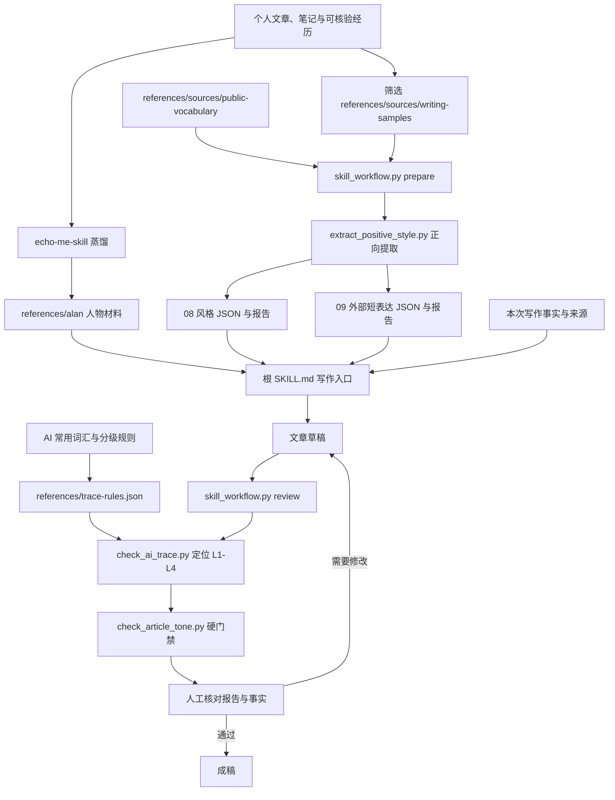

# 我把个人口吻和去 AI 味接进同一个写作 Skill

我用过一些公开的去 AI 味 Skill，成稿效果有点不咋地。这只是我的使用感受，没有做过严格的横向评测，也不打算替那些工具下结论。

反复调整之后，我决定自己写一版。手头攒了一大堆文章、复盘和笔记，也有一套整理出来的 AI 常用表达。与其每次在提示词里说“写得像我一点”，不如把材料、规则和检查动作放进 Skill，让下次写稿还能接着用。

我最初把这件事拆成三步：先用 `echo-me-skill` 蒸馏人物风格，再准备“需要警惕的表达”和“值得参考的写法”，最后让写作 Skill 把它们接起来。现在这些能力收在 `alan-writer-article-style` 一个包里：`SKILL.md` 要求写稿前运行 `prepare` 更新报告，成稿后运行 `review`。这两个命令需要按流程执行，并不会在语料文件变化时自行触发。去 AI 味方案里的 L5/L6 和总分还停留在设计文档里。

## 整体怎么接：先建素材，再写稿，最后查问题

这套 Skill 的输入并非一张万能提示词。人物蒸馏回答“我通常怎么判断、怎么说”；正向提取回答“哪些写法在候选文章里有证据”；公众词汇提供更顺口的替换；负向规则负责把可疑套话定位到行。写作 Skill 负责调度这些材料，不能拿词库代替本次文章的事实。



图里最关键的是正向提取那条线。`echo-me-skill` 给人物材料一个相对稳定的轮廓；但具体写一篇公众号文章，只靠“短句、口语、重证据”几个标签还不够。得把候选原文里的词、句式、节奏和出处拿出来，写稿时才能回到样本核对，不至于把所谓个人风格写成一组漂亮形容词。

## 第一步：把个人风格拆成能核对的材料

如果只有一句“模仿我的风格”，模型抓到的保不齐只是几个口头禅。写两段还行，写长了就开始重复。

我先整理个人文章、月度复盘、技术笔记等材料，用 `echo-me-skill` 蒸馏出一个 `alan` Skill。它记录了我关注的工程问题、表达习惯和事实使用规则。例如，谈 Agent 评测时，通常会追问样本从哪里来、结论怎么验证、出了问题能不能复现。它也写明：转载、段子和词表可以作为表达素材，不能变成“我亲身做过”的事情。

蒸馏时的 `alan/` 曾是单独的 Skill。整合后，`references/alan/self.md` 放人物记忆，`persona.md` 放判断方式和口吻，`corpus.md` 说明不同材料能怎么用，`publishing.md` 留下发布型技术文章的规则；项目根目录的 `SKILL.md` 是唯一写作入口。这样以后发现一句话“不像我”，可以回到口吻规则；发现一段经历压根没发生过，就得查人物事实和语料归属，不能靠换个同义词糊弄过去。

这一步得到的是人物与判断习惯，还不是一篇文章。写公众号稿时，根 `SKILL.md` 先区分本次事实和人物参考，再按主题取少量样本组织正文。人物材料给口吻和判断顺序，根入口处理文章结构与交付要求；出问题时可以沿着包内路径回查。

蒸馏时我希望留下两类东西。一类是遇到问题时的判断顺序：先看输入、证据和失败样本，再谈结论。另一类是表达上的习惯：短段落、口语解释、技术对象后面跟一个能验证的动作。年龄、职业、项目经历这类人物事实要比词汇更谨慎；原材料没支持的内容，不能因为生成了一个人物 Skill 就自动成立。

语料本身还得整理，文件混在一起，统计结果容易乱成一锅粥。我把项目里的样本重新筛了一遍，现在放在 `references/sources/writing-samples/`。当前目录有 51 篇 Markdown；提取脚本按正文去重后，把其中 19 篇列为候选主语料，6 篇列为其他体裁，18 篇列为技术笔记，5 篇列为补充材料，另外识别出 3 篇正文重复。

| 材料 | 当前用法 | 写作时要守住的事 |
| --- | --- | --- |
| 文章与月度复盘 | 观察句长、段落节奏、转折和常用表达 | 文件分类不能证明每篇都由本人独立手写 |
| 技术笔记与其他体裁 | 补充术语解释、叙事和工程判断 | 不直接混入公众号主语料的词频统计 |
| AI 常用表达词表 | 定位需要复核的套话 | 命中词语不等于文章由 AI 生成 |
| 公众词汇参考 | 给生硬书面语找自然说法 | 外部作者的经历、观点和长句不能拿来当自己的 |

真正让我能把“像我写的”往前推一步的，是现在包内的 `scripts/extract_positive_style.py`。它从早期 `referenced-chatgpt-conversation-this-is-an/outputs/` 的提取逻辑整理而来；当前运行时只用包内脚本。它没有训练模型，也没有用语义向量猜风格，而是对 Markdown 做一套能复跑、能回查的统计。当前报告覆盖 32,753 个候选主语料汉字。

**先分组，免得把别人的话算到我头上。**脚本按文件名先识别黑话、段子、译文等补充材料和游记、年终总结等其他体裁，再看 frontmatter 的 `category: 公众号文章/Articles` 或月度复盘文件名；命中后列为候选主语料，其余归为技术笔记。这是规则分类，并不会验证作者身份。所以“19 篇主语料”准确说是 19 篇候选文章，不能拿它给每篇盖“纯本人手写”的章。

**再清理正文、按内容去重。**读取时兼容 UTF-8 BOM；清掉 frontmatter、代码块、列表、表格和链接标记，把标题单独留下，正文按段落提取。然后对清理后的正文计算 SHA-256 摘要：同样的正文即使文件名不同，也只计一次。51 篇输入最终得到 19 篇候选主语料、6 篇其他体裁、18 篇技术笔记、5 篇补充材料，另有 3 篇正文重复。这里去的是全文重复，换几个字的近似稿仍需人工辨认。

**最后才提取表达。**脚本内置了一组候选词、短语、连接词和句式正则。它逐篇查原文，只有至少跨 2 篇出现的词语才进主要候选表，同时记下总命中次数、覆盖篇数、短例句和最多 3 个来源文件。像“说白了”这种短语，得先在材料里找到，再回原文看它用在什么判断上；写进候选表本身没有证明力。这个方法是“预置候选词＋原文核对”，覆盖不了词表之外的新表达，也不能说高频词就是个人独有。

有一层对照挺实用：脚本把主语料里某个表达的跨篇覆盖率，与技术笔记和补充材料里的覆盖率比较；主语料达到设定门槛、且相对更常见时，才列进“语料内较有辨识度”的表。它只比较本地这批文件，谈不上全网独有。句式部分则用规则统计“不是 A 而是 B”“先 A 再 B”等结构，以及相邻句子的“先问再答”。同一句式命中很多次，可能是写作习惯，也可能是模板惯性，报告只负责给证据。

词之外还有节奏。脚本按汉字数统计长短句、段落长度和一句一段比例，另算标点、标题、小标题、常见句首句尾，以及技术词与口语词同句出现的例子。当前候选主语料里，15 字以内的句子占 32.2%，45 字以上占 8.3%；这比“多写短句”具体一些，但也不是要求每篇照着比例配餐。

| 脚本环节       | 留下什么          | 写作时怎么用              |
| ---------- | ------------- | ------------------- |
| 分组与正文去重    | 每篇归属、重复文件名    | 先确认样本边界，误分组就改源材料或规则 |
| 候选词与句式命中   | 次数、跨篇覆盖、例句、来源 | 选贴题的表达，回原文看上下文      |
| 主语料与补充材料对照 | 本地相对常见的表达     | 避免把外部口语误认成个人专属      |
| 节奏与结构统计    | 句长、段落、标点、标题特征 | 调整文章读感，不机械复制比例      |

个人风格这条线输出两份：`references/research/08-positive-style.json` 给 Skill 按字段检索，`08-positive-style-report.md` 给人看证据和边界；同一脚本还为外部素材生成 `09-public-vocabulary.json` 与 `09-public-vocabulary-report.md`。在 `alan-writer-article-style` 根目录运行 `/usr/bin/python3 scripts/skill_workflow.py prepare`，它会调用包内提取脚本，从 `references/sources/writing-samples/` 和 `references/sources/public-vocabulary/` 读取，更新这四份产物。`SKILL.md` 要求写稿前先执行 `prepare`，但文件变化本身不会自动触发它。写新主题时，先看报告，再按来源读相关原文。这样一个词为什么被推荐、它出自哪篇，都有地方可查。

整理语料时还碰到一个很实际的问题：早期项目目录已经删到 51 篇，另一个已安装 Skill 的旧语料目录却还留着 63 篇。只更新报告、不改读取路径，下次运行又会把旧文件带回来。整合包现在自带 `writing-samples/`，提取脚本通过自身所在位置找到项目根目录，再读取这份包内语料；后续增删文件也只改这里。人物蒸馏时使用的旧材料仍有历史参考价值，但这轮公众号正向统计以整合包的分组报告为准。

## 第二步：给外部表达留一个独立入口

我另外留了 `references/sources/public-vocabulary/`，放口语表达、网络黑话、轻松回复和段子素材。当前 9 篇外部参考文章，脚本提取出 646 条短表达或替换关系。

这里的提取也有具体做法：脚本按文件来源区分口语替换、职场黑话、网络表达等类型，从箭头、冒号、表格里的短句找“原说法 → 更自然的说法”。每条结果保留来源文件。长段子和整段口语故事只留下阅读入口，不整段塞进可复用词表。这样改稿时可以查一个短表达的出处，也能看出它适合轻松转场，还是只适合当作反例。

这些材料挺好玩，但也最容易整活过头。技术文章讲的是脚本为什么误报，突然插一句不合时宜的网络梗，读者只会觉得作者在硬撑“活人感”。反过来，“出现误报”后面顺手补成“正常句子也被标了出来”，读者一下子明白了。

因此我把它们放在辅助语料里：先把事实和判断写准，再按语境挑表达。黑色幽默放一丁点儿用于转场，方言给句子一点温度；没有合适位置就不放。如果有喜欢的作家、好词好句，也可以放到这层参考；它们不会因此变成“我常说的话”。外部材料里的原话要保留来源，也不能把别人的第一人称故事搬成我的经历。

## 第三步：把 AI 常用表达分级，再交给脚本定位

负向材料来自 `ai-words.md` 和 `ai-words-clear-方案.md`。原方案把写作痕迹扩展到 L1–L6，还设计了 0–100 分的指数。落地时先收窄到 L1–L4：当前脚本给出行号、命中规则和原句上下文。L5/L6 结构识别和总分仍在方案阶段。

分级依据是误报风险。“问题”“关键”这样的词太普通，单次出现没有解释力；“值得注意的是”常常只是提醒读者注意，删掉前缀后后半句照样成立；固定句式则要看整句话是否只是在制造转折。把这些混成一张禁词表，脚本看起来很严格，结果可能专挑正常句子下手，词越删越多，读起来反倒更费劲。

| 等级 | 检查对象 | 当前处理方式 |
| --- | --- | --- |
| L1 | “问题”“关键”“系统”等普通高频词 | 只统计，不据此要求删词 |
| L2 | “底层逻辑”“赋能”“抓手”等易空泛的词 | 标出位置，看它有没有指向具体对象 |
| L3 | “值得注意的是”“不难发现”等提示性短语 | 优先检查能否直接进入后面的事实 |
| L4 | 固定的对照、提醒和总结句式 | 定位整句，结合文章语境重写或保留 |

实际规则放在 `references/trace-rules.json`。L1–L3 是明确列出的词和短语，脚本在正文里逐项匹配；L4 用有长度范围的正则找固定句式。报告按原文件行号排序，每条给出等级、规则名和命中附近的文本。它不调用模型，也不拿这些命中计算“AI 生成概率”。

把代码动作缩到最小，大概就是下面四行。脚本先过滤 frontmatter、代码块和表格，再在剩下的正文里找词与句式。输出保留原始行号，改稿时能直接跳回文件；这个位置比一个总分有用得多。

```text
逐行读取正文，保留原文件行号
L1～L3：匹配词库中的具体词和短语
L4：用限定长度的规则匹配整句
输出：行号、等级、规则名、命中附近的原文
```

这个分工意味着脚本的退出码不会因为命中 L2 或 L3 就变成失败。它负责把疑点摆到桌面上；作者负责判断疑点是否成立。发布型技术文章的硬门禁是另一回事，`check_article_tone.py` 检查少数明确禁用的套式、固定表达和几个抽象词的用量，失败就得改。

检查器会跳过 frontmatter、代码块和表格，输出正文里的行号。报告摊开，一眼就看出问题落在哪句，不用盯着一个分数猜发生了什么。执行方式也很简单：

```bash
cd alan-writer-article-style
/usr/bin/python3 scripts/skill_workflow.py review /path/to/article.md
```

举个只涉及表达的例子。假设稿子写成“值得注意的是，检查器会跳过代码块”，定位脚本会提示这个前缀。删掉前缀，直接写“检查器会跳过代码块”，事实没有变，句子还短了一截。如果后半句本来就没说清检查器做了什么，删四个字救不了它，还得回到代码和实际输出补细节。脚本能指出位置，没法替作者完成这一步判断。

这里有个挺容易翻车的地方：正向报告显示，“不是 A 而是 B”在 19 篇候选主语料中的 18 篇出现过。`说白了` 也跨多篇出现。如果把网上整理的“AI 禁句”整包复制进来，一刀切地删，禁词表可能勤快到把作者本人也拦在门外。

所以检查报告只是修改线索。出现“链路”时，要看后面有没有真实调用路径；出现一句转折时，要看它是否推进了判断。没有内容的套式改掉，确实贴切的表达留下，硬删反而多此一举。发布型技术文章还有一份更窄的硬规则，由 `review` 接着调用 `check_article_tone.py` 检查。原人物材料里的某些套式与发布硬规则冲突；根 `SKILL.md` 已说明以硬门禁为准。

## 第四步：让写作 Skill 把三份材料接起来

现在的实现只有一个根 `SKILL.md` 入口，包内脚本负责语料准备和成稿复查。不必把一大堆词表一股脑儿塞进一次对话；写稿时按主题挑材料，写完再让检查器指出值得回看的句子。

给写作 Skill 的输入首先是一份事实材料：项目文件、运行结果、作者亲历、公开来源分别是什么。它先决定哪些句子可以用第一人称，哪些只是计划，哪些必须标出处。然后按主题去读少量正向样本，再从公众词汇里挑适合的短表达。没有事实的地方，语料再丰富也不能补出一段“我当时怎么想”。

前面的总览图把语料准备和写稿时的动作连在一起了。每次写作先运行 `prepare` 更新正向报告和公众词汇库，再提供本次事实；根 Skill 按主题取相关材料。写完运行 `review`，它依次调用包内的 `check_ai_trace.py` 和 `check_article_tone.py`。前者给人工修改线索，后者是硬门禁；改稿后重跑。

人物规则在 `references/alan/`，文章写作入口是根 `SKILL.md`；检测规则在 `references/trace-rules.json`，两份供人阅读的提取报告在 `references/research/`。下次出稿出了问题，可以沿着这些路径分辨是素材分错组、写作指令打架，还是检测规则误伤。

| 步骤 | 输入 | 可检查的产物 |
| --- | --- | --- |
| 人物蒸馏 | 个人材料、真实经历 | `references/alan/` 中的人物判断与事实禁区 |
| 正向提取 | `references/sources/writing-samples/` | 带分组、计数和出处的 `08-positive-style.json` |
| 外部口吻提取 | `references/sources/public-vocabulary/` | 带来源的短表达词库 `09-public-vocabulary.json` |
| 成稿检查 | Markdown 文章、`references/trace-rules.json` | 可回到原句的 L1–L4 报告 |
| 发布型文章复查 | 改写后的正文 | 硬规则通过或明确指出需要修改的表达 |

把原先分散的材料收到一个可以独立分发的项目后，`alan-writer-article-style` 不再依赖其他已安装的 Skill。它把目录拆成几块，各管一段：

```text
alan-writer-article-style/
├── SKILL.md                            # 唯一写作入口
├── README.md                           # 五部分路径与使用命令
├── scripts/
│   ├── skill_workflow.py               # prepare / review
│   ├── extract_positive_style.py       # 正向风格与公众词汇提取
│   ├── check_ai_trace.py               # L1–L4 分级定位
│   ├── check_article_tone.py           # 发布语气硬门禁
│   └── README.md                       # 脚本参数与生成文件
├── references/
│   ├── alan/                           # 人物 Skill 的包内参考层
│   │   ├── self.md / persona.md / corpus.md
│   │   └── publishing.md / meta.json
│   ├── alan-persona.md                 # 人物写作速览
│   ├── trace-rules.json                # L1–L4 定位规则
│   ├── sources/
│   │   ├── writing-samples/            # 51 篇 Markdown，另有图片附件
│   │   └── public-vocabulary/          # 9 篇外部表达参考
│   └── research/                       # 01–07 与方案资料；08/09 为生成结果
│       ├── 08-positive-style.json
│       ├── 08-positive-style-report.md
│       ├── 09-public-vocabulary.json
│       └── 09-public-vocabulary-report.md
└── tests/                              # 提取、定位、工作流测试
```

这样拆的意图和文章前面说的完全一致：
`SKILL.md` 只承载调用顺序和交付要求，不背大段词表；
`sources/` 是唯一放原始语料的地方，开源前需要核对个人信息与第三方转载授权；
`research/` 里的 `01`–`07` 和方案文档是人工整理的参考，`08`、`09` 是脚本生成的数据与报告。
写稿时按主题去 `research/` 挑参考，脚本只负责提取和定位，不改正文。
两个检查脚本各管一段：`check_article_tone.py` 管少数禁用表达，`check_ai_trace.py` 管分级定位，谁都不替作者下结论。
目前脚本没有“自动清理全文”按钮。对“值得注意的是”这类前缀，有时删掉就顺；对技术句子的转折，直接替换可能改掉原意。现在的流程是脚本定位，Skill 结合事实改写，再跑一次检测。L1 只做统计，L2–L4 逐条复核；硬门禁失败时才必须继续修改。

写完再检查一次事实很有必要。改写时一不留神就会翻车：把“计划增加”润成“已经上线”，或把“脚本能定位”写成“脚本能自动消除 AI 味”。这两种变化读起来都很顺，意思却已经跑偏。检查前后两版时，我更关心数字、时态、归属和技术动作有没有被改掉。

## 第五步：用能复核的结果收尾

当前独立包通过了 Skill 格式检查。包内 5 个测试覆盖了去 AI 味定位、外部词汇同名副本判断，以及 `review` 对语气硬门禁失败退出码的传递。运行 `prepare` 后，当前包内得到 19 篇候选主语料、9 篇公众词汇来源和 646 条短表达；`review` 在现有文章上也能同时给出分级提示与语气门禁结果。数据都从包内路径读取，不再借用旧安装目录。

这些证据说明文件能被发现、脚本能运行、分类与定位规则符合当前设计。它们还不能证明“读者一定觉得像我写的”，也不能证明它比公开 Skill 更好。尤其是候选主语料的作者身份还需逐篇确认，词表的误报率也没用成组样本测过。拿一句“大差不差”当质量验收，够呛。原方案中的 L5/L6 和 0–100 分因此没有挂到交付门禁上。

下一步可以拿确认过的本人文章和已知模板稿各做一组样本，逐条记录哪些提示有用、哪些误伤；再看文章结构上的重复是否需要单独检测。每次写完也该留下修改前后两版和修改理由。光盯着“AI 味分数”下降就说稳了，很容易糊弄自己：一篇有内容的文章，改到最后只剩另一种空话。

## 试着来一套：五件材料联动

这一整套流程，别人不一定照抄目录，但可以按同一个思路自己凑一套。核心不是哪份脚本，而是把“不要什么”“要什么”“想学什么”拆成可单独维护的材料，再让它们互相接起来。拆法大概是五件：

1. **搜索 AI 味词汇**，作为反向样本。它们不是要立刻清光，而是先收集、再按等级归类，给检测脚本当判据。先把“值得注意的是”“综上所述”这类高频套话收进清单，后面写稿和检查都有据可依。
2. **整理自己的文章，提炼、蒸馏，作为正向样本**。把自己写过的、自己认可的内容归一归类，从里找出句子的节奏、用词和判断习惯，作为“像作者本人”的候选素材。这一步得到的是风格证据，不是拍脑袋的形容词。
3. **搜集自己喜欢风格的公开样本，分级渗透到文章里**。外部口语、黑话、段子单独放一个目录，标清来源。它们是表达层面的参考，可以按语境渗透进句子，但不能改第一人称归属，也不能当成作者经历。
4. **一份人物风格材料**，承接第 2 步的蒸馏结果，回答“我通常怎么判断、怎么说、哪些事实不能碰”。我把原人物 Skill 的这层内容放进 `references/alan/`，写稿时给整体留下口吻的基线。
5. **一个写作 Skill 入口**，组织写稿的动作：怎么读事实材料、按主题取正向和外部样本、写完跑去 AI 味定位和硬门禁。它由根 `SKILL.md` 承担调度，不负责编造事实。

这五件事合成一个项目联动起来：包内人物材料定基调，正向样本给弹药，公开样本补表达，反向词汇管检查，根写作 Skill 把这些接到一篇稿子上。每份材料独立可维护，出了问题能定位——是素材分错组、规则误伤，还是写作指令打架。想从头试一套，就从这五件开始攒，不必一开始就全自动化。

#AgentSkill #AI写作 #去AI味 #公众号写作
