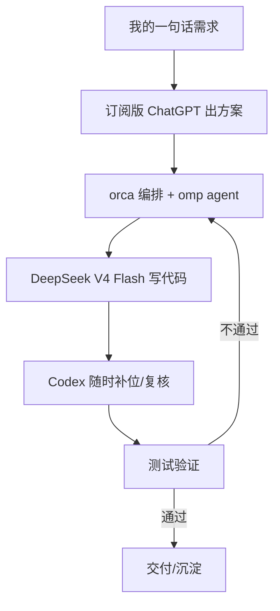

# 除了 Claude Code，我的第二生产力是 orca + omp + DeepSeek V4 Flash

先把话说透：除开 CC 和 Codex，我现在真正的主力生产力，是 **orca + omp + DeepSeek V4 Flash** 这套组合。平时开发基本靠它扛。

套路也很固定：方案用订阅的 ChatGPT 出，到了要动手写代码就切回这套，Codex 随时补位。我的项目没那么复杂，V4 Flash 日常真的够用。omp 的 agent 配上 DS V4 Flash，用下来的感觉就一句话——**小钢炮王炸组合**。

这话不是拍脑袋。上个月 Composio 在 8 个 Agent Harness 里拿同一个 V4 Flash 跑 30 个高难度任务，Pi 那套默认安装过了 20 个拿了第一，OMP 第二。又稳又便宜，不同人实测都是这个结论。

但今天不打算一味夸工具，想把三件事讲清楚：**为什么是这套组合**、**omp 到底比它 fork 出来的原版 Pi 多了啥**、**日常该装哪几个插件**。因为太多人和我曾犯一样的错——一开始根本分不清 omp 和 pi，照样稀里糊涂用一路。

## 先把组合搭起来看两眼

这套东西长这样：



图上最值钱的地方不是任何一个工具，是分工：**方案和写代码是两拨人**。ChatGPT 负责"该不该做、往哪做"，omp+V4 Flash 负责"怎么落地、把代码跑出来"。你让一个便宜快的模型既想方案又写代码，它容易给你交一坨看着像活、其实推不动的东西。

现在的状态是：**代码这事，主力是 omp + V4 Flash；CC 和 Codex 留着当替补和复核**。这套分工跑了一段时间，才敢说它是"第二生产力"。

这一节里的 orca，是这套组合里常被忽略、其实最关键的那一层——它是把这些 agent 串起来的编排壳。

### orca 是什么

orca 是我现在跑代码 agent 的宿主/编排层。它管的东西很具体：我哪个目录开哪个 worktree、会话的状态和卡片、要不要派个子代理去单独查一件事、终端里谁在跑、甚至内置的浏览器。一句话，**它负责"调度"和"现场"，模型负责"写"**。

在 orca 里可以很顺手地做这些事：

| orca 能干的 | 说白了是 |
| --- | --- |
| 管理 worktree / 会话 | 一个项目一个工作区，互不打架 |
| 派子代理并行干活 | 同时查资料、改代码、复核 |
| 终端接管 / 发消息 | 在 agent 和真命令之间当桥梁 |
| 内置浏览器 | agent 直接开页面看结果 |
| 技能（skills）共享 | 本地技能打个 unlisted 链接就能发给别人 |
| 全会话文本搜索 | 找回"上次那个 agent 到底改了什么" |

它和 omp 的分工很清晰：**orca 管"这场戏怎么演"，omp 管"这句台词怎么写"**。同一个 omp + V4 Flash，放到 orca 的编排和会话体系里，才能变成前面 mermaid 图里那种"能循环、能复核"的闭环；裸跑一个 CLI 是得不到这层体验的。

orca 现在是 1.4.206，mac 上装在 `/Applications/Orca.app`，命令行是 `orca` 这个二进制（`orca status --json` 看运行状态、`orca open` 启动）。vendor 是本机的 `com.stablyai.orca`（Stably AI）。


## 先分清：omp 是 Pi 的 fork，但已经不是一个量级的东西

Pi 是 Mario Zechner 在 2025 年 8 月做的编码代理，纯 TypeScript。omp（oh-my-pi）是 Can Bölük 从 Pi fork 出来的独立项目，两个项目各自发展，omp 会定期从上游合并 Pi 的改动。

名字像、血缘近，但规模差得离谱：

| 对比项 | Pi | omp |
| --- | --- | --- |
| 规模 | 约 20 万行 TypeScript，没有 Rust | 约 112 万行 TS + 17 万行 Rust |
| 包结构 | 4 个包 | 16 个包 + 8 个 Rust crate |
| commit | 4,600+ | 14,000+ |
| coding-agent（核心 CLI 包） | 104K | 631K |

差距最大的就是 `coding-agent` 这个核心。Pi 那边是 agent 的基础流程（会话、工具调度、RPC 模式），omp 在这之上加了一整套东西。

一句话概括能从 README 学来：**想要开箱即用，选 omp；喜欢极简自己折腾，选 pi。** 这不是踩谁，是两条完全不同的路线。

## omp 多出来的，都是 Pi 刻意没做的正餐

很多用 Pi 的人第一反应是"太素了"：内置工具常年就 7 个（跑命令、读写文件、编辑、搜代码），没有 plan mode，不集成 MCP，连权限弹窗都嫌多余。这其实是 Pi 的哲学——作者对内核有洁癖，能力靠扩展自己长出来。生态里那句话很有名：**先用惯了 Claude Code / Codex 的人，看到 Pi 只会觉得寒酸。**

omp 反过来，把这些补成了出厂标配。挑几个日常真能用上的：

### Hashline：让 AI 改代码不再抄一遍

AI 改代码一直是"把旧代码原样抄一遍再交差"，抄错一个空格就匹配不上，然后重试十几轮。

Hashline 用 tree-sitter 把代码按语法块算哈希当锚点，AI 只要说"把标识 a3f2 那段换了"就行，不用抄。实测（README 数据）：Grok 4 Fast 用 Hashline 比传统文本匹配少花 61% 的输出 token。

### AST 编辑：按语法结构批改

传统文本匹配搜 `console.log(`，会误伤 `myConsole.log(`，也漏掉 `console .log(`。AST 编辑找的是"语法上是函数调用"，空格换行怎么排都不影响。批量改动（比如把所有 `console.log` 换成 `logger.info`）先预览再原子写入，3 处要么全改要么全不改。用 `ast-grep`，覆盖 50 多种语言。

### LSP 集成：像 IDE 一样懂代码关系

omp 内嵌语言服务器客户端。重命名一个函数，不光改定义那一处，`index.ts` 的 barrel export 和别名导入里的引用会一起更新。

这活儿纯靠文本匹配根本干不了——你告诉它改函数名，它得自己也"查得到"谁在用这个函数。

### DAP 调试器：AI 真的跑程序找 bug

C++ 崩了 attach lldb 打断点看变量，Go 卡住了 attach dlv 遍历 goroutine，Python 挂了 attach debugpy 执行表达式。AI 不是看源码猜 bug，是能真跑程序看运行时状态。这是"能上手"和"能治"的分水岭。

### 子代理：派分身并行干活

Pi 也有子代理，但 omp 多出三样：

- **git worktree 隔离**：A 在 worktree-A 改，B 在 worktree-B 改，互不冲突
- **子代理间 IRC 通信**：A 改了函数签名，通知 B 更新对应调用处
- **结构化输出**：返回 schema 校验过的字段，不用从散文里解析结果

我遇到大改动，会让一个只读子代理把 diff 重新挑一遍刺。自查自纠容易客气，换一双眼睛就实在得多。

### Advisor：第二模型实时审

同一个会话配两个模型，一个负责写，一个负责审。审的跑在独立上下文里，不跟主力抢 token，发现问题注入备注——可能是提醒，可能是硬性阻止。这功能对"想省钱又怕翻车"的场景特别值：主力用便宜的，审的用贵的盯着。

### Hindsight：跨会话记忆

聊完就忘是全行业通病。omp 用 `retain` / `recall` / `reflect` 三件套，会话结束自动压缩要点到项目记忆库，下次开新会话第一轮就"记得上次聊过 API 主路由是 /v2/orders"。而且按项目隔离，A 项目学的不会串到 B。

除此之外还有：持久化 Python/JS 执行环境（第一步定义的变量第二步还能用）、TTSR 规则按需触发（不占常驻上下文）、内置 ripgrep/glob/brush 原生引擎（不依赖系统命令、跨平台免 WSL）、内部 URL 体系（`read pr://1428` 读 PR、`read agent://子代理/findings` 读结构化结果）、Agentic Commit（自动拆 commit 按依赖排序）、浏览器驱动 + web 搜索。

这清单看着长，但反过来想：**这些在 Claude Code / Codex 里多半要么有、要么能接，而 Pi 想不折腾根本达不到。** 这就是 omp 存在的意义。

## 同一套箱子，能不能装别人——关键在 Harness 而非模型

上个月 Composio 做了个公开测试，值得记住：同一个 DeepSeek V4 Flash，放进 8 种 Harness，跑 30 项高难度任务。结果：

| Harness | 通过数/30 | 成功率 | 单项成本 |
| --- | --- | --- | --- |
| Pi | 20 | 66.7% | 0.028 美元 |
| Oh My Pi | 17 | ~56.7% | — |
| Claude Code | 16 | ~53.3% | 0.195 美元 |
| Codex | 16 | ~53.3% | — |
| Deep Agents | 16 | ~53.3% | — |
| Prime Agent | 15 | ~50% | — |
| Hermes Agent | 15 | ~50% | — |
| OpenCode | 14 | ~46.7% | — |

同一个模型，只换外面的底座，成功率能从 46.7% 拉到 66.7%，差 20 个百分点。成本差距更离谱：Pi 平均一项成功任务花 0.028 美元，Claude Code 要 0.195，将近 **7 倍**。中位耗时 Pi 的 132.2 秒略慢于 CC 的 122.7 秒，但综合成功率、速度和成本，它在这轮测试里最突出。

更有意思的是，Pi 用的是**全新、没调过参数的默认安装**，只接了测试要用的 MCP 插件。反而是会话量最庞大的 Prime（有的会话吃到 350 万 token、33 次工具调用），把评分器都跑超时了，6 次运行没被计入成绩。

Pi 拿第一还有个技术底子：DeepSeek 的缓存按提示词前缀命中的，基线越稳定命中率越高。Pi 那套"稳定环境摘要、固定温度、确定性摘要哈希"的设计，能把手动配置的缓存命中率做到 99% 以上。开发者 0xEvan 用 Pi 调 V4 Flash 处理了快 10 亿输入 token，缓存命中 99.93%，只花了 2.65 美元；不命中按常规价要 132 美元。

Mario Zechner（Pi 作者）早就说过一句被当段子传的话："pi + ds4 == sovereign AI enterprise ready."——三个多月后有开发者真拿这个组合跑出 99.93% 缓存命中，这句吐槽才被数据接住。

当然这不是说"轻量适用于所有人"。这套组合更适合**任务相对短程、可控、对成本敏感、自己愿意调一点**的场景。长链条、多分支、深依赖上下文的活，极简 Harness 可能丢必要的中间层。别神化，看场景。

## 插件：日常四件套起步，剩下的按需加

我的原则和社区共识一样：**插件不是越多越好，各司其职，装之前先想清楚，这是 Pi 天生该干的，还是我的使用习惯需要。**

先装这四个，跑几个仓库再决定留不留：

| 插件 | 用途 | 一句话点评 |
| --- | --- | --- |
| pi-web-access | 联网：网页搜索、抓取、GitHub 克隆、PDF 解析、YouTube 理解 | 零配置可用 |
| pi-subagents | 派生子代理并行干活，内置 scout/researcher/reviewer/oracle | 大改动挑刺换双眼睛 |
| pi-fff | 预索引文件，模糊匹配 + frecency + Git status 加速大仓库搜索 | 代码库大了不卡 |
| pi-context-view | 估算当前会话上下文占用 | 防止悄悄塞满 |

往里加的话，按我自己实际留下的清单：

| 插件 | 用途 |
| --- | --- |
| @narumitw/pi-plan-mode | 规划模式，锁死写权限，逼我先想清楚再动手 |
| pi-memory | 记忆存成 markdown 文件，跨会话不忘事，随时能改能查 |
| pi-mcp-adapter | 一个代理工具接整个 MCP 生态，按需发现、懒启动，只占约 200 token |
| pi-cache-optimizer | 稳定提示词前置、动态内容后置，提高缓存命中率，长期省钱 |
| @narumitw/pi-btw | 旁路提问，干到一半插问也不打断主线 |
| @narumitw/pi-file-context | 圈精确文件行喂上下文，大文件不整份刷屏 |
| pi-open-tui | 精致皮肤，底部状态栏显示模型、分支、上下文、token、成本 |
| context-mode | 大文件/大日志先进沙箱过滤，只回传摘要，省 98% 上下文 |

几个安装相关的坑，别踩：

- 插件大多发 npm，命名习惯 `pi-<name>`，装一个：`pi install npm:pi-open-tui`
- 想先试再决定，用 `-e` 跑一个会话不实际安装：`pi -e npm:pi-memory`
- 清单存在 `~/.pi/agent/settings.json` 的 `packages` 数组，一目了然，也能手工改
- 配 DeepSeek 用 `DEEPSEEK_API_KEY` 环境变量，Pi 从 0.70.1 起内置 V4 Flash，一条命令就能起来：

```bash
export DEEPSEEK_API_KEY="your_key"
pi --provider deepseek --model deepseek-v4-flash
```

模型目录里直接出 `deepseek-v4-flash` 和 `deepseek-v4-pro`，不用手写 model 配置。这是这套组合最省心的一环——**官方已经把 DeepSeek 内置了，你只管填 Key 选模型。**

## 为什么我建议你试试这套"小钢炮"

很多人和之前的我一样：要么死磕订阅制的 CC/Codex，觉得贵的才稳；要么被各种"全家桶"Harness 吓到，觉得配置越满越强。

这组对比测试给了第三种思路：**选一个快且便宜的模型，放进一个干净、轻量的 Harness，再用真实任务检验组合**。每增加一层，智能体就多一个可能迷路的地方；每增加一个工具，它就多一项需要做出的选择；每增加一份庞大的指令文件，它在行动前就要读更多噪声。干净的 Harness 给模型一条从接任务到完成的短路径，臃肿的会让它四处绕路。

对你的具体场景，我的判断是：

- **项目不算特别复杂** → V4 Flash 日常完全够，不用为"想象中更大的活"整天上贵模型
- **对成本敏感** → 99% 缓存命中率 + 白菜价 token，跑起来真的不心疼
- **想在 CC/Codex 之外留一条能干活、又便宜的线** → omp 开箱即用，插件按四件套补
- **享受极简、爱折腾** → 原版 Pi 也成立，只是要知道想要的能力多半要自己装

## 几句感想，说点大实话

最后想聊几句不被工具评测遮住的话。

第一，**打分越多的 Harness，越不代表你该用**。Composio 那个测试里，Prime 把会话吃到 350 万 token、33 次工具调用，最后把自己拖垮。这特别像现实里一类人：开会先列十页计划，干活前先建七个文件夹，最后项目死在仪式感上。工具是这样，人也是。**别让配置的堆砌，变成逃避开工的借口。**

第二，**"第二生产力"不是贬义词，是清醒的定位**。我不是说 CC/Codex 不行，恰恰相反，我把它们留在替补席，是因为它们的容错和复核价值很高。真正的工程手感和效率，一部分来自工具，更大一部分来自你什么时候知道该换工具、什么时候知道就用便宜的扛。**省钱不是抠，是把贵的留给用得上的地方。**

第三，**这套组合真正值钱的，不是某个单点功能，而是"能一直跑、不烧钱、出了问题能回头找"**。V4 Flash 便宜快到让我敢把日常琐事都丢给它，omp 的 Hindsight 让我跨会话不丢上下文，稳定缓存基线帮我压住账单。这些单拎出来都不炸裂，连起来才是有复利的系统。

如果你是那种"功能堆得越高越心安"的人，这篇可能让你不太舒服。但我想说句实在话：**这个时代，真正决定上限的不是模型，是它外面的那层 Harness；真正决定你用得爽不爽的，是你有没有一套能一直跑、又养得起的组合。**

orca + omp + DeepSeek V4 Flash 于我，就是那套。

把我的经验抄走也行，自己折腾也行，但别再用"工具越多越香"的惯性拍脑袋了。先跑起来，再谈配置。

## 附：orca 与 omp 的地址和装法

收个尾，把能落地的东西给你整理成清单。先是两个项目的去向：

| 项目 | 是什么 | 地址 / 装法 |
| --- | --- | --- |
| **orca** | agent 编排壳（本机是 `com.stablyai.orca`，Stably AI） | 官方主页地址无可靠来源，不确定就不写。mac 装的是 `/Applications/Orca.app`，命令行 `orca`（`orca status --json` 查状态） |
| **omp** | Pi 的 fork，开箱即用的编码 agent | 官网 omp.sh / GitHub `can1357/oh-my-pi`；安装见下方命令 |

**omp 三选一的安装命令**（任选其一）：

```bash
# 方式一：homebrew（mac 推荐）
brew install can1357/tap/omp

# 方式二：官方安装脚本
curl -fsSL https://omp.sh/install | sh

# 方式三：npm / bun 全局装
bun install -g @oh-my-pi/pi-coding-agent
# 或用 npm
npm install -g @oh-my-pi/pi-coding-agent
```

装上之后很重要的一步：给 omp 配 DeepSeek，设环境变量然后指定模型：

```bash
export DEEPSEEK_API_KEY="your_key"
omp --provider deepseek --model deepseek-v4-flash
```

最后再看一遍这套组合的取舍：**orca 负责把工作区、子代理、会话这些"现场"管起来；omp 负责开箱即用地把活干出来；DeepSeek V4 Flash 负责便宜、快、够用。** 三者各管一段，缺一环都不成立。先跑起来，再谈配置。

---

#omp #pi #DeepSeek #Agent #编码工具 #插件 #AI编程