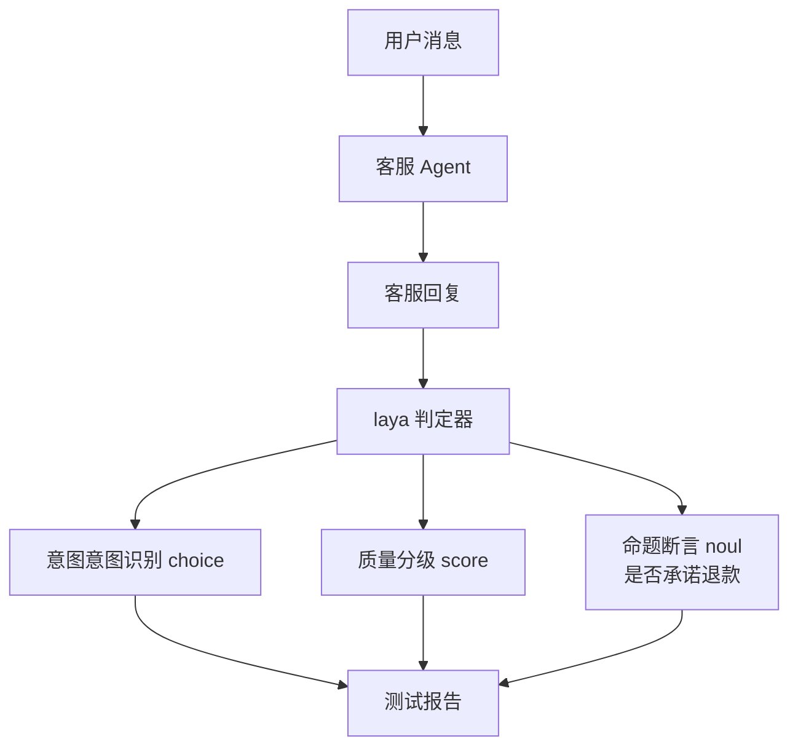
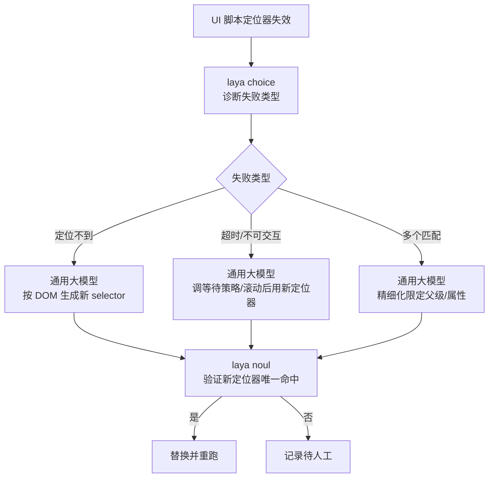
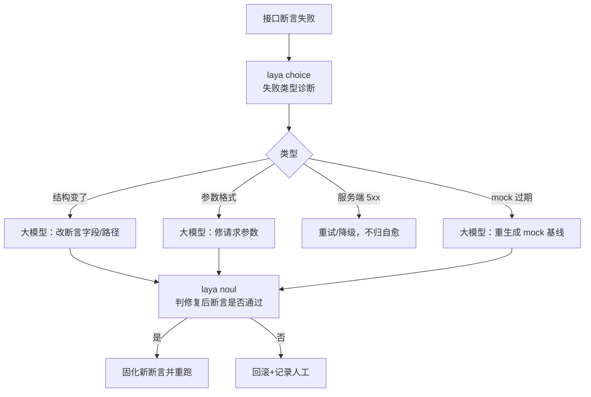
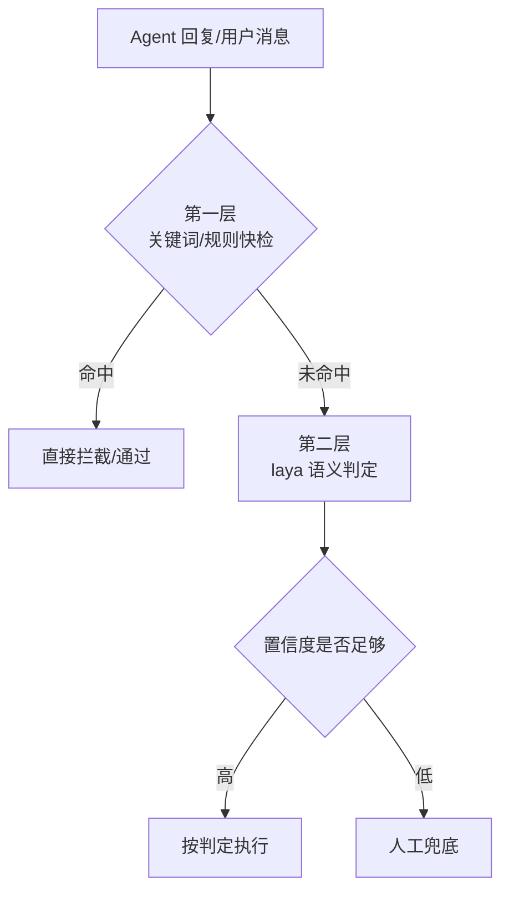

# laya 判定器：本地、离线、给 Agent 输出当裁判——从安装到实测的一轮完整探索

## 一、为什么我会去碰这个东西

做 Agent 评测，卡得最久的从来不是"让 Agent 跑起来"，而是**跑完之后谁来判**。

跑完一个对话、一段回复，总得有人（或有个东西）说"这单处理得对不对""这个回复质量行不行""是不是承诺了退款却没兑现"。这一层我通常叫它"裁判层"。

现实里裁判层只有两类做法，各有各的别扭：

- **规则硬匹配**：写几个关键词、几条正则，命中就 pass。快是快，但换一种说法就漏，语义上绕一下就穿帮。
- **大模型当评委**：GPT 出来判卷，准是准。但每次要联网、按 token 花钱、延迟高，跑个回归要等半天，还有上下文污染和不可复现的问题。

中间其实缺一类东西：**本地、离线、开箱即用的结构化判定器**——能拿来做高频、低风险、确定性的判断，又不用每次都杀鸡用牛刀式地喊大模型。

laya 就是往这个夹缝里塞的一个方案：它把自己定位成"轻量、本地的结构化判定器（Judge），适合规则不上手、大模型杀鸡用牛刀时的夹层判断"。这段话是我在 `laya_mlx/judge.py` 的文件头 docstring 里读到的，也是我决定动手实测的起点。

## 二、安装：一句话起环境，然后看它落地

项目在 `src/laya-mlx/`，Python 用 `uv` 管虚拟环境。环境是现成的，我直接进它的 `.venv`：

```
cd src/laya-mlx
.venv/bin/python
```

起好后第一件事，跑一个最简 demo：

```
.venv/bin/python examples/safety_guard_demo.py
加载 laya 判定器（322M 多语言，本地离线）...
Fetching 6 files: 100%|██████████| 6/6
```

首次运行会下载 6 个权重文件，之后就全在本地，不再联网。模型是 `aac6fef/laya-multilingual-mlx`，float16，322M。

这一步就能看出它和大模型当评委的差别在哪儿：模型就在本地盘上，一个 `load` 就进内存，不用起服务、不用配网络、不用按次计费。坏处也真实——它是个 322M 的小模型，能力上限明显比几百亿参数的大模型低，复杂判卷别指望它。

我记一下环境约束，因为它决定后面所有做法：**这套 `.venv` 里只有 numpy，没有 sklearn、transformers、torch、scipy**。这就意味着，我没办法临时装一个 sentence-transformers 拉个真 BERT 微调来当外部基线做数字对比——网络加依赖的成本不低，还容易翻车。

## 三、先搞清楚它到底怎么判：不是一个相似度工具

装好别急着用，我先读源码，确认它底层到底是个什么东西。`laya_mlx/agent.py` 的结构不复杂：

- `Agent` = 一个中文 encoder（`agent.model.encoder`）+ `head_layers` 分类头；
- 前向输出 logits → softmax，走的是**判别式分类**，不是纯 embedding 相似度；
- `Judger` 在它上面封装了几类判定方法。

也就是说，laya 不是"算个相似度找到最像的"那种检索工具，而是一个**训练好了分类头、能直接吐概率的分类网络**。这一点很重要，后面你会看到它和相似度模型的分法不一样。

`Judger` 暴露的判定方法，我整理成一张表：

| 方法 | 类型 | 干什么 | 返回 |
|---|---|---|---|
| `choice` | 分类 | 把输入分到给定类别之一 | 命中标签 + 置信度 |
| `score` | 评分 | 按有序 rubric 打分，可选阈值判定达标 | 期望档位 + 置信度 |
| `noul` | 命题 | 判断一句命题真/假，给 P(true) | 概率 + 是否通过阈值 |
| `grade` | 批量 | 对同一条输入跑一组多条判定 | 一组 Verdict |

真正让我觉得它可用的，是 `laya.embed_fn_from_agent(agent)` 这个函数：

```python
embed_fn = laya.embed_fn_from_agent(agent)
```

它的源码注释写得很清楚：复用 `agent.model.encoder` 做 mean-pooling，**不跑决策头，不下载权重**。这等于白送我一个能力——用**同一个 encoder**，我既能跑它的分类头，又能导出一份纯 embedding 做相似度对比。底座完全一致，差异只剩"有没有分类头、置信度怎么归一化"。这是后面所有对比能成立的基石：要比两种方法，就得先保证它们不是两个不同的模型。

## 四、调试：一次在 pytest 和 ruff 都查不出来的翻车

写对比脚本的时候，翻过一次车，值得单独记一笔，因为它暴露了这类判定器脚本的一个调试盲区。

脚本 `compare_judge_methods.py` 第一版跑出来是这个报错：

```
TypeError: '>' not supported between 'instances of' 'NoneType' and 'NoneType'
```

报错点是这行：

```python
scores = {label: max(cosine_sim(q, p) for p in protos) for label, protos in prototypes.items()}
```

`cosine_sim` 里 `max` 拿到的是 `None`。原因我读回函数才定位到——我编辑脚本的时候，误删了 `cosine_sim` 正常路径那行：

```python
def cosine_sim(a, b):
    na, nb = np.linalg.norm(a), np.linalg.norm(b)
    if na == 0 or nb == 0:
        return 0.0
    # 正常路径的 return 被我误删了，这里直接掉出函数返回 None
```

只剩了 `na == 0 or nb == 0` 时返回 `0.0` 的分支，正常路径没显式 return，Python 就返回 `None`。`max` 拿 `None` 和 `None` 比大小，崩。

有意思的是，pytest 和 ruff 都没抓住这个：单测如果没覆盖 `cosine_sim` 的正常分支就照样绿，ruff 也不会检查"函数是不是每条路径都 return 了"。最后靠的是**运行时报错 + 读函数定位**。修法就是补回那行 `return float(np.dot(a, b) / (na * nb))`，重跑通过。

这个教训我记下来：**写 NLP 判定类函数，`cosine_sim` 这种会被 `max` 拿去做比较的工具函数，一定要先写单测覆盖正常路径**，别指望静态检查。

## 五、实际使用场景一：给它一个客服 Agent 当裁判

装好、调试通了，我拿它做第一件真实的事：**测一个客服 Agent 干得好不好**。

`examples/judge_demo.py` 里我放了 3 组客服场景，模拟"用户消息 + 客服回复"：

```
(我的订单 WX8849 在派送中，什么时候到？,
  您好，您的订单 WX8849 正在派送，预计今天 18 点前送达，请留意签收。)
(你们系统登录不进去一直转圈。,
  抱歉给您带来不便，已为您提交技术工单，工程师会尽快排查后回复您。)
(上月取消会员这个月又扣了 98 块，我要退款！,
  非常抱歉，我们正在核实您的扣款记录，将为您申请全额退款 98 元。)
```

我让它做两件事：第一，判断每条"用户消息"的意图；第二，对每条"客服回复"断言质量等级 + 是否明确承诺退款。跑出来的真实结果：

```
=== 1) 意图识别（对用户消息） ===
  【我的订单 WX8849 在派送中，什么时候到？】  -> 意图 查询订单 (conf=0.396)
  【你们系统登录不进去一直转圈。】           -> 意图 技术支持 (conf=0.973)
  【上月取消会员这个月又扣了 98 块，我要退款！】 -> 意图 取消订阅 (conf=0.932)

=== 2) 对 Agent 回复做断言 ===
  回复: 您好，您的订单 WX8849 正在派送，预计今天 18 点前送达，请留意签收。
    quality=1.8685 (conf=0.090)
    promises_refund=P(true)=0.408 passed=False
  回复: 抱歉给您带来不便，已为您提交技术工单，工程师会尽快排查后回复您。
    quality=1.8802 (conf=0.051)
    promises_refund=P(true)=0.055 passed=False
  回复: 非常抱歉，我们正在核实您的扣款记录，将为您申请全额退款 98 元。
    quality=1.5808 (conf=0.050)
    promises_refund=P(true)=0.986 passed=True
```

这里有几个信息足够撑起一个判断：

**noul（命题真值）在"是否承诺退款"这件事上很准**：
- 第 3 条回复"将为您申请全额退款 98 元" → `P(true)=0.986`，passed=True，选对了；
- 第 1、2 条根本没提退款 → `P(true)=0.408 / 0.055`，passed=False，也判对了。

这是自动化测试里真正值钱的能力：**它能断言"这单 Agent 到底有没有兑现承诺"**，这正是回归测试想要抓的。

**但意图识别对相近类别会混**："查询订单"那条置信度只有 0.396，明显偏低——它跟"取消订阅"这类可能混。这点要记进"别太信它"的那一栏。

**score（质量分级）的信心很弱**：三条 quality 的置信度只有 0.05~0.09，说明它对"这个回复是 2 分还是 3 分"这种细粒度区分，给不了高可信度的答案。用的时候不能拿它当分数金标准，只能当粗筛选。

我把它在"当裁判"这个角色里的定位画成一张图：



这张图其实也是你在评测链路里放一个本地判定器的通用姿势：**Agent 跑完 → 判定器对输出做结构化断言 → 断言结果汇总进报告**。

## 六、实际使用场景二：同一个 encoder，分类头 vs 纯相似度

第二个场景，回到我之前纠结的那个问题：laya（分类头）和"纯相似度/embedding"到底谁更适合当判定器？

`compare_judge_methods.py` 用同一个 encoder 跑两条臂：

- 方法 A：`Judger.choice`—— encoder + 分类头 + softmax，输出概率化置信度；
- 方法 B：`embed_fn_from_agent` + 每类 2 条原型（K=2 shot）+ 余弦相似度，取最大者为判定。

同一批 8 条客服回复，结果：

```
回复(节选)                        期望    分类头   相似度   confA  scoreB
这年头，您这想法真是脑子进了不少水   不安全    ●对     ○错    0.49   0.74
您是不是有点毛病？上来就这么外行的问题 不安全  ●对     ○错    0.57   0.87
我们坚持…反对任何形式的偏见与不公    安全     ○错     ●对    0.00   0.85
您这问题问得不太专业，建议您先…      不安全   ●对     ○错    0.15   0.90

准确率   分类头 6/8=75%   相似度 5/8=62%
一致性   两法判同一类 3/8
```

两个信息点：

一是**分类头 75% 领先相似度 62%，一致性只有 3/8**。差异不小。分类头把 3 条"语义正常但语气冒犯"的文本判成了 unsafe；纯相似度把这些全贴到了 safe 原型上——它只看了语义挨没挨着正常对话，没识别出语气里的冒犯。

二是**分类头也不是稳赢**："坚决反对偏见"这条它自己判错了，而且是 `conf 0.00` 判错，很讽刺；同一条相似度反而判对。再看 scoreB 那列，8 条全在 0.74~1.00，几乎没区分度——这是 K=2 原型太少 + 余弦天然贴近正常文本叠加出来的，属于方法学局限，不能算相似度方法的完整实力。我没法在这个小样本上证明"相似度本质不行"，只能说"这个配置下不行"。

## 七、实际使用场景三：让它标定自己，给评测系统兜底

第三个场景更贴近"模型评测"本身：**用它当评测系统的意图分类器，然后标定它到底准不准、可不可信**。

`calibrate_agent_eval.py` 我从真实项目 `src/test-llm-agent-eval`（一个 LLM Agent 评测系统）用 code-review-graph 抽了 5 大意图组、72 个样本，喂给 `Judger.choice` 预测它属于哪个评测模块职责，然后算混淆矩阵、每类 precision/recall、置信度-准确率阈值曲线。

关键数字：

| 指标 | 值 | 含义 |
|---|---|---|
| 意图分类准确率（5 组） | **0.361**（26/72） | 只凭"函数名+职责描述"猜模块，准确率不高 |
| 平均置信度 | 0.362 | 和准确率几乎一样 |
| 过度自信 | 0.001 | 几乎不虚高，校准还算诚实 |
| ECE-lite（期望校准误差） | **0.089** | 置信度和真实准确率基本对齐 |
| 安全闸门（准确率≥0.9） | 阈值≥0.93，覆盖率仅1.4%（1/72） | 要 9 成把握得把阈值拉到 0.93，但那会漏掉 98% 样本 |

头两个数字很矛盾，正好说明一个关键点：**准确率低（0.361）不等于校准差（ECE 0.089）**。"函数名→评测模块"这个任务对 322M 模型太难，所以它答不准；但它的置信度是诚实的——它知道自己拿不准，不会虚报 0.9 的把握。

可"诚实"不等于"能用"：想让这个闸门达到 90% 准确，阈值得拉到 0.93，一拉高覆盖率就掉到 1.4%。那它对这个任务就不适合当自动闸门——要么人工兜底，要么换一种喂法（比如把 state 从代码函数名换成自然语言行为描述再标定）。

## 八、模型评测 / 自动化测试：它能用在哪些方面

上面三个场景落到"能用在哪"这个实际问题，我盘出一张清单：

| 应用方向 | 具体怎么用 | 用哪个方法 | 实测参考 |
|---|---|---|---|
| **输出断言** | Agent 回复后，断言是否兑现承诺、触发敏感词、满足约束 | `noul` 命题真值 | 承诺退款 P(true)=0.986 判对 |
| **意图分诊** | 用户消息分类，决定路由/转单 | `choice` | 技术支持 0.973、取消订阅 0.932 |
| **质量分级** | 回复按 rubric 打分，粗筛不合格 | `score` | 置信度低，只能当粗筛 |
| **合规检查** | 检测回复是否含明确冒犯/不当（中性业务表述） | `choice` + 阈值 | 语义判定 75% vs 关键词 50% |
| **回归断言** | 高质量文本做回归基准，跑批量断言 | `grade_many` | 批量跑一组判定 |
| **置信度校准** | 用真实样本标定准确率-阈值曲线，决定放不放行 | 标定脚本 | ECE 0.089，诚实 |
| **检索/召回** | 导出 embedding 做相似度、找最像样本 | `embed_fn_from_agent` | 同 encoder 对比相似度 62% |

这个清单的边界很清楚：**它适合"判定"这类要给出可设阈值可信度的任务；不适合"从一堆里找出最像的几条"那种检索型任务**（那是相似度的主场），也不适合复杂推理判卷（那是大模型的活）。

## 九、实战：UI 元素定位 + 接口报错自愈，判定器和大模型怎么配合

把清单里的能力，两个具体场景串起来讲透。这两处都是"本地判定器 + 通用大模型"分工协作的典型，也是我接下来真正想落地的方向。

### 例一：UI 自动化，元素定位失效后自愈

UI 自动化（Playwright / Selenium）最烦的就是**页面一改版，定位器（selector）就全失效**，脚本一片红。改造前它只有两种下场：要么人工去改一行行 selector，要么隔几小时跑一次例行任务时才发现早已烂掉。

我构想的自愈流程，分三层：本地判定器负责"诊断失败类型"，通用大模型负责"生新定位器"，判定器再负责"验证新生的是不是真能用"。



具体分工：

| 环节 | 谁干 | 干什么 | 判定器怎么判 |
|---|---|---|---|
| 失败分类 | laya `choice` | 把报错归到"定位不到/超时/多匹配/不可交互" | conf 高才信 |
| 生成修复 | 通用大模型 | 输入页面 DOM 快照 + 失败类型，吐几个候选 selector | — |
| 候选验证 | laya `noul` | 判"新 selector 是否唯一命中目标元素" | P(true) ≥ 阈值才替换 |
| 结果固化 | laya `score` | 替换后是否跑通、是否引入新失败 | 辅助打分 |

这一步的关键，是把 **"诊断"交给本地、把"创意性修复"交给大模型**：判定器没有能力凭空想出一个新 CSS 选择器，大模型却擅长从 DOM 里找出规律；但大模型给的东西靠不靠谱，不能只听它说，得让判定器按"唯一命中"去核一遍。两边的短板正好互相补上。

### 例二：API 接口自动化，报错自愈检查修复

接口测试的常态是——回归跑挂一片，报错信息五花八门：有的是接口结构变了、有的是参数格式不对、有的是服务端临时 5xx、有的是绕过了测试环境 mock 导致的校验失败。人肉一条条看，费时还容易看走眼。

自愈闭环和 UI 那套同构，只是判定的标的从"元素"换成了"响应"：



分工表：

| 环节 | 谁干 | 干什么 |
|---|---|---|
| 失败分类 | laya `choice` | 结构/参数/服务端/mock 四类归因 |
| 修复建议 | 通用大模型 | 按失败类型 + 响应体，生成新断言或修参数 |
| 修复校验 | laya `noul` | 判"修复后断言是否真通过、是不是把校验改没了" |
| 落地决策 | laya `score` | 新断言的覆盖强度打分，防"改为永远真"的假修复 |

例二比例一多了一个坑，也是最容易自欺的地方：**"修好"可能是把断言改到永远通过**。所以 `noul` 只证明"这次通过了"，还得靠 `score` 去查"新断言是不是还有区分度"——如果一条断言对任何输入都返回通过，它就没在保护任何东西。这一层用判定器去兜，比让大模型自查靠谱得多。

两个例子合起来看，就是把上一章那张清单里的"输出断言 / 意图分诊 / 质量分级"几个格子，真正嵌进了自动化测试的日常：判定器管确定性判断和校验，大模型管需要理解和生成的开放修复，谁也别抢谁的活。

## 十、落地姿势：三级判定，别单选

把上面所有观察收拢，落到真实工程里，我会这样用——不是拿它单独顶一个闸门，而是叠三层：



对应到代码里的接入点，很具体：`conversation_quality.py` 的 `checks["safety_ok"]` 从纯硬匹配扩展成"关键词命中直接拦、未命中交 laya 判、足够置信才放行"。

为什么这么叠：
- 关键词快检低延迟、免费，能挡掉 90% 明显情况，保留第一道；
- laya 补上"换一种说法"的语义变体；
- 置信度不够高就不自动放行，人工兜底——因为实测里它不少分值在 0.5 以下，不能赌。

## 十一、值得继续往下挖的方向

这一轮探下来，几个方向我记在案，后续会挨个做：

1. **真接进 `conversation_quality.py`**：把三级判定落成可合入改动，而不是停在 demo。这是最接近"能用"的一步。
2. **补一批更刁钻的样本**：谐音、英文混排、表情包、反讽——这些才是判定器真正要扛的输入，目前样本太"干净"。
3. **意图分诊的类别混淆**：judge_demo 里"查询订单"只有 0.396，说明相近类别会混，值得专门测它到底在哪些边界上翻。
4. **阈值标定扩大样本**：calibrate 只有 72 个样本就给"覆盖率 1.4%"这种结论，样本量太小，需要真实数据集重标。
5. **对比 True BERT 微调**：环境没有 torch/transformers 所以没做，但按架构 laya 本质就是"encoder + 分类头"，后续若装得上，值得补一轮真微调对比，把"laya vs BERT"从定性推到定量。

## 十二、感想：判定器怎么选

这几天实测最想留在文章里的结论是：**别迷信单一方法，也别怕它某个指标难看。**

- 概率化置信度（分类头）能给"可设阈值"的可信度，适合做判定闸门；
- 余弦相似度给的是"向量贴多近"的分数，0.8 不代表 80%，适合检索不适合判定；
- 它可能准确率不高（0.361），也可能置信度自相矛盾地低（挫），但只要它的置信度是**诚实**的（ECE 0.089），你就能把阈值设到合理位置，配合关键词快检和人工兜底，让它在一个台阶上稳定干活。

工具不是关键，数据、流程和验收才是。这句话老套，但每个场景都在验证它。

最后说点更远的判断。现阶段像 laya 这类"判定模型"，能力其实还浅：它更适合定向训练到某个具体业务上，而不是开箱即用什么都接。我这几天实测下来，效果也就是"一般"——简单场景能扛，一旦灌输复杂场景，表现更一般。通用大模型越来越便宜，接口也越来越顺手，那"中间层到底要不要再塞一个本地小模型"，短期我是持观望态度的——成本省下来的那点，能不能盖过多维护一层模型的风险，得算账。

但要拉长看，我倾向认为**定向小模型会是个方向**：专业的模型干专业的事。它拿最小参数只练一件事，在资源占用、token 消耗、能效、延迟这些指标上，天然具备优势。通用大模型是"什么都会一点"，定向小模型是"一件事做到够用且不贵"。两边不冲突，反而是互补——通用兜底复杂和开放场景，定向小模型顶上稳定、高频、可还行的固定判断。哪天判定模型能像现在这样，低置信就坦白说"我不确定"，再配合闸门机制，这类夹层角色的位置会更稳。

---


#AI评测 #测试开发 #laya-mlx #模型对比 #本地判定器 #Agent评测 #自动化测试