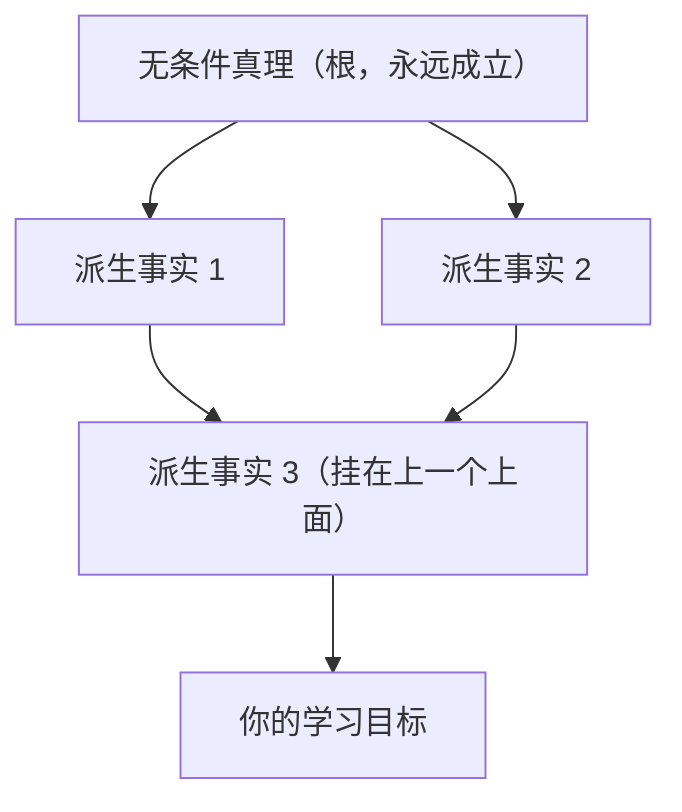
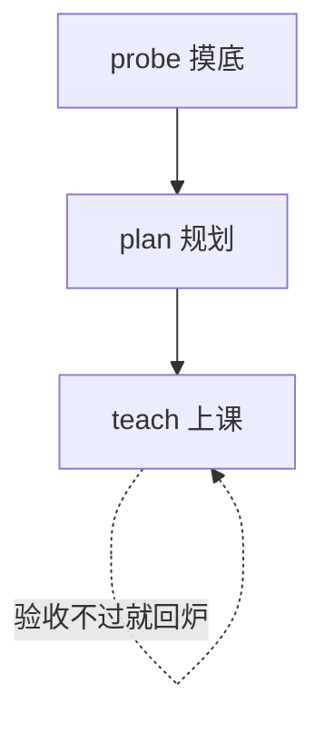
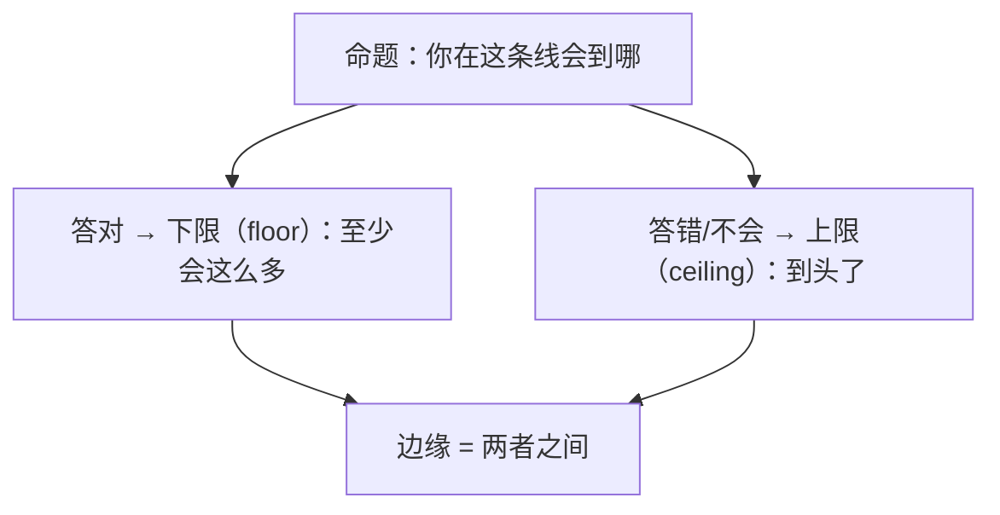
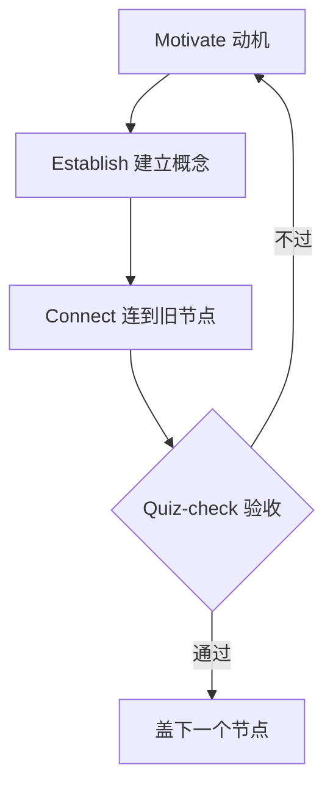
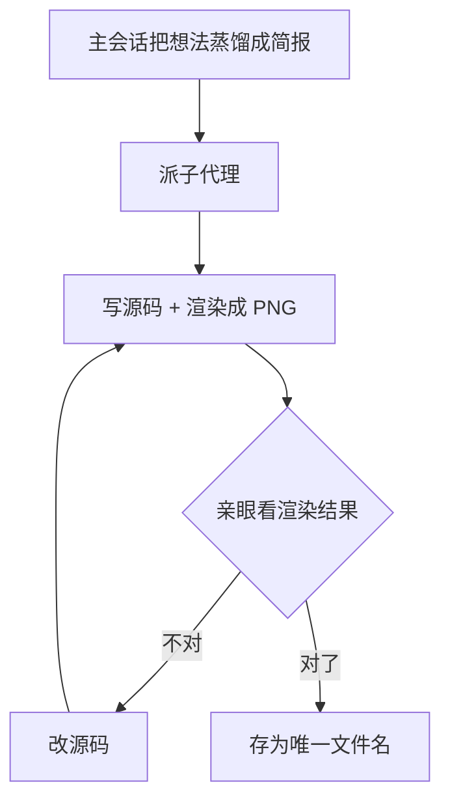

# 一个用 AI 学习的开源系统：它把“理解”做成了工程

上周翻到一个个人项目，作者叫 Amos Blomqvist，仓库名就叫 `learn`，一个 `.pi` 目录：一个教学 skill、一个画图 skill、三个子代理（researcher、svg-maker、mermaid-maker）、四个小扩展（弹窗提问、带评分的测验、把会话镜像成 markdown、画图工具）。里面没有一行通用学习套路的承诺，只有一句话反复出现：教的目标不是“他能复述这个知识点”，而是**理解**——这个事实能从他本来就认可的地基里推导出来，长进他的心智模型里，然后自己活下来。

先说清楚它是干嘛的，免得上面那串名字把人绕晕。

`learn` 不是一个新的学习 App，也不是网站，是一份**配置**。它跑在 pi 这个工具里——pi 是一个极简的终端编码 Agent：在命令行里起一个对话，它就是能读文件、跑命令、写代码的 AI agent。但 pi 特意把核心做得很小，预留了扩展位（扩展、skill、子代理），让你按自己的用法去配它，而不是反过来被它定死。

Amos 配出来的是一个**专属的 AI 老师**：你在 pi 里跟它说“教教我 X”，它不会照本宣科讲一遍就完，而是按一套固定的教学方法来——先摸清你现在的水平和你真正想学什么，再排教学顺序，一小步一小步地教，每讲完一块就用带评分的小测确认你真懂了再往下，不确定的知识点它会自己先联网核实，必要时画张图辅助。整个教学过程都会镜像到一个 markdown 文件里，你可以在 Obsidian 里舒服地回看。

**它能拿来干什么？**
对想认真学一个新领域的人，它把一个“AI 老师”的整套教学流程工程化：先探你的底、再规划、再教、再测验。别人可能用来把教程变成你自己真能弄懂的系统，而不是收藏了就完。

**怎么用？**
它是开箱即用的 `.pi` 目录。先装 pi 和子代理插件，然后在你的学习项目根目录跑：

```bash
git clone https://github.com/amosblomqvist/learn .pi
```

再在那个目录打开 pi，它会按这套流程教你你想学的东西。也要提醒一句：配置是作者为自己一个人写的，教学用“我”来写，你要按自己怎么学最有效去改它。

下面我从仓库源码出发，把这份配置拆开——它一共有哪几块、每一块在整套流程里负责什么、为什么这么设计。不跑通给你报喜，只把代码和 SKILL 文本里可核实的东西摆出来。

## 先看整体：这份配置由四层构成

仓库本质是一张“要怎么教”的分工表。读第一遍时最容易晕的是它东西多、名字像，所以我先按“谁来发号施令、谁来执行、靠什么工具落地”排成一张表：

| 层 | 对象（在仓库里的位置） | 管什么 | 谁调用它 |
| --- | --- | --- | --- |
| 教学脑 | `skills/teach/SKILL.md` | 教学哲学 + 完整流程（probe→plan→teach） | 你打开 pi 后主动用 |
| 配图 | `skills/visualize/SKILL.md` | 判断何时该画图，并把画图外包出去 | 主会话需要图示时 |
| 交互扩展 | `extensions/quiz.ts` | 终端里出题、判分、给解释 | teach 流程里每步验收 |
| 交互扩展 | `extensions/ask-user-question.ts` | 弹窗收“没有标准答案”的目标/偏好 | teach 第一关探目标 |
| 记录扩展 | `extensions/md-log.ts` | 整节课实时镜像进 markdown | 从你开始上课就一直挂着 |
| 画图工具 | `extensions/visual-tools/` | 给画图子代理用的渲染工具 | 子代理调用 |
| 子代理 | `agents/researcher.md` | 联网查资料、核事实 | 主会话不确定时派 |
| 子代理 | `agents/mermaid-maker.md` | 画结构图（依赖图/流程图/时序） | 需要结构图示时派 |
| 子代理 | `agents/svg-maker.md` | 画几何图（坐标/形状/函数图） | 需要空间图示时派 |

这套结构最关键的一句话在 README：**整个仓库就是一份 `.pi` 配置，主会话负责教学，扩展和子代理都是给这套教学打下手的**。底下真正的主业务逻辑全在 `teach` 那份 SKILL 里——它是唯一“每次都按流程执行”的部分。

## 信息的核心动作：把“理解”变成一张网

要理解这套流程为什么这样走，得先看它把“学会”定义成了什么。SKILL 用了一个很明确的比喻：

> 两个人脑子里装了同样的命题，从外面看答案一模一样。但一个是**一堆孤立的知识点**（A），另一个是**几条能推导出一切的核心真理**（B）。对 B 来说，那些对 A 是孤立的知识点，天然就是联通的——这份“联通”就是理解。

所以它要建的，是一张**依赖图**：底层是无条件真理（根节点），往上是靠它们推导出来的派生事实。每讲一个新知识点，就是往这张图里加一个节点，并明确连到它依赖的旧节点上。



图就是教学顺序：从下往上，一个一个节点搭。作者还特意警告别把“听着像地基”当成“真地基”——能照单全收、不带任何“不过……”的才算无条件真理；需要条件、需要补充才有隐含前提的，得继续往下挖根基。

## 为什么大脑只肯记住“安全”的知识

这套设计背后有一条认知机制，SKILL 写得很直白：**大脑不会彻底记住一个它不确信“锁进来是否安全”的事实。** 万一后面冒出个更根本的东西能推翻它，记住就赌输了——得推翻重来，所以大脑宁可留一手，这个事实就永远落不了地。

两条核心教学原则，本质都是在不同环节消掉这个“锁进不安全的担心”：

- **无条件真理先行**。先立住永远成立、没有例外可防备的地基，因为它们是大脑最容易接受、最能瞬间锁进的东西，成为第一块能站脚的地，再往上盖别的。
- **“我怎么才能自己发现这个？”** 一个只有觉得“它本来就该这样”、不是凭空硬塞的事实，大脑才肯信。所以讲任何派生步骤，都要带学习者走“这东西自己也能发现”的路——每一步都讲清为什么非要走这步。

这就回到了那个总目标：知识因为彼此相连，才被自己稳稳托住。

## 教学的流程：probe → plan → teach，三阶段各司其职

原则管“怎么教”，流程管“对谁、什么时候教”。三个阶段顺序跑，只能按话题改每阶段的**大小**，不能改它的**形状**：



### probe：先找到你“会的底”和“不会的天花板”

这一步极度反直觉，也是整套流程里我最服的一条。它不靠你自评“我基础还行”，而是靠题，靠一个**括号法**：每个相关支线，都要同时拿到两样东西——一题你答对的（下限，证明你至少会这么多）和一题你答错或真不会的（上限，证明你在这到头了）。边缘卡在两者之间，只拿到一边没用。



所以“全对”不是完成，反而是信号：题出简单了，你证明了下限、没探到上限，要往难的方向跳，直到有题崩掉。反过来“错一题”也不是马上开课——因为你还不知道那是个手滑、一个孤立窄缺口，还是一个被坚定持有的误解，前两者的处方和第三种完全不同，得先判断清楚再动。

同一阶段里，`ask_user_question` 负责另一件事：探你“想学什么”。目标通常是含糊的，“我想理解 LLM”底下可能压着三件不同的事——要原理、要会用、要能造。没对齐就开讲，整张图都是歪的。

### plan：先画一张图，你点头才教

摸完底，它不直接讲，而是把方案摆给你确认。作者自己说这是杠杆率最高的一步，不许快——先用 `researcher` 把话题地图摸一遍（核心概念、真实第一性原理、常见坑），再对着你的 edge 和目标设计，然后给出两样：一段白话讲清“学什么、什么顺序、为什么这么学”，加上刚那张依赖图。

这个交接点很关键：方向错了现在改只要一句话，楼上楼都盖到一半再翻工就贵了。

### teach：每个节点，走同一个四步循环

正式开讲后，每个知识点都过一遍固定四步，不管是地基还是派生步骤，绝不多讲几步一起堆：

| 步骤 | 干什么 | 作用 |
| --- | --- | --- |
| Motivate | 先讲“为什么现在学它、它解什么问题” | 让学习者知道这是为什么 |
| Establish | 真地基平铺直叙定；派生步骤走“我怎么能发现它” | 建立概念本身 |
| Connect | 明确说出它挂在前面哪个节点上 | 把依赖边画出来，成为“理解” |
| Quiz-check | 出题验收，确认真落地才往上盖 | 验收不过就在这停下修 |

这套四步循环我可以画成一张流程：



## 大胆的地方：它敢用“带判分的测验”当硬卡点

多数 AI 聊天工具把出题当点缀，“嗯你答得不错我们继续”。这套系统不是——`quiz` 是个真的会判分的扩展，而且判分逻辑里藏了不少工程心思：

- **必带“我不知道”选项，且它不参与打乱、没有正确值。** 选它产生的是一个独立的 `dontKnow` 信号，不是判错。一个诚实的“我不知道”永远不会和蒙对的运气混在一起。
- **正确项按 value 判分，不按位置。** 选项显示前做洗牌，但正确项靠 value 映射，所以判的始终是你实际看到那一版。就算题面作者把正确答案打错字，也会变成硬报错而不是静默打错分——把犯规挡在白天，而不是让它在夜里偷偷错。
- **解释只在答完后出现。** 题目本身不带答案，看题时猜不出对错。

更值钱的是它把“构造选项”也定成工序——这是大多数出题工具完全不管的死角。常见翻车在题目写出来之前就定了：正确项总是不自觉带着解释（“……，因为它保留了 X”），干扰项是裸的，结果正确项一目了然。作者的规矩是：**先把正确的断言写出来，再由它变异出每个干扰项**——抓住一个具体误区，用“持这个误区的人会怎么说”写，同骨架、同颗粒度、同语气；干扰项还必须是学习者真会犯的错，这样他选哪个本身就是诊断。再加一条不对称加粗禁令：要加就每个选项的那个平行术语一起加，别只给正确答案打高亮。验收法也很直接：冷眼看完一套选项，若不用懂材料也能猜出哪个对，那构造就跳过了第一步，重写。

这套做法放到 Agent 评测里，就是把“正确性从结果审计挪到构造过程”——我作为测试的人，最想看到的正是这种收敛方式。

## 图：该画才画，画了必须“亲眼看”过才交付

`visualize` 技能的克制让我服气：**只有文字带不动的东西——形状、结构、方向、几何——图才配出现。** 一张只是把旁边那句话再画一遍的装饰图，加的是噪音，还多了一个出错的机会。拿不准就不画，缺一张图比挂一张错图便宜。

真需要时，主会话**不许自己手搓图**——它只管把想法蒸馏到最少的承载元素，然后派子代理去画。为什么必须外包？因为这套系统强调一条不可谈判的规则：图在被交付前，必须由画它的人**亲眼看渲染结果、不对就迭代**，直到确认它说的是真话为止。渲染成功只证明语法对，证明不了一点内容对不对，所以“看了才算数”。画不出真话，子代理就老实返回 `RESULT: NONE`，而不是硬交一张糊弄的图：



mermaid-maker 和 svg-maker 的分工一句话：节点和边这类关系用 mermaid（依赖图、流程图、时序、状态机）；位置和形状这类几何用 svg（坐标、几何图形、函数图、物理排布）。发布用唯一文件名 PNG，`md-log` 按文件名解析嵌入——你笔记里看到的就是子代理亲眼看过的那一版，没有二次渲染漂移。

## 事实：不确定就先查，不许凭记忆讲

这是整套系统里我判断最重的一条。SKILL 写着：对一个事实、名字、日期、公式、定义只要有一丁点不确定，**停下，先派 `researcher` 子代理确认再说**。理由很简单也致命：

> 一个自信满满的幻觉，不只是这次讲错——它会污染所有挂在它上面的节点。一个错的无条件真理，或一步错的“发现”，会腐蚀掉后面盖的每一层。

放进施工流程里，准确不是一种品德，是一个显式步骤。`researcher` 的活法也吻合：把问题拆成 2–4 个可检索的面、多角度搜、官方文档和一手资料优先于博客、产出带引用且含保留/丢弃来源说明的简报。

我不评价这篇有没有做到“一次都不错”——没有任何教学系统能保证这个。我服的是它的处置顺序：不把杜绝幻觉押在模型自身上，而是给“我自己可能弄错”单独修了一条验证通道，并把“错了要明说、别悄悄圆过去”写进规则。对一个以正确性为生命线的系统，这个位置放得对。

## 记录：笔记是副产品，不需要“课后整理”

`md-log` 从你开课起就挂在后台，把你说的话、它说的话、每道题的题目、你的答案和判分解释，实时写进你挂的那份 markdown。下课，整节课已经在笔记里了。

README 没把这个设计说得玄，但效果很实在：学习流程里没有“课后整理笔记”这个额外动作，记录在过程里自然发生。挂的是 Obsidian 能渲染的 markdown，任何编辑器都能打开。


仓库地址：https://github.com/amosblomqvist/learn
配套视频：How I Use AI to Learn Things（作者 YouTube）
#AI学习 #开源项目 #Agent #skill #pi #知识库 #测试开发