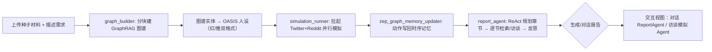

# 开源项目解读：它把"预测"做成了多智能体社会实验

先踩一脚，别被封面那句"预测万物"唬住。`MiroFish`（作者 666ghj，得到盛大集团战略支持与孵化，AGPL-3.0 开源）不是一个"装个模型、喂数据、吐结论"的预测工具。它的做法是把"预测"整个换掉：**不再去算一个更聪明的答案，而是先搭一个平行世界，放进去一群有脾气、有记忆、会抱团的人，让他们把未来自己演一遍，再从这场"预演"里把结论问出来**。

你往上传一份种子材料（一份舆情分析报告，或《红楼梦》前八十回几十万字的小说），再用自然语言说一句你想预测什么。它返回两样东西：一份详细的预测报告，加上一个你能点进去、甚至跟里面的人对话的高保真数字世界。README 的原文是"让未来在数字沙盘中预演，助决策在百战模拟后胜出"。

本文的依据只有两份东西：作者的中文主文档 `README-ZH.md`，和 `backend/` 的源码。下面只讲这俩里能核实的内容，不吹没有验证的效果。

## 仓库里实际有什么

```
MiroFish/
├── README-ZH.md            # 中文主文档（本次解读对象）
├── README.md               # 英文文档
├── package.json            # 根脚本：setup:all / dev（同时起前后端）
├── docker-compose.yml      # 一键起服务（:3000 / :5001）
├── .env.example            # 必填 LLM_API_KEY / LLM_BASE_URL / LLM_MODEL_NAME / ZEP_API_KEY
├── backend/                # Flask 后端（Python ≥3.11 ≤3.12，uv 管理）
│   ├── run.py              # 启动入口（:5001，启动即校验配置，缺 key 直接退出）
│   └── app/
│       ├── api/            # graph / simulation / report 三组 REST 路由
│       ├── models/         # project / task 状态管理
│       ├── services/
│       │   ├── graph_builder.py            # ① 种子提取，GraphRAG 建到 Zep Cloud
│       │   ├── ontology_generator.py       # ② 实体类型 / 关系抽取
│       │   ├── oasis_profile_generator.py  # ② 图谱实体 → OASIS 人设（红/推双格式）
│       │   ├── simulation_config_generator.py # ② 注入仿真参数
│       │   ├── simulation_runner.py        # ③ 拉起 Twitter+Reddit 并行模拟
│       │   ├── zep_graph_memory_updater.py # ③ Agent 动作 → 时序记忆写回
│       │   ├── report_agent.py             # ④⑤ ReAct 报告 Agent + 工具集
│       │   └── zep_tools.py                # ⑤ 检索 / 深度访谈模拟 Agent
│       └── utils/          # llm_client / retry / zep / file_parser
│   └── scripts/            # run_twitter/reddit_simulation.py（真正驱动 OASIS）
├── frontend/               # Vue3 + Vite + d3（:3000，含 Process/Simulation/Report/Interaction 视图）
└── tests/                  # 后端测试
```

把前端当个可视化工作台，后端是一条"上传 → 建图 → 生成人设 → 跑模拟 → 写回记忆 → 出报告 → 可对话"的流水线，跑模拟的引擎本身不是它的，是按 README 说的用 camel-ai 的 OASIS 驱动的。它自己负责的是前面建图、中间把实体变成人、后面出报告这几段。

## 先看整体：谁发令、谁执行、靠什么落地

一上来最容易晕的是"一堆 Agent"到底哪来、谁干嘛。把 README 的 5 步工作流和 `backend/app/services/` 一一对上：

| 工作流步骤（README） | 谁发令 | 谁执行 | 靠什么落地 |
| --- | --- | --- | --- |
| ① 图谱构建 | 上传种子文件 | `graph_builder.py` | 分块 → Zep Cloud 建图 → 设本体 → GraphRAG |
| ② 环境搭建 | 图谱里的实体 | `oasis_profile_generator.py` | 实体 → OASIS 人设（含 MBTI/职业/关注话题） |
| ③ 开始模拟 | `simulation_runner.py` | OASIS（camel-ai） | Twitter / Reddit 双平台并行，动作写回记忆 |
| ④ 报告生成 | ReportAgent | `report_agent.py` | ReAct：规划 → 逐章节 → 反思，用工具集 |
| ⑤ 深度互动 | 用户 or ReportAgent | `report_agent.py` + `zep_tools.py` | 对话报告 / 访谈模拟里真实 Agent |

这一排下来能看清一件事：**它把整个预测分成"建世界、养人、跑社会、写观察报告"四段，每段都落到一个明确的服务文件**，不是靠一个大 prompt 糊过去。

## 核心机制：把"预测"重新定义成"先演一遍"

值得先强调一层。README 的关键词是"群体涌现"：预测的可靠性，来自成千上万个有独立人格、长期记忆、行为逻辑的 Agent **自由交互、社会演化后浮现出来的结果**，而不是某个模型单点算出来的答案。所以它做了三件配套的事，源码里都能找到对应：

**一、把现实里的人和机构，变成 OASIS 里的人设。** 图谱里识别出的人和群体实体，喂给 `OasisProfileGenerator` 生成 profile。从 `oasis_profile_generator.py` 里的 `OasisAgentProfile` 数据结构能看到字段很具体：`bio`、`persona`、`karma`、`follower_count`，还有 `age/gender/mbti/profession/country/interested_topics`。同一份人设能输出两种平台格式：`to_reddit_format()` 和 `to_twitter_format()`——同一个"人"，在 Reddit 和在 Twitter 上是两套字段。这不只是形式差异，是"同一群人在不同社区说话的方式不一样"这个设定。

**二、双平台并行，让同一个事件在两套社区里各演一遍。** `simulation_runner.py` 用 `subprocess.Popen` 分别拉起 `run_twitter_simulation.py` 和 `run_reddit_simulation.py`，各自维护 `twitter_running` / `reddit_running`、`twitter_simulated_hours` / `reddit_simulated_hours` 独立状态。相当于同一个"舆论事件"放了两个对照组。

**三、Agent 干过的每件事，都写回长期记忆。** `zep_graph_memory_updater.py` 把 `AgentActivity`（发帖、点赞、点踩、转发、评论、关注、搜索……）转成一段话（`to_episode_text`），批次写回 Zep 的时序记忆。README 里"动态更新时序记忆"这一句，落实下来就是：**模拟不是跑完就完，社会里每一个人为什么要那么说的"履历"，会被持续记下来，成为后面报告和访谈的上下文**。

## 为什么它敢让"群体"来决定答案

一个干测试的人第一反应是：让一堆 Agent 自行互动，怎么保证结果稳定、能讲清来龙去脉？README 自己先承认了代价——部署一节明说"注意消耗较大，可先进行小于 40 轮的模拟尝试"。所以它不是在追求"一次跑出标准答案"，而是**把预测分成可观察、可回查的多阶段**：

- 图谱是静态的底（世界里的实体关系），
- 记忆是动态的账（每个人经历过什么），
- 采访是现场的口供（跑完之后去问这帮人到底怎么想）。

三层叠起来，报告不是从空气里"生成"的，是靠"这个世界的静态结构 + 动态履历 + 现场访谈"三份证据堆出来的。这个"先把不确定性收进多个可查的来源，再让 AI 挑着往里翻"的思路，是这套体系里最值得肯定的一处。

## 主流程：一场预测从上传到成片

整条链路可以画成一条主线：



每段在整套里的职责，对应 README 五步，前面表格已排过。注意最后两步是**可回环**的：报告不是一次性的，你能随时再进去提问，让它再调工具、再去问模拟里的人。

## 一个被刻意保留的工程细节：模拟完不关环境，留一个"采访窗口"

整段代码里最值得说的是这个设计：**OASIS 模拟跑完之后，环境默认不关闭，而是进入等待命令模式，监听 IPC。** 这是 `run_twitter_simulation.py` 头注释里写明的机制——"完成模拟后不立即关闭环境，进入等待命令模式；支持通过 IPC 接收 Interview 命令；支持单个 Agent 采访和批量采访；支持远程关闭环境命令"。对应 `backend/scripts/` 底下还有 `simulation_ipc.py` 专门管这条路。

这个小小的留口，直接撑起了 README 的第五步"深度互动"。`zep_tools.py` 的 `interview_agents` 是这么工作的：

1. 读模拟的人设文件，知道社会里都有谁；
2. 用 LLM 根据采访需求，挑最相关的几个 Agent（`max_agents`，上限 10）；
3. 用 LLM 生成采访问题；
4. 调用 `/interview/batch`，`platform=None` 就是**Twitter 和 Reddit 两个平台同时采访**（`timeout=180`）；
5. 清理每段回答（去标题、去 JSON、去工具调用包裹），再提取关键引言。

最有意思的是第 4 步之前有个提示词前缀，原文大意是"你正在接受采访，结合你的人设和过往记忆，用纯文本回答；不要调用工具；不要返回 JSON；不要用 Markdown 标题；按问题编号、每题 2-3 句"。

这个前缀，对干测试的人很眼熟——**这就是给"被测对象"下的输出约束**。让一个还在运行状态、随时可能去调工具的 Agent 回答问题，如果不把输出格式焊死，后面根本没法解析。作者在实现里把"让一个活着的 Agent 开口说人话"这件事，当成一个有输出约束的接口来做，而不是靠运气。整个"先演一遍、再问现场的人"之所以能转起来，全系在"模拟完不关进程、留一个可采访的窗口"这一个工程决定上。

## 读完想说的几件事

读完全套，几点个人判断，不全是夸。

**它真正想解决的不是"预测准"，是"预测这件事没有参照物"。** 传统的预测要么靠统计外推，要么靠单个模型想象；MiroFish 的赌注是：与其让一个模型去"猜"，不如造一个足够像现实的世界，让里面的群体把各种可能都演出来，再从演出的结果里找规律。这个想法的价值在于它给了预测一个**可以被盘问的现场**——你不只拿到结论，你还能回进去问某个 Agent"你为什么这么选"。对决策者来说，一个能解释来龙去脉的"预演"比一个冷冰冰的概率数字有用多了。

**评价有保留，主要在成本和真实度这条线上。** README 自己承认"消耗较大"。整条线到处在调 LLM：建图、生成人设、用 LLM 挑采访对象、用 LLM 生成提问、ReportAgent 逐章节生成——每一环都是 token。而且双平台并行是把成本直接乘二。更根本的问题是：这个"平行世界"离"真实未来"有多近，取决于种子材料给的实体关系够不够真、人设生成得像不像。它提供的是"一套完整、可信的推演框架"，不是"已经验证过的预测准度"——README 里全是愿景和演示视频，没有一份"它当年预测对了什么"的验证数据。能确认的是它把整个流程搭得完整、工程做得扎实，但"预测准不准"这件事没有可回查的证据，只能算待验证。

**最有可借鉴价值的，是"把运行中的系统当成可采访的对象"这个思路。** 市面上多数"预测""推演"都是把数据灌给一个 LLM 然后吐报告，图省事。MiroFish 绕了一圈：真人设、真模拟、记住每个人干过的事、模拟完还留窗口让人去问。这套"先养一个会自己长大的系统，再以用户身份进去问它"的做法，对做测试的人启发很大——**与其给被测系统写死一堆断言，不如造一个环境让被测试的东西自己活起来，再作为一种"活的被测对象"去对话和验证**。它指向的，正是测试里反复出现的那个命题：过程可观察，结果可盘问。

如果你认同"想看清未来的走向，不如先把几个典型的人放进一个有规则的世界里，让他们先走一遍"，那 MiroFish 给你的是这套想法的完整落地：怎么建图、怎么把人变成 Agent、怎么双平台并行、怎么把行为记成记忆、怎么用带工具的 Agent 去问现场。剩下要自己小心的是成本，和"这个世界到底复刻得够不够真"这个最大的变量。

仓库地址：https://github.com/666ghj/MiroFish
在线 Demo：https://666ghj.github.io/mirofish-demo/
中文主文档：https://github.com/666ghj/MiroFish/blob/main/README-ZH.md

**推荐标签**：#AI预测 #群体智能 #多智能体模拟 #开源项目 #OASIS #GraphRAG #Agent