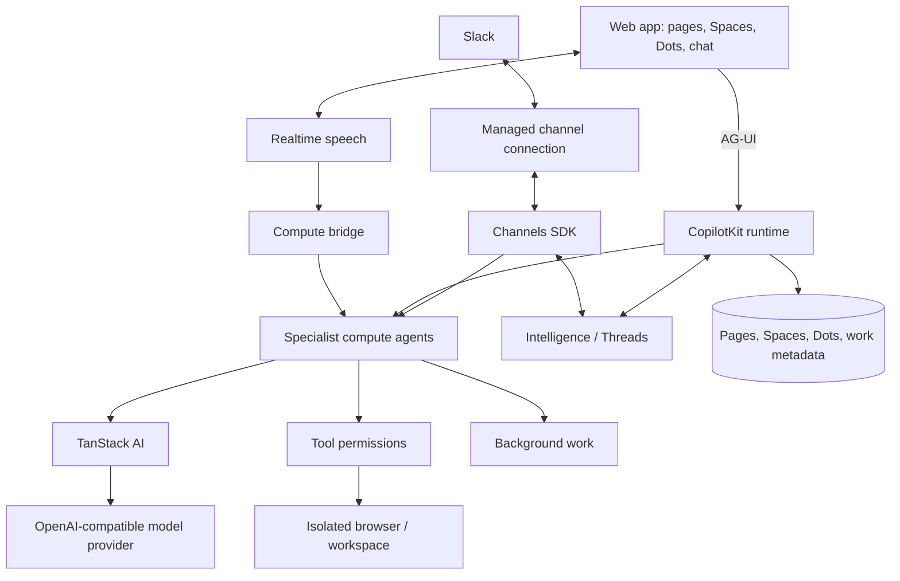
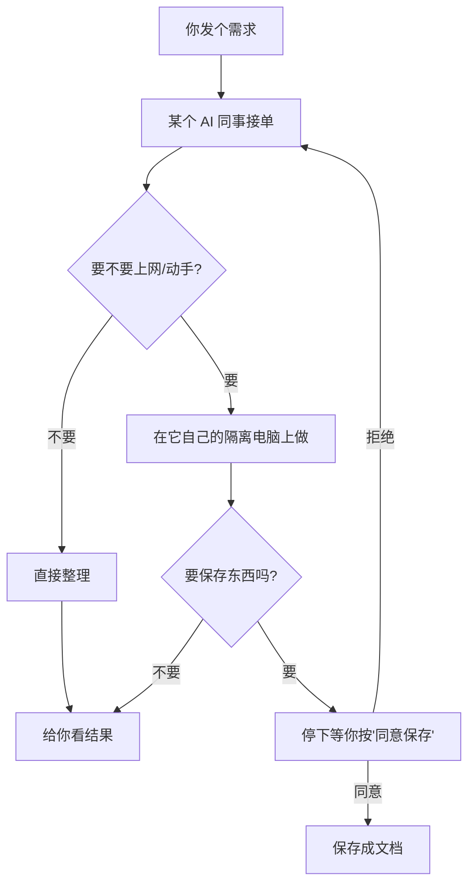

# 开源项目解读：它给每个 AI 同事都配了一台自己的电脑

先说点直白的话：**最近有一批 AI"小助手"，不再只是你问一句它答一句的聊天框，而是会"一直在那儿干活"的常驻小员工**。你给它一个目标，它会自己打开浏览器、翻资料、写文件、发消息，干完了再回来跟你汇报。

这几个小员工就是 2026 年 9 月底扎堆冒出来的"AI Agent"产品。其中有一个开源的，叫 **OpenDots**，很适合想看懂"这类东西怎么工作、普通人能不能用上"的人。下面先横向比比几个最火的，再单独把这个开源项目讲清楚。

---

## 一、先横向对比几个热门产品

最近火的常驻型 AI 小助手主要有四个：OpenAI 的 Dots、Meta 的 Muse、Instinct，还有一个开源的 OpenDots（就是这篇的主角）。它们分开看是这个区别：

| 比什么 | OpenAI Dots | Meta Muse | Instinct | OpenDots（这篇主角） |
| --- | --- | --- | --- | --- |
| 是什么 | OpenAI 出的常驻 AI 助手，偏办公 | Meta 出的生活管家 | 藏在 iMessage 里的私人助手 | 开源的 AI 助手模板，能自己搭 |
| 要不要花钱 | 要，最早 100 美元/月起，也有 500 美元档 | 免费（目前） | 免费（目前） | 软件免费开源，但要自己付模型和服务器钱 |
| 在哪用 | 电脑上的 App + 一个云端电脑 | 手机/电脑上的生活助手 | 就藏在你的 iMessage 里，没有新界面 | 自己电脑上跑，也能接 Slack、打电话 |
| 主要帮你干嘛 | 办公：改网站、整理文件、用专业软件 | 生活：购物、订旅行、发邮件 | 日常：想起来了就帮你顺手处理点事 | 办公+自己做：研究、写文档、跑脚本 |
| 每个助手有自己的"电脑"吗 | 有，一个独立的云端电脑 | 有，一个专用虚拟机 | 连的是你自己的手机/屏幕 | 有，每个助手一台隔离的小电脑 |

这几家各走各的路子：
- **OpenAI Dots**：像请了一个正式"员工"，能干专业活儿（还配了台公司的电脑给它），但收费高，而且感觉像是办公软件。
- **Meta Muse**：像个贴心的"生活秘书"，帮你购物、订票、发邮件，目前免费。
- **Instinct**：最"隐形"，就住在你手机短信里，你说句话它就去办了，不给你看花哨界面。
- **OpenDots**：别人的都是"帮你干"，它是"**代码全给你，你自己搭一套，想怎么用怎么用**"。别人家是请员工，它是给你一整套盖办公室的方法。

要说评测结论：**想省事、信大厂不放假的，用前三家；想自己掌控、不怕折腾的，OpenDots 最值**——因为它是开源免费的，而且每个助手都被"关"在自己的小电脑里，安全可控。

---

## 二、重点介绍 OpenDots：一个给你"AI 同事团队"的开源模板

### 它是什么？

**OpenDots 是一份开源的"AI 同事"搭建模板。** 你不用从零造轮子，把这个模板下载下来，配置一下，就能拥有一群"住"在你电脑上的 AI 小助手，每个都有名字、有分工、有自己的专用电脑。

它最特别的一点，概括起来就是：**每个 AI 助手的身边，都配了一台独立的小电脑**。这台小电脑跟你的电脑隔开，AI 在那上面自己开网页、存文件、敲命令，再怎么折腾也出不了那台小电脑，不会碰坏你自己电脑上的东西。

它是 MIT 开源协议（就是随便下载、随便改、商用也行），用现在很主流的 TypeScript 写的，GitHub 上约 2500 星。官方自己说它还是"初版模板"，不是成品服务——**你得自己来跑它、配置它**。

### 它是做什么用的？

概括起来：**帮你组建一支"随时在线、随叫随到"的 AI 小队**。每个 AI"同事"可以有不同的分工，比如：

- 一个专门**查资料**的助手，你让它去调研个话题，它自己上网搜、把来源链接整理给你。
- 一个专门**写东西**的助手，你把查到的材料给它，它帮你整理成一份能看的文档。
- 一个专门**看电脑干活**的助手，它有自己的小电脑，帮你开网页、整理文件、甚至跑个小脚本。

而且你不用一直守着它打字。它可以：
- **正常打字聊天**：像微信一样跟它对话。
- **打电话**：直接用语音跟它聊，它一边听你说话一边干活，忙完告诉你。
- **拉进 Slack（团队群聊软件）**：在群里@它，它就在那个群里接活。

每个人都像你办公桌上真实存在的同事——给了分工、给了权限，干完活向你汇报，重要的事先拿给你过目。

### 怎么用？（按步骤来就行）

它需要一点点技术基础（会复制粘贴命令行就行），步骤不长：

1. **装好环境**：电脑上装 Node.js 24 和一个包管理工具 npm。
2. **下载模板**：在命令行里输入 `git clone https://github.com/CopilotKit/OpenDots.git`，回车。
3. **安装依赖**：进入文件夹，输入 `npm ci`，让电脑把需要的零件下载好。
4. **复制配置**：输入 `cp .env.example .env`，生成一个配置文件。
5. **启动**：输入 `npm run dev`，然后浏览器打开 `http://127.0.0.1:5173`。

到这一步，你已经能看见一个工作台界面了：可以先建几个叫"Space"的文档区，写写笔记，把助手们添加进去。**哪怕还不连任何外部服务，光这些就能玩起来**。等想让它真正帮自己查资料、干活了，再往配置文件里填上你的模型（比如 OpenAI）的密钥就能聊天了。要是想接 Slack 或电话，官方给了对应的配置说明，跟着填就行。

**关键一点**：等它写完东西，它不会直接存——而是先"拿给你看"，你点"同意保存"它才存。它干活的时候你也可以随时暂停它、改它的权限。这就是普通人也能放心用的原因：**它再怎么自由，重要的一步永远有你把关**。

## 三、项目内部长什么样（想看细节的朋友看这里）

上面讲的是"它能干嘛"。下面这一段稍微具体一点，给想跟你一样"扒开看看里面是怎么组织的"的朋友。如果觉得这段偏技术，直接跳到第四节也一样能 get 到重点。

### 整体视图：谁在发号施令、谁在干活、靠什么落地

整个 OpenDots 可以看成四层互相配合的"人/部门"：

| 层 | 干什么 | 对应源码目录 |
| --- | --- | --- |
| **前端界面** | 你看到的页面：聊天窗口、文档编辑、Space 工作区、真人接管面板 | `src/client/` |
| **后端运行时** | 每个 AI"同事"的大脑 `DotAgent`，负责跑一轮、调度工具、检查权限 | `src/server/` |
| **隔离电脑（执行端）** | 每个助手自己的小电脑，开网页、存文件、跑命令都在这台隔离机里 | 走 OpenBot 容器，见 `deployment/` 与 `docs/COMPUTERS.md` |
| **持久存储** | 页面、Space、助手信息、后台工作状态 | `src/server/workspace.ts` + CopilotKit Threads/Intelligence |

关系就是：**前端发令 → 后端 `DotAgent` 执行 → 每台助手专用电脑落地 → 保存前先经真人审批**。

### 项目目录树：整个项目拆分成了这些块

这是项目根目录和主要子目录的结构（来自仓库本身）：

```text
OpenDots
├── README.md / LICENSE / SECURITY.md     # 说明、许可证、安全
├── Dockerfile / compose.yml              # 容器化部署
├── package.json / tsconfig.json          # 工程配置
├── public/                               # 静态资源（含每个助手的头像）
├── src/                                  # 核心代码
│   ├── browser/                          # 只读网页抓取服务（security/transport）
│   ├── client/                           # 前端：聊天、通话、文档、Space、真人接管
│   ├── server/                           # 后端：dot-agent、电脑服务、页面、语音、Slack
│   └── shared/                           # 前后端共用部分（如保存前审批）
├── tests/                                # 自动化测试（几十个用例）
├── docs/                                 # 使用文档（SETUP/COMPUTERS/演示）
└── deployment/                           # 电脑容器部署（supervisor 等）
```

想让电脑自动装好这套环境，仓库里还准备了 Docker 编排文件（`compose.yml`、`compose.computers.yml`），不想手动折腾依赖的可以直接用容器跑。

### 流程图：一次任务是怎么跑起来的

下面是项目 README 里的官方架构流程图（mermaid 图），换成直白表达就是：**你从网页 / Slack / 电话发起 → 运行时把活儿交给后端 → 后端调模型、开工具 → 该动手就用隔离电脑 → 存东西前先问你要不要**。



再简化成打工人的视角，一次"派活儿"大概是这样走一遍：



### 摘选 README 里的几段原文（补充说明）

下面几段直接来自项目 `README.md`，能帮你确认官方是怎么给自己定位的：

> **定位**（README 开篇）：*Always-on AI coworkers that move between text, calls, and Slack. An open-source template for persistent AI agents, each with its own computer.*

> **关于本质**（Overview 段）：*OpenDots is a starting point for building your own agent workspace. Clone it, define your Dots, connect your services, and adapt the interface and tools to your needs. A template, not a hosted product.* ——注意这句"**template, not a hosted product**"，它是在反复提醒你：这是给你搭的模板，不是替你管好的云服务。

> **保存前先审**（Review before saving 段）：*Ask a Dot to show a draft before saving it. ... pauses the conversation for Approve & save or Decline. Approval creates the page in an authorized Space.* ——这跟前面说的"写完先拿给你看，你同意才存"对应上了。

> **每个助手一台电脑**（Dot computers 段）：*Each Dot can have its own computer ... Its browser profile and workspace files persist across stop/start. The Computer panel exposes browser control, human takeover, files, terminal output, and activity.* ——助手的小电脑能记住状态，还能"真人接管"。

> **上手命令**（Get started 段，官方原文）：`git clone https://github.com/CopilotKit/OpenDots.git` → `npm ci` → `cp .env.example .env` → `npm run dev`，然后打开 `http://127.0.0.1:5173`。

## 四、个人想法 + 它能用到生活/工作的哪些地方

看到这里，你可能会想：这玩意儿到底对自己有啥用？发散着聊聊几个真实能用上的场景。

**如果你是普通上班族 / 学生：**
- **写周报、月报**：每周日把你一周的聊天记录随手丢给它，让它整理成一份能直接交的周报。
- **做资料整理**：让它上网查一个主题，把散落的资料收集起来带链接给你，省得自己一个个网页翻。
- **语音备忘录变文档**：开会或想到点子时，拿起电话跟它说几分钟，它帮你整理成一份有条理的笔记。

**如果你是做测试开发的（这也是这类 AI 同事最能发挥价值的地方）：**
- **让它当"测试助手"**：每天例行都要看的回归结果、测试报告，可以让它定时整理成摘要，盯着关键指标有没有异常，异常了提醒你。
- **管理测试环境 / 用例**：给它配好权限放在独立小电脑里，让它帮忙维护测试用例文档、整理历史回归记录，出了篓子能往回查。
- **它的小电脑隔离是测试最爱的点**：养过 AI 的都知道，让它瞎跑最怕碰乱环境。OpenDots 每个助手被关在自己独立的电脑里，跑坏了大不了重启那台，**绝不会污染你在用的正式环境**。这对做测试、做运维的人而言，是最大的安全感。
- **"写动作先给你审"刚好就是测试的验收思维**：AI 写的东西不是直接落库，而是先过你这一关。这跟测试里"上线前必过验收"是同一套逻辑——**先看证据再放行**。

**如果你在公司负责业务/运营/产品：**
- **给它分好工，当你的"数字员工"**：一个研究市场、一个整理竞品、一个管知识库，各干各的，互不干扰。
- **群聊里@它干活**：团队用 Slack 的，直接把它拉进频道，让它在群里接需求、交付成果，减少来回开会的碎活。

**说到底它是什么思路？** 它不追求"一次对话就解决问题"，而是追求"**有一群一直在那儿、可以随时叫、事事有交代的 AI 同事**"。对你个人，它是你省时间的私人心腹；对你所在的技术或业务团队，它是可以代理重复劳动的数字员工。唯一门槛是它需要你愿意花半小时把环境搭起来——但这半小时换回来的是一个完全听你自己的 AI 小队。

---

## 附：想动手试试

- **项目地址**：https://github.com/CopilotKit/OpenDots
- **上手文档**：克隆下来后看它自带的 `README.md` 和 `docs/` 目录，每一步都有说明。
- **适合人群**：会一点命令行、想自己拥有一套 AI 助手的人；做测试、运维、自动化、知识管理的技术朋友尤其会喜欢它的"隔离 + 人审"设计。

`#Agent` `#AI工具` `#开源` `#OpenDots` `#CopilotKit` `#效率工具` `#测试开发` `#AI助手`