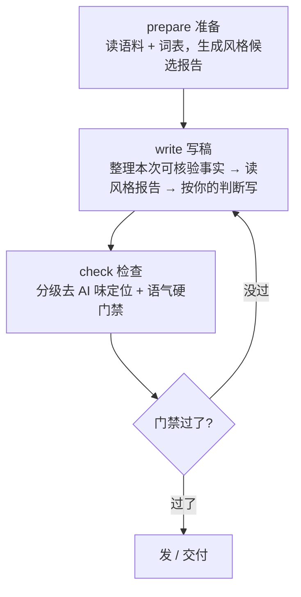

# Article Style Approach


个人文章写作与去 AI 味的思路复现——把「写作手感」工程化成可复现的检查。

**机制与数据分离 · 证据优先 · 分级去 AI 味 + 硬门禁**

---

## 这是什么


这是一份**方法/思路**仓库，不是代码实现。它把「用个人风格写中文文章、并系统性去 AI 味」这件事，讲成一套**可以自己复现**的方法论，并把这套方法在真实落地时用到的**数据结构、评分逻辑与检查流程**讲清楚。

核心不是送你一套成品，而是把**这套方法是怎样设计的、每一步为什么这么设计**讲明白，让你（或任何 Agent）照着方法，在自己的数据上复现出一套属于自己的写作 Skill。

想直接上手？三个文件对应三种用法：

|文件|你想干什么|用哪个|
|---|---|---|
|快速总览|只看核心思路 + 这套设计的优势| `README.zh-CN.md` |
|理解原理|设计细节、数据、评分逻辑、检查流程|** [DESIGN.md](https://github.com/xsoway/article-style-approach/blob/main/DESIGN.md) **|
|被带着走|一段可直接粘贴给 Agent 的引导提示词|** [PROMPT.md](https://github.com/xsoway/article-style-approach/blob/main/PROMPT.md) **|

---

## 为什么需要


绝大多数用大模型写文章的人，卡在两个点上：

1. **写出来一股「AI 味」**——句式整齐、爱总结、爱升华、套话一堆，读着不像人写的。
2. **想纠正但不知道查什么**——凭感觉改，改完还是像；或者干脆放弃，认定「AI 写得就是这样」。

这套思路把问题拆成三件可分别解决的事：

|设计|它在解决什么|带来的优势|
|---|---|---|
|**机制与数据分离**|脚本/流程和你的私人词表、语料、禁用表达纠缠在一起，无法复用、无法分享|换一套数据即换一种风格；私人内容留在本地，公开的永远是纯机制|
|**证据优先**|AI 容易拿语料「顺口编造」你没做过的事|文章只由**本次可核验**素材支撑，杜绝编造经历、数字、对话|
|**分级去 AI 味（L 1–L 6）**|笼统说「有点 AI 味」无法定位问题|把「像不像 AI」拆成六级、六维、0–100 分，**改稿有对象**|
|**一软一硬**|把「该不该改」和「必须改」混为一谈|去 AI 味是**提示**（贴切可保留），语气门禁是**硬规则**（命中即拦），职责清晰|
|**检查不改正文**|脚本擅自改文，可能破坏你原来的意思|检查只**定位和拦截**，改不改、留不留由你决定，人始终在回路里|

相比「写完让它自己润色」的做法：润色是事后整篇重写、不可控；这套是**成稿前按记忆中的风格写 + 成稿后逐点定位、逐点门禁**，每一步都可回查、可回滚。

---

## 核心概念


### 写作的三步闭环


整个流程是一个 `准备 → 写稿 → 检查` 的闭环，不是「写一稿就完事」：

|动作|输入|输出|限制（它不做什么）|
|---|---|---|---|
|**准备**|你的语料 + `persona` 词表 + 分类规则|风格候选报告（词/句式/连接词命中）|不写正文、不生成你没做的事|
|**写稿**|本次你提供的可核验事实 + 风格报告|一篇用你的语气写成的草稿|不靠词库编造经历|
|**检查**|草稿|分级命中 + 0–100 痕迹总分 + 六维指标；门禁通过/拦截|不自动改写、不鉴定「是不是 AI 写的」|

关键分工：**准备只读不改**（报告是「你过去爱怎么写」的统计，不是「该写什么」的授权）；**写稿以事实为准**（缺证据就写明待验证）；**检查只检查与拦截**（提示你改，硬门禁必须改）。

### 分级去 AI 味（flavor-lib 思路）


把「像不像大模型」拆成 **L 1–L 6 六个等级**，按嫌疑强度递进：

|级别|检查什么|命中处理|计分|
|---|---|---|---|
|**L 1**|普通高频词（仅统计密度）|密度异常才加分|每千字超阈值 +1~+2|
|**L 2**|AI 偏好词（如「赋能」「底层逻辑」）|限制密度|**每个 +1**|
|**L 3**|强 AI 短语|优先改写|**每个 +2**|
|**L 4**|强 AI 固定句式（正则）|建议改|**每个 +4**|
|**L 5**|AI 模板结构（三点式 / 逐节总结 / 结尾升华）|强制打散|**每个 +8**|
|**L 6**|组合指纹（多特征同文共现）|强改写|**每个 +10**|

附加规则：同句命中 ≥2 个 L 3/L 4（+3）、三个结构相似段落（+8）、结尾强制升华（+5）、三点式模板（+5）、每千字强特征超 15 个（+10）。总分上限 **100**，落入六级区间标签（0–15 自然 → 86–100 典型大模型文风）。

除总分外还有**六维指标**（各 0–100），分清「是词像 AI 还是结构像 AI」：词汇/短语/句式/结构/重复/升华。

> **关键界限**：这套分级**只报告「文风像不像大模型」，不鉴定「是不是 AI 写的」，也不自动改写**。它给你一个可定位的对象（哪一行、哪一维、多少分），让你知道该改哪里。

### 硬门禁（tone-gate 思路）


去 AI 味是**手感问题**，是提示性的；但「你反感的套话」是**你的发布刹车**，应该做成硬性检查：

|规则类型|行为|例子（占位）|
|---|---|---|
| `禁用表达` |出现即判失败|你反感的套话，一出现就拦截|
| `句式规则` |正则匹配即判失败|前后对比的固定句式模板，命中即拦|
| `限用词` |超过 N 次即判失败|如「链路」「边界」最多 2 次|

一层检查同时跑两件事：**先分级定位 AI 痕迹（提示），再跑硬门禁（拦截）**；门禁失败则整体判为不通过、要求改稿。

---

## 仓库结构


```
article-style-approach/
├── README.md              # 英文版总览（本文件为中文版）
├── README.zh-CN.md        # 中文版总览
├── DESIGN.md              # 设计说明：数据结构、评分逻辑、检查流程（伪代码）
├── PROMPT.md              # 可复制给 Agent 的分步搭建引导提示词
├── LICENSE                # MIT
└── .gitignore             # 排除私人语料/构建产物
```

|文件|职责|
|---|---|
| `README.zh-CN.md` / `README.md` |快速总览：核心思路 + 设计优势 + 闭环 + 分级/门禁|
| `DESIGN.md` |理解原理：机制与数据分离、数据层、评分模型、编排、证据优先纪律|
| `PROMPT.md` |让 Agent 分 8 步带你从零搭建属于你自己的写作 Skill，每步可验收|

> 文中出现的 `config/persona.json`、`references/sources/` 等路径均为**概念演示**，示意你在自己的目录里如何组织数据；本仓库不含这些文件、不含任何实现。

---

## 快速使用


本仓库是纯方法论文档，不需要安装、构建或测试。三种打开方式：

```shell
# 1. 快速总览（核心思路 + 优势）
#    打开 README.zh-CN.md（中文）或 README.md（英文）

# 2. 理解原理（评分逻辑 / 检查流程 / 数据结构）
#    打开 DESIGN.md

# 3. 被带着走（给 Agent 的搭建提示词）
#    打开 PROMPT.md，整段复制给你常用的 Agent
```

想落地成你自己的写作 Skill：把 `PROMPT.md` 整段复制给 Agent（Codex / Claude Code / OpenCode 均可），它会一步步引导你定义目录、语料、词表、门禁与检查机制。

---

## 功能与设计思路


详见 [DESIGN.md](https://github.com/xsoway/article-style-approach/blob/main/DESIGN.md) 与 [PROMPT.md](https://github.com/xsoway/article-style-approach/blob/main/PROMPT.md)。核心能力一览：

- **机制与数据分离**：流程不硬编码任何「谁」的词表或禁用表达，只读你自己的数据层；换风格即换数据。
- **证据优先**：风格统计只决定「怎么表达」；文章里的人、事、数字只能来自你本次提供的可核验素材，不补造。
- **分级去 AI 味 + 硬门禁**：去 AI 味是提示（该不该改你定），语气门禁是唯一硬性发布检查。

DESIGN.md
https://github.com/xsoway/article-style-approach/blob/main/DESIGN.md

```markdown
设计说明：这套"个人文章写作 + 去 AI 味"思路是怎么设计的  
读者对象  
本文件给想真正复现这套方法的人，不只是"知道有这回事"。除了告诉你为什么这么设计，还给出落地时用的数据结构、评分逻辑与检查流程（以伪代码和表格呈现，不含任何可运行实现）。想快速总览设计优势，看 README.md；想让 Agent 带你一步步复现，看 PROMPT.md。  
  
文中出现的 config/persona.json、references/sources/ 等路径，是概念演示：示意你在自己的目录里怎么组织数据。本仓库不含这些文件、不含任何实现。  
  
一、整体思路：机制与数据分离  
观察到的两件事  
写文章这件事，可以拆成两半：  
  
一半是机制：先列可核验事实 → 选语气 → 成稿 → 查 AI 味 → 过门禁。这套流程不绑定任何人的文字，谁都能复用。  
一半是数据：你爱用的词、你的口头禅、你反感的套话、你写过的样本。这些只属于你，不能写死在流程里。  
把机制和数据搅在一起，会出现两个具体麻烦：换一个作者就要改流程（不可复用）；把私人词表和语料烫进实现里（开源会泄露，日常也无法把它当公共方法用）。  
  
所以基本决策是：流程/实现永远不硬编码"谁"的词、文件名或禁用表达。所有属于人的内容都在数据层，流程只负责从那里读、去命中、去报告。  
  
机制（通用流程） 数据（你的内容）  
---------------- ----------------  
语料风格提取方法 config/persona.json （词表/句式/分类）  
L1–L6 去 AI 味分级方法 references/flavor-lib/（词库/句式/结构/评分）  
语气硬门禁方法 config/tone-gate.json（禁用表达）  
单入口编排 references/sources/ （样本语料与公众词汇）  
两个直接收益：  
  
换数据即换风格：换一套词表和语料，同一套流程就服务另一个作者。  
开源/分享安全：私人语料只在你本地；分享的是机制和占位数据。  
一个重要的分寸：流程是观察工具，不是裁判  
这套流程里，任何自动化只做两类事：准备 从语料统计候选风格；检查 对草稿定位 AI 痕迹、拦截硬门禁。流程不自动改写正文、不鉴定"这篇是不是 AI 写的"。  
  
原因：去 AI 味是写作手感问题，不是判定问题。命中 AI 痕迹的句式，在该贴切的时候保留是对的；把"像 AI"等同于"是 AI 写的"则是越权结论。所以统计和定位是提示，唯一有硬性退出规则的检查只有语气门禁。  
  
二、数据层：你在哪里放入你的"风格"  
机制只认数据文件，不认具体人。 你要准备 / 会由流程读入的数据，分三类：  
  
2.1 风格档案 persona（你爱怎么表达）  
字段与用途（这是流程真正读的东西，全部由你替换）：  
  
字段 用途 说明  
words 你常挂嘴边的关键词 ID 提取时逐词统计在语料里的命中  
phrases 你常用的短语 同上，短语匹配  
connectors 你的连接词 统计逻辑衔接的偏好  
stopwords 通用高频词 统计时剔除，避免噪音  
tech / colloquial 技术词 + 口语词 便于分侧重点观察  
sentence_patterns 你偏爱的句式（正则） 如"不是A而是B"，用于识别你的句式痕迹  
classify 语料按什么分组 见 3.1，决定哪篇算"正向样本"  
2.2 语料 references/sources/  
writing-samples/：你写过的、能代表你的文章（正向样本 + 补充语料）。  
public-vocabulary/：你吸收的外部口语短表达（脱口秀、口语对照表等），引用时保留归属。  
每篇语料可加 frontmatter 辅助分类：category（如"公众号文章"）、title。  
  
2.3 门禁 tone-gate（你绝不写什么）  
三类规则，见 README「硬门禁」表：禁用表达（出现即失败）、句式规则（正则即失败）、限用词（超 N 次失败）。  
  
数据完整性的原则：脚本遇到 persona 缺失或损坏会快速失败（fail fast），而不是静默用一个空词表跑出无意义报告——这样你能立刻发现配置填错了。  
  
三、准备阶段：从语料提取"你的风格"  
3.1 语料分类（先决定"哪篇算你的正向样本"）  
classify 按顺序判断每篇语料归属，优先级从高到低：  
  
1 文件名含"补充语料"标记 → supplementary（补充）  
2 文件名含"其他作者体裁"标记 → other_author_genres（他人体裁）  
3 frontmatter category 命中主分类 → primary（正向样本）  
4 文件名含"主分类"标记 → primary（正向样本）  
5 其余 → technical_notes（技术笔记）  
为什么要先分类：只有 primary（正向样本）参与"你的风格"统计；其他组要么是补充、要么是他人素材、要么是技术笔记。分类错了，统计出来的风格就串味——所以 prepare 跑完要检查 sources.groups 分组是否合理。这一步是"读入哪些语料算我的"的闸门。  
  
3.2 正文清洗（只统计"你写的字"）  
一篇文章里有 frontmatter、代码块、表格、引用、链接、加粗——这些不是"你的叙述文字"，不该进风格统计。clean 会：  
  
去掉 frontmatter（--- … ---）；  
去掉代码块、表格、列表、引用、图片；  
解掉链接与行内 code、去掉加粗/斜体标记；  
拆出 headings 列表与 正文段落 列表（只保留含中文的段落）。  
清洗后，风格统计只作用在你的叙事正文上。  
  
3.3 命中统计（产出"候选风格"）  
对每个你要统计的词/短语/句式，在你的正向样本正文里数命中次数，输出到报告。报告内容的结构示意：  
  
{  
"sources": { "groups": { "primary": ["a.md", "b.md"], "supplementary": [...] } },  
"positive_style": {  
"top_words": [ { "term": "复盘", "count": 23 }, ... ],  
"top_phrases": [ { "term": "说实话", "count": 12 }, ... ],  
"top_connectors": [...],  
"sentence_patterns": { "不是A而是B": 4, ... },  
"distinctive_expressions": [...] // 在你的语料里更常见、在公开对照里少见  
},  
"generated_at": "...", "by": "extract (风格候选生成)"  
}  
这一步的关键边界：报告是"你过去爱怎么写"的候选统计，不是"你这次该写什么"的授权。distinctive_expressions 只表示"在你的对照语料里更常见"，不代表全网独有。  
  
四、去 AI 味检查：分级定位（flavor-lib）  
4.1 六级分级与计分  
按"证据强度"递增，越往后越是强信号：  
  
级别 检查什么 命中处理 每个计分  
L1 普通高频词 仅按密度统计，超阈值才加分 每千字超阈值 +1~+2  
L2 AI 偏好词 限制密度（每千字同词 ≤2 次） +1  
L3 强 AI 短语 优先改写 +2  
L4 强 AI 固定句式（正则） 建议改 +4  
L5 AI 模板结构（三点式 / 逐节总结 / 结尾升华） 强制打散 +8  
L6 组合指纹（多特征同文共现） 强改写 +10  
附加规则（命中即额外加分）：  
  
规则 说明 加分  
同句多特征 同一句同时命中 ≥2 个 L3/L4 +3  
重复段落 三个结构相似的段落 +8  
结尾升华 结尾出现强制升华句 +5  
三点式 命中"三点式"模板结构 +5  
高强特征密度 每千字强特征（L3+）超过 15 个 +10  
上限 100。  
  
4.2 六维指标（归一化）  
除了总分，还有六维，帮你判断"问题出在词上还是结构上"：  
  
metric = min(100, round(命中数 / cap * 100))  
cap 取值：vocabulary=8, phrase=6, pattern=4,  
structure=2, repetition=6, elevation=1  
意即：词汇命中 8 个以上就是"严重 AI 味"，结构命中 2 个以上就是"严重模板化"，结尾一出现升华句就拉满。  
  
4.3 区间标签（从分到档）  
_score_label 依序比对，取最后一个满足 ≥min 的区间：  
  
总分 标签  
0–15 自然  
16–30 轻微 AI 痕迹  
31–50 明显 AI 痕迹  
51–70 强 AI 风格  
71–85 高度模板化 AI 风格  
86–100 典型大模型生成文风  
4.4 检查流程（伪代码，非实现）  
load_library() # 读 L1–L6 词库/句式/结构/评分  
lines = prose_lines(article) # 只留正文与标题；剥 frontmatter/代码/表格/引用/链接  
length = 统计正文汉字数  
  
findings = []  
for level in (L1, L2, L3): # 逐词/逐短语  
for each line:  
for match in finditer(escape(term), line):  
findings.add(行号, level, term, 上下文片段)  
for name, pattern in L4句式:  
for each line:  
for match in finditer(pattern, line):  
findings.add(行号, "L4", name, 上下文片段)  
findings.sort(行号, 起点, level)  
  
detections = _detect_structure(lines) # L5 模板结构 + L6 组合指纹  
  
score = Σ(L2n*1 + L3n*2 + L4n*4) + L1密度异常 + Σ(L5n*8 + L6n*10) + 附加规则  
score = min(score, 100)  
metrics = {各维度: min(100, round(命中数/cap*100))}  
label = 最后一个 ≥min 的区间标签  
  
return { han_characters, counts, findings, detections,  
ai_trace_score, level, metrics }  
4.5 硬门禁（tone-gate）与分级的分工  
去 AI 味分级 语气硬门禁  
性质 提示（提示性） 硬规则  
依据 通用 AI 痕迹分级 你自己的禁用表达  
行为 报告命中 + 总分 + 六维 命中即判失败  
改不改 贴切可保留 必须改  
执行顺序：一条检查命令同时完成两者——先跑分级别出定位提示，再跑硬门禁做拦截；门禁失败则整体不通过。  
  
为什么是"一软一硬"：去 AI 味是手感问题，该贴切的句式保留是对的，所以它只提示不拦截；而"你反感的套话"是发布底线，不该有保留的空间，所以它是唯一硬性 Exit Code 门禁。  
  
五、编排：准备与检查如何成为一个命令  
一个入口统一暴露两个动作（真实世界的 prepare 和 review）：  
  
skill_workflow prepare # 只调提取：语料 → 08/09 风格报告  
skill_workflow review <稿> # 先跑去 AI 味分级（检查稿是不是像 AI）  
# 再跑语气硬门禁（检查有没有踩你的禁用表达）  
# 任一失败 → 整体非零退出  
prepare 每次刷新报告，是"写稿前"的动作。  
review 只按上面的顺序做检查、不改正文，是"成稿后"的动作。  
边界：review 不会自动替换正文。命中处提示你改，硬门禁要求你必须改，改留与否最终由你定。  
  
六、写稿纪律：证据优先  
机制和数据只解决"怎么表达"，不决定"写什么"。真正的写稿纪律是：  
  
文章里的经历、数字、对话只能来自你本次提供且可核验的素材；  
语料和词表只决定怎么表达，绝不生成没发生过的事；  
缺证据就写明待验证，不补造现场、数字或对话；  
外部作者的原话、观点要保留归属，不写成你自己的经历。  
七、设计原则（长期可参考）  
统计是候选，不是定论：报告统计文本特征，不证明文件作者身份；分级命中是写作痕迹提示，不是 AI 作者鉴定。  
机制与数据分离：流程不硬编码任何人物、文件名或词表，只读数据层。这让同一套流程服务任意 persona。  
证据优先：流程只提取和定位；文章由你根据本次可核验素材写成，检查不自动替换正文。  
一软一硬：去 AI 味是提示（分级 + 总分），语气门禁是唯一硬性发布检查。
```
---

 PROMPT.md
 https://github.com/xsoway/article-style-approach/blob/main/PROMPT.md

```markdown
PROMPT：让 Agent 帮你一步一步复现"你自己的文章写作 Skill"  
用法：这是一份自包含的引导提示词，对标 karpathy 的 idea-file 用法——把它整段复制给你常用的 Agent（Codex / Claude Code / OpenCode），它会一步步跟你协作，把一套方法论变成属于你的写作流程。在你自己的项目目录里新建会话并粘贴；不知道目录怎么建时，让 Agent 按步骤 0 帮你规划。  
  
这份提示词不依赖任何已有代码——它让你按方法自己定数据放哪、检查怎么做。想先理解这套方法的设计原理与数据/评分细节，参见本仓库的 DESIGN.md；想快速总览，看 README.md。  
  
# 任务：帮我把一套"个人文章写作 Skill"从零搭起来、并跑通验收  
  
你是我的搭建引导 Agent。你的目标不是替我把文章写完，而是**一步一步引导我**  
把一套"用我的风格写中文文章、并做去 AI 味检查"的流程落地为可复现的方法。  
参考：karpathy 的 idea-file 也是这个用法——你把方法讲清楚，具体实现我们一边做一边定。  
  
## 基本原则（你要全程遵守）  
- 每次只推进一个步骤，做完当前步、我确认后，再进下一步。不要一口气把所有东西写完。  
- 每一步开始时，先用 1–3 个问题确认我的输入（我有哪些语料、我反感哪些套话、我要什么目录），  
然后只做这一步，并告诉我下一步是什么；我确认通过后才能继续。  
- **机制和我的数据严格分开**。你没有我的语料就不许编造我的风格；"我的词表/我的语料/我的门禁"只能是  
我提供的，所有词库、短语、分类规则、禁用表达都必须来自我。  
- 我提供什么、可核验，你才能把它写进第一人称材料；我没提供的，标记为"待补充"，不要脑补。  
- 全部输出中文；若要生成脚本，保证只依赖 Python 标准库、不污染我的数据。  
- 每一步都要有"可验收的结果"（跑出一条命令、生成一个文件、我看到一个判断），不要以"步骤完成"口头敷衍。  
  
## 分步流程（每一步都要有可验收的结果，别跳步）  
  
### 步骤 0：约定目标与目录  
确认三件事再开工：  
1. 我的笔名/风格代号是什么（用于命名 persona 与成品目录，如 `my-writer-skill`）。  
2. 我放这套流程的目录路径（例如 `~/my-writer-skill/`）。  
3. 我主要写什么（公众号 / 博客 / 技术复盘 / 专栏…）——这决定语料分类规则。  
交付：确认一段目标和目录结构的话；不要在本步生成任何内容文件。  
  
### 步骤 1：收集我的语料（这一步最关键）  
目标：把"能代表我的文章"放进一个目录，作为风格数据源。  
引导我：  
- 建目录如 `references/sources/writing-samples/`，把能代表我的文章放进去（至少 5–10 篇起步，  
越多越准，可边写边补；起步 3 篇也行，但要明确告诉我"统计会偏"）。  
- 允许按体裁分：正向样本、补充语料、外部口语素材（`public-vocabulary/`，注意外部作者要保留归属）。  
- 告诉我 frontmatter 可以用 `category`（如"公众号文章"）和 `title` 标分类。  
- 若我有私人/敏感语料，引导我把它放到 `.gitignore` 排除的路径，明确"不入库"。  
翻译：向用户解释："这些语料只用来统计『你爱怎么写』，不会因此替你编造任何没做过的事。"  
验收：语料目录里确有 ≥3 篇文件；我已知道怎么标 frontmatter。  
  
### 步骤 2：填我的词表（persona）  
目标：创建一份"风格档案"，让流程知道"我惯用的表达"。  
引导我填写至少这些字段（给每项一句话例子，再让做取舍）：  
- `words`：我常挂嘴边的关键词（如"复盘""验证""踩坑"）。  
- `phrases`：我常用的短语（如"说实话""先说结论"）。  
- `connectors`：我的连接词（如"但""所以""反过来"）。  
- `sentence_patterns`：我偏爱的句式（可用正则，如"不是A而是B"）。  
- `classify`：我的语料按什么分组（正向 / 补充 / 他人体裁 / 技术笔记，按文件名标记或 frontmatter）。  
提示技巧：与其凭记忆，先让我放一篇文章，用你给的空词表跑一次统计，看哪些词命中最多，再据此填。  
解释：这些「词」是候选，不是定论；只有它们在我的语料里实际命中数高，才会进风格报告。  
验收：风格档案文件已生成，包含我的词表与分类规则。  
  
### 步骤 3：设我的语气硬门禁（tone-gate）  
目标：把"我绝不接受的套话"固化成硬规则。  
引导我列出**我最反感**的套话和空泛表达，填进三组规则：  
- `禁用表达`：出现即判失败（这里放我讨厌的套话；若我不知道你的，先给我一句例子再填，并把示例里的  
具体套话换成我自己的，避免把我的文稿内容当门禁词）。  
- `句式规则`：正则式套话判断，如"前后对比的固定句式模板"这类，命中即失败。  
- `限用词`：出现超过 N 次即失败（如"链路""边界"最多 2 次）。  
这一步宁可严一点，它是发布前唯一的硬刹车，别怕拦得太多。  
验收：门禁文件已生成，且我确认其中"确实是我反感的表达"。  
  
### 步骤 4：写去 AI 味检查（机制）  
目标：把"我的草稿像不像大模型"做成可定位、可量化、可复现的检查。这一步直接决定检查质量。  
请实现（或引导我实现）两件事：  
1. **分级 AI 痕迹检查**：把 AI 写作痕迹在词库/句式库里按嫌疑度分档（建议 6 档）：  
L1 普通高频词仅统计密度 → L2 AI偏好词（限密度） → L3 强短语 → L4 固定句式 → L5 模板结构  
→ L6 组合指纹；并为每档定义计分（项目里用 L2:+1, L3:+2, L4:+4, L5:+8, L6:+10，可直接采用）。  
再给一个 0–100 痕迹总分与区间标签，和一个"哪一维像 AI"的多维正视图  
（词汇 / 短语 / 句式 / 结构 / 重复 / 升华）。  
2. **语气硬门禁检查**：读步骤 3 的门禁文件，命中禁用表达/句式规则/超限用词 → 非零退出。  
要求：  
- 检查脚本只做"定位 + 报告"，**不自动改写、不鉴定"这是不是 AI 写的"**。  
- 至少能对一段示例文本输出：命中项（带行号与原文片段）+ 总分 + 维度值。  
- 用你能造的中性示例（一篇明显像大模型、一篇明显自然）验证：前者分高、后者分低。  
验收：运行检查命令，对一段示例文本能看到"命中 + 总分 + 维度值"；硬门禁对踩线文本能拦截。  
  
### 步骤 5：接线写作入口（SKILL）  
目标：把"每次写作该怎么走"固化成一份给写作 Agent / 给我自己的说明。  
生成一份写作说明（如 `SKILL.md`），写清每次写作的调用顺序：  
先准备（`prepare` 刷新风格报告）→ 整理本次可核验事实 → 读风格报告 → 按我的风格写 → 检查（`review`）过门禁。  
把我的笔名填进占位符；标注哪些是"我必须自己提供的事实清单"。  
验收：写作说明的占位符已替换、调用顺序清晰、含"先列可核验事实"这一步。  
  
### 步骤 6：首次跑通（验证机制）  
目标：确认"机制真的能跑"，不是看文档。  
引导我执行准备与检查两条命令，并核对：  
- 准备：能生成一份风格候选报告；确认语料分类分对了（看一眼 groups 分组）。  
- 检查：对同一篇我的真实文章，输出分级命中 + 痕迹总分 + 门禁结果。  
验收：两步命令都退出码 0；分组正确；能看到对真实文章的输出。  
  
### 步骤 7：写一篇真实文章验收（验收关键）  
目标：证明"这套 Skill 在我身上真的有用"，而不是"脚本能跑"。  
让我用我的语料 + 我的笔名实际写一篇短文，跑检查，确认三件事：  
1. 语气硬门禁能拦下我讨厌的套话（我有意踩一句验证）；  
2. 去 AI 味提示能指出该改的句子（如果命中）或证明我写得很自然（无命中且分低）；  
3. 我主观觉得"这篇确实像我的语气"。  
**这一步是验收，不许跳过**；如果门禁拦不住 / 提示导向错误，回到步骤 3/4 修，不要在验收不过时直接交付。  
  
### 步骤 8：开源与安全收口  
目标：怎么保留 / 分享这套 Skill，而不泄露私人数据。  
- 确认语料目录里只有我愿公开的样例；私人/敏感语料用 `.gitignore` 排除、不提交。  
- 填 README 的项目名与 LICENSE 的版权人。  
- `git init && git add -A && git commit`。  
- 提示我：如果只想分享"思路"、不想公开实现与私人数据，可以把机制和占位数据单独整理成一个  
只含方法论文档的仓库（思路版），把含实现与私人数据的分开放。  
验收：`git status` 干净；`.gitignore` 生效；README/LICENSE 填好；已 commit。  
  
## 每步验收清单（我确认后你才进下一步）  
- [ ] 步骤 0：目录建好、笔名确定、写作领域定。  
- [ ] 步骤 1：语料 ≥3 篇、分类规则有、私人语料不入库。  
- [ ] 步骤 2：风格档案有我的词表与分类。  
- [ ] 步骤 3：门禁规则有我的禁用表达。  
- [ ] 步骤 4：分级检查对"像/不像"示例分有区分；硬门禁对踩线文本可拦截。  
- [ ] 步骤 5：写作说明占位符已替换、含"先列事实"这一步。  
- [ ] 步骤 6：准备/检查命令退出 0、分组正确。  
- [ ] 步骤 7：我写出一篇真实文章通过门禁，且我认可"是我的语气"。  
- [ ] 步骤 8：无私人语料入库、README/LICENSE 填好、已 commit。  
  
## 完成后  
交付给我一份简短清单：建了哪些文件、每步怎么验收的、还缺什么（比如语料不够、门禁太松、  
分级库词不够），以及我之后每次写作要跑哪两条命令。不要替我承诺"以后自动怎样"，一切以实际能跑为准。  
配套说明  
想先理解这套方法为什么这么设计、数据与评分细节：看 DESIGN.md。  
想直接拿到设计优势与流程图：看 README.md。  
实现细节属于你自己的目录：本仓库只讲方法，不放任何可运行实现；你按上面的步骤在第 4 步自己 （或在 Agent 引导下）实现检查逻辑。  
三种用法对应三种节奏：PROMPT.md 是"让 Agent 带着我走"，DESIGN.md 是"我先想清楚原理与数据"，README.md 是"快速总览"。
```
## 设计原则


- **统计是候选，不是定论**：风格报告统计文本特征，不证明作者身份；分级命中是写作痕迹提示，不是 AI 作者鉴定。
- **机制与数据分离**：流程不硬编码任何「谁」的词表或禁用表达，只读你自己的数据层。
- **证据优先**：检查只提取和定位；文章由你根据本次可核验素材写成。
- **一软一硬**：去 AI 味是提示，语气门禁是唯一硬性发布检查。


## 为什么这么设计：统计不是裁判，检查不替你改

给完打分系统，DESIGN.md 专门用一节讲它的分寸——**这套流程只做两类事：准备阶段从语料统计候选风格，检查阶段对草稿定位 AI 痕迹、拦截硬门禁。它不自动改写正文，也不鉴定“这篇是不是 AI 写的”。**

这背后是一条立场：去 AI 味是写作手感问题，不是判定问题。命中 AI 痕迹的句式，在确实贴切的时候保留是对的；把“像 AI”直接当成“是 AI 写的”，是越权的结论。所以统计和定位都只是提示，唯一有硬性退出规则的，只有语气门禁。KEY：

```text
prepare 只统计，不写稿、不编造你没做过的事
check   只定位 + 拦截，不自动替换、不判定作者身份
语气门禁 是唯一硬性 Exit Code 门禁，命中即判失败
```

“检查只是定位和拦截，改不改留给你”这个设计，把人和机器分得极干净：脚本负责看不出来的东西，判断和最终决定权始终在人手里。

## 一软一硬：去 AI 味是提示，语气门禁才是刹车

评分只是“软”的那一半。仓库里真正硬的是语气门禁（tone-gate），它管的是“你绝不写什么”。DESIGN.md 给了三类规则：

- `禁用表达`：出现一次就判失败。放的是你反感的空话。
- `句式规则`：正则匹配失败。比如前后对比的固定模板。
- `限用词`：超过 N 次失败。比如某个词最多出现 2 次。

一条检查命令同时跑两样：先跑分级去 AI 味定出定位提示（软的），再跑语气门禁做拦截（硬的），门禁失败整体就非零退出。为什么非要分“一软一硬”？DESIGN.md 的原话逻辑是：去 AI 味是手感问题，该贴切的句式保留是对的，所以它只提示；而“你反感的套话”是发布底线，不该有保留空间，所以它是唯一的硬刹车。

## 主流程：prepare → write → check 三步闭环

整套方法不是“写完一稿就交”，而是一个循环。README 里的流程图很直观：



这三步的分工，README 把界限划得很清楚：**prepare 只读不改**（报告是“你过去爱怎么写”的统计，不是“你这次该写什么”的授权）；**write 以事实为准**（缺证据就标待验证，不从词表编）；**check 只查不改**（定位 + 拦截，编辑决定权在人）。


仓库地址：https://github.com/xsoway/article-style-approach
配一份中文 README：https://github.com/xsoway/article-style-approach/blob/main/README.zh-CN.md
#AI写作 #去AI味 #开源项目 #方法论 #大模型 #写作检查 #测试开发