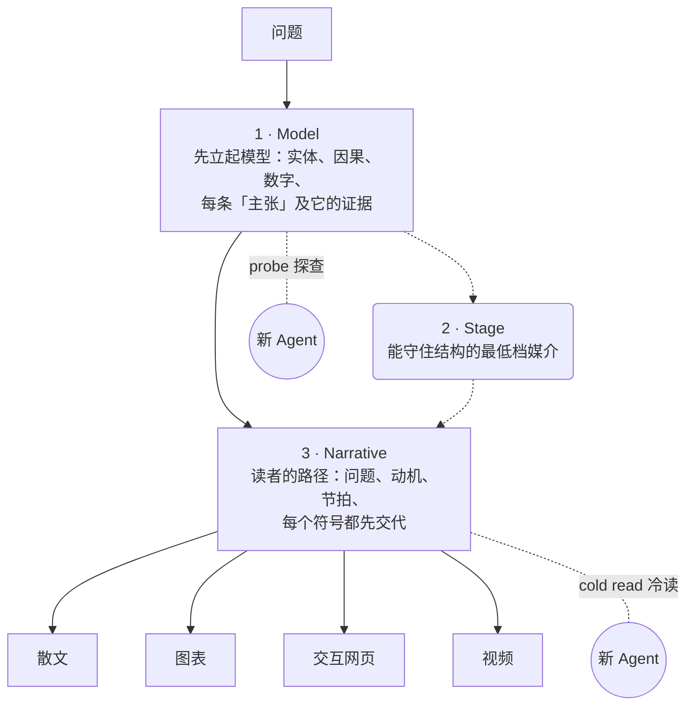

# 理解 LLM 输出的四层格式：从受控语言到解释视频

有个判断现在越来越站得住：往后真正费力的不是让大模型干活，而是弄懂它到底干了什么。因为模型越来越强，越来越多活它自己就做完了，人的工作沉到上面，变成监督和理解。

那怎么理解？一份流传很广的思路给出了一条由易到难的台阶：先是**受控语言**把文字写干净，再是**图表**，再是**网页**，最后是**解释视频**。每一层都比上一层更吃力，但也更好读。这套想法有具体的落地工具，而且有两个仓库把它做成了能开关的东西。这篇就把这条台阶和两个仓库讲清楚。

## 台阶第一级：让 LLM 说「被限定的话」

这一层用的是 **ASD-STE100**，一个受控语言规范。它最早是航空航天行业为维修文档定的：一个词只准有固定含义、只用主动语态、只用简单时态、一句话只说一件事、句子要短、不许省略会导致歧义的词。目的很直白——飞机维修手册不能被读岔，读了岔是要出人命的。

为什么这种「苛刻」现在反而有用？因为读你输出的对象变了。以前是人读，人有退路，看不懂可以回问。现在越来越多是**另一个 AI**在被解析的输出：工具描述、错误信息、Agent 之间的指令，中间没有任何人能替它问一句「你说的是 X 还是 Y？」。一个航空机械师读懂扭矩规格的规则，恰好也是一个下游 Agent 读懂工具描述需要的规则——同一套纪律，换了一个没有回声通道的读者。

## 一个仓库把这个想法做成了 skill

GitHub 上的 `danyuchn/asd-ste100-skill`（3532 star，MIT）把 STE 改造成一个 Claude Code 的 skill，专门用来重写「含糊、容易被读岔」的、面向 Agent 的英文。仓库很小：一份 `SKILL.md`、一份 `references/writing-rules.md` 规则汇总、一个 `examples/before-after.md`、一个 linter `scripts/ste-lint.py`。

它做什么：选模式（**Strict** 覆盖流程、错误信息、工具描述；**STE-flavored** 覆盖 README、PR 描述这类更自由的文字，保留句式纪律但不管死词表）→ 通读原文拿住意思 → 逐句标出违规（含混用词、被动语态、一句话塞多件事、超长名词堆、长句、违禁副词等）→ 逐句重写，**不丢原文任何事实、条件或限定词**——如果压缩会损失精度，它宁可保留长句并标出这是个取舍，而不是擅自简化 → 只输出改写结果，不加开场白和总结，但会留一行 `Kept as-is:` 说明哪些是故意不动的。

有些人会觉得 STE 太死板，所以作者自己也松过一档。`asd-ste100-skill` 的 README 说得很清楚：它只修**形式**，不修**内容**——一段没话可说的话，改完是又短又干净，但还是空的。

这套项目有个内行的克制：它**没有**复刻 ASD 官方那约 900 词的核准词表。词表免费但禁止随意转载，Issue 9 规定只有拿到 ASD 书面授权或属于八类机构才能重制。所以这个 skill 只落地「用最朴素的词、且每次用法一致」这条**原则**，不查固定词表。真要做认证级 STE 文档，去用官方标准。

## 但台阶真正的价值在 Explainer 这个仓库

只停在「写干净文字」这一级其实还不够。那份流传思路的关键主张是：**格式越丰富，理解成本越低**。与其用文字，不如让模型画图；比画图更省力的是要一个能点的交互网页；比网页更省力的是要一段像 3Blue1Brown 那样边画边讲的解释视频。


先看它是什么。它是一个「解释编译器」：你问「某样东西怎么运作」，它按四档输出。

| 档位 | 什么时候用 | 特征 |
| --- | --- | --- |
| 1 · Prose（精炼文字） | 流程、定义、论证 | 五句话能说清，就是五句话，绝不多写 |
| 2 · Diagram（图表） | 结构、流程、架构 | 读者要同时 hold 住 3 个以上关系时升级 |
| 3 · Interactive（交互网页） | 参数、场景、逐层下钻 | 需要读者自己探索状态或分支时升级 |
| 4 · Video（解释视频） | 随时间变化的过程 | 理解依赖「看见 A 变成 B」，如 softmax 温度从 1 降到 0.5 时数值怎么散开 |

它的写作风格就是上面第一级的 STE，作者取名叫 **STE-80**——应用大约 80% 的 STE 规则，跳过词表检查。剩下那 20% 留给「解释力」：一个精确术语可以保留但要定义一次，原因要留在句子里跟着效果走。典型例子：

> ~~确保液压油箱在开始操作前已补足燃油是当务之急。~~
> 开机前把液压油箱加满。

## 它真正不像别家的一点：产出被检查

多数工具到「生成解释」就停了。Explainer 的关键在它自己 README 的这句话：**「checked, not trusted」（检查过，而不是信任）**。它把解释工作切成三遍，并且每遍都有独立验证：



1. **Model（模型）**：把实体、因果链、每个渲染里出现的数字、读者必须带走的主张写死。一条「为什么」的主张需要给出最简单的不成立替代；一条「保证」需要同时有成立和不成立的例子。
2. **Stage（定档）**：选能守住结构的最低档媒介——别一上来就做视频。
3. **Narrative（叙事）**：把问题、结果、为什么值得关心、为什么这么讲、每个术语符号颜色的出场登记写出。README 直言：解释的功力更多在这层，而不是动画本身。

所有渲染（散文、图、网页、视频）都由**同一份 model + narrative**编译出来，所以各档用的是同一套术语和数字，不会互相打架。

检查往两个方向推。**probe**：一个新 Agent 探查模型漏了什么——一个没有「为什么」的公式、一个没给失败场景的保证、一个用了却没人解释过的符号。**cold read**：让新 Agent 以「目标读者」身份从第一遍读到最后一版，报告三件事——读者没被给到的东西、读者根本不需要的冗余、跨越的断层。Explainer 的 README 说得很直白：**努力有两个来源，检查同时顶住两个——缺的，和多出来的。** 少了第二项，每次评审都只会继续加字。

这个仓库把自己的评测数据也摊开给读者看。`explainer eval chat` 用六道现象题（为什么冰会浮、为什么 TCP 启动慢、机翼怎么产生升力……）三种系统提示跑盲测：

| 系统提示 | 得分/10 | 字数 | 读者不需要的段落/篇 | 被评为最佳 |
| --- | --- | --- | --- | --- |
| 无 | 6.3 | 399 | 4.7 | 0/6 |
| v0.5 原则 | 7.2 | 544 | 5.0 | 1/6 |
| 现行原则 | **7.8** | **292** | **1.5** | **5/6** |

第一版原则把答案写长了 50%，还带着 Scope 章节、教科书事实的状态标签、额外案例。一条规则修好它：**聊天里的回答不是一个小型产物。** 加了这条，现在 292 个字、7.8 分、5/6 被盲评为最佳。

解释视频也做了工程级的东西：本地语音合成一个音节一个音节地配字幕，动画在语音念到指定标记的那一刻才开始；`self.predict` 会压暗画面抛个问题，网页播放器停在那儿等你先猜，猜完再放。

## 中文版 prompt：一段能直接贴给 LLM 的受控语言工具

中文读者可以直接绕开仓库，把下面这段贴给任何 LLM 当系统提示，得到同样的受控语言输出。它保留了原仓库的几样关键行为：两种模式（严格 / 宽松）、逐句标违规、不丢事实和限定词、只输出改写结果、故意不简化时交代一句「保留原样」。

中文版 ASD-STE100 prompt›


```markdown
你是受控语言改写专家，输出遵循 ASD-STE100 精简技术英语（中文版）的规则。

【背景】
ASD-STE100 是航空航天行业为维修文档制定的受控语言规范，目标是一个词只有一种含义、
文本不能被读岔。现在要把同一套纪律用在中文上：你输出的文本会被另一个 AI 或
非母语读者逐字解析，中间没有人类能替对方追问「你这里指的是 X 还是 Y？」。
所以你的任务是把含糊、容易被读岔的中文，改写成「一个词只准有一种解读、
一句只讲一件事、主动语态、短句」的干净文本。

【硬性规则（必须全部满足）】
1. 一条语义只能用一个词表达，同一个概念全文始终用同一个词，不得同义换词。
2. 只用主动语态，动作的主语必须明确出现。
3. 一句只讲一件事；一句只给一个指令。
4. 句子要短；能用简单词就不用大词；删掉所有语气词、程度副词和装饰词。
5. 不得丢失原文的任何事实、条件、数字、限定词（范围、前提、例外）。
   —— 如果压缩会损失精度，就保留较长的说法，并明说这是个取舍，
      而不是擅自简化。
6. 不许省略会导致歧义的成分（谁、对谁、做什么、什么时候、到什么程度）。
7. 输出只给改写后的文本本身：不加开场白、不加模式说明、不加总结。

【两档模式，任选其一】
- 严格模式：上面 7 条全部执行，包括词表锁定（同一概念死死用同一个词）。
  适用：错误信息、工具描述、指令、Agent 之间的消息。
- 宽松模式（STE-flavored）：保留第 1、2、3、5、7 条的句子纪律，
  但词表不做硬锁定，可保留必要的术语之美。
  适用：README、说明性文字、一般解释。

【什么不该做】
- 不评价原文写得好不好。
- 不为原文补充你没读到的事实。
- 不加「总而言之」「第一……第二……第三……」「值得注意的是」这类连接套话。
- 不把一句话硬切成无意义的碎片。

【输出格式】
- 逐句检查原文，对每一处违规原地改写。
- 若有某个地方你故意不简化（为保住精度或术语），改写后单独写一行
  「保留原样：」并说明原因。
- 想看到改了哪些规则，就补一句「show the diff」，
  那时就输出一个 before/after 对照表，逐条标出命中的规则。

【待改写的原文】
（把要改写的中文粘贴在这里）
```


用法：末尾「待改写的原文」处粘贴要改的中文；要更严就走「严格模式」，偏说明文就换「宽松模式」；想看每个改动对应哪条规则，追加一句「show the diff」。


## 那句最值得记的话

台阶的思路给了画面，Explainer 补上了脚手架。放在一起看，最有可借鉴价值的不在「会做图、会做视频」——那是对 LLM 的常规寄望。拉开差距的是一条被反复验证的核查链：**如果一个解释漏掉或塞进了东西，光靠生成它的模型自己是看不出来的，得有一个「没读过这段」的干净读者从旁边看一遍。**

这套「产出被独立的干净视角复核」的工序，放到测试开发的语境里几乎是教科书式的收敛方式——正确性不从结果上猜，而是从构造过程就嵌进去检查，再让全新视角验收。工具能筛掉多少 AI 痕迹是另一件事，但「checked, not trusted」这个起点，是两份仓库共同的落点。


**推荐标签**：#LLM #Agent #ASD-STE100 #解释视频 #开源项目 #测试开发 #理解AI #提示词 #skill