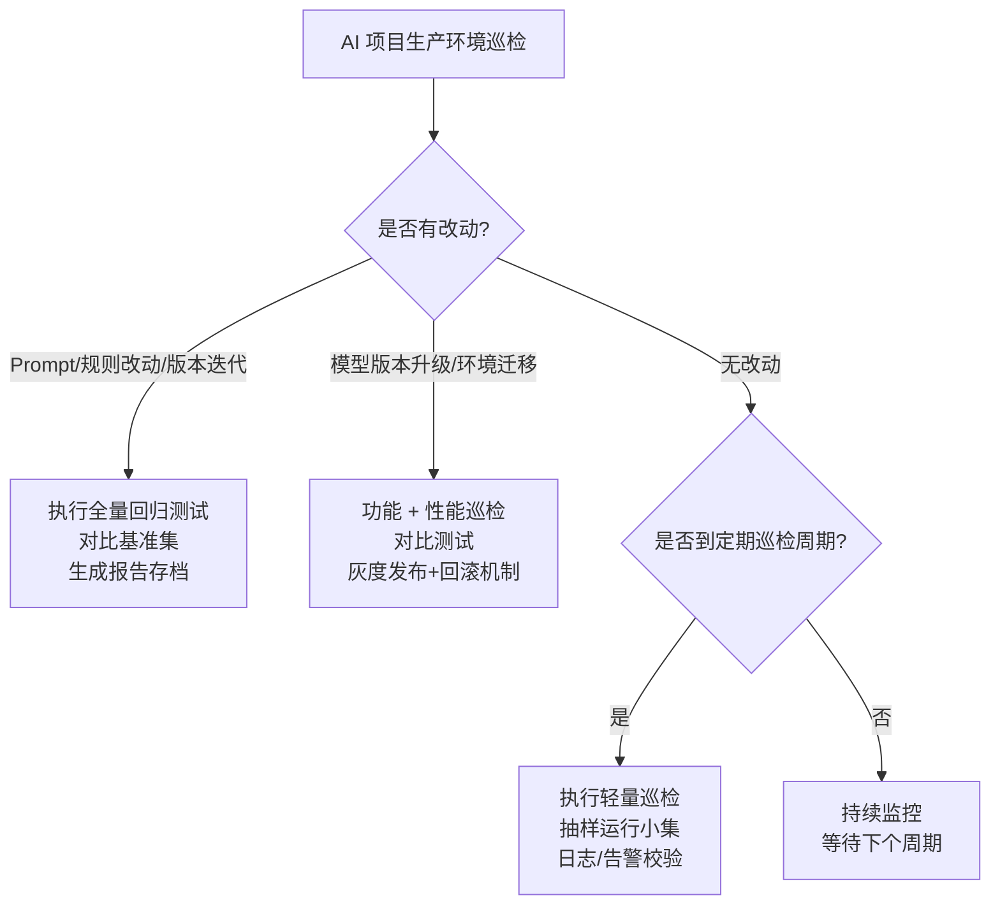
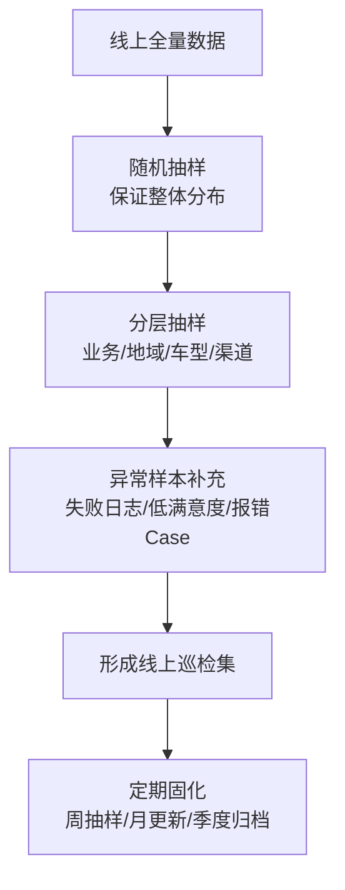
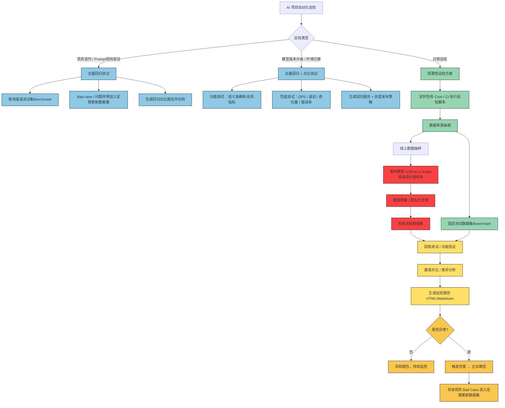
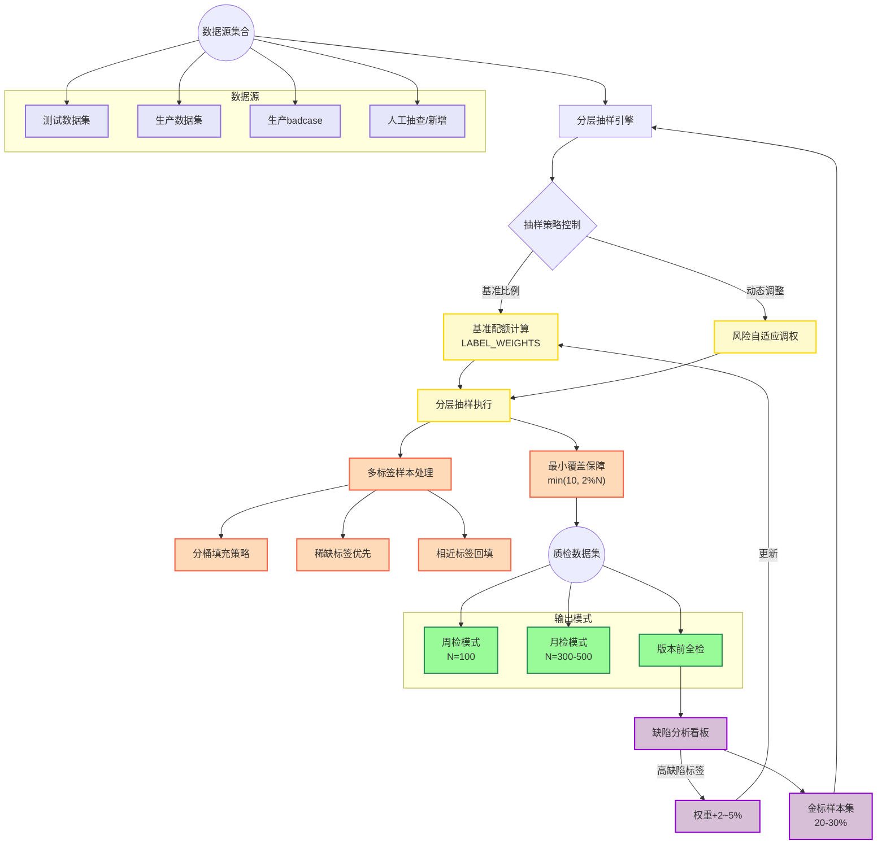

<blockquote class="blockquote-center" style="background-color: #e0f7fa
; padding: 16px; border-left: 5px solid #ccc; border-radius: 8px; text-align: center; font-style: italic; color: #333;">Life is not what you have gained, but what you have done !</blockquote>


## **1.** **项目迭代有规则改动 (如 Prompt 改动)**


- ✅ **必须全量回归**：Prompt 改动往往会导致整体行为逻辑的变化，不能只测改动点。

- 建议：

  

  - 准备一份 **基准测试集（benchmark dataset）**，覆盖常见场景、边界场景、历史 bug case。
  - 改动后 **全量跑 benchmark**，对比前后结果，监控准确率、召回率、语义相似度、业务关键指标。
  - 对比报告保存存档，形成“模型基线”，便于回溯。

  

------


## **2.** **模型版本升级 / 环境迁移**


- ✅ **必须巡检 + 对比测试**：新模型或者新环境可能会影响结果稳定性和性能。

- 检查点：

  

  - **功能层面**：跑基准集，保证语义准确率不下降。
  - **性能层面**：QPS、延迟、吞吐量、资源消耗。
  - **兼容性**：上下游 API / 服务调用是否异常。
  - **回滚机制**：保留旧版本，设置灰度发布，逐步切流。

  

------


## **3.** **项目迭代无改动**


- ❓是否有必要巡检 → **建议定期轻量巡检**

- 理由：即使代码/Prompt没改，生产环境可能因为：

  

  - 模型 API 供应商升级了底层（无通知更新）
  - 依赖服务（数据库、缓存、接口）稳定性问题
  - 数据分布随时间漂移（用户提问习惯、业务场景变化）
  - 资源不足（显存、并发压力）

  

🔍 **巡检建议**：


- **周检**：抽样小集跑通流程，看功能和准确率是否正常。
- **月检**：跑一次完整基准集，出报告（准确率、响应时间、异常率）。
- **季度检**：系统级巡检，包括安全、性能压测、日志分析、异常告警校验。


------


### **✅ 总结**

- **有改动 (规则/Prompt)**：全量回归必跑。
- **模型升级/环境迁移**：必须巡检+对比，灰度上线。
- **无改动**：也要定期轻量巡检（周检/月检/季度检），预防 API 变动、数据漂移。

------


## **🔹  流程图**





------


## **🔹 巡检 Checklist 表格**


| **巡检场景**            | **必要性** | **巡检动作**                                                 | **频率**         | **输出物**                  |
| ----------------------- | ---------- | ------------------------------------------------------------ | ---------------- | --------------------------- |
| Prompt/规则改动         | **强制**   | - 跑全量基准测试集- 对比前后准确率/业务指标- 保存对比报告    | 每次改动         | 基准对比报告、回归结果      |
| 模型版本升级 / 环境迁移 | **强制**   | - 功能测试（语义准确率）- 性能测试（QPS、延迟、吞吐）- 上下游兼容性验证- 灰度发布+回滚策略 | 每次升级/迁移    | 功能+性能报告、灰度上线方案 |
| 无改动（例行巡检）      | **建议**   | - 周检：小集抽样运行，功能结果对比- 月检：完整基准集跑一遍，出报告- 季度检：系统巡检（安全、性能、日志、告警） | 周检/月检/季度检 | 巡检报告、异常分析记录      |


------

## **4**. **线上数据在巡检中的使用原则**

### **1. 什么时候用线上数据？**


| **使用场景**               | **是否适合** | **理由**                                                   |
| -------------------------- | ------------ | ---------------------------------------------------------- |
| **功能正确性（回归测试）** | ❌ 不直接使用 | 线上数据不可控、不可复现，无法稳定对比。                   |
| **数据漂移检测**           | ✅ 推荐       | 用户提问习惯、业务内容会随时间变化，需要线上数据抽样监控。 |
| **性能/稳定性巡检**        | ✅ 必须       | 真实流量最能反映 QPS、延迟、错误率。                       |
| **安全/合规检测**          | ✅ 可用       | 抽查线上输入，识别潜在风险（敏感词、越权行为）。           |


------


### **2. 怎么用线上数据？**

- **抽样**：不要全量，避免成本过高（一般取 **1% 流量** 或每日 **N 千条**）。
- **回放**：将抽样的线上请求，导入测试环境，避免影响真实用户。
- **脱敏**：对用户隐私数据（手机号、姓名、车牌、身份证）做脱敏处理。
- **基线对比**：和历史线上抽样的结果对比，监控准确率、异常率变化。
- **自动化管道**：数据抽样 → 脱敏 → 存储到“线上数据集” → 定期跑巡检。

------


### **3. 注意事项**

- **隐私合规**：敏感数据必须脱敏或匿名化，保证合规。
- **可复现性**：巡检数据集要定期固化（例如“2025Q3线上样例集”），方便后续对比。
- **覆盖代表性**：要覆盖不同类型用户、不同入口（App/小程序/PC）、不同业务场景。
- **异常优先**：除了随机抽样，还要重点收集日志中失败的 case（如报错、空响应）。

------


### **4. 如何挑选线上数据？**

#### **✅ 挑选原则**

1. **代表性**：覆盖主要业务意图（购车咨询、卖车、贷款、售后、配件、报价）。
2. **多样性**：包含长尾问题、冷门车型、方言、emoji、网络用语。
3. **异常性**：采集异常日志样例（报错/低分/用户反馈不满意）。
4. **时效性**：保证数据集更新频率（比如每月替换 20% 数据）。

#### **📊 选择方法**

- **随机抽样**：保证整体分布。
- **分层抽样**：按业务意图、入口渠道、地域、车型等维度采样，保证覆盖面。
- **热点采样**：选取用户量最高的车型/问题，确保主流场景稳定。
- **异常采样**：挑选失败/低满意度 case，重点巡检。

------


### **5. 推荐落地做法**

- **每周**：随机抽取线上 1% 数据，快速回放测试。
- **每月**：更新一版“线上样例集”，合并进基准测试集。
- **每季度**：全量分析线上日志，生成分布报告，更新巡检策略。

------


👉 总结一句话：


- **功能正确性靠离线固定基准集**；
- **线上数据用于发现新问题、监控漂移和性能**；
- **选择时遵循：代表性 + 多样性 + 异常性 + 时效性**。


------




## **5.** **总结**(看这里)

### 1. **全量回归**


- 用于 **项目迭代或规则改动**、**模型版本升级/环境迁移**
- 保证整体准确率和业务逻辑不受影响
- **Bad case** 会加入定期更新数据集，形成长期基准

### 2. **日常巡检**

- 周期性执行（建议 **每 2 周**）

- 数据来源：

  - **线上抽样数据** → 使用裁判模型 judge_as_a_llm 筛选高价值样本
  - **固定测试数据集(Benchmark)** → 保证对比可复现

  

- 输出：巡检报告 + 巡检数据集存档

### 3. **裁判模型作用**

- 自动判断线上数据是否适合作为巡检样本
- 可以依据 prompt 规则筛选异常、低质量或高代表性样本


------

### 4. **流程图**



### 5. AI搜车巡检线上设计方案


#### 数据集来源_DataSource

1. 测试数据集

2. 生产数据集(定期导出)

3. 生产badcase(修复后数据集)

4. 人工抽查/新增(更新)

   - Datasets 新增字段(数据来源)

   ```json
   "data_source": "test"   # 测试
   "data_source": "prod"  # 生产
   "data_source": "badcase" # 版本迭代问题修复(个别用例)
   ```

   

#### **数据集抽样比例_benchmark（总计 100%）**


| **场景类型** | **占比** |
| ------------ | -------- |
| 单条件查询   | 18%      |
| 多条件组合   | 18%      |
| 口语化表达   | 8%       |
| 用户意图识别 | 8%       |
| 包含错别字   | 6%       |
| 数字格式变化 | 6%       |
| 条件模糊表达 | 6%       |
| 多值并列条件 | 6%       |
| 边界值       | 6%       |
| 条件冲突     | 5%       |
| 地域相关性   | 4%       |
| 特殊格式字符 | 3%       |
| 全部条件     | 2%       |
| 异常情况     | 2%       |
| 隐含否定条件 | 2%       |

**设计理由（核心点）：**

- **真实分布 + 高频主干**：单条件查询、多条件组合 合计 36%，覆盖最常见路径，能稳定反映线上主流程健康度。
- **可用性与鲁棒性**：口语化、错别字、数字格式、模糊表达、多值并列（合计 32%）是搜索/解析最常见噪声来源，容易引发召回或解析偏差，需持续巡检。
- **边界&冲突**：边界值、条件冲突 合计 11%，专门挖风险点（规则边界、优先级冲突、解析歧义）。
- **长尾稳压**：特殊格式字符、全部条件、异常情况、隐含否定条件 共 9%，保持低但固定占比，防止盲区；地域相关性 4% 兼顾地域词典/地名歧义。
- **理解保障**：用户意图识别 8% 专注“未显式结构化”的理解正确率，防回退为“看似正常但理解错”。


*备注:* 

> 如果有历史线上缺陷数据：把对应标签的占比**额外上调 2–5 个百分点**，从 单条件查询/多条件组合 中对等下调。


#### **抽样规则（实操落地）**


1. **总量与最小覆盖：**

   

   - 设本次巡检样本量 = **N**。
   - 每类目标样本数 = round(占比 * N)。
   - **每类最少 min(10, max(2, 0.02\*N)) 条**（避免极小样本导致“假通过”）。不足则从“主干类”（单条件/多条件）等比例扣给不足类。

   

2. **多标签样本处理：**

   

   - 每条样本可有多个 scenario_types。
   - **分桶填充**：对每个标签独立建候选池，按各自配额从池内抽；同一条样本被多个标签命中时只计入一次，优先归属最稀缺的标签（当前缺口最大的标签）。
   - 若某标签候选不足，用“相近标签”回填（例如：特殊格式字符 不足，优先用含表情/全角符号/混排数字的样本；地域相关性 不足，用含城市/省份/商圈词的样本）。

   

3. **风险自适应调权（可选）：**

   

   - **线上报警/质量看板**：最近 1 周错误率 > 阈值（如 >3%）的标签，临时 +3pt；
   - **新版本影响面**：引入新解析/新规则的标签 +2pt；
   - **季节/活动因素**：与营销/节日强相关的标签（如价格数字/颜色）+1–2pt。

   

4. **频率与留存：**

   

   - **周检**用 30–50 条/日滚动抽样（轻量健康度）；
   - **月检/大版本前**用 N=300–500；
   - 保留**金标样本集（不变集）20–30%**做回归基线，其余 70–80%滚动更换，避免过拟合巡检集。

   

#### **示例：给定 N 的配额计算**


以 **N=300** 为例（供参考）：


- 单条件 54， 多条件 54， 口语化 24， 意图识别 24， 错别字 18， 数字格式 18， 模糊表达 18， 多值并列 18， 边界值 18， 条件冲突 15， 地域 12， 特殊字符 9， 全部条件 6， 异常 6， 隐含否定 6。

  （若四舍五入有出入，按缺口从主干类补/扣。）

#### **质检要点（抽样后）**

- **覆盖检查**：所有 15 类都有样本且 ≥ 最小覆盖；
- **难例比例**：含噪声类（错别字/口语化/数字格式/模糊/多值并列/特殊字符/边界/冲突）合计 ≥ 50%；
- **标签一致性**：多标签样本的主次标签合理（记录主因标签，便于缺陷定位）。

#### **采样代码**

- 测试数据集

  ```json
   [
   {
      "sample_id": "1065",
      "scenario_types": [
        "单条件查询"
      ],
      "query": "帮我查查国六的车",
      "expected": {
        "emissionStandard": "国六"
      },
      "intent": "查询国六排放的二手车",
      "data_source": "test"
    },
    {
      "sample_id": "1066",
      "scenario_types": [
        "多值并列条件","多条件组合"
      ],
      "query": "本田CR-V或者丰田RAV4，2019-2021款",
      "expected": {
        "keywords": [
          "本田CR-V",
          "丰田RAV4"
        ],
        "years": [
          "2019",
          "2020",
          "2021"
        ]
      },
      "intent": "查询2019-2021款本田CR-V或丰田RAV4",
      "data_source": "test"
    },
    {
      "sample_id": "1067",
      "scenario_types": [
        "地域相关性","多条件组合"
      ],
      "query": "成都本地的沃尔沃S90，2020年以后上牌的",
      "expected": {
        "keywords": "沃尔沃S90",
        "registrationDate": {
          "registrationDateFrom": "2020-01-01",
          "registrationDateTo": "2025-12-31"
        }
      },
      "intent": "查询成都本地的2020年后上牌沃尔沃S90",
      "data_source": "test"
    },
    {
      "sample_id": "1068",
      "scenario_types": [
        "包含错别字" ,"多条件组合"
      ],
      "query": "比压迪汉EV，2023款",
      "expected": {
        "keywords": "比亚迪汉",
        "years": "2023",
        "oilType": "纯电"
      },
      "intent": "查询2023款比亚迪汉EV",
      "data_source": "test"
    }
   ]
  
  ```

- 数据集抽样逻辑 handle

```python
#!/usr/bin/env python
# -*- coding: utf-8 -*-
# @Time     : 2025/9/2 22:37
# @Filename : stratified_sample_handle.py
# @Author   : Alan_Hsu


import json
import random
from collections import defaultdict, Counter

# 标签及抽样比例（可调整）
LABEL_WEIGHTS = {
    "单条件查询": 0.18,
    "多条件组合": 0.18,
    "口语化表达": 0.08,
    "用户意图识别": 0.08,
    "包含错别字": 0.06,
    "数字格式变化": 0.06,
    "条件模糊表达": 0.06,
    "多值并列条件": 0.06,
    "边界值": 0.06,
    "条件冲突": 0.05,
    "地域相关性": 0.04,
    "特殊格式字符": 0.03,
    "全部条件": 0.02,
    "异常情况": 0.02,
    "隐含否定条件": 0.02
}


def compute_quota(total_n, weights, min_each=2):
    """计算每个标签的目标抽取数"""
    base = {k: max(min_each, int(round(v * total_n))) for k, v in weights.items()}
    # 修正总和可能不等于 total_n 的问题
    delta = total_n - sum(base.values())
    if delta != 0:
        # 按权重从大到小调整
        keys_sorted = sorted(weights, key=weights.get, reverse=True)
        i = 0
        while delta != 0:
            k = keys_sorted[i % len(keys_sorted)]
            base[k] += 1 if delta > 0 else -1
            delta += -1 if delta > 0 else 1
            i += 1
    return base


def stratified_sample(data, total_n, weights):
    """
    按标签比例抽样，支持多标签 scenario_types
    data: list of dict
    total_n: 抽样总数
    weights: 标签比例字典
    """
    # 构建每标签候选池
    pools = {label: [] for label in weights}
    for item in data:
        labels = item.get("scenario_types", [])
        for label in labels:
            if label in pools:
                pools[label].append(item)

    # 计算每个标签的抽取目标
    quota = compute_quota(total_n, weights)
    chosen_ids = set()
    result = []

    # 按缺口最大的标签依次抽样
    while len(result) < total_n:
        # 计算当前缺口
        deficits = {k: quota[k] - sum(1 for x in result if k in x.get("scenario_types", [])) for k in quota}
        deficits = {k: v for k, v in deficits.items() if v > 0}
        if not deficits:
            break
        target_label = max(deficits, key=deficits.get)
        # 候选池中未选中的样本
        candidates = [x for x in pools[target_label] if x["sample_id"] not in chosen_ids]
        if not candidates:
            quota[target_label] = sum(1 for x in result if target_label in x.get("scenario_types", []))
            continue
        selected = random.choice(candidates)
        if selected["sample_id"] not in chosen_ids:
            result.append(selected)
            chosen_ids.add(selected["sample_id"])

    # 若仍不足 total_n，从剩余样本随机补齐
    if len(result) < total_n:
        remaining = [x for x in data if x["sample_id"] not in chosen_ids]
        extra_needed = total_n - len(result)
        if remaining:
            extra_samples = random.sample(remaining, min(extra_needed, len(remaining)))
            result.extend(extra_samples)

    # 统计每个标签数量
    label_counter = Counter()
    for item in result:
        for label in item.get("scenario_types", []):
            label_counter[label] += 1

    print("🔹 抽样结果统计（标签: 数量, 占比）")
    for label, count in label_counter.items():
        print(f"{label}: {count} / {len(result)} ({count/len(result):.2%})")

    return result


def main(input_file="output.json", output_file="output_new.json", n=300):
    # 读取数据
    with open(input_file, "r", encoding="utf-8") as f:
        data = json.load(f)

    # 抽样
    sampled_data = stratified_sample(data, n, LABEL_WEIGHTS)

    # 保存结果
    with open(output_file, "w", encoding="utf-8") as f:
        json.dump(sampled_data, f, ensure_ascii=False, indent=2)

    print(f"\n✅ 已生成巡检数据集，共 {len(sampled_data)} 条，保存到 {output_file}")


if __name__ == "__main__":
    main(input_file="../eval_dataset/dataset_0901_all.json", output_file="../eval_dataset/dataset_0901_clean.json", n=300)
```


#### **执行与复盘**

(频次待定)

- **周检**：N≈100，快速健康度；
- **月检/大促前**：N≈300–500，全面巡检；
- **复盘看板**：按标签统计：通过率、严重/高/中缺陷占比、回归是否修复；
- **动态调权**：把“近两周高缺陷标签”自动 +2–5 个百分点，并保留到下次抽样。

#### 流程图



