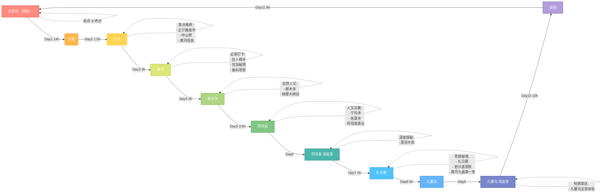

# 🚗甘南自驾2025

🏔️ 三千海拔之上，绿浪托起红原，经幡卷走浮世尘埃，此程——见天地，见众生，终见本心

<!-- more -->

#  **心之所向，念之已久**

心之所向，念之已久



对甘南的向往，早在疫情前就已开始计划，便一再搁置。

七月，是甘南最美的时节。天空澄澈，草原一片青绿；而在六月份，那边还常常飘雪，虽寒，却能远眺皑皑雪山。等到七月中下旬，雨季便悄然而至，行程多了几分变数。

这次两周的假期，计划了三套方案：青甘大环线、北疆小环线、还有最早开始酝酿的甘南环线。

最终决定走甘南——不仅因为筹划已久，更因为每个人心中，都藏着一个想去的地方。

我想去《魔兽世界》里的现实原型——莲宝叶则,

莫菲一直惦记着扎尕那,

艾米则心心念念着九寨沟,

甘南环线恰好能一网打尽，三个人的愿望一个不落。

我们最终舍弃了最远端的色达：一方面是担心高海拔的反应，另一方面，如果要去九寨沟，就必须割舍掉色达。

权衡之下，行程套餐为: 甘南环线附赠九寨沟 :smile::car:



# 行程路线

# ᰔᩚ📍𝐋𝐚𝐧𝐳𝐡𝐨𝐮蘭州

# 😄一家藏式小店~

# 📍好吃的藏饭-乌泽林卡🏠

# 📍甘南·拉卜楞寺

## 走过世界最长的转经筒廊，愿心之所念·皆能如愿～

## 甘南 | 一半是信仰 一半是色彩美学

# ⛰️纳摩大峡谷海拔3300轻徒步，18000步收获满满🌲🌲

# 📍莲宝叶则⛰️ —> 扎尕尔措湖🌊

# 阿坝->扎尕那

## 在甘南感受信仰的力量，从拉卜楞寺、郎木寺到娘玛寺、各莫寺，无论是建筑，还是虔诚的僧侣们，都可以感受到浓厚的宗教氛围和独特的藏族文化✨

## 扎尕那——山野千里，草木生欢喜🌲

# 🚘九若公路->九寨沟🏞️

## 🌲被大自然的绿意治愈🌿

## 🌲山山而川，迢迢其泽，绿水盈盈

## 🌦️烟雨朦胧中的九寨沟，缥缈的云雾缭绕在峰峦、海子之间，将“朦胧美”演绎到极致，可惜相机拍不出肉眼可见的五彩斑“蓝”

