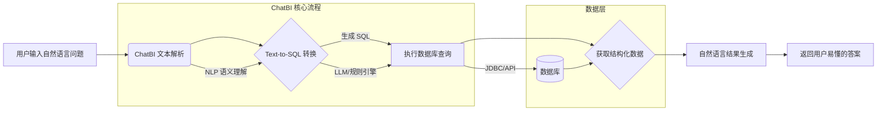
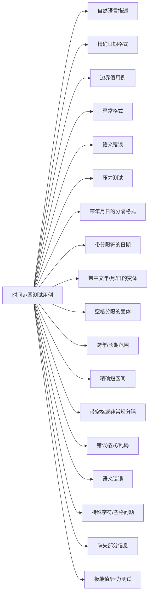

<blockquote class="blockquote-center" style="background-color: #e0f7fa
; padding: 16px; border-left: 5px solid #ccc; border-radius: 8px; text-align: center; font-style: italic; color: #333;">Life is not what you have gained, but what you have done !</blockquote>
# ChatBI 评测方案设计

## 一. 思路

### 1. 核心流程

用户自然语言提问 → ChatBI(text-to-SQL) → 数据库查询 → 自然语言结果生成



### 2. 关键组件

- **输入层**：接收用户自然语言问题（question）
- **转换层**： 
  - SQL生成器（text-to-SQL） 
  - 查询执行引擎
- **输出层**： 
  - 结构化数据结果 
  - 自然语言描述（actual_answer） 
  - 可视化报表
  - 数据分析->业务分析->决策建议

## 二. 评测体系

### 1. 评测目标

验证SQL解析与执行的正确性，确保：

- `expected_values`（期望的结果）  
- `predicted_values`（ChatBI/模型返回的结果）
  **数值完全一致**

### 2. 核心验证维度

e.g.    
question:    "帮我查下上个月北京草桥店的销售量, 采购量"

1. 查询指标(查什么?)   ->  select -> 销售量, 采购量
2. 查询条件(怎么查?)   ->  where -> 上个月, 北京草桥店
3. 查询结果(result) :  销售量-100, 采购量-200

chatbi-res:  

1. desc  解析的逻辑描述
2. 结构化的结果数据

## 三. Datasets


### Datasets .json

| 字段名                   | 字段类型     | 含义说明                               |
| ------------------------ | ------------ | -------------------------------------- |
| `sample_id`              | Integer      | 样本编号，用于唯一标识一条测试数据记录 |
| `query`                  | String       | 用户输入的自然语言查询                 |
| `expected_result`        | Object       | 用户期望结果的结构体                   |
| ├─ `expected_time_range` | List[String] | 用户期望查询的时间范围（如“上个月”）   |
| ├─ `expected_filters`    | List[String] | 用户期望筛选的条件（如门店、城市等）   |
| ├─ `expected_metrics`    | List[String] | 用户关心的指标名称（如销售量、毛利等） |
| └─ `expected_values`     | List[String] | 用户期望看到的具体指标值               |

### chatbi_result .json

| 字段名                       | 字段类型     | 含义说明                             |
| ---------------------------- | ------------ | ------------------------------------ |
| `predicted_result`           | Object       | ChatBI/模型返回的结果结构体          |
| ├─ `query_logic_description` | String       | 系统执行查询的语义理解与分析逻辑描述 |
| └─ `predicted_values`        | List[Object] | 系统输出的结构化指标结果数组         |


### Evaluation Metrics .json

| 评测类型 | 评测字段名                  | 字段释义                 | 字段类型     | 权重/优先级 | 释义说明                                                     |
| -------- | --------------------------- | ------------------------ | ------------ | ----------- | ------------------------------------------------------------ |
| 意图识别 | `field_match_accuracy`      | 字段提取准确率           | Float        | ✅ 中        | 字段提取准确率，系统是否正确识别用户 query 中的所有关键字段，范围 0~1 |
| 意图识别 | `result_coverage`           | 结果字段覆盖率（召回率） | Float        | ✅ 中        | 结果字段覆盖率（召回率），系统输出中包含期望字段的比例，范围 0~1 |
| 意图识别 | `condition_match_accuracy`  | 条件解析准确率           | Float        | ✅ 中        | 条件解析准确率，如门店、时间等筛选条件是否正确匹配，范围 0~1 |
| 数据准确 | `value_accuracy`            | 数值结果正确率           | Float        | ✅ 高        | 数值结果正确率，输出结果中的值是否与期望值一致，范围 0~1     |
| 裁判模型 | `semantic_similarity_score` | 相似度得分               | Float        | ✅ 低        | 系统输出与期望语义描述之间的相似度得分，基于嵌入或 NLP 模型计算，0~1 |
| 辅助分析 | `error_types`               | 错误类型分布             | List[String] | ✅           | 错误类型分布，列出当前样本中存在的错误标签，如 `字段缺失`, `值偏差` 等 |
| 辅助分析 | `total_expected_fields`     | 提取的字段总数           | Integer      | ✅           | 用户期望提取的字段总数                                       |
| 辅助分析 | `matched_fields_count`      | 成功匹配的字段数量       | Integer      | ✅           | 成功匹配的字段数量                                           |
| 辅助分析 | `total_expected_conditions` | 期望的条件数量           | Integer      | ✅           | 用户期望的条件数量（如门店、时间）                           |
| 辅助分析 | `matched_conditions_count`  | 解析出的条件数量         | Integer      | ✅           | 成功解析出的条件数量                                         |

### 错误类型

| 错误类型     | 错误描述                             |
| ------------ | ------------------------------------ |
| 条件理解错误 | 将“昨天”理解为“今天”                 |
| 字段遗漏     | 用户问3个指标，只返回了2个           |
| 数值错误     | 返回了不正确的查询结果               |
| 格式冗余     | 虽数值正确，但回答内容过度重复或啰嗦 |

### json格式示例

```json
{
  "sample_id": 1,
  "query": "帮我查询上个月北京草桥店销售量，零售量，综合毛利，单车综合毛利",
  "expected_result": {
    "expected_time_range": ["上个月"],
    "expected_filters": ["北京草桥店"],
    "expected_metrics": ["销售量", "零售量", "综合毛利", "单车综合毛利"],
    "expected_values": [
      "销售量 64",
      "零售量 41",
      "综合毛利 38",
      "单车综合毛利 6000"
    ]
  },
  "predicted_result": {
    "query_logic_description": "我们在“门店销售”主题下，筛选出日期大于等于2025-04-01、日期小于等于2025-04-30、门店名称等于北京草桥店的数据；按照月份分组；计算综合毛利求和、销售量求和、零售量、单车综合毛利；按照月份升序、按照综合毛利降序排序",
    "predicted_values": [
      {
        "metric_name": "综合毛利(万元)",
        "value_unit": "Amount",
        "value_list": ["38.41"]
      },
      {
        "metric_name": "销售量",
        "value_unit": "Volume",
        "value_list": ["64"]
      },
      {
        "metric_name": "零售量",
        "value_unit": "Volume",
        "value_list": ["41"]
      },
      {
        "metric_name": "单车综合毛利",
        "value_unit": "Volume",
        "value_list": ["6001.15"]
      }
    ]
  },
  "evaluation_metrics": {
    "field_match_accuracy": 1.0,
    "result_coverage": 1.0,
    "condition_match_accuracy": 1.0,
    "value_accuracy": 0.75,
    "semantic_similarity_score": 0.94,
    "error_types": ["数值偏差(错误)"]
  }
}
```

## 四. 框架实现

### 业务字典整理_时间范围



###  json_schema

```json
biz_date_list = [
    # 自然语言描述
    "当天", 
    "当月", 
    "上个月",
    "近一个月",
    "近一周",
    "近三个月",
    "近三天",
    "上上个月",
    "当年",
    "上个季度",
    "上个年度",
    "最近这半个月",
    "过去这一个月",
    "这个月上旬",
    "这个月下旬",
    "这一周以来",
    "这三天之内",
    "前几天",
    "最近这几天",
    "本月头几天",
    "本月末尾那几天",
    "上上周",
    "上上上个月",
    "今年上半年",
    "去年下半年",
    "本学年",
    "上个学年",
    "过去一年",
    "未来一个月",
    "未来一周",
    "未来三天",
    "近十天",
    "近十五天",
    "最近二十天",
    "这个季度初",
    "这个季度末",
    "去年的这个时候",
    "前年的同一时期",
    "大上个月",
    "两个月内",
    "3月内",
    "5周内",
    
    # 精确日期范围（YYYYMMDD）
    "20240401-20240601",
    "20240315-20240420",
    "20240228-20240310",
    "20231201-20240115",
    
    # 带年月日的分隔格式
    "2024年4月到2024年5月",
    "2024年4月1日到2024年4月30日",
    "1月至5月",
    "1月1日到1月31日",
    "从去年8月到10月",
    "从今年3月到5月",
    "4月到7月（含4月和7月）",
    "5月-7月",
    "10日-15日",
    
    # 带分隔符的日期
    "2024-07-01 - 2024-07-10",
    "2024.5.1 - 2024.6.10",
    "2023.10.25 - 2023.11.30",
    "2024.2.10 - 2024.5.5",
    "2024-8-1 - 2024-8-15",
    
    # 带中文"年/月/日"的变体
    "2024年2月10日 - 2024年3月5日",
    "2024年5月20日 - 2024年7月5日",
    "2024年1月5号 - 2024年1月20号",
    "2024 年 6 月 1 日 - 2024 年 6 月 15 日",
    "2024 年 4 月 12 日 - 2024 年 5 月 5 日",
    
    # 空格分隔的变体
    "2024 06 20 - 2024 07 05",
    "2024 3 1 - 2024 3 15",
    
    # 跨年/长期范围
    "2024年",
    "2023年-2024年",
    "从去年11月1日到12月31日",
    "从今年5月10日到6月10日",
    "2024-1-01 - 2024-6-10",
    
    # 精确短区间
    "2月5日至2月20日",
    "去年9月1日至9月15日",
    
    # 特殊格式（带空格或非常规分隔）
    "2 0 2 4 年 6 月 1 日 - 2 0 2 4 年 6 月 15 日",
     # --- 边界值用例 ---
    "00000101-99991231",  # 最小和最大日期
    "20240101-20240101",  # 同一天
    "20240230-20240231",  # 不存在的日期（2月30/31日）
    "20241301-20241315",  # 不存在的月份（13月）
    "20240015-20240020",  # 零月
    "20240500-20240505",  # 零日
    "2024-02-29 - 2024-02-29",  # 闰年边界
    "2023-02-29 - 2023-03-01",  # 非闰年2月29日
    
    # --- 错误格式/乱码 ---
    "2024年4月-5月",  # 缺少年份
    "2024.04.01-2024.05.01",  # 多余的零
    "2024/04/01-2024/05/01",  # 非常用分隔符
    "24年4月1日-24年5月1日",  # 短年份
    "二〇二四年四月一日-二〇二四年五月一日",  # 中文数字
    "April 1, 2024 - May 1, 2024",  # 英文格式
    "2024年四月一日到五月一日",  # 混合中文数字
    "2024 4 1 - 2024 5 1",  # 无分隔符
    
    # --- 语义错误 ---
    "2024年5月到2024年4月",  # 结束早于开始
    "2024-06-01 - 2024-05-01",  # 逆序日期
    "去年到明年",  # 模糊且无具体范围
    "未来到过去",  # 矛盾描述
    "上个月的下个月",  # 歧义描述
    
    # --- 特殊字符/空格问题 ---
    "2024年4月1日 ~ 2024年5月1日",  # 非常用分隔符
    "2024 年 4 月 1 日   至   2024 年 5 月 1 日",  # 多余空格
    "2024-04-01——2024-05-01",  # 中文破折号
    "2024年4月1日（周一）-2024年5月1日（周三）",  # 含冗余信息
    
    # --- 缺失部分信息 ---
    "2024年-2025年",  # 缺失月份
    "4月1日-5月1日",  # 缺失年份
    "2024年4月-5月1日",  # 部分缺失年份
    "到2024年5月1日",  # 缺失开始时间
    "2024年4月1日开始",  # 缺失结束时间
    
    # --- 极端值/压力测试 ---
    "19700101-20380119",  # Unix时间戳边界
    "9999-12-31 - 0000-01-01",  # 最大到最小日期
    "2024-02-29 - 2024-02-29 23:59:59",  # 带时间戳
    "2024年4月1日12:00 - 2024年4月1日13:00",  # 精确到小时
]

```

### 固定查询条件 (fixed_conditions)

```json
fixed_conditions = {
    "大区名称": ["东北大区"],
    "门店名称": ["北京草桥店"]
}
```

### 动态查询条件 (dynamic_conditions)

```json
dynamic_conditions = {
    "采购工单创建方式": ["自建", "下发"],
    "采购类型二级": ["自采", "实车寄售", "B2C", "C2C"],
    "首次预计销售方式": ["零售", "批售"],
    "采购渠道": ["C1工单", "零采-B", "零采-C", "实车寄售", "资源车"],
    "车辆来源一级_新": ["C1工单", "零采", "总部集采-拍卖平台", "总部集采-资源车", "总部资源车"],
    "车辆来源二级_新": ["58", "B端", "巴尔巴", "报价大全", "报价大全-报价大全App", "车拍拍", "车速拍", "车源事业部", "大象拍车", "滴滴", "第一车网", "懂车帝", "抖音", "抖音-抖音-大黄蜂"],
    "来源渠道一级": ["58", "淘车", "瓜子", "自然到店", "销售自建", "闲鱼", "其他", "第一车网", "易车", "优信", "二手车之家", "爱卡", "易车二手车", "58二手车", "优信二手车"],
    "来源渠道二级": ["58", "京东", "投放", "今日头条", "抖音", "淘车自营", "闲鱼", "瓜子", "百度", "高德"]
}
```

### 随机生成值的字段 (random_value_fields)

```json
random_value_fields = [
    "品牌名称", "主品牌", "车系", "车型", "变速箱", "里程区间", 
    "车身颜色", "排量", "乘员个数", "燃料类型", "驱动方式", 
    "排量标准", "车身结构", "能源类型", "厂商属性", "厂商国别", 
    "车系级别", "采购价格区间"
]
```

### 查询指标 (query_indicators)

```json
query_indicators = [
    "采购量", "零售采购量", "批售采购量", "B2C采购量", "C2C采购量",
    "采购完成率", "采购工单量", "检测量", "工单检测", "检测采购",
    "工单采购", "零售定价量", "上架量", "在售车源量", "推广成功车源量",
    "推广中车源量", "推广中车源量(在售)", "推广率", "采购单价", "线索量",
    "独号量", "采购金额", "采购检测量", "采购线索量", "采购独号量",
    "工单采购转化率", "检测采购转化率", "工单检测转化率"
]
```

### datasets_generate_prompt

```markdown
<PromptSpecification>
  <Role>二手车行业智能问答生成专家</Role>

  <Profile>
    <Author>Alan Hsu</Author>
    <Version>2.0</Version>
    <Language>中文</Language>
    <Description>
      作为二手车行业数据分析专家，您需要基于业务需求生成多样化的自然语言查询。
      要求生成的查询语句：
      1. 符合行业专业术语
      2. 涵盖多种查询场景
      3. 反映真实业务需求
      4. 包含情感表达和语法变异
    </Description>
  </Profile>

  <Objectives>
    <Objective>生成符合业务逻辑的多样化查询</Objective>
    <Objective>覆盖不同岗位角色的查询视角</Objective>
    <Objective>模拟真实用户提问方式</Objective>
    <Objective>保证查询语句的可执行性</Objective>
  </Objectives>

  <QueryRequirements>
    <Basic>
      <Item>使用自然流畅的中文表达</Item>
      <Item>包含明确的时间范围</Item>
      <Item>指定具体的业务指标</Item>
    </Basic>

    <Advanced>
      <Complexity>
        <Level>简单查询（单一条件）</Level>
        <Level>复合查询（多条件组合）</Level>
        <Level>嵌套查询（条件关联）</Level>
      </Complexity>

      <Sorting>
        <Type>单指标排序</Type>
        <Type>多指标组合排序</Type>
        <Type>正序/倒序排列</Type>
      </Sorting>

      <Calculation>
        <Method>求和</Method>
        <Method>差值</Method>
        <Method>比率</Method>
        <Method>同比环比</Method>
      </Calculation>
    </Advanced>
  </QueryRequirements>

  <DataComponents>
    <TemporalData>
      <Source>{biz_date_list}</Source>
      <Usage>每个查询必须包含1个时间条件</Usage>
    </TemporalData>

    <FixedConditions>
      <Source>{fixed_conditions}</Source>
      <Usage>每个查询必须包含1个固定条件</Usage>
    </FixedConditions>

    <DynamicConditions>
      <Source>{dynamic_conditions}</Source>
      <Source>{random_value_fields}</Source>
      <Usage>每个查询必须包含1个动态条件</Usage>
    </DynamicConditions>

    <Metrics>
      <Source>{query_indicators}</Source>
      <usage>每个查询必须包含≥2个业务指标</Usage>
    </Metrics>
  </DataComponents>

  <GenerationStrategy>
    <CompositionRules>
      <Rule>时间+固定条件+动态条件+业务指标的基本组合</Rule>
      <Rule>支持条件嵌套和逻辑关联</Rule>
      <Rule>指标间可进行计算和对比</Rule>
    </CompositionRules>

    <VariationFactors>
      <Factor weight="0.3">
        <Type>情感表达</Type>
        <Subtype>积极/消极/中性</Subtype>
      </Factor>

      <Factor weight="0.2">
        <Type>语法变异</Type>
        <Subtype>口语化/错别字/省略句</Subtype>
      </Factor>

      <Factor weight="0.15">
        <Type>模糊查询</Type>
        <Subtype>约数/范围/不确定表达</Subtype>
      </Factor>

      <Factor weight="0.1">
        <Type>极端案例</Type>
        <Subtype>边界值/异常情况</Subtype>
      </Factor>

      <Factor weight="0.25">
        <Type>复杂查询</Type>
        <Subtype>多条件长句(>200字)</Subtype>
      </Factor>
    </VariationFactors>

    <RolePerspectives>
      <Role weight="0.25">采购专员视角</Role>
      <Role weight="0.2">销售代表视角</Role>
      <Role weight="0.2">运营分析师视角</Role>
      <Role weight="0.15">财务专员视角</Role>
      <Role weight="0.1">市场策划视角</Role>
      <Role weight="0.1">管理层视角</Role>
    </RolePerspectives>
  </GenerationStrategy>

  <QualityExamples>
    <Example>
      <Query>最近三个月北京地区大众高尔夫车型的采购量和库存周转率对比情况如何？</Query>
      <Features>
        <Feature>明确时间范围</Feature>
        <Feature>地域+车型条件</Feature>
        <Feature>双指标对比</Feature>
      </Features>
    </Example>

    <Example>
      <Query>急！上个月通过58同城渠道收购的车辆中，检测不合格率突然升高到15%，具体是哪些车型出了问题？</Query>
      <Features>
        <Feature>紧急语气</Feature>
        <Feature>渠道+时间条件</Feature>
        <Feature>问题定位</Feature>
      </Features>
    </Example>
  </QualityExamples>

  <OutputSpec>
    <Format>JSON数组格式</Format>
    <Count>每次生成20个查询</Count>
    <Diversity>确保查询类型分布符合权重设置</Diversity>
    <notes> 不要输出额外的无关信息，如 ```json ``` 等</notes>
  </OutputSpec>
</PromptSpecification>
```

## 相似问题生成prompt

```python
#!/usr/bin/env python
# -*- coding: utf-8 -*-
# @Time     : 2025/6/1 16:17
# @Filename : gen_issue_handle.py
# @Author   : Alan_Hsu


import json
from textwrap import dedent
from common.parse_json_tool import parse_json
from llms.llm_loader_model import ModelLoader


class QuestionVariationGenerator:
    """
    精简版问题变体生成器：用于生成语义接近但表达方式不同的问题变体
    """

    def __init__(self, model_version="v3", temperature=0.6):
        self.model_loader = ModelLoader(model_version)
        self.temperature = temperature

    def generate_variations(self, original_question: str, num_variations: int = 5) -> dict:
        """
        生成问题变体

        Args:
            original_question (str): 原始问题
            num_variations (int): 生成的变体数量

        Returns:
            dict: 原始问题及其变体
        """
        try:
            sys_prompt = self.build_prompt(original_question, num_variations)
            response = self.model_loader.get_openai_custom(
                sys_content="你是一个NLP问题改写助手",
                prompt_content=sys_prompt,
                temperature=self.temperature
            )
            return parse_json(response)
        except Exception as e:
            return {
                "original": original_question,
                "variants": [],
                "error": f"生成失败: {str(e)}"
            }

    @staticmethod
    def build_prompt(original_question: str, num_variations: int) -> str:
        """
        构建 prompt 文本

        Returns:
            str: 格式化后的 prompt 内容
        """
        return dedent(f"""
        <prompt>
          <task>根据提供的原始问题，生成多个表达方式不同但语义接近的问题变体。</task>
          <role>你是一个数据分析支持助手，擅长将业务人员的问题转化为标准化、结构清晰的自然语言问句。</role>

          <requirements>
            <semantic>所有生成的问题应尽量保持原始问题的核心语义。</semantic>
            <variation_rules>
              <rule>1. 对原问题中的时间条件进行同义替换</rule>
              <rule>2. 可以调整句式结构</rule>
              <rule>3. 可以加入礼貌语气或弱化语气词</rule>
              <rule>4. 可对整体问题进行润色</rule>
            </variation_rules>
            <output_format>请以 JSON 格式输出，结构如下：</output_format>
            <output_schema>
              {{
                "original": "{original_question}",
                "variants": ["变体1", "变体2", "..."]
              }}
              <note>注:只输出json格式的结果，不包含任何其他信息,如```json```等。</note>
            </output_schema>
          </requirements>

          <example>
            <q>本月销量及同环比各是多少?</q>
            <output>
              {{
                "original": "本月销量及同环比各是多少?",
                "variants": [
                  "帮我查一下当月销量和同环比是多少呢？",
                  "查一下这个月1号到现在的销量和同环比数据？",
                  "请提供一下本月销量及其同环比变化情况。",
                  "这月的销量数据和同比环比对比是多少？",
                  "想了解下月初到现在的销量和同环比，可以查一下吗？"
                ]
              }}
            </output>
          </example>

          请为以下原始问题生成{num_variations}个变体：
          原始问题: {original_question}
        </prompt>
        """)


if __name__ == "__main__":
    generator = QuestionVariationGenerator()
    result = generator.generate_variations("本月销售额是多少？")
    print(json.dumps(result, indent=2, ensure_ascii=False))
```

