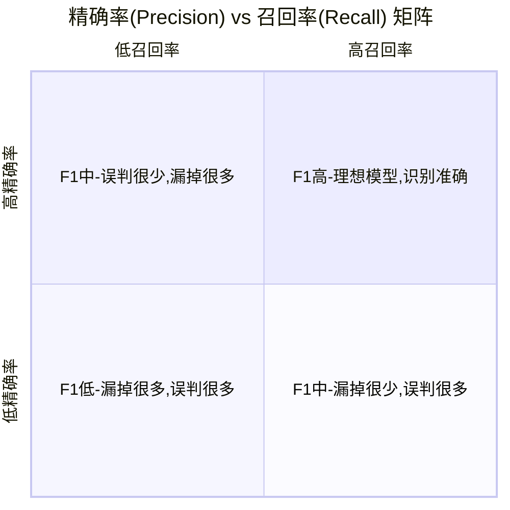

<blockquote class="blockquote-center">时光荏苒，珍惜当下</blockquote>

# 模型评测 _意图识别_ 关键指标详解

### **🧠 四个关键指标的通俗解释**

| **指标** | **英文名** | **通俗理解**                                                 |
| -------- | ---------- | ------------------------------------------------------------ |
| 准确率   | Accuracy   | 总体判断对的比例（考试得了几分）                             |
| 精确率   | Precision  | 你说是对的里，有多少是真的对（你说有癌的病人里，真的有癌的比例） |
| 召回率   | Recall     | 真正该判断出来的，有多少被你找出来了（所有癌症病人里，你找出来多少） |
| F1分数   | F1-score   | 精确率和召回率的加权平均，是个综合分数                       |


------


### **🕵️‍♀️ 什么时候用这些指标？**


| **场景类型**       | **推荐使用指标**   | **为什么**                                           |
| ------------------ | ------------------ | ---------------------------------------------------- |
| 类别平衡           | 准确率             | 比如识别猫狗照片，各类样本数差不多                   |
| 正负样本极度不平衡 | 精确率、召回率、F1 | 比如癌症检测、欺诈识别，阳性样本极少，准确率可能误导 |
| 希望少错杀         | 精确率             | 比如自动封号系统，不能乱封用户                       |
| 希望少漏报         | 召回率             | 比如安全报警系统，希望尽可能别漏掉真正的异常         |
| 想要两者平衡       | F1-score           | 综合考虑不要漏太多也不要乱报                         |


------


### **✅ 如何用它们分析模型效果？**


假设你对两个模型做了评估：

| **模型** | **精确率** | **召回率** | **F1分数** |
| -------- | ---------- | ---------- | ---------- |
| 模型A    | 90%        | 50%        | 64%        |
| 模型B    | 70%        | 70%        | 70%        |

分析：

- 模型A 很谨慎，只在非常确定的情况下才说“这是阳性”，所以**精确率高**，但**召回率低**，漏掉很多。
- 模型B 更积极地判断，**召回率提高**了，但**精确率下降**了一点点，整体的 **F1更好**，说明更平衡。

------


### **📌 总结一句话**


> **准确率看整体对错，精确率看你说对的有多准，召回率看你能找全多少，F1看你综合表现。**


------


## **实例: 多分类意图识别（3类）**

三类分别是：

- 无意图（no_intent）
- C1意图（c1_lead）
- C2意图（c2_lead）


------

#### **✅ 一、用哪些指标合适？**

在多分类意图识别中，推荐你重点关注这几个指标：

| **指标**             | **是否推荐**                                             | **原因说明** |
| -------------------- | -------------------------------------------------------- | ------------ |
| **准确率 Accuracy**  | ✅ 基础指标，看整体预测有多准，但容易==被类分布不均误导== |              |
| **精确率 Precision** | ✅ 看每个意图你说对的有多少是真的                         |              |
| **召回率 Recall**    | ✅ 看每个意图里你能找出多少                               |              |
| **F1-score**         | ✅ 综合考虑精确率和召回率的平衡                           |              |


------


#### **🧪 举个例子（假设有100条测试样本）**


| **实际 / 预测** | **无意图** | **C1意图** | **C2意图** | **合计** |
| --------------- | ---------- | ---------- | ---------- | -------- |
| 无意图          | 30         | 3          | 2          | 35       |
| C1意图          | 4          | 25         | 1          | 30       |
| C2意图          | 3          | 2          | 30         | 35       |

从这个混淆矩阵可以看出：


- 总共预测对的 = 30（无意图）+ 25（C1）+ 30（C2） = 85  → **准确率 = 85%**
- C1的 **精确率 = 25 / (25 + 3 + 2) = 25 / 30 = 83.3%**
- C1的 **召回率 = 25 / (25 + 4 + 1) = 25 / 30 = 83.3%**
- C1的 **F1 = 2 × (0.833 × 0.833) / (0.833 + 0.833) = 2 × 0.694 / 1.666 ≈ 0.833（即 83.3%）**

- ==F1 = 2 × (Precision × Recall) / (Precision + Recall)==


你可以对每个类都这样计算精确率、召回率、F1-score，然后看哪一类模型识别得不好，是否存在误判为“无意图”等问题。


------


#### **📊 实际怎么分析和使用这些指标？**

##### **1.** **准确率可以看整体是否可用**

> 比如训练了一个模型，准确率从 60% 提升到 85%，说明整体识别能力有进步。

##### **2.** **F1-score 分析“弱类”**

> 比如 C2意图 的 F1 比 C1意图 低很多，那可能是你训练数据中 C2 不够，或者模型容易把它误判为 无意图。

##### **3.** **精确率 vs 召回率的权衡**

- **高精确率、低召回率**：你只预测最有把握的，比如只说特别明显的 C2 是 C2，漏掉了一些边界样本；
- **高召回率、低精确率**：你把很多都预测为 C2，但有些其实是错的，模型激进了；
- **F1-score** 可以看整体平衡性。

##### **📌 建议这样做评估**

评测数据_dataset

```
{
  "accuracy": 0.85,
  "intent_results": [
    {
      "name": "no_intent",
      "precision": 0.91,
      "recall": 0.86,
      "f1_score": 0.88
    },
    {
      "name": "c1_lead",
      "precision": 0.83,
      "recall": 0.83,
      "f1_score": 0.83
    },
    {
      "name": "c2_lead",
      "precision": 0.80,
      "recall": 0.86,
      "f1_score": 0.83
    }
  ]
}
```

这样你就可以清楚地分析每个意图的分类表现，看到弱点在哪里（比如哪类精度低或召回低），进而优化数据或模型策略。


------


### **✅ 二、F1 是什么？为啥有它？**


通俗地说：


- 精确率高，但召回低：你说得很准，**但只说了一小部分**；
- 召回高，但精确率低：你说了很多，但正确的很少；
- F1-score 是这两者的“**综合评分**”，告诉你：你既不能瞎猜，也不能太保守。


就像考试时：


- 你写的答案对的比例是精确率；
- 所有应该答对的题中，你做对的比例是召回率；
- F1 就是你总体的答题能力。


------


### **✅ 三、F1-score 是高好还是低好？**


- **高好！F1 越高越说明你的模型“全面且可靠”**。
- **F1 = 1（100%）** 表示：你预测得既准又全，非常理想。
- **F1 = 0** 表示：完全没预测对。


------


### **✅ 四、如何分析 F1 的高低？**


------


#### **举例：你有三个类的 F1 分数**





------


| **意图**  | **Precision** | **Recall** | **F1** | **分析建议**                 |
| --------- | ------------- | ---------- | ------ | ---------------------------- |
| no_intent | 0.91          | 0.86       | 0.88   | 模型在这类上表现很好         |
| c1_lead   | 0.83          | 0.83       | 0.83   | 表现稳定，可以继续优化       |
| c2_lead   | 0.60          | 0.40       | 0.48   | 问题明显：召回太低，可能漏报 |

分析建议：


- **如果 F1 明显低**：

  

  - 可能样本数量不够；
  - 或训练数据分布不均；
  - 或模型对这个意图区分能力差；

  

- **进一步看 Precision 和 Recall 谁低**，找出是**乱猜**还是**漏报**。


------


#### **✅ 五、总结一句话**


> **F1 越高越好，是判断单个意图识别是否“又准又全”的关键指标。**


------

# **指标结果(报告)分析**


## **✅ 一、术语回顾（以 C1 意图为例）**


- **精确率（Precision）**：预测为 C1 的样本中，有多少是真的 C1？
- **召回率（Recall）**：所有真实是 C1 的样本中，有多少被你预测对了？
- **F1-score**：精确率和召回率的综合评分。


------


## **✅ 二、四种组合场景分析**

------


### **✅ 1.** **精确率高 + 召回率高 ⇒ F1 高**

#### **✅说明**

- 你预测为 C1 的，大多数是对的（Precision 高）
- 你把该找的 C1 样本几乎都找到了（Recall 高）

#### **✅模型状态**


> 模型表现理想，识别准确、覆盖也全。

#### **✅调优建议**


- 保持现状，可能进一步通过模型微调、增加边界样本来提升鲁棒性。


------


### **⚠️ 2.** **精确率低 + 召回率高 ⇒ F1 中等偏低**

#### **❗说明**

- 你预测为 C1 的样本，很多是错的（Precision 低）
- 但你确实把大部分 C1 都找出来了（Recall 高）

#### **📌可能原因**

- 模型“太激进”，宁可错杀也不放过；
- 把很多非 C1 样本误判为 C1（**误报多，假阳性多**）。

#### **✅调优建议**


| **方向**       | **操作**                                                |
| -------------- | ------------------------------------------------------- |
| 1️⃣ 优化数据质量 | - 给模型更多 **“负样本”（非 C1）**，让它知道哪些不是 C1 |
| 2️⃣ 提高决策门槛 | - 调高分类阈值，使模型只有“非常确定”才判为 C1           |
| 3️⃣ 调整损失函数 | - 使用 Focal Loss 等惩罚误报的函数                      |
| 4️⃣ 规则辅助     | - 加一些后置逻辑判断或规则补充识别逻辑                  |


------


### **⚠️ 3.** **精确率高 + 召回率低 ⇒ F1 中等偏低**

#### **❗说明**

- 你说 C1 的时候基本都对（Precision 高）
- 但很多真正的 C1 你没说出来（Recall 低）

#### **📌可能原因**

- 模型“太保守”，只有特别像的样本才判断为 C1；
- 导致漏报多（**假阴性多**）。

#### **✅调优建议**


| **方向**         | **操作**                                          |
| ---------------- | ------------------------------------------------- |
| 1️⃣ 增加多样性样本 | - 丰富“边缘 C1 样本”，让模型知道哪些样本也属于 C1 |
| 2️⃣ 降低分类门槛   | - 放松模型判断条件，让更多潜在 C1 被识别出来      |
| 3️⃣ 数据增强       | - 使用语义变换、同义替换等提升 Recall             |
| 4️⃣ 多模型融合     | - 融合更激进模型补充召回，做 Recall 提升模型      |


------


### **❌ 4.** **精确率低 + 召回率低 ⇒ F1 很差**

#### **❗说明**


- 模型在这个类别表现很差，基本是乱猜；
- 不但预测错多，而且漏得也多。

#### **✅调优建议**


| **方向** | **操作**                                              |
| -------- | ----------------------------------------------------- |
| 数据     | - 检查是否样本太少或标签错误                          |
| 特征     | - 看是否特征区分度不够，需要引入上下文、意图词等      |
| 模型结构 | - 换更强的模型，如 BERT -> RoBERTa 或引入语义增强模块 |
| 多轮策略 | - 引入多轮会话上下文，避免只依赖当前句子判断          |


------


## **✅ 三、总结分析表**


| **情况**        | **分析**           | **建议重点**                  |
| --------------- | ------------------ | ----------------------------- |
| 精确高 + 召回高 | 理想状态           | 保持 & 微调                   |
| 精确低 + 召回高 | 误报多，模型太激进 | **调高阈值 + 训练更多负样本** |
| 精确高 + 召回低 | 漏报多，模型太保守 | **增加边缘样本 + 降低阈值**   |
| 精确低 + 召回低 | 模型几乎失效       | **检查数据 + 模型结构大调整** |


------


## **✅ 四、“意图识别三分类”中建议**


- **重点看 C1 / C2 意图是否 Precision 低 or Recall 低**
- 看是否混淆成“无意图”
- 检查标签质量 + 多样性 + 特征词覆盖情况


------


## **⚠️ 情况：精确率低 + 召回率高**

### **❓情境**

你训练了一个模型来识别 **用户是否有 C1 买车意图**（比如：想买车但还没确定品牌）。


------


### **✅ 测试数据中**


- 实际 C1 意图的用户：**100 个**
- 实际非 C1 的用户：**100 个**


------


### **🤖 模型预测结果**


- 模型预测为 C1 的用户：**150 个**

  

  - 其中真正的 C1：**80 个**
  - 错判成 C1 的（其实不是）：**70 个**

  

------


### **📊 指标计算**


| **指标**         | **公式**              | **结果**                             |
| ---------------- | --------------------- | ------------------------------------ |
| Precision 精确率 | 80 / 150              | **53.3%** → 很多预测错了（误报多）   |
| Recall 召回率    | 80 / 100              | **80.0%** → 绝大部分 C1 被识别出来了 |
| F1               | 2 × (P × R) / (P + R) | ≈ **64.0%**（中等偏低）              |


------


### **🧠 通俗理解**


> 你“见谁像买车的都说是 C1”，导致你**覆盖面很广**（召回率高），但很多人其实是“无意图”或“C2”被你**误判成 C1**（精确率低）。


------


### **🚧 风险**


- 实际上很多不是 C1 的客户（例如随便问问的）被你当成 C1 推给销售，**增加了销售的无效工作量**。
- 销售可能反馈：“这个模型推的线索质量太差了，浪费时间”。


------


### **🛠️ 如何优化？**


| **方向** | **优化方式**                                                |
| -------- | ----------------------------------------------------------- |
| 数据层   | 增加“无意图”和“C2”类别的负样本，减少混淆                    |
| 模型层   | 加强模型区分 C1 和其他意图的能力                            |
| 阈值层   | 提高 C1 类别的分类阈值，让模型更保守一点，不要轻易说是 C1   |
| 后处理   | 引入规则，例如“必须提到预算/品牌/购车需求关键词”才认为是 C1 |


------

## **实例: (数据分析_完整版)**


我们用一组模拟数据生成了**意图识别的分类结果**，其中包括三类意图：**C1、C2、无意图**。以下是完整的分析：


------


### **✅ 一、混淆矩阵结果**


|               | **预测为 C1** | **预测为 C2** | **预测为 无意图** |
| ------------- | ------------- | ------------- | ----------------- |
| 实际是 C1     | **7**         | 2             | 1                 |
| 实际是 C2     | 2             | **2**         | 1                 |
| 实际是 无意图 | 2             | 2             | **1**             |


------


### **📊 二、指标分析报告**


| **类别**     | **精确率 (Precision)** | **召回率 (Recall)** | **F1 分数** | **样本数** |
| ------------ | ---------------------- | ------------------- | ----------- | ---------- |
| C1           | **63.6%**              | **70.0%**           | **66.6%**   | 10         |
| C2           | 33.3%                  | 40.0%               | 36.4%       | 5          |
| 无意图       | 33.3%                  | 20.0%               | 25.0%       | 5          |
| **宏平均**   | 43.4%                  | 43.3%               | 42.7%       | -          |
| **加权平均** | 48.3%                  | 50.0%               | 48.7%       | -          |
| **准确率**   | -                      | -                   | **50.0%**   | 20         |


------


### **🧠 三、重点解读：C1 精确率低、召回率高的情况**


- **预测为 C1 的人有 11 个，但其中只有 7 个是真的 C1**

  

  - 所以 **精确率低**：63.6%

  

- **实际 10 个 C1 中识别出了 7 个**

  

  - 所以 **召回率高**：70.0%

  

- **所以 ->**

  > 精确率低 + 召回率高 ⇒ F1 中等偏低（66.6%）


------


### **🧰 四、调优建议**


| **问题**                              | **建议**                                                     |
| ------------------------------------- | ------------------------------------------------------------ |
| 模型把太多非 C1 的样本当成 C1（误报） | 加强 **区分能力**：让模型学会真正的 C1 特征，比如用户明确表达意图、车型预算、提到购买时间等 |
| 精确率低                              | **提升预测门槛**：提高 C1 的判断阈值，避免“太容易就说是 C1”  |
| C2 和 无意图混淆严重                  | 增加无意图和 C2 的训练样本，特别是容易与 C1 混淆的那部分对话 |
| 模型过度偏向 C1（可能类别不平衡）     | 检查训练集分布，考虑加入 class_weight 或重新采样             |


------


### **🔍 五、宏平均 vs 加权平均**


| **类型**     | **含义**                                                     |
| ------------ | ------------------------------------------------------------ |
| **宏平均**   | 所有类别一视同仁，不考虑样本数差异。适合衡量模型对每类的均衡表现。 |
| **加权平均** | 按样本数加权，更真实地反映整体表现。适合衡量实际平均性能。   |


------


### **✅ 一、F1 分数（F1-score）**


#### **📌 定义**

F1 是**精确率（Precision）**和**召回率（Recall）**的调和平均数

#### **📌 作用**

- 衡量模型的**整体表现**，特别在类别不平衡时，比准确率更可靠。
- 适合用在 **“不希望错过任何一个正例” 又希望 “预测要准”** 的场景，比如意图识别、疾病诊断。

#### **🎯 理解方式**


- **F1 高**：模型既**预测准**又**找全了**。
- **F1 低**：说明 precision、recall 至少有一个差。


#### **✅ 你要监控 F1，特别是在**


- 多分类任务中，**每一类的识别效果**
- 类别不平衡时的表现


------


### **✅ 二、宏平均（Macro Average）**

#### **📌 定义**

将每个类别的指标（如 F1、precision、recall）**等权重地平均**：

#### **📌 特点**


- **不考虑类别数量多少**
- 假设每类都一样重要（即便只有很少的样本）

#### **🎯 使用场景**


- 当你希望**每个意图分类都表现良好**（公平性导向）
- 特别适合 QA 系统、客服意图识别等场景


------


### **✅ 三、加权平均（Weighted Average）**


#### **📌 定义**

将每个类别的指标按照该类**真实样本占比加权平均**

#### **📌 特点**

- 更反映**整体准确性**。
- 大类权重更高，小类影响小。


#### **🎯 使用场景**


- 当你更关心**整体性能**（比如误报率、准确率）
- 在**类别分布不均**（如 C1 多、无意图少）时很有用


------


### **✅ 四、ROC 曲线 & AUC**

#### **📌 什么是 ROC 曲线**


- **横轴（FPR）**：假正例率（把负类错分为正类）
- **纵轴（TPR）**：真正例率（召回率）
- 每一个点代表一个**预测阈值**


#### **📌 AUC（曲线下的面积）**


- AUC 越接近 1，表示模型越好；
- AUC ≈ 0.5 表示模型没啥用（随机猜）


------


#### **📈 在多分类中的用法**


- 对每个类别做 One-vs-Rest（如：是否为 C1）
- 得到每类的 ROC 曲线 + AUC 值


------


### **🧠 总结对比**


| **指标**     | **是否考虑类别权重** | **用途**                            | **对不平衡敏感性** |
| ------------ | -------------------- | ----------------------------------- | ------------------ |
| F1-score     | ❌ 单类               | 综合衡量一个类的 precision + recall | 是                 |
| 宏平均 Macro | ❌ 平均每类表现       | 想看每一类是否都表现得不错          | 高                 |
| 加权平均     | ✅ 按样本占比加权     | 更贴近整体真实表现                  | 中                 |
| AUC/ROC      | ✅ 评估模型阈值表现   | 阈值调节、诊断模型能力              | 是                 |


------


### **✅ 建议你怎么用这些指标分析模型？**


1. **每类 F1 分数**：判断哪个意图识别弱，是否是 precision 低还是 recall 低。

2. **Macro-F1 vs Weighted-F1**：

   

   - Macro-F1 低 → 少数类模型学不好（比如无意图）
   - Weighted-F1 高 → 整体还凑合

   

3. **AUC 曲线**：看是否有足够区分度，以及是否能通过**调节阈值**改善性能


------

