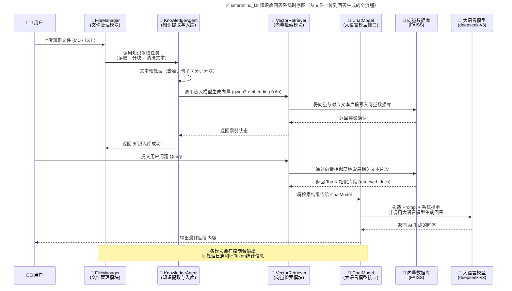
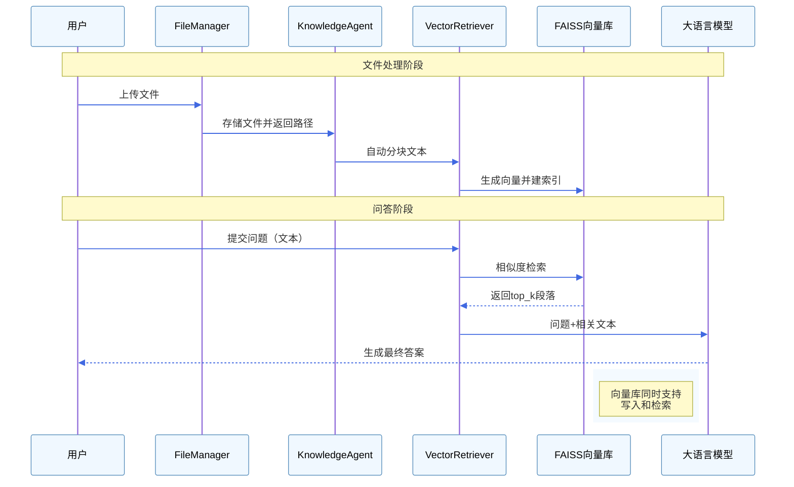
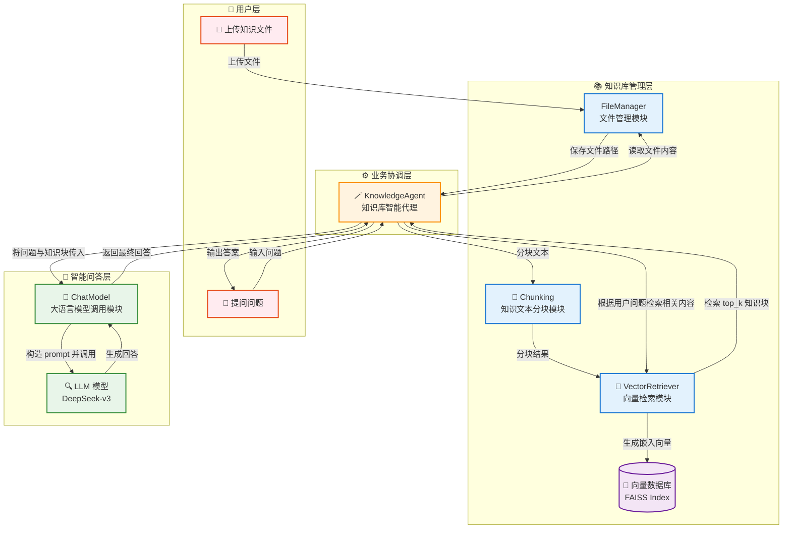

<blockquote class="blockquote-center" style="background-color: #e0f7fa
; padding: 16px; border-left: 5px solid #ccc; border-radius: 8px; text-align: center; font-style: italic; color: #333;">Life is not what you have gained, but what you have done !</blockquote>


# **🧠 智能知识库问答系统 smartMind_kb **

**分类**: 向量检索
**技术说明**: 向量检索测试资料库
**简述**: 基于Embedding+LLM+Faiss+chunk分块策略构建的智能化测试资料检索与摘要生成平台
应用场景:  适用于测试团队内部资料库（如业务文档、生产问题数据、测试用例数据等）的智能检索与知识总结，支持多源文档嵌入、语义召回与快速相似度计算，为测试分析、问题追踪及知识复用提供高效支持。

## **技术栈与作用说明**

### **🚀 一、整体技术架构概览**

#### 📊 **时序图**





#### **🧭 图示说明**


| **阶段**           | **描述**                                                     |
| ------------------ | ------------------------------------------------------------ |
| **1️⃣ 文件上传阶段** | 用户上传文件 → FileManager 负责保存与校验 → 调用 KnowledgeAgent |
| **2️⃣ 知识处理阶段** | KnowledgeAgent 清洗文本、分块、调用 Embedding 模型生成向量   |
| **3️⃣ 向量存储阶段** | VectorRetriever 将文本块与向量索引写入向量数据库（FAISS/Chroma） |
| **4️⃣ 用户问答阶段** | 用户输入问题，系统通过向量相似度检索知识库中最相关内容       |
| **5️⃣ 回答生成阶段** | ChatModel 构造 prompt 调用 LLM，根据知识内容生成答案         |
| **6️⃣ 反馈输出阶段** | 最终回答返回给用户界面，控制台打印日志与调试信息             |


------


该系统实现了一个**本地私有化知识库问答系统（RAG：Retrieval-Augmented Generation）**，

主要流程是：


> **文本 → 向量化 → 向量检索 → LLM问答 → 输出答案**


整个流程融合了 **LLM 推理、语义检索、文本嵌入、文件管理、Gradio前端界面** 等多种技术组件。

#### 🎨 实现过程





1. **用户上传文件 → FileManager 保存**

   

   - 文件存储到指定目录，并生成可访问路径。

   

2. **KnowledgeAgent 加载文件 → 文本分块**

   

   - 自动识别 Markdown 或普通文本标题，分块清洗文本。

   

3. **向量化 → FAISS 向量数据库**

   

   - VectorRetriever 将文本段落转换为嵌入向量。
   - 构建或加载 FAISS 索引，支持高效相似度检索。

   

4. **用户提问 → 检索相关段落 → LLM 生成答案**

   

   - 查询文本经 VectorRetriever 检索 top_k 相关段落。
   - ChatModel 将问题和检索到的文本传给大语言模型生成回答。
   - 返回最终答案给用户。

   

5. **数据流完整覆盖**

   

   - 文件 → 文本段落 → 向量 → FAISS 检索 → LLM → 回答。

   

------


### **🧩 二、核心技术栈组成**


| **模块**             | **技术/库**                                          | **主要作用**                                   | **在本项目中的位置**                |
| -------------------- | ---------------------------------------------------- | ---------------------------------------------- | ----------------------------------- |
| **大语言模型 (LLM)** | text-embedding-qwen3-embedding-0.6b 以及 deepseek_v3 | 提供文本嵌入 (Embedding) 和问答生成            | 用于生成语义向量 / 生成回答         |
| **向量数据库**       | Faiss (Facebook AI Similarity Search)                | 存储与检索文本嵌入向量，实现高效语义匹配       | 支撑 VectorRetriever 实现知识库检索 |
| **Web前端框架**      | Gradio                                               | 构建交互式Web聊天界面                          | 对应 ChatInterface 模块             |
| **LLM调用封装**      | 自定义 ModelLoader                                   | 封装不同 LLM 的调用接口（如deepseek_v3）       | core/chat_model.py 依赖             |
| **文件管理模块**     | FileManager                                          | 管理上传文件、存储知识库文本                   | file_manager.py                     |
| **知识库智能体**     | KnowledgeAgent                                       | 协调文件加载、文本分块、向量生成、检索、问答   | 系统核心控制器                      |
| **文本嵌入模型**     | Qwen3-Embedding-0.6B                                 | 将文本转化为语义向量，用于检索与语义相似度计算 | VectorRetriever 使用                |
| **相似度计算**       | cosine_similarity (来自 sklearn)                     | 计算查询与知识向量的相似度                     | 用于找出最相关的文档片段            |
| **进度显示**         | gr.Progress                                          | 反馈文件加载、知识库构建等过程的状态           | Gradio界面交互优化                  |
| **正则表达式**       | re                                                   | 文本清洗与 token 估算                          | token_utils.py                      |


------


### **🧠 三、核心组件与对应职责**


#### **1️⃣** **text-embedding-qwen3-embedding-0.6b**


> 💡 模型来源：阿里巴巴 Qwen（通义千问）开源系列

> 💪 模型类型：Embedding 模型（非生成模型）

> 🧩 模型功能：将文本转化为高维语义向量（向量表示）


##### **🔍 在项目中的作用**


- 用于将知识库文本（段落、句子）转换为语义向量；
- 查询时，将用户提问同样转为向量；
- 然后通过 **Faiss 相似度搜索** 找到最相关的知识片段；
- 是整个“语义检索”模块的核心算子。


##### **✅ 特点**

- 支持中英文混合语义；
- 相比传统 TF-IDF / BM25，更擅长捕捉语义相关；
- 速度快、体积小（0.6B 参数），非常适合本地私有化部署。


------


#### **2️⃣** **Faiss (Facebook AI Similarity Search)**


> 💡 Facebook AI 开源的高性能相似度搜索库

> 🚀 用于大规模向量检索与聚类


##### **🔍 在项目中的作用**


- 存储所有知识片段的向量；
- 查询时，计算与输入问题的相似度（默认余弦相似度）；
- 返回最相近的若干条知识文本，作为 LLM 生成答案的上下文。

##### **✅ 优势**


- 支持数百万条向量的快速近似搜索；
- GPU/CPU 都可运行；
- 比传统全匹配快几个数量级；
- 已成为语义检索系统的工业标准（同类：Milvus、Weaviate）。

##### **📦 实现类**


在项目中由 VectorRetriever 封装使用，如：

```
import faiss
index = faiss.IndexFlatL2(vector_dim)
index.add(embedding_matrix)
```


------


#### **3️⃣** **Gradio**


> 💬 一个快速搭建机器学习交互界面的框架


##### **🔍 在项目中的作用**


- 构建 “文件上传 + 知识库选择 + 聊天界面” 的 Web 界面；
- 提供进度条、下拉选择、按钮、聊天窗口组件；
- 支持浏览器直接访问、调试和展示。

##### **✅ 优点**

- 代码少、上手快；
- 自带 REST API；
- 支持 Markdown 渲染、头像、复制功能；
- 在 ChatInterface.launch() 中构建完整布局。

------


#### **4️⃣** **ModelLoader**


> 项目自定义模块，用于封装各种 LLM 的 API 调用逻辑。

##### **🔍 在项目中的作用**

- 提供统一的 LLM 调用入口；
- 支持调用 LM Studio 本地模型（如 Qwen2、Yi、DeepSeek）；
- 也可扩展支持 OpenAI API 或阿里云百炼 API。


```
answer = self.loader.call_llm(sys_prompt, user_prompt)
```


##### **✅ 功能特性**

- 模型切换方便；
- 统一管理请求 headers、base URL；
- 支持异常捕获与响应超时控制。


------


#### **5️⃣** **KnowledgeAgent**

> 整个智能知识问答的“中控核心”

##### **🔍 在项目中的作用**

- 负责协调整个流程：

  

  1. 加载知识库文件；
  2. 拆分文本；
  3. 调用 embedding 模型生成向量；
  4. 存入 Faiss；
  5. 接收用户提问；
  6. 召回最相关片段；
  7. 交由 ChatModel 生成最终答案。

##### **✅ 作用举例**


```
self.agent.load_knowledge_file("知识库.txt")
answer = self.agent.query("这款车的质保多久？")
```


------


#### **6️⃣** **ChatModel**


> 与 LLM 对话生成模块

##### **🔍 在项目中的作用**

- 将检索出的知识片段整合；
- 构建系统 prompt；
- 调用大语言模型生成符合规则的回答；
- 限制 token 数防止超长输入。

##### **✅ 特点**

- 内置 token_utils 截断机制；
- 保证回答基于知识库；
- 专业、准确、可控。


------


#### **7️⃣** **FileManager**

> 负责文件上传、管理与列表更新

##### **🔍 在项目中的作用**

- 保存用户上传的 .txt / .md 文件；
- 管理知识库目录；
- 提供文件列表给前端下拉菜单。

##### **✅ 典型调用**


```
saved_path = self.file_manager.save_uploaded_file(file_obj)
file_list = self.file_manager.list_knowledge_files()
```


------


#### **8️⃣** **token_utils.py**

> 轻量级工具，用于估算与控制 token 长度。

##### **🔍 在项目中的作用**

- estimate_tokens(text)：估算文本 token 数；
- truncate_to_token_limit(text, max_tokens)：智能截断文本；
- 避免上下文太长导致 LLM 超限或延迟。


------


### **🔄 四、**技术架构分层图





#### **🧩 图示说明**

##### **👤 用户层**

- U1 上传知识文件（如 .txt、.md）
- U2 向系统提出问题

##### **📚 知识库管理层**

- **FileManager**

  负责知识文件的保存、列表管理。

- **Chunking**

  将知识文本按标题、段落、句子进行智能分块。

- **VectorRetriever**

  负责调用嵌入模型生成文本向量，构建并查询 **FAISS 向量数据库**。

- **FAISS 向量数据库**

  存储知识向量，用于相似度检索。

##### **🧠 智能问答层**

- **ChatModel**

  根据检索结果和用户问题构造 Prompt，并调用大语言模型生成答案。

- **LLM**

  可以是 **LM Studio 本地模型**、**OpenAI GPT**、或 **DeepSeek** 等模型。

##### **⚙️ 业务协调层**

- **KnowledgeAgent**

  项目核心协调器。负责：

  

  1. 连接文件管理、分块、向量、问答模块
  2. 处理用户请求
  3. 控制从文件加载 → 向量生成 → 检索 → LLM 回答的完整链路

#### **🔄 端到端数据流**


| **阶段** | **数据流**                              | **描述**             |
| -------- | --------------------------------------- | -------------------- |
| ①        | 用户上传 → FileManager                  | 保存文件到知识库目录 |
| ②        | FileManager → KnowledgeAgent            | 返回文件路径         |
| ③        | KnowledgeAgent → Chunking               | 文本分块             |
| ④        | Chunking → VectorRetriever              | 将分块结果转化为向量 |
| ⑤        | VectorRetriever → FAISS                 | 构建向量数据库       |
| ⑥        | 用户提问 → KnowledgeAgent               | 启动问答流程         |
| ⑦        | KnowledgeAgent → VectorRetriever        | 相似度检索相关知识   |
| ⑧        | VectorRetriever → KnowledgeAgent        | 返回匹配文本         |
| ⑨        | KnowledgeAgent → ChatModel              | 调用 LLM 生成回答    |
| ⑩        | ChatModel → LLM                         | 生成自然语言回答     |
| ⑪        | LLM → ChatModel → KnowledgeAgent → 用户 | 输出最终答案         |


------


### **🧭 五、总结与优势**


| **模块**        | **关键价值**               | **替代方案**                   |
| --------------- | -------------------------- | ------------------------------ |
| Qwen3 Embedding | 中文语义优、体积小、速度快 | OpenAI text-embedding-3-small  |
| Faiss           | 本地向量检索性能极强       | Milvus / Chroma / Weaviate     |
| Gradio          | 快速构建前端可视化界面     | Streamlit / Flask + Vue        |
| LLM Loader      | 模型接入可插拔             | 支持 LM Studio、本地 Ollama 等 |
| KnowledgeAgent  | 系统调度器，核心控制层     | CrewAI / LangChain Agent       |


------

## **后续扩展**

### 1. 生产问题整理清洗, 作为资料库

### 2. 查询优化

1) 查询重写 (`QueryRewriterAgent`)
   - 分析用户查询的知识点和复杂度
   - 提取核心关键词
   - 规范表述，生成多个查询变体
2) 智能检索 (`LocalRetriever`)
   - **查询类型分析**：自动识别精确查询、语义查询或混合查询
   - **多路径检索**：
     - 向量搜索（BGE-M3嵌入模型）
     - 关键词搜索（基于jieba分词）
     - RRF融合（Reciprocal Rank Fusion）
   - **Cross-Encoder重排序**：精确优化检索结果排序
3) 质量评估 (`QualityEvaluatorAgent`)
   - **4维度评估**：相关性、完整性、准确性、覆盖面（各10分）
   - **80%阈值判断**：总分≥32分为PASS，否则为FAIL
   - **详细分析**：提供质量分析报告和改进建议
4) 增加测试用例生成及报告相关>?
5) ...etc....

### 3. 前端优化

1. 添加mermaid流程图总结
2. 扩展上下文记忆,历史消息
3. 优化操作体验