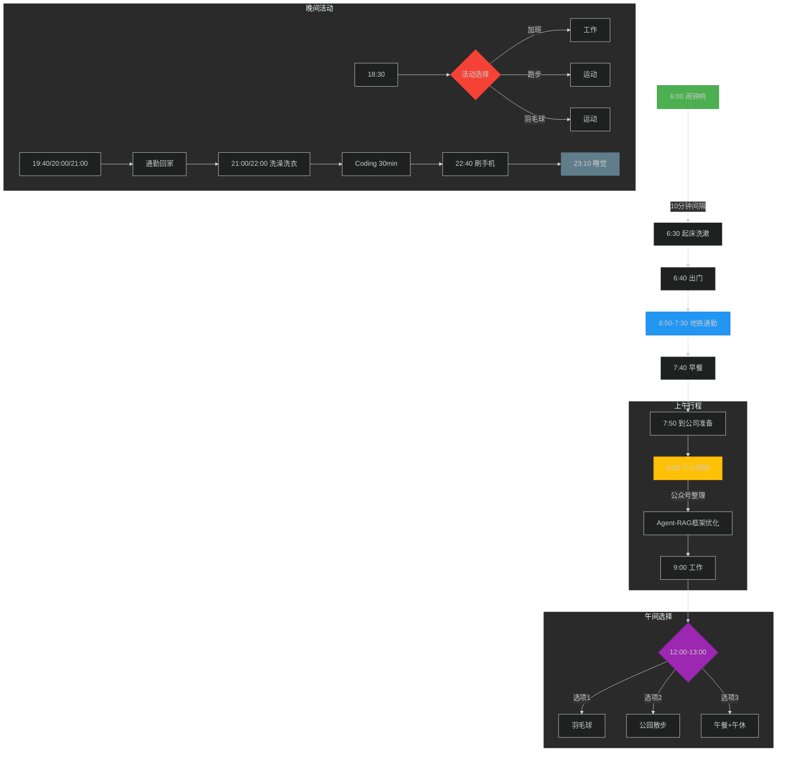

<blockquote class="blockquote-center" style="background-color: #e0f7fa
; padding: 16px; border-left: 5px solid #ccc; border-radius: 8px; text-align: center; font-style: italic; color: #333;">Life is not what you have gained, but what you have done !</blockquote>

```mermaid
%%{init: {'theme': 'dark', 'themeVariables': { 'primaryColor': '#1e1e1e', 'nodeTextColor': '#f0f0f0', 'edgeLabelBackground':'#333', 'clusterBkg': '#2a2a2a'}}}%%
gantt
    title 每日作息流程图
    dateFormat  HH:mm
    axisFormat %H:%M
    
    section 早晨
    闹钟 :a1, 06:00, 10m
    闹钟 :a2, after a1, 10m
    闹钟 :a3, after a2, 10m
    起床洗漱 :06:30, 10m
    通勤 :06:50, 40m
    早餐 :07:40, 10m
    
    section 上午
    到公司准备 :07:50, 10m
    个人时间 :08:00, 60m
    工作 :09:00, 180m
    
    section 午间
    午休活动 :12:00, 60m
    
    section 下午
    工作 :13:00, 330m
    
    section 晚上
    健身/加班 :18:30, 90m
    通勤回家 :19:40, 60m
    晚间清洁 :21:00, 40m
    Coding时间 :21:40, 30m
    刷手机 :22:40, 30m
    睡觉 :23:10, 0m
    
    section 关键标注
    地铁阅读 :crit, 06:50, 40m
    公众号整理 :crit, 08:00, 60m
    运动时间 :crit, 12:00, 40m

```

## 1. 6:00 闹钟响 (10分钟响一次,闹3次)

## 2. 6:30 起床,洗漱,检查背包(要带的装备,衣服)

## 3. 6:40 出门

## 4. 6:50  -> 7:30 (地铁通勤)

- ### 40分钟

- ### Review公众号文章(有价值的转载)

## 5. 7:40 早餐 (随机)

- ### 豆腐脑,油条

- ### 星巴克早餐

- ### 瑞幸咖啡

## 6. 7:50 公司,收拾工位,水杯,洗漱

## 7. ~~8:00 (WC大事) 随机~~

## 8. 8:00 个人时间

- ### 开始整理公众号文章

- ### 文整理一篇

- ### Agent-RAG-评测-框架( 持续优化)

## 9. 9:00 Working...

## 10. 12:00-13:00 (随机)

- ### 楼上羽球40分钟

- ### 公园遛达30分钟

- ### 午餐(步行 & 骑行)

- ### 午休

## 11. 18:30 ~ (随机)

- ### 加班

- ### 跑步

- ### 羽球

## 12. 19:40/20:00/21:00 ~

- ### 下班回家

- ### 通勤1小时(整理转载公从号文章)

## 13. 21:00/22:00

- ### 洗澡

- ### 洗衣服

- ### coding~ (30分钟)

## 14. 22:40 躺下

- ### 刷手机(30分钟)

## 15. 23:10 睡觉

