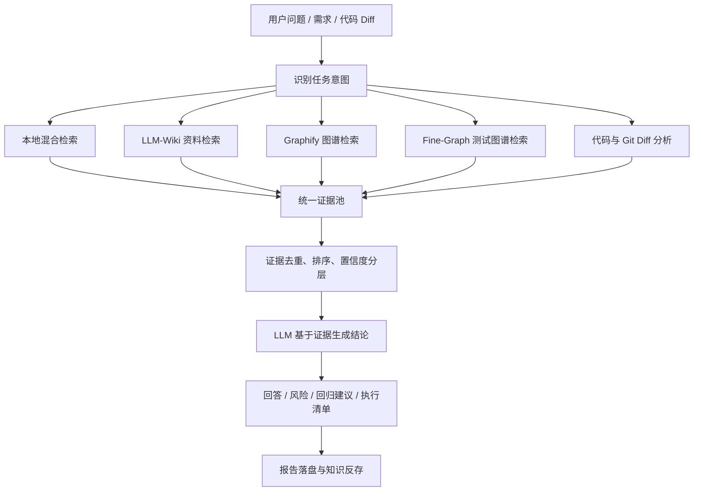
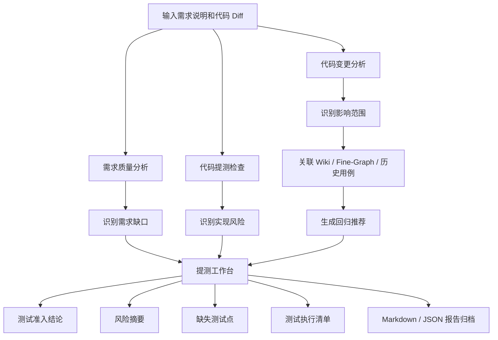
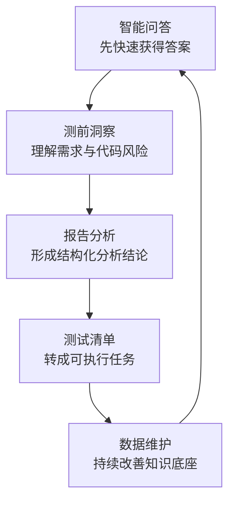
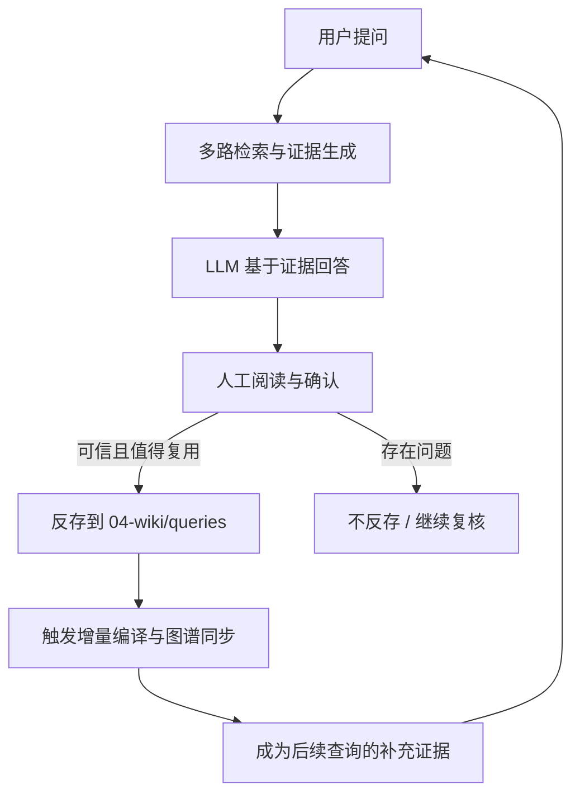
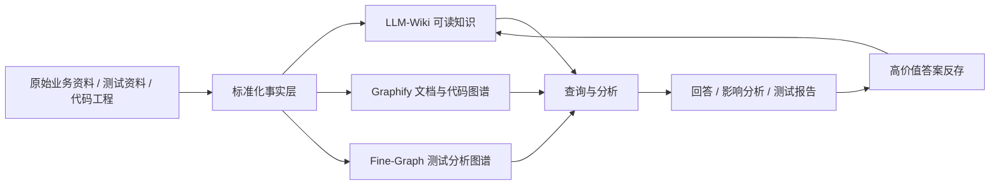
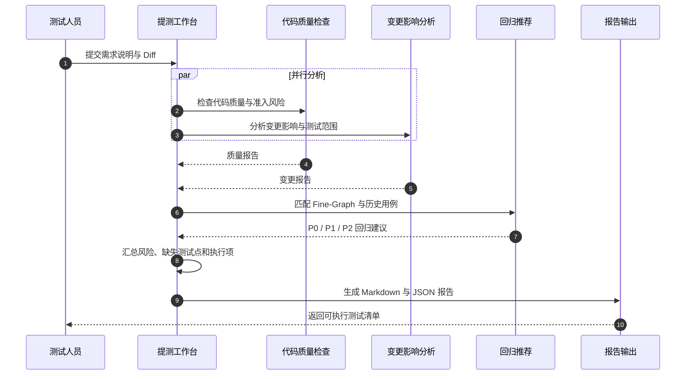
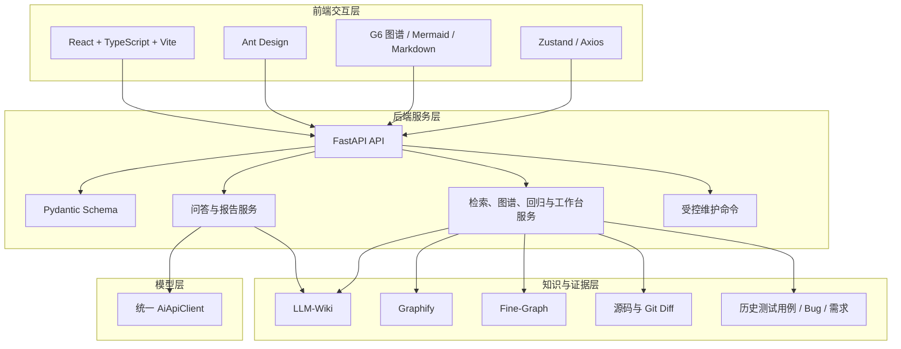

# 从“问知识库”到“完成一次提测判断”：我们如何打造面向测试人员的 LLM-Wiki-Code

> 一套真正有用的 AI 测试平台，不应该只会回答问题。  
> 它还应该能够告诉测试人员：这次改动影响哪里、风险有多高、哪些用例必须执行、哪些结论有证据、哪些地方仍需人工复核。

---

## 一、测试工作中，最昂贵的往往不是执行，而是判断

一个新需求进入测试阶段时，测试人员经常需要同时回答很多问题：

- 需求描述是否完整，是否存在口径冲突？
- 这个功能过去是怎么实现的？
- 代码改动影响了哪些模块、接口和业务流程？
- 历史上是否出现过类似 Bug？
- 哪些测试用例可以复用？
- 哪些场景必须回归，哪些场景可以降低优先级？
- 当前结论来自真实代码、业务文档，还是模型推断？

这些问题看起来分散，背后却指向同一个矛盾：

**企业内部并不缺资料，缺的是把资料转化为可靠判断的能力。**

业务文档在 Wiki，测试用例在文件或平台，Bug 在缺陷系统，真实逻辑藏在代码中，历史经验则散落在聊天记录和测试人员脑海里。即使接入大模型，如果只是把问题原样交给模型，也很容易得到“语言流畅，但无法验证”的答案。

`LLM-Wiki-Code` 正是在这样的背景下诞生的。

它最初是一个面向测试人员的 Wiki 与 Code 知识库查询平台，随后逐步扩展出混合检索、图谱分析、代码变更分析、回归推荐、需求质量分析、测试工期评估、测试用例生成和提测工作台等能力。

更重要的是，项目在演进过程中逐渐形成了一个明确方向：

> 从“帮助测试人员查询知识”，走向“帮助测试人员完成一次提测判断”。

---

## 二、这不是一个简单的聊天机器人

如果只看界面，`LLM-Wiki-Code` 有智能问答入口，也能生成 Markdown 报告，很容易被理解为又一个“企业知识库 + 大模型”应用。

但它真正想解决的问题，不是让模型知道更多，而是让模型在回答之前，先找到足够可信、足够相关、可以追溯的证据。

平台中的一次回答，大致需要经过以下过程：



这里有一个非常关键的设计原则：

**模型负责理解、组织和表达，事实证据尽量来自本地知识资产、图谱和真实代码。**

平台并不把大模型当作事实数据库，而是把它当作一个能够阅读证据、解释关系、组织结论的分析者。

---

## 三、项目要解决的六个核心问题

| 核心问题 | 传统做法 | LLM-Wiki-Code 的处理方式 |
|---|---|---|
| 资料分散 | 人工在多个系统搜索 | 将 Wiki、标准化资料、图谱、代码和历史答案统一召回 |
| 搜索结果不完整 | 依赖单一关键词或个人经验 | BM25、精确关键词、语义召回、图谱检索多路融合 |
| 模型回答不可验证 | 只看到自然语言结论 | 返回证据路径、片段、类型、排序原因和置信度 |
| 代码与业务语言不一致 | 人工把英文类名映射到中文业务 | 通过业务别名、`meta.md` 和图谱桥接代码符号与业务概念 |
| 回归范围依赖经验 | 测试人员人工阅读 diff | 从 diff、业务关键词、Fine-Graph 和历史用例生成回归建议 |
| 分析结果难以落地 | 报告看完即结束 | 生成测试准入结论、缺失测试点、执行清单，并支持归档 |

从产品角度看，这些能力最终服务于五个最实际的问题：

```text
1. 这次要测什么？
2. 哪些内容必须测？
3. 哪些风险最大？
4. 哪些历史资产可以复用？
5. 最终如何形成可交付的测试报告？
```

---

## 四、项目功能全景：从问答、洞察到执行

当前平台按使用阶段组织为五类能力。

| 能力域 | 主要功能 | 直接产出 |
|---|---|---|
| 智能问答 | 业务问答、代码问答、代码业务规则反推 | 基于证据的回答、业务规则文档 |
| 测前洞察 | 需求质量分析、测试工期评估、测试用例生成、代码提测检查、代码变更分析、提测工作台 | 需求问题、工期拆解、风险和影响范围 |
| 报告分析 | 测试报告、关系链分析、覆盖分析 | 专项报告、关系索引、覆盖盲区 |
| 测试清单 | 回归推荐、测试工作台 | P0/P1/P2 回归项、可执行测试清单 |
| 数据维护 | Wiki/Code 数据维护、质量检查、待复核队列、图谱、资产总览 | 可持续维护的知识资产 |

这些功能并不是简单平铺。它们可以被串成一次完整的提测分析流程：



### 1. 智能问答：不是直接问模型，而是先查证据

用户可以选择 Wiki 业务问答或 Code 代码问答。

平台会自动识别问题意图，也允许用户明确选择：

- **业务规则模式**：直接回答定义、流程、口径和字段含义，避免套用测试报告模板。
- **测试评估模式**：输出测试范围、风险点、回归建议和待复核项。

前端还会展示每个检索节点召回了多少证据，让用户看到答案是如何形成的。

### 2. 代码业务规则反推：从生产代码生成产品视角文档

很多系统运行多年后，真实业务规则并不完全存在于 PRD 中，而是沉淀在控制器、服务、状态判断、异常分支、补偿任务和外部系统交互里。

平台可以从代码图谱和源码证据反推业务规则，并生成面向产品、业务、测试和研发共同评审的文档，内容包括：

- 系统定位与业务流程
- 业务规则表
- 状态、异常和补偿逻辑
- 外部系统交互
- 代码名词中文释义
- 统一术语表
- 证据索引与待复核项

生成结果支持 Markdown 和 HTML 下载，并落盘到业务 Wiki 的报告目录中。

### 3. 覆盖分析：识别“知识有定义，但测试没有覆盖”的盲区

覆盖分析读取 `meta.md` 中的业务模块、功能关键词、页面关键词、接口关键词、Bug 关键词和风险关键词，再与历史测试用例匹配。

它可以回答：

- 哪些业务关键词没有任何测试用例命中？
- 哪些领域只有少量用例，可能覆盖不足？
- 哪些历史用例可以成为本次测试的候选集合？

### 4. 待复核队列：把不确定性显式暴露出来

图谱和模型都可能产生推断。平台不会把所有关系包装成确定事实，而是将证据区分为：

| 置信度 | 含义 | 使用原则 |
|---|---|---|
| `EXTRACTED` | 从资料或代码中明确抽取 | 可作为主要结论依据 |
| `INFERRED` | 根据关系或上下文推断 | 可用于扩展分析，需要校验 |
| `AMBIGUOUS` | 存在歧义或弱相关 | 只能作为待复核线索 |

待复核队列还会汇总 Wiki 中的待验证段落、断链、孤立页面、缺少来源等治理问题。

### 5. 回归推荐：把英文代码变更桥接到中文测试资产

真实代码中可能出现：

```text
CarDetectionReportController
getDetectionReport
PaymentService
LeadPushTask
```

而测试用例和业务资料中使用的却是：

```text
检测报告
支付
线索推送
```

平台通过代码业务别名、`meta.md` 关键词和 Fine-Graph 特征节点建立桥接，再从变更影响到的 Feature 出发，寻找关联测试证据，并输出：

- `MUST`：必须回归
- `SHOULD`：建议回归
- `OPTIONAL`：可选回归

每条推荐都保留命中原因、证据节点和评分，方便测试负责人裁剪，而不是让系统替代最终判断。

### 6. 前端功能菜单详解：每个入口分别解决什么问题

平台前端不是按照 Wiki、图谱、代码等底层技术名词简单罗列页面，而是逐步收敛为更贴近测试工作过程的五个一级菜单：



页面顶部提供统一项目选择器。进入 Wiki 类页面时切换业务线知识库，进入 Code 类页面时切换代码工程，减少用户在不同功能中反复配置项目上下文的成本。

#### 智能问答

| 二级菜单 | 页面功能 | 主要输出 | 功能亮点 |
|---|---|---|---|
| 业务问答 | 查询业务规则、概念定义、历史资料和测试范围 | 基于 Wiki 证据的回答、证据列表、检索过程 | 支持智能识别、业务规则、测试评估三种回答方式；回答可下载、可反存 |
| 代码问答 | 查询接口影响、字段含义、调用关系和源码业务逻辑 | 基于源码与代码图谱的回答 | 可按主题从生产代码反推业务规则，并下载 Markdown/HTML 文档 |

业务问答和代码问答页面并不只展示最终答案。用户还可以看到：

- 当前采用的检索策略；
- 本地混合检索、LLM-Wiki、Graphify、Fine-Graph 等节点的执行过程；
- 每个节点召回的证据数量；
- 最终入选证据的路径、片段、置信度和选择原因；
- Markdown 与 HTML 格式的可下载报告。

#### 测前洞察

| 二级菜单 | 页面功能 | 适合使用的时机 | 主要输出 |
|---|---|---|---|
| 需求质量分析 | 从产品经理自查和测试人员评审视角检查需求 | 需求评审、测试介入前 | 质量评分、问题清单、待澄清问题、提测建议、Markdown 报告 |
| 测试工期评估 | 根据需求内容、端类型、业务复杂度和测试关注点估算工作量 | 排期、资源协调前 | 场景拆解、阶段工期、回归工作量、HTML 报告 |
| 测试用例生成 | 基于需求文档和代码图谱证据生成测试点与用例 | 用例设计阶段 | 当前为能力说明和后续接入入口 |
| 代码提测检查 | 从代码质量和测试准入角度检查本次变更 | 开发提测前 | 质量问题、风险评级、准入结论、开发修复项、测试关注点 |
| 代码变更分析 | 从测试视角分析 Git Diff 或手工 Diff | Code Review、回归范围评审 | 影响范围、调用链、风险等级、用例建议、自动化建议、资料冲突 |
| 提测工作台 | 编排代码检查、变更分析和回归推荐 | 正式进入测试前 | 准入结论、风险摘要、影响范围、缺失测试点、执行清单 |

其中，“提测工作台”是测前洞察的聚合入口。测试人员只需要输入需求说明和 Diff，平台就会并行运行多个分析服务，并把分散结果重新组织成一份可以执行和交付的提测分析报告。

#### 报告分析

| 二级菜单 | 页面功能 | 支持能力 | 主要价值 |
|---|---|---|---|
| 测试报告 | 生成查询、影响、用例或 Bug 专项报告 | 支持 `llm-wiki`、`graphify`、`fine-graph`、`combined`、`combined-fine` 五种数据源模式 | 按任务选择知识源，并支持报告落盘与反存 |
| 关系链分析 | 构建并查看需求、用例、Bug 之间的关系索引 | 展示覆盖率、实体数、关系数、高风险断链、歧义关系和证据 | 让测试覆盖与断链风险可以被量化和追溯 |
| 覆盖分析 | 将 `meta.md` 中的业务关键词与历史用例匹配 | 按业务模块、功能、页面、接口、Bug、风险等维度展示覆盖 | 快速发现零覆盖和低覆盖盲区 |

测试报告页面允许用户主动选择报告类型和数据源模式。例如：

- 只想查询业务资料时，选择 `llm-wiki`；
- 想查看结构关系时，选择 `graphify`；
- 想分析测试点和风险时，选择 `fine-graph`；
- 需要综合判断时，选择 `combined-fine`。

这种设计把“系统自动检索”与“专家主动控制数据源”结合起来。普通用户可以使用默认模式，高级用户也可以明确指定分析链路。

#### 测试清单

| 二级菜单 | 页面功能 | 核心输入 | 主要输出 |
|---|---|---|---|
| 回归推荐 | 根据代码变更推荐历史回归用例 | Git Diff 或手工 Diff | 必跑、建议跑、可选用例，以及评分和命中原因 |
| 测试工作台 | 将提测分析结果转成可执行测试任务 | 需求说明与代码变更 | 测试项、优先级、执行方式、数据准备、预期结果 |

同一个提测工作台同时出现在“测前洞察”和“测试清单”中，是因为它承担了两个阶段的连接作用：

- 在测前阶段，它用于判断风险和测试准入；
- 在执行阶段，它用于查看和导出最终测试任务。

#### 数据维护

| 二级菜单 | 页面功能 | 维护对象 | 功能亮点 |
|---|---|---|---|
| Wiki 数据维护 | 新建知识库项目、上传资料、编辑 `meta.md`、执行构建动作 | 需求、用例、Bug、笔记、知识页和图谱 | 支持增量编译、全量重编、一键更新、Graphify 同步和 Fine-Graph 构建 |
| Code 数据维护 | 查看代码项目状态和图谱维护能力 | 代码工程及代码图谱 | 为代码资产更新与图谱重建提供统一入口 |
| 质量检查 | 执行 Wiki Lint 并分类展示问题 | Wiki 页面、来源、链接、索引和结构 | 将脚本输出转成可读的问题看板 |
| 待复核队列 | 聚合不确定关系、待验证内容和 Lint 告警 | `AMBIGUOUS` 边、`INFERRED` 边、待验证段落、质量问题 | 支持按严重级别和来源筛选 |
| Wiki 图谱 | 浏览 Wiki 与 Fine-Graph 图谱 | 文档节点、业务特征、测试证据和关系 | 支持置信度筛选、节点详情和邻居关系查看 |
| Code 图谱 | 浏览代码工程图谱 | 类、方法、文件、调用与依赖关系 | 从代码结构进入源码证据和关联节点 |
| Wiki 资产总览 | 查看 Wiki 资料和图谱规模 | 标准化资料、知识页、图谱和报告 | 快速判断知识库是否完整、是否需要维护 |
| Code 资产总览 | 查看代码图谱和报告状态 | 代码工程、Graphify 产物和更新时间 | 快速判断代码知识资产是否可用 |

数据维护页面中的构建动作采用白名单命令执行，并带有确认弹窗、超时控制、退出码和日志展示。平台既让非命令行用户可以维护知识库，也避免前端任意执行脚本带来的风险。

### 7. 容易被忽略的功能亮点

#### 知识资料反存：让一次高质量回答进入长期知识循环

很多知识库问答系统存在一个问题：今天问过的问题，明天仍然要从头检索和回答。即使人工已经确认某次回答非常准确，它也不会自动成为下一次查询的知识。

`LLM-Wiki-Code` 提供了两种知识反存入口：

1. 在业务问答页面，对人工确认可信、可复用的回答点击“反存”；
2. 在测试报告页面生成报告时，打开“反存到 `queries/`”开关。

反存流程不是把一段模型回答悄悄写入数据库，而是显式形成可治理的知识资产：



反存内容会附带来源、反存时间和人工确认提示，并写入原项目的 `04-wiki/queries/`。后续查询会把它作为低权重补充证据使用。

这项能力带来了三个变化：

- **把个人经验变成团队资产**：一次排查结论不再只停留在聊天窗口；
- **让知识库越用越丰富**：高频问题和人工确认结论持续沉淀；
- **保留人工质量闸门**：只有用户主动确认后才反存，避免模型输出污染事实库。

#### 检索链路可视化：不仅给答案，也解释答案怎么来的

平台会把查询过程记录为 `ChatTraceStep`，前端展示关键词抽取、各类检索、证据去重与报告生成步骤。用户可以据此判断：

- 是没有相关资料，还是资料没有被召回；
- 答案主要来自 Wiki、源码还是图谱；
- 某个检索通道是否失败；
- 当前回答为什么被标记为需要复核。

这对于调试知识库质量和提升用户信任都非常重要。

#### 报告即交付物：查询结果可以下载、落盘和继续复用

平台中的多个页面支持输出真实报告，而不是只在页面中展示一段文本：

| 功能 | 支持的交付方式 |
|---|---|
| 智能问答 | 下载 Markdown、下载 HTML、人工确认后反存 |
| 代码业务规则反推 | 报告落盘、下载 Markdown、下载 HTML、复制路径 |
| 需求质量分析 | 下载 Markdown |
| 测试工期评估 | 下载 HTML |
| 代码提测检查 | 下载 Markdown、下载 HTML |
| 代码变更分析 | 下载 Markdown、下载 HTML |
| 提测工作台 | 下载 Markdown、下载 HTML、保存 Markdown 与 JSON |
| 测试报告 | 输出报告文件，可选反存到 `queries/` |

这种“结果可交付”的设计让平台更容易进入真实工作流：报告可以进入评审、测试计划、项目群沟通或后续归档，而不是停留在一次会话中。

#### 业务规则反推：让代码资产服务产品与测试沟通

代码问答页面提供独立的“业务规则反推”入口。用户输入业务主题后，系统会使用代码图谱优先策略检索证据，并按产品需求文档视角生成业务规则。

与普通代码解释不同，它要求输出业务流程、规则表、状态、异常、补偿逻辑、外部交互、术语表和证据索引。这样可以把“只有研发理解的代码逻辑”转化为产品、测试和业务都能参与评审的文档。

#### 统一证据置信度：让治理能力贯穿多个页面

`EXTRACTED / INFERRED / AMBIGUOUS` 不只是图谱页面上的颜色标签，它同时影响：

- 智能问答中证据如何被使用；
- 图谱节点和关系如何筛选；
- 关系链分析如何识别歧义关系；
- 待复核队列如何确定优先级；
- 报告中哪些内容可以形成主结论，哪些必须标记为待复核。

这使“证据可信度”成为贯穿查询、分析、治理和交付的共同语言。

---

## 五、三层知识体系：可读知识、关系图谱、测试风险图谱

这套系统的知识底座并不是一个目录，而是三种互补的知识表达。

| 层级 | 核心组件 | 擅长解决的问题 |
|---|---|---|
| 可读知识层 | LLM-Wiki | 业务说明、概念、历史资料、主题导航 |
| 关系图谱层 | Graphify | 模块关系、调用路径、代码与文档结构 |
| 测试分析层 | Fine-Graph | 测试点、风险、状态、Bug、证据关联 |

可以把它们理解为：

- `LLM-Wiki` 把资料变成“人和模型都容易阅读的知识”；
- `Graphify` 把资料与代码变成“可以沿关系分析的图”；
- `Fine-Graph` 把知识进一步组织成“面向测试决策的风险图”。

完整的数据闭环如下：



其中，高质量查询结果可以被反存到 `queries/`，成为后续检索的补充证据。系统因此不是一次性问答工具，而是在使用过程中持续积累经过确认的项目知识。

---

## 六、技术亮点一：本地混合检索，不把所有希望押在向量数据库上

平台的主召回链路内置了一个轻量混合检索服务：

```text
用户问题 + 上游关键词
-> 本地文件扫描
-> BM25 风格排序
-> 精确关键词排序
-> RRF 融合
-> Top N 证据
```

为什么这样做？

在企业测试场景中，“支付”“检测报告”“线索推送”“订单状态”等专有业务词通常非常稳定。精确关键词和 BM25 对这类事实检索具有很强的可解释性，而且不依赖额外的在线向量服务。

与此同时，系统保留 QMD 作为可选语义召回，并用 Graphify 和 Fine-Graph 补充关系型证据。

### RRF 融合的核心逻辑

BM25 分数和精确关键词分数不在同一个尺度上，直接相加容易产生偏差。项目使用 RRF（Reciprocal Rank Fusion，倒数排名融合）只根据名次合并多路结果：

```python
def _fuse_by_rrf(self, ranked_lists):
    scores = {}
    documents = {}
    channels = {}

    for ranked in ranked_lists:
        for rank, (doc, _score, channel) in enumerate(ranked, start=1):
            scores[doc.doc_id] = scores.get(doc.doc_id, 0.0) + 1 / (60 + rank)
            documents[doc.doc_id] = doc
            channels.setdefault(doc.doc_id, []).append(channel)

    fused = [
        (documents[doc_id], score, channels[doc_id])
        for doc_id, score in scores.items()
    ]
    return sorted(fused, key=lambda item: -item[1])
```

这段逻辑很朴素，却体现了项目的一个重要思想：

> 优先选择简单、稳定、可解释的技术组合，再用模型和图谱补充其能力边界。

---

## 七、技术亮点二：证据优先，让 AI 回答可以被审查

智能问答的核心入口并不是简单的：

```python
answer = llm(question)
```

而是先组装证据，再让模型基于证据回答：

```python
evidence_text = "\n".join(
    f"- [{item.kind}] {item.title}\n"
    f"  路径: {item.path}\n"
    f"  置信度: {item.confidence or 'UNKNOWN'}\n"
    f"  摘要: {item.snippet}"
    for item in evidence
)

messages = [
    {"role": "system", "content": system_prompt},
    {
        "role": "user",
        "content": (
            f"项目: {project}\n"
            f"问题: {question}\n\n"
            f"可用证据:\n{evidence_text or '未找到本地证据'}"
        ),
    },
]
```

模型提示词还明确要求：

- 代码与 Wiki 冲突时，以最新代码证据为准，并标记冲突；
- `EXTRACTED` 可作为主结论；
- `INFERRED` 只能作为关联扩展；
- `AMBIGUOUS` 必须作为待复核线索；
- 证据不足时必须说明缺口。

这让“AI 生成答案”变成了“AI 基于证据形成可审查结论”。

---

## 八、技术亮点三：用编排代替堆功能

平台最有价值的能力之一，是提测工作台。

它没有再造一个新的大模型功能，而是编排现有服务：

1. 并行执行代码质量检查和变更分析；
2. 根据 diff 生成回归推荐；
3. 汇总风险等级与影响范围；
4. 识别缺失测试点；
5. 形成测试准入结论与执行清单；
6. 将结果保存为 Markdown 和结构化 JSON。

核心编排逻辑如下：

```python
with ThreadPoolExecutor(max_workers=2) as executor:
    quality_future = executor.submit(
        self.inspection_service.inspect,
        project=code_project,
        question=self._quality_question(payload),
        diff_text=payload.diff_text,
        use_git_diff=payload.use_git_diff,
    )
    change_future = executor.submit(
        self.review_test_service.review,
        project=code_project,
        question=self._change_question(payload),
        diff_text=payload.diff_text,
        use_git_diff=payload.use_git_diff,
    )

    quality_report = quality_future.result()
    change_report = change_future.result()

regression = self.regression_service.recommend(code_project, regression_request)
```

这里没有让模型重复判断所有事情。

例如，风险等级、测试准入结论和执行项优先级会结合客观信号生成。这样既减少模型调用成本，也让最终结论更稳定。



---

## 九、技术亮点四：把“关系”作为一等公民

传统知识库擅长回答“文档里写了什么”，但测试分析还经常需要回答：

- 这个需求被哪些用例覆盖？
- 哪些 Bug 与当前功能相关？
- 哪个代码变更可能影响某个业务特征？
- 哪些关系来自明确事实，哪些只是推断？

项目通过可追溯索引把 Requirement、Testcase、Bug 和 Code 组织成关系链。

当前实现会从标准化 Markdown 中抽取实体，再根据关键词和 Fine-Graph 关系构建：

```text
Requirement --covered_by--> Testcase
Testcase --verifies--> Requirement
Testcase --detects--> Bug
Feature --supported_by--> Evidence
```

关系链的意义，不只是展示一张图，而是为覆盖分析、回归推荐、风险识别和报告证据提供共同底座。

---

## 十、技术架构与技术栈

项目采用前后端分离架构，并复用相邻 `tcc-llm-wiki` 项目中的知识资产和 AI 调用能力。



### 技术栈一览

| 层级 | 技术与组件 | 主要职责 |
|---|---|---|
| 前端 | React 18、TypeScript、Vite | 页面和交互 |
| UI | Ant Design | 后台工作台界面 |
| 图谱与内容渲染 | AntV G6、Mermaid、React Markdown | 图谱、流程图、报告展示 |
| 状态与请求 | Zustand、Axios | 项目选择、菜单状态、API 调用 |
| 后端 | FastAPI、Pydantic、Uvicorn | API、参数校验、服务编排 |
| 本地检索 | Python 内置实现的 BM25 风格评分、精确关键词、RRF | 可解释召回 |
| 知识组织 | LLM-Wiki、Graphify、Fine-Graph | 可读知识、关系图谱、测试图谱 |
| AI 调用 | 统一 `AiApiClient` | 基于证据生成回答与报告 |
| 工程工具 | uv、pytest | 依赖管理与自动化测试 |

从当前仓库结构看，后端采用清晰的分层：

```text
API 路由
-> Pydantic 请求/响应模型
-> 领域服务
-> 本地知识资产、代码、图谱与模型客户端
```

前端则围绕五类工作区组织页面，通过统一项目选择器在 Wiki 项目与 Code 项目之间切换。

---

## 十一、这套系统背后的设计思想

### 1. AI 不应该替代证据

模型可以总结，但不能成为唯一事实来源。任何关键结论都应该尽可能指向文档路径、代码位置、图谱节点或历史用例。

### 2. 不确定性应该被展示，而不是被隐藏

很多 AI 产品的问题不是会犯错，而是把推断说得像事实。`EXTRACTED / INFERRED / AMBIGUOUS` 的分层，让用户知道哪些内容可以直接采用，哪些内容需要人工判断。

### 3. 图谱是分析工具，不是最终产品

用户通常不是为了“看一张图”而来，而是为了知道影响范围和测试风险。图谱真正的价值，是成为问答、关系链、回归推荐和提测分析的底层能力。

### 4. 高价值功能必须进入工作流

单独的覆盖热图、关系链或图谱页面，对知识治理很有价值，但测试人员更需要一个能够直接完成工作任务的入口。

因此，平台正在把底层能力重新编排进“提测分析 -> 回归推荐 -> 测试执行清单 -> 报告归档”的主流程。

### 5. 人始终保留最终判断权

平台输出的是证据、建议和结构化结论，而不是代替测试负责人作出不可解释的决定。

---

## 十二、平台真正带来的变化

使用这套系统之前，一次提测分析可能是：

```text
读需求 -> 问开发 -> 搜历史文档 -> 看代码 -> 找旧用例
-> 凭经验判断影响范围 -> 手工整理测试清单
```

使用这套系统之后，流程可以变为：

```text
输入需求与 Diff
-> 自动检索业务和代码证据
-> 自动识别风险与影响范围
-> 自动关联历史用例和 Bug
-> 输出回归优先级与缺失测试点
-> 生成可执行测试清单
-> 人工复核并归档
```

这并不意味着测试人员不再需要理解业务和代码。

恰恰相反，它把测试人员从大量重复搜索、资料拼接和格式整理中释放出来，让人把时间投入到更有价值的工作：判断证据是否可靠、发现系统未覆盖的风险、设计真正有洞察力的测试。

---

## 十三、必须诚实面对的边界

`LLM-Wiki-Code` 当前已经具备较完整的工具能力，但它仍然在从“知识与代码资产工具箱”向“测试决策系统”演进。

当前边界包括：

- 知识质量仍依赖原始资料、`meta.md` 和历史测试资产质量；
- 代码符号与中文业务概念的映射仍需要持续维护；
- 关系链中的部分关系来自关键词或图谱推断，需要人工复核；
- 图谱、覆盖分析和待复核队列更偏底层治理能力，必须进入主工作流才能释放价值；
- 回归推荐适合生成候选范围，不能替代测试负责人最终裁剪；
- 第一阶段仍以本地项目白名单和既定目录结构为主。

项目当前最值得继续投入的方向，不是再增加更多孤立功能，而是打磨一个更强的主流程：

```text
需求说明 + 代码 Diff
-> 一句话测试准入结论
-> 变更影响范围
-> 重点风险
-> 必跑 / 建议跑 / 可选回归用例
-> 缺失测试点
-> 最终测试执行清单
-> 可追溯交付报告
```

---

## 十四、结语：AI 测试平台的终点，不是“会回答”

今天，构建一个能够接入大模型、上传文档并进行问答的应用已经不难。

真正困难的是：

- 如何让答案建立在真实项目证据上；
- 如何把业务资料、测试资产和代码变更连接起来；
- 如何诚实表达推断与不确定性；
- 如何把分析结果转化成可执行、可复核、可归档的工作成果。

`LLM-Wiki-Code` 的探索给出了一个务实答案：

> 不把 AI 当作无所不知的专家，而是把它放进一条有知识、有图谱、有代码、有证据、有人工复核的工程链路中。

当系统能够在测试人员拿到需求和代码变更后的几分钟内，帮助回答“测什么、为什么、风险在哪里、证据是什么”，它才真正从一个聊天窗口，成长为测试决策基础设施。

而这，也许才是企业内部 AI 工具最值得追求的方向。
