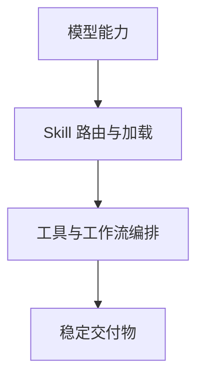

# 我认真拆了一个 Awesome Skills 仓库，发现 AI Agent 真正的门槛已经不是模型了


最近看了一遍 `ForceInjection/awesome-skills` 这个仓库，最大的感受不是“这里面收录了很多技能”，而是它把一个趋势讲得很清楚：

**AI Agent 的竞争，正在从“模型能力”转向“技能系统能力”。**


大模型决定你“会不会”，Skill 决定你“能不能稳定做成”。

这个仓库真正值得看的地方：

- 它到底收录了什么
- 为什么这些 Skill 不是简单 prompt 模板
- 一个生产级 Skill 应该如何设计
- 为什么未来 AI Agent 的差距，会越来越体现在 Skill System 上
- 如果你自己也想做一套 Skill 库，应该先从哪里开始

## 30 秒版本

一句话总结：**`awesome-skills` 不是一个“提示词合集”，而是一套围绕 Agent 工作流、知识封装和工程规范展开的能力库。**

如果你只看结果，可以先记住三点：

1. 好的 Skill 不只是会输出内容，而是能封装流程、约束边界、定义交付标准。
2. 真正强的 Agent，不是裸奔的大模型，而是挂载了一组可复用 Skills 的系统。
3. 未来谁能把 Skills 做成体系，谁的 AI 工作流就更接近“稳定生产力”而不是“偶尔灵光一现”。

---

## 一、这个仓库到底是什么

`ForceInjection/awesome-skills` 的定位非常明确。

它不是一个泛泛的 AI 资源目录，也不是单纯展示“我写过哪些 prompt”。它更像一个围绕 **认知技能、代码理解、文档生成、项目分析、规范驱动开发** 展开的 Agent Skill 合集。

仓库开头就把目标说得很直接：

> 通过自动化工作流和多智能体协作，帮助开发者深入理解代码库结构、提取核心业务逻辑，并生成结构化技术文档。

这个定位很重要。

因为它说明了一件事，这个仓库不是在追求“让 AI 多会一点”，而是在追求：

> **让 AI 在复杂工程任务里，以更稳定、更可验证的方式交付结果。**

从目录上看，它主要分成几块：

```text
awesome-skills
├── 核心技能介绍
├── 核心设计理念
├── Agent Skill 最佳实践
├── 深度解析案例
├── 推荐参考资源
└── Skill 单元测试
```

这几个模块拼在一起，其实已经很像一个完整的方法论了。

不是只给你技能名称，而是把下面这些东西一起交代清楚：

- 技能到底解决什么问题
- 技能应该怎么设计
- 为什么这么设计
- 参考了哪些工程实践
- 怎么测试，怎么保证它不退化

这就是它和很多“技能合集”最大的差别。

---

## 二、最值得看的，不是技能数量，而是技能类型

这个仓库里最吸引我的，不是数量，而是它选的 Skill 类型很有代表性。

它收录的不是那种“让 AI 帮你写一句文案”的轻型玩法，而是更偏**工程型、知识型、流程型**的能力模块。

比如它的核心技能里就有这些：

| Skill | 解决的问题 | 关键词 |
|---|---|---|
| `code-reader` | 深度阅读陌生代码库，提炼模块知识 | 代码认知、验证闭环、多智能体协作 |
| `project-analyzer` | 对项目做逆向工程和架构分析 | 架构深挖、静态分析、全局报告 |
| `dir-organizer` | 规范化目录结构并更新引用 | 重构计划、用户确认、结构整理 |
| `doc-reviewer` | 评审技术文档质量和规范 | 文档一致性、排版规范、自动修复 |
| `update-submitter` | 自动分析变更并生成规范 commit | Git 提交、逻辑分组、Conventional Commits |
| `openspec-assistant` | 规范驱动开发辅助 | SDD、Spec、代码与测试协同 |
| `web-content-downloader` | 抓取网页正文并转 Markdown | 内容本地化、图片抽取、表格转换 |
| `md-link-checker` | 检查 Markdown 内外链健康度 | 文档巡检、并发扫描、缓存优化 |
| `drawio-designer` | 设计与导出 draw.io 架构图 | XML 控制、架构制图、自动导出 |

你会发现，这些 Skill 有个共同点：

**它们都不是单轮问答，而是需要流程、规则和交付物的复杂任务。**

这就很关键。

因为真正能把 AI 用进工作流的人，最终都会面对这类问题：

- 不是“写一段话”，而是“把一篇技术文档整理到能发”
- 不是“看一段代码”，而是“把整个仓库分析出结构结论”
- 不是“帮我提交代码”，而是“分析改动、分组、拟定提交计划并等我确认”

也就是说，这个仓库展示的不是 AI 的表演能力，而是 AI 的**工程执行能力**。

---

## 三、这个仓库最硬核的地方，是它把 Skill 做成了“工作流单元”

很多人会把 Skill 理解成 prompt 模板。

但认真看这个仓库之后，你会发现，这种理解其实太浅了。

这里的 Skill，更像一个“带边界的微工作流”。

一个典型 Skill 往往不只是告诉 Agent “要做什么”，而是同时定义了：

- 适用场景
- 角色分工
- 执行顺序
- 验证机制
- 输出结构
- 风险边界

以 `code-reader` 为例，它不是简单地“总结代码”。

它设计了一个多智能体验证闭环：

- 技术作者负责提炼认知
- QA 工程师负责出测试题
- 初级开发者只根据文档作答
- 再用“闭卷考试”的方式验证文档是否真的足够准确

这个思路非常妙。

因为很多 AI 代码总结的问题，不是它完全错，而是它“看起来懂了，实际没讲透”。

而这个 Skill 的价值就在于，它不是只追求“生成一份总结”，而是通过验证机制逼近“真正可复用的模块知识”。

同样的，`project-analyzer` 也不是只扫一遍代码结构就结束，而是把：

- 代码逻辑
- 构建流程
- 测试体系
- 部署方式
- 架构报告

整合成一套面向第三方项目逆向分析的完整链路。

这背后反映的是一个很清楚的设计思路：

> **Skill 不是一段提示词，而是把经验、顺序、边界和标准打包成一个可以反复调用的能力单元。**

---

## 四、我特别认同它的两个设计理念

这个仓库里有两个设计理念，我觉得非常值得所有做 Agent 的人认真看一遍。

### 1. 受众隔离：给 AI 看的和给人看的，不要混在一起

仓库明确提出了一套语言规范：

- 面向 Agent / LLM 的 `SKILL.md`、prompt 模板，优先纯英文
- 面向人类开发者交付的报告、文档，优先纯中文

这背后的逻辑很实在。

一方面，英文指令在很多大模型里依然更稳定，更利于约束执行细节。另一方面，最终交付给人看的技术文档，如果目标用户本来就是中文开发者，那中文输出更直接、更专业，也更利于团队协作。

这其实是一个很容易被忽略，但非常重要的原则：

> **不要让“给模型看的控制指令”和“给人看的交付内容”互相污染。**

很多 Agent 项目后面越来越乱，往往就是因为这两层混在一起了。

### 2. 输出 Skill，而不是生成一堆专用 Agent

仓库里还有一个我很认同的判断：

`code-reader` 的输出是每个模块的 `SKILL.md`，而不是为每个模块生成一个新的 Agent。

这代表了一种更轻量、更可扩展的思路。

如果每分析一个模块就造一个 Agent，最后系统会非常臃肿：

- 角色越来越多
- 提示词越来越分散
- 能力边界越来越难维护

而如果输出的是 `SKILL.md`，那本质上是在生成一张“技能卡”。

任何通用 Agent 只要在需要的时候挂载这张技能卡，就能临时获得对应模块的上下文和操作规范。

这就像：

- Agent 是人
- Skill 是技能书

技能书可以按需学，没必要每学一个技能就复制一个新的人出来。

这个比喻虽然简单，但特别准确。

---

## 五、它给出的 Skill 最佳实践，几乎就是一份生产级清单

如果你想知道一个 Skill 到底该怎么写，这个仓库的第三部分特别值得看。

它没有停留在概念层，而是把生产级 Skill 的几个关键原则讲得很具体。

### 1. 目录结构要解耦

它推荐把 Skill 拆成这种结构：

```text
skill-name/
├── SKILL.md
├── scripts/
├── references/
└── assets/
```

这个结构的好处很明显：

- `SKILL.md` 放核心规则
- `scripts/` 放原子执行脚本
- `references/` 放按需加载资料
- `assets/` 放静态资源

这比把所有东西全堆在一个 Markdown 文件里强太多了。

### 2. 触发描述必须精准

仓库提到一个很重要的黄金公式：

> **功能描述 + 触发场景 + 关键词**

这件事看起来简单，实际上是 Skill 能不能被正确路由的关键。

描述如果太泛，Agent 就容易误触发。描述如果太窄，又可能该触发的时候触发不了。

所以，Skill 的 `description` 不是注释，而是整个系统的路由入口。

### 3. 要做渐进式知识披露

这一点特别工程化。

它建议 Skill 按三层加载：

1. 元数据层，只常驻名称和描述
2. 核心指令层，触发后再加载 `SKILL.md`
3. 详细文档层，执行时按需读 `references/`

这其实就是在解决一个现实问题：

> 技能一多，上下文窗口一定会炸。

所以优秀 Skill 系统，不是“把所有知识都塞进来”，而是“只在需要的时候加载需要的部分”。

### 4. Skill 是有状态的

这一点很多人容易忽略。

仓库明确提醒：Agent Skill 不是无状态函数，它本质上是在动态修改对话上下文。

这意味着：

- 一个线程里不适合同时激活太多 Skill
- 复杂工作流更适合用 Skill 做编排，而不是并发乱跑

这个判断非常成熟。

### 5. Skill 也需要测试

仓库甚至给出了“技能测试金字塔”：

- 触发测试
- 功能测试
- 性能评估

并且专门做了 `unit-test` 目录来做自动化评估。

这件事我特别认同。

因为 Skill 一旦不测试，就很容易出现这种情况：

- 改了一版描述，误触发率飙升
- 加了一段规则，Token 成本暴涨
- 底层脚本改了，结果 Skill 表面能触发，实际已经失效

没有测试的 Skill，只能叫“实验品”。

有测试和回归验证的 Skill，才算“系统资产”。

---

## 六、这个仓库真正体现的，是 AI Agent 从“能用”走向“工程化可用”

我觉得 `awesome-skills` 最值得看的，不是具体哪一个 Skill，而是它整体上呈现出来的工程观。

它在传递一个非常清楚的信号：

**AI Agent 的下一阶段，不是拼谁能写出更长的 prompt，而是拼谁能把能力做成系统。**

这个系统里至少要有四层：



如果只有 A，没有 B、C、D，那就是裸模型。

裸模型可以聪明一时，但很难稳定产出。

而当你把 Skill、工具、验证机制和交付格式都加进去，Agent 才会从“偶尔好用”变成“可以接进工作流”。

这也是为什么我越来越觉得，未来真正拉开差距的，不只是模型选型，而是下面这些问题：

- 你有没有一套清晰的 Skill 库
- 你的 Skill 描述是否足够精准
- 你的流程有没有验证闭环
- 你的输出有没有交付标准
- 你的系统能不能持续迭代而不退化

说到底，**AI Agent 的产品力，越来越体现在 Skill System 上。**

---

## 七、如果你也想搭一套自己的 Skills，建议从这 5 类任务开始

如果你看完也想做自己的 Skill 库，我的建议是不要一上来就搞一个大而全框架。

先从高频、明确、可验证的任务下手。

### 1. 代码理解类

适合做成：
- 仓库阅读器
- 模块分析器
- API 关系梳理器

### 2. 文档治理类

适合做成：
- 文档评审器
- 链接检查器
- 格式规范器
- 翻译器

### 3. 内容抓取与整理类

适合做成：
- 网页转 Markdown
- 参考文献整理
- 多文档摘要对比

### 4. 工程操作类

适合做成：
- Git 提交助手
- 目录整理器
- 发布检查器
- 配置巡检器

### 5. 规范驱动开发类

适合做成：
- Spec 生成器
- 规范审查器
- 测试样例生成器
- 实现约束器

这 5 类任务的共同特点是：

- 高频重复
- 输入输出相对清晰
- 很适合定义边界
- 适合沉淀成长期资产

---

## 八、我看完这个仓库后的最终判断

如果让我用一句话总结 `awesome-skills` 的价值，我会这么说：

> **它不是在收集“AI 能做什么”，而是在沉淀“怎样让 AI 稳定地把事做成”。**

这中间的差别非常大。

前者更像 demo 思维。

后者是工程思维。

而未来真正有价值的 AI Agent，一定更接近后者。

因为企业不会为“偶尔好用”买单，团队也不会把核心流程交给一个不可预测的系统。

只有当 Skill、流程、测试、规范、验证机制都逐步成型，AI 才会从一个聪明的聊天对象，变成真正可托付的工作伙伴。

从这个角度看，`awesome-skills` 不只是一个仓库，它更像一份很有参考价值的路线图。

它提醒我们，接下来该卷的，不只是模型，更是：

- 技能设计
- 流程编排
- 验证机制
- 工程规范
- 长期可维护性

这才是 AI Agent 走向生产力的真正路径。

---

## 最小复刻清单

如果你想自己动手，建议按这个顺序开始：

1. 先列出你每周重复出现的 5 个任务
2. 选一个最容易标准化的任务先做成 Skill
3. 给它写清楚“适用场景”和“非适用场景”
4. 把执行顺序拆成 3 到 6 步
5. 明确最终输出格式和验收标准
6. 把危险操作单独标出来，默认不自动执行
7. 做最基本的触发测试和功能测试
8. 连续跑 5 次，记录失败模式
9. 再把它拆成脚本、参考文档和核心规则
10. 最后再考虑 Skill 路由和多技能编排

先做稳一个，再扩展一组。

这会比一开始就追求“全自动智能体平台”靠谱得多。

---

项目地址：
https://github.com/ForceInjection/awesome-skills/blob/main/README.md


`#AIAgent` `#AgentSkill` `#PromptEngineering` `#WorkflowDesign` `#OpenClaw` `#Automation` `#工程实践` `#技术写作`
